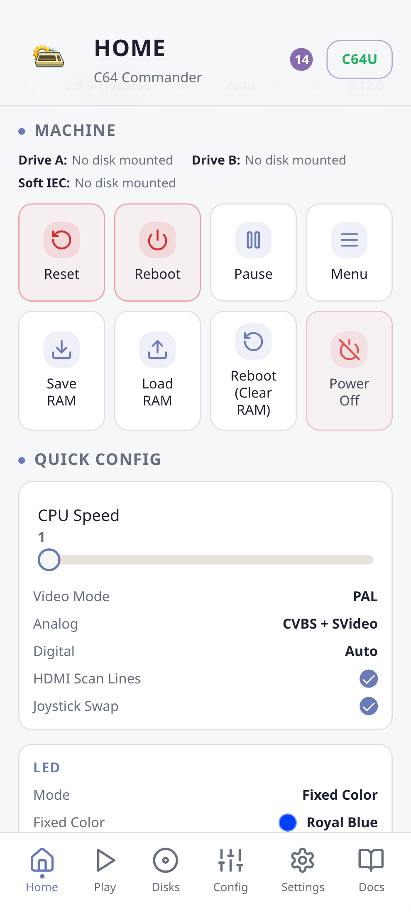
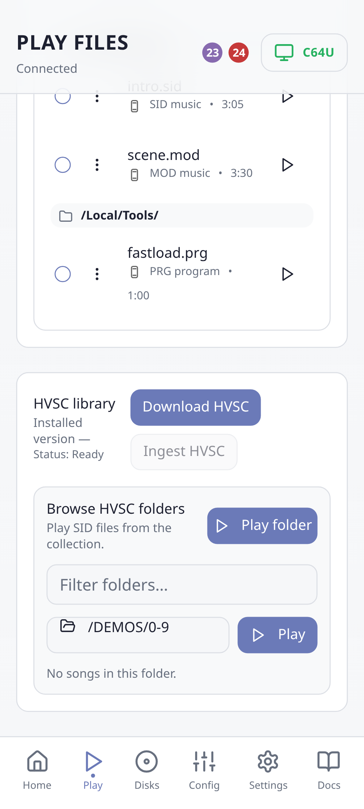
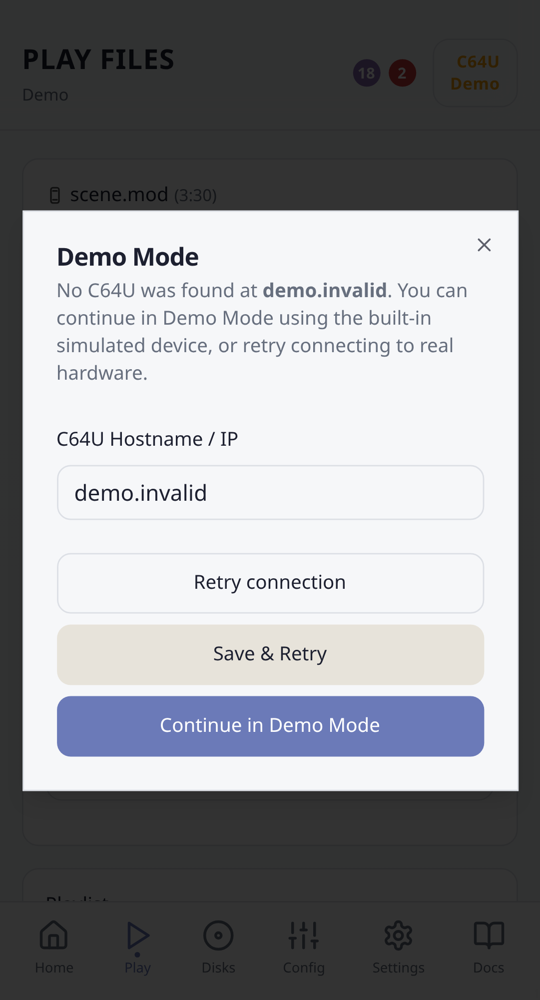
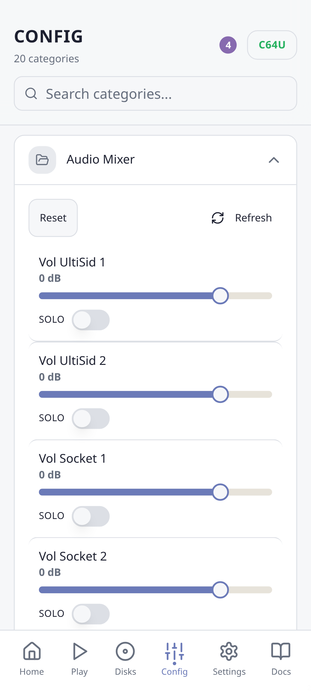
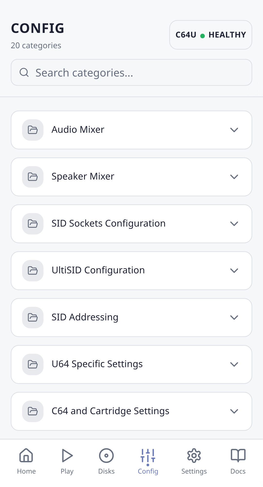
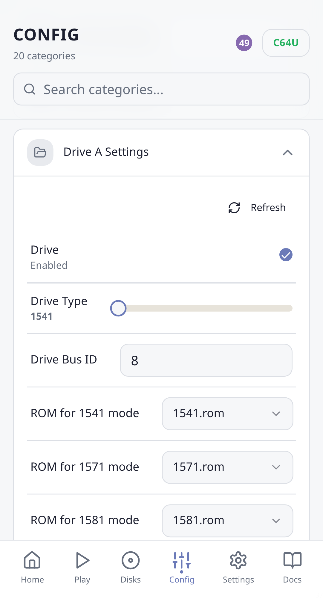
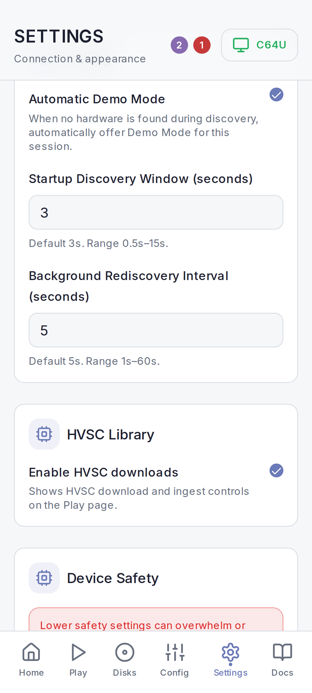
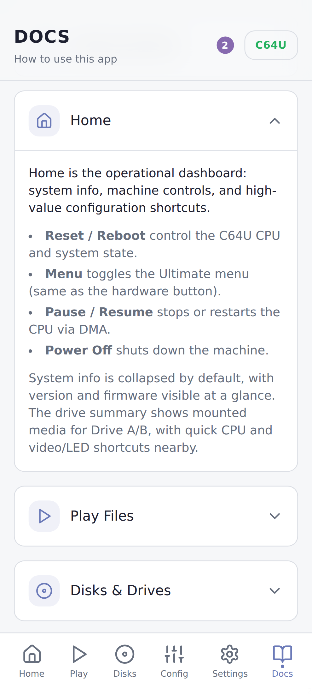
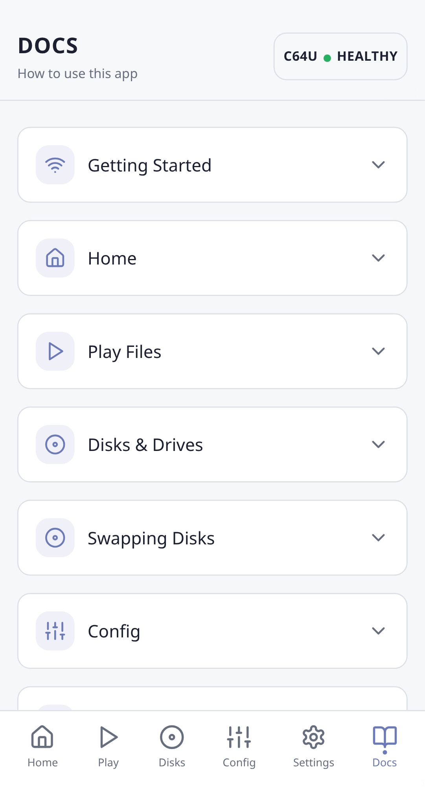
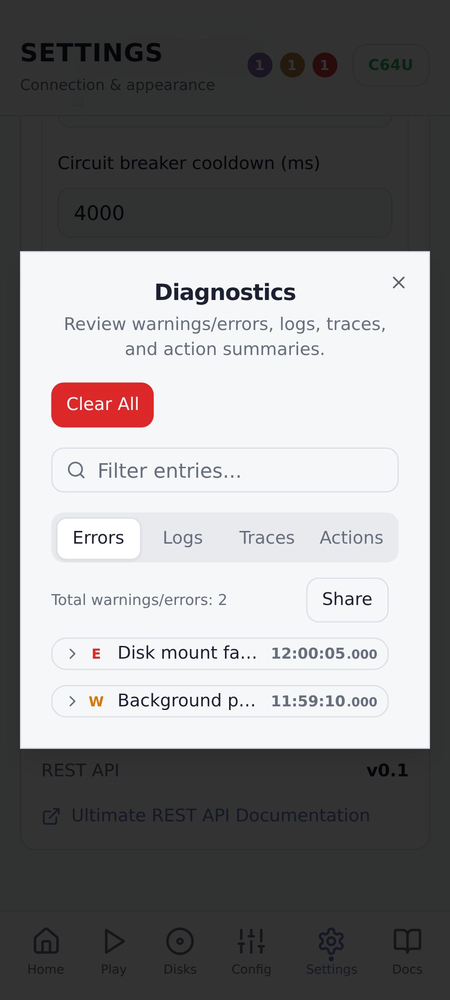

# C64 Commander

Control your Commodore 64 Ultimate from your Android device

> [!NOTE]
> This project is under active development. Some features are still being finalised.

C64 Commander is an Android app that connects to a C64 Ultimate on your local network:

- **Configuration**: View and adjust the full C64 Ultimate configuration.
- **Control**: Operate the C64 and its disk drives from a mobile-friendly interface.
- **Playback**: Browse and play music, programs, and disk images from local storage or via the C64 Ultimate, with playlist and automatic playback support.
- **Disks**: Work with disks and disk collections, including mounting, unmounting, and multi-disk workflows.
- **Collections**: Browse and play the HVSC music library via your C64 Ultimate.
- **Diagnostics**: Inspect device state and use diagnostic tools for troubleshooting.

## Screenshots

### Home

Track device status at a glance, control the machine and drives, and access quick configuration actions.

<table>
  <tr>
    <td>
      
    </td>
    <td>
      
    </td>
  </tr>
  <tr>
    <td>
      
    </td>
    <td>
      
    </td>
  </tr>
</table>

### Play

Control SID playback, adjust playback settings, manage playlists, select SID subsongs, and explore HVSC playback modes.

<table>
  <tr>
    <td>
      
    </td>
    <td>
      
    </td>
  </tr>
  <tr>
    <td>
      
    </td>
    <td>
      
    </td>
  </tr>
</table>

### Disks

Monitor drive status, mount images, and browse your disk collections.

<table>
  <tr>
    <td>
      
    </td>
    <td>
      
    </td>
  </tr>
</table>

### Configuration

Browse configuration categories, tune audio and SID settings, and edit drive-specific options.

<table>
  <tr>
    <td>
      
    </td>
    <td>
      
    </td>
  </tr>
  <tr>
    <td>
      
    </td>
    <td>
      
    </td>
  </tr>
  <tr>
    <td>
      
    </td>
    <td></td>
  </tr>
</table>

### Settings

Adjust appearance, connections, diagnostics, playback defaults, HVSC library access, and device safety.

<table>
  <tr>
    <td>
      
    </td>
    <td>
      
    </td>
  </tr>
  <tr>
    <td>
      
    </td>
    <td>
      
    </td>
  </tr>
  <tr>
    <td>
      
    </td>
    <td>
      
    </td>
  </tr>
</table>

### Docs

Read in-app documentation, getting started guides, and per-page walkthroughs with external references.

<table>
  <tr>
    <td>
      
    </td>
    <td>
      
    </td>
  </tr>
  <tr>
    <td>
      
    </td>
    <td>
      
    </td>
  </tr>
</table>

### Diagnostics

Trigger diagnostic actions, inspect traces, review logs, and triage errors.

<table>
  <tr>
    <td>
      
    </td>
    <td>
      
    </td>
  </tr>
  <tr>
    <td>
      
    </td>
    <td>
      
    </td>
  </tr>
</table>

Full screenshot set lives under [doc/img/app/](doc/img/app/).

## Install the APK on your Android phone

1. Download the APK from the latest GitHub release (`c64commander-<version>.apk` for normal installs; use `c64commander-<version>-debug.apk` only if you need a debug build).
2. Open the downloaded file on your phone (Files app or notification).
3. If prompted, allow installs from unknown sources for the browser/files app.
4. Tap Install to finish.

## Device safety settings

C64 Commander includes a configurable device safety system to reduce REST/FTP overload on fragile hardware.
You can find these controls in Settings → Device Safety.

- **Safety mode presets**: Relaxed, Balanced (default), and Conservative.
- **Advanced controls**: REST/FTP concurrency, read coalescing windows, cooldowns, backoff strategy, circuit breaker thresholds, and discovery probe interval.
- **Warning**: Lower safety settings can overwhelm the device. Use relaxed settings only if you understand the risks.

## Developer documentation

For build instructions, testing, and contribution guidelines, see [doc/developer.md](doc/developer.md).

Chaos/fuzz testing is documented in [doc/testing/chaos-fuzz.md](doc/testing/chaos-fuzz.md).
