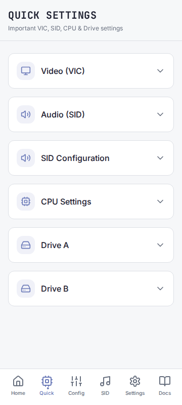
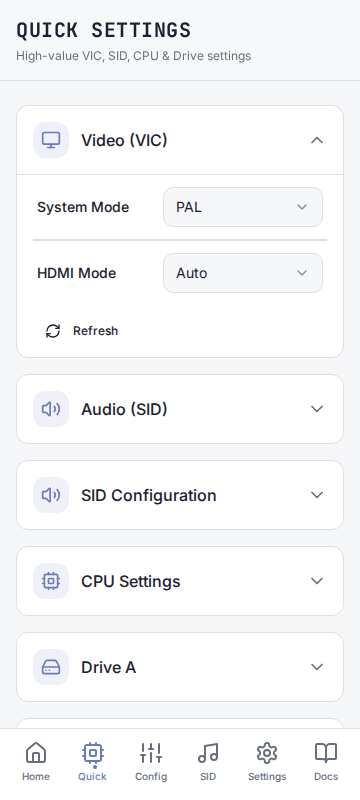

# C64 Commander

[](https://github.com/chrisgleissner/c64commander/actions/workflows/android-apk.yml)
[](https://www.gnu.org/licenses/old-licenses/gpl-2.0.en.html)

Control your C64 Ultimate device from Android with fast access to settings and device actions.


C64 Commander is an Android app that connects to a C64 Ultimate device on your local network:

- Browse and edit the entire C64U config
- Quick access to key settings (SID, VIC, CPU, drives) and device actions.

## Screenshots







## Run it in Android Emulator (Linux)

```sh
npm install
./scripts/android-emulator.sh
```

If you already have the Android SDK installed, set one of these before running Android commands:

```sh
export ANDROID_HOME="$HOME/Android/Sdk"
export ANDROID_SDK_ROOT="$HOME/Android/Sdk"
```

Alternatively, create android/local.properties with:

```text
sdk.dir=/home/you/Android/Sdk
```

## Build the Android APK (Linux)

```sh
java -version
export ANDROID_HOME="$HOME/Android/Sdk"
export ANDROID_SDK_ROOT="$HOME/Android/Sdk"
npm run android:apk
```

You can then find the APK at

```text
android/app/build/outputs/apk/debug/app-debug.apk
```

## Install + run an APK on a physical Android phone via ADB (Samsung / One UI)

Phone (one-time): Auto Blocker Off (Samsung), enable Developer options, enable USB debugging, approve the USB prompt.

Linux (one-time):

```sh
sudo apt update
sudo apt install google-android-platform-tools-installer
adb version
```

Install + launch:

```sh
adb devices
adb -s <DEVICE_ID> install -r path/to/app.apk
adb -s <DEVICE_ID> shell monkey -p <PACKAGE_NAME> -c android.intent.category.LAUNCHER 1
```
