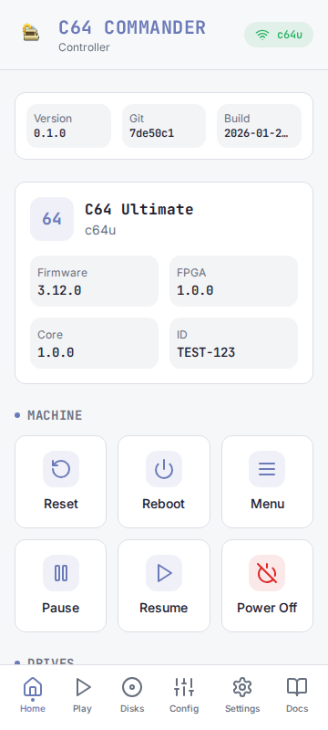
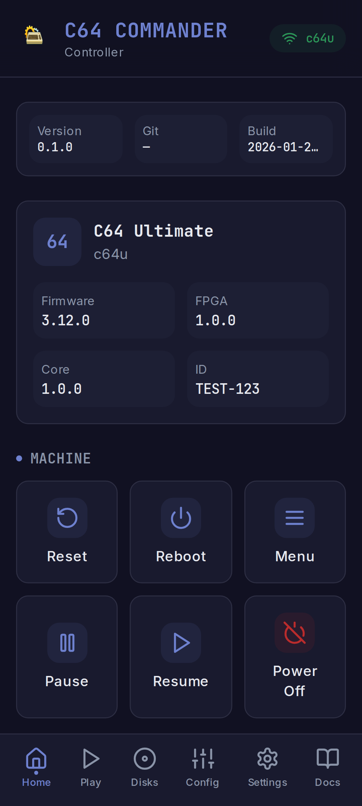
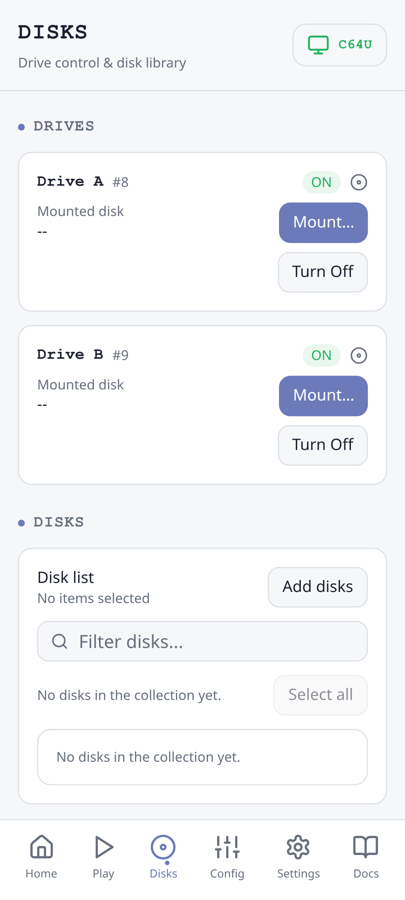
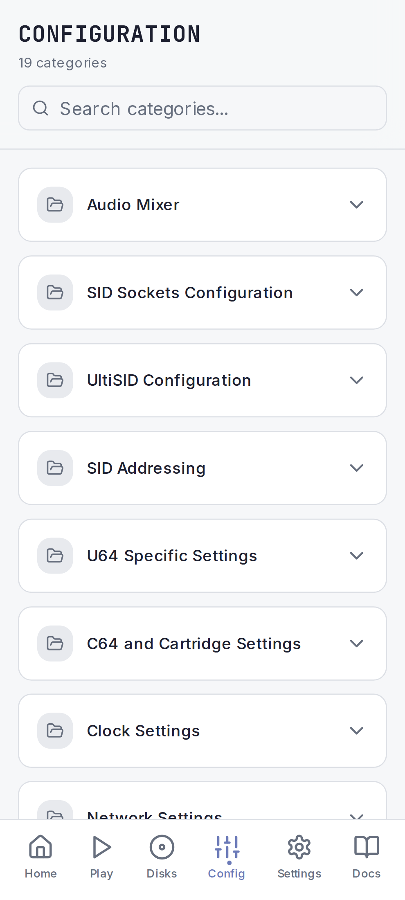
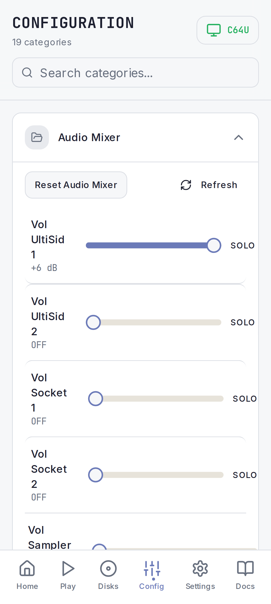
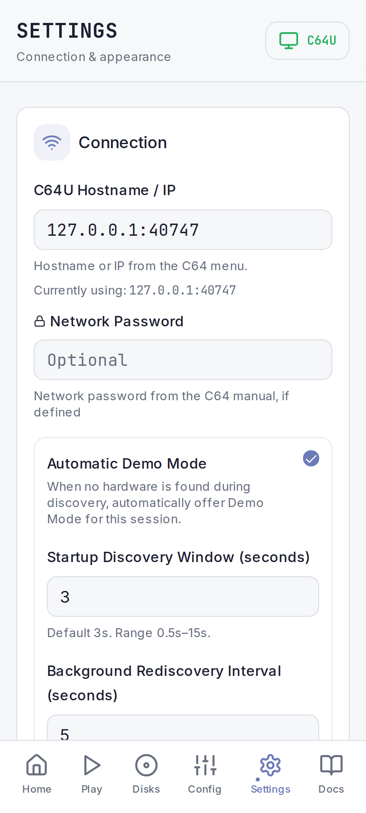

# C64 Commander

Control your Commodore 64 Ultimate from your Android device

> [!NOTE]
> This project is under active development. Some features are still being finalised.

C64 Commander is an Android app that connects to a C64 Ultimate device on your local network:

- Browse and edit the entire C64U configuration.
- Device controls and disk management from a mobile-friendly dashboard.
- Play files from local storage (work in progress) or the Ultimate 64 with a playlist-first workflow.
- Diagnostics and developer tools for troubleshooting.

## Screenshots

<table>
  <tr>
    <td>
      
    </td>
    <td>
      
    </td>
  </tr>
  <tr>
    <td>
      
    </td>
    <td>
      
    </td>
  </tr>
  <tr>
    <td>
      
    </td>
    <td>
      
    </td>
  </tr>
  <tr>
    <td>
      
    </td>
    <td>
      
    </td>
  </tr>
</table>

## Install the APK on your Android phone

1. Download the APK from the latest GitHub release (`c64commander-<version>.apk` for normal installs; use `c64commander-<version>-debug.apk` only if you need a debug build).
2. Open the downloaded file on your phone (Files app or notification).
3. If prompted, allow installs from unknown sources for the browser/files app.
4. Tap Install to finish.

## Developer documentation

For build instructions, testing, and contribution guidelines, see [doc/developer.md](doc/developer.md).
