# C64 Commander

[](https://github.com/chrisgleissner/c64commander/actions/workflows/android.yaml)
[](https://codecov.io/gh/chrisgleissner/c64commander)
[](https://www.gnu.org/licenses/gpl-3.0.en.html)
[](https://github.com/chrisgleissner/c64commander/releases)

Control and manage a Commodore 64 Ultimate from Android, iOS, or a self-hosted web deployment on your local network.


## Features

- **Cross-platform**: Native Android and iOS apps, plus a Docker-based web interface for macOS, Windows, or Linux.
- **Cross-device**: Works with the C64 Ultimate, the Ultimate 64 (Elite I/II), and the Ultimate-II+(L) cartridge.
- **Dashboard**: Machine controls, Quick actions, drive and printer shortcuts, SID mixer, and streams on a single page.
- **Playlists**: Build playlists from local files, C64U storage, the High Voltage SID Collection (HVSC), or CommoServe search results. Autoplay, shuffle, and subsong selection.
- **Disk management**: Mount, unmount, and rotate multi-disk groups across drives.
- **Configuration**: Browse and edit the full C64 Ultimate configuration tree.
- **Diagnostics**: Inspect activity logs, traces, latency, and connection health across App, REST, FTP, and Telnet activity.
- **Device Switcher**: Switch between devices and run parallel health checks.

## Getting Started

Setup takes three steps: install the app, enable the C64 Ultimate's network services, then connect the two over your local network.

### Step 1 — Install C64 Commander

Install the app on a phone, tablet, or host that is on the **same local network** as the C64 Ultimate.

**Android**

1. Download the latest APK from [Releases](https://github.com/chrisgleissner/c64commander/releases).
2. Open the APK and allow installs from unknown sources if prompted.
3. Tap **Install**.

**iOS**

1. Set up [SideStore](https://docs.sidestore.io/).
2. Download the latest IPA from [Releases](https://github.com/chrisgleissner/c64commander/releases).
3. In **SideStore > My Apps**, tap **+** and select the IPA.

SideStore refreshes the app signature automatically every 7 days.

**Web (Docker)**

The web version is self-hosted for LAN use. It needs Docker on Windows, macOS, or Linux; a Raspberry Pi Zero 2W or 4B with 512 MiB RAM or more is enough. Install Docker with [Docker Desktop](https://docs.docker.com/desktop/) (Windows/macOS) or [Docker Engine](https://docs.docker.com/engine/install/) (Linux). The image supports `linux/amd64` and `linux/arm64`.

```bash
mkdir -p ./c64commander-config && chmod 0777 ./c64commander-config

docker run -d --name c64commander -p 8064:8064 \
  -v ./c64commander-config:/config --restart unless-stopped \
  ghcr.io/chrisgleissner/c64commander:<version>
```

Open `http://<host-ip>:8064` in a browser to load the app. If you later set a password in **Settings > Device > Network password**, the web interface requires that password to log in.

### Step 2 — Enable Network Services on the C64 Ultimate

C64 Commander controls the device through its built-in network services, so turn these on first.


1. On the C64 Ultimate, press **C=** and **RESTORE** together to open the menu, then select **Network Services & Timezone**.
2. Enable the services the app relies on:
   - **Web Remote Control Service** — the REST API used for most control and status operations. **Required.**
   - **FTP File Service** — needed to browse and transfer files for playlists and disk collections.
   - **Telnet Remote Menu Service** — used for a few advanced operations not available over REST, such as power cycle.
3. Make sure the C64 Ultimate is on the same network as the device running C64 Commander. Note its IP address under **Wired Network Setup** or **WI-FI Network Setup** in case you need to enter it manually.

### Step 3 — Connect to Your Device

1. Start C64 Commander. When no reachable device is configured yet, it automatically scans the local network for C64 Ultimate devices.
2. From the discovered devices, tap **Use** to connect now, or **Save** to keep one for later. If a device is password-protected, the app prompts for its network password before connecting.

   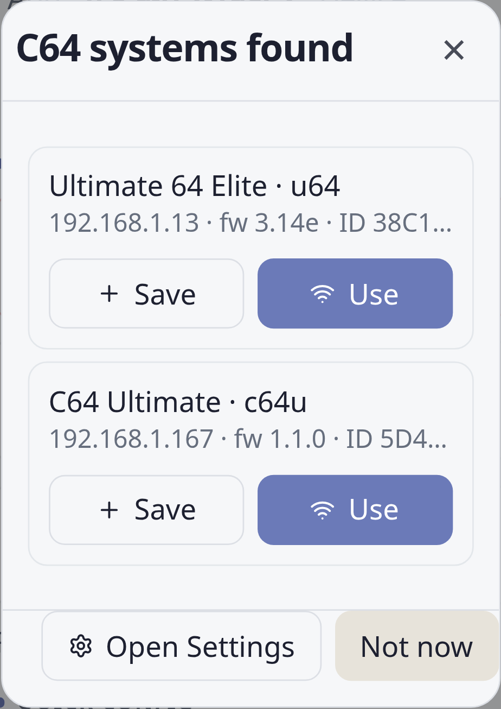

3. To scan again later, open **Settings > Device > Connection** and tap **Discover devices**.
4. If discovery does not find your device, enter its IP address or hostname manually under **Settings > Device > Connection**.
5. A green health indicator at the top right confirms a successful connection.


On later launches, C64 Commander reconnects to your saved device automatically. If a device needs a network password — or a saved password stops working — the app prompts for it and reconnects as soon as the correct password is entered.

## Pages

### Home

Operational dashboard: machine controls, quick actions, light effects, drives, printer, SID mixer, streams, and configuration snapshots.

<table>
  <tr>
    <td></td>
    <td>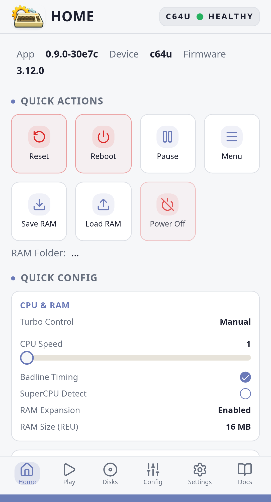</td>
    <td></td>
  </tr>
  <tr>
    <td></td>
    <td></td>
    <td></td>
  </tr>
  <tr>
    <td></td>
    <td></td>
    <td></td>
  </tr>
  <tr>
    <td></td>
    <td></td>
    <td></td>
  </tr>
</table>

### Play

Build playlists for programs and songs sourced from the local device, C64U storage, HVSC, or CommoServe. Supports autoplay, shuffle, repeat, subsong selection, and automatic song length discovery.

<table>
  <tr>
    <td></td>
    <td></td>
    <td></td>
  </tr>
</table>

### Browse & Import

Choose an import source, browse its contents, then add files to your playlist or disk collection.

<table>
  <tr>
    <td></td>
    <td>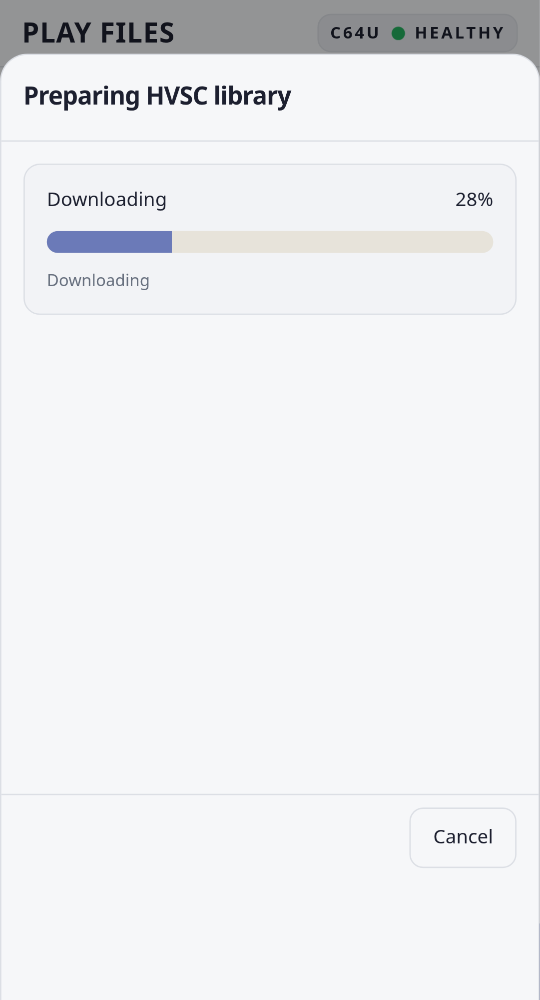</td>
    <td>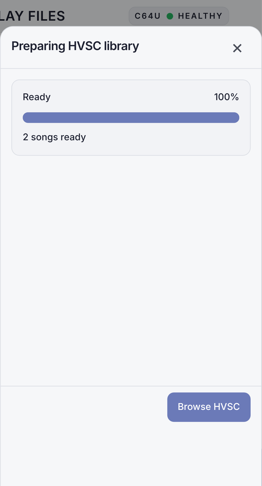</td>
  </tr>
  <tr>
    <td>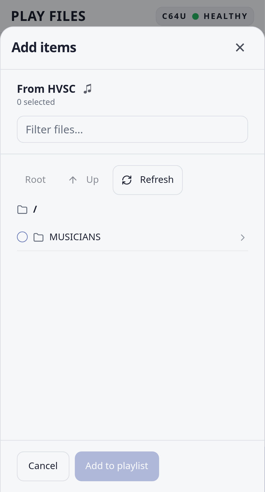</td>
    <td></td>
    <td></td>
  </tr>
</table>

### Disks

View drive state, mount and eject images, and manage disk collections with multi-disk group rotation.

<table>
  <tr>
    <td></td>
    <td></td>
    <td></td>
  </tr>
</table>

### Configuration

Browse and edit the full C64 Ultimate configuration: categories, items, sliders, toggles, and per-item refresh.

<table>
  <tr>
    <td></td>
    <td>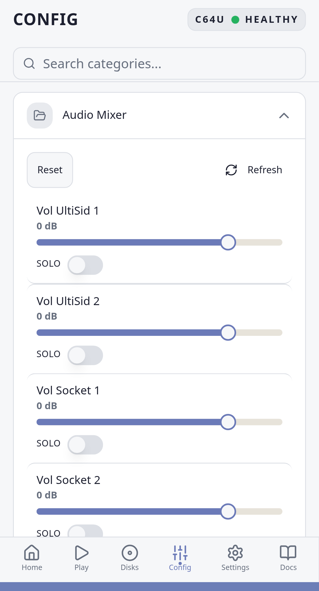</td>
    <td></td>
  </tr>
</table>

### Settings

Connection, appearance, diagnostics, playback defaults, HVSC integration, and device-safety controls.

<table>
  <tr>
    <td></td>
    <td></td>
    <td></td>
  </tr>
  <tr>
    <td></td>
    <td></td>
    <td>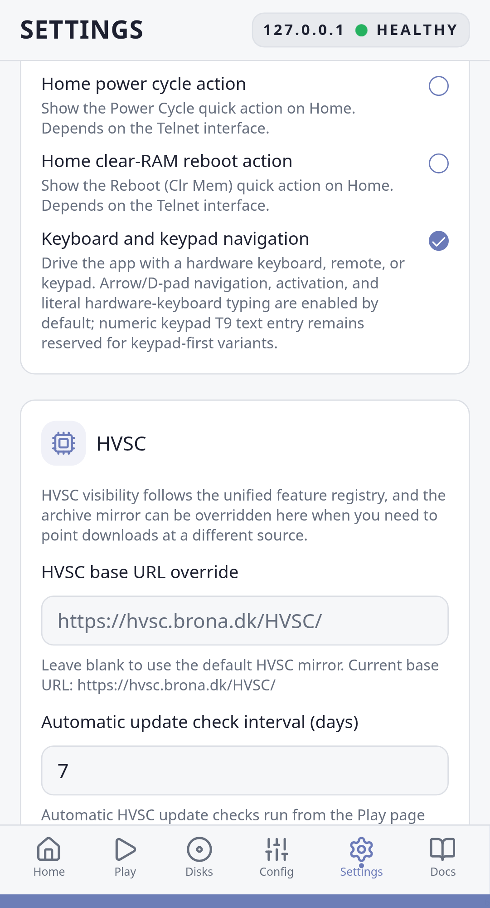</td>
  </tr>
</table>

### Docs

Built-in guides for setup, workflows, and day-to-day usage.

<table>
  <tr>
    <td></td>
    <td></td>
    <td></td>
  </tr>
</table>

### Diagnostics

Tap the top-right status badge to open diagnostics.

Provides health checks, activity logs, trace inspection, filter editor, and latency analysis across App, REST, FTP, and Telnet contributors.

<table>
  <tr>
    <td>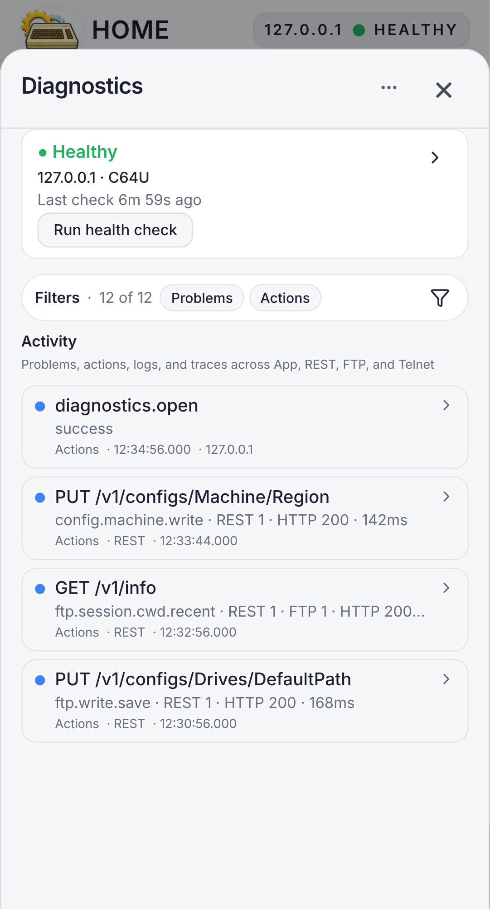</td>
    <td></td>
    <td></td>
  </tr>
</table>

### Switch Device

Long-press the top-right status badge to open the device switcher.

The switcher shows all configured devices with real-time health status, allowing instant switching and quick identification of connectivity or device issues.

<table>
  <tr>
    <td>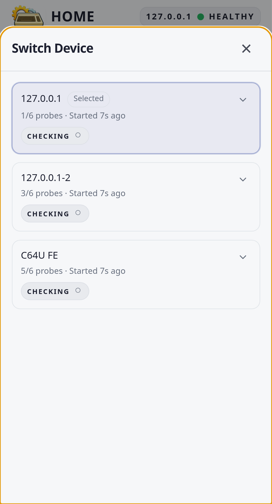</td>
    <td>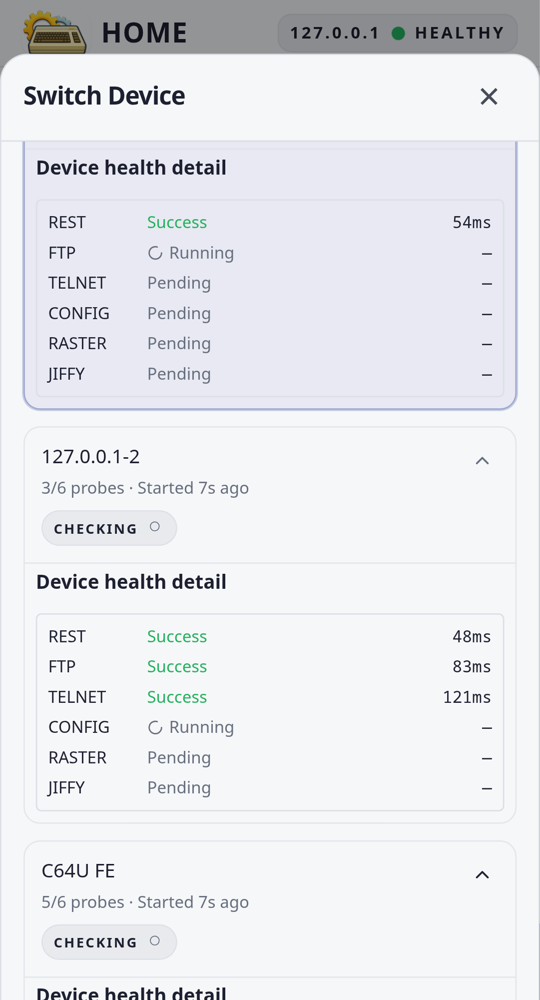</td>
    <td>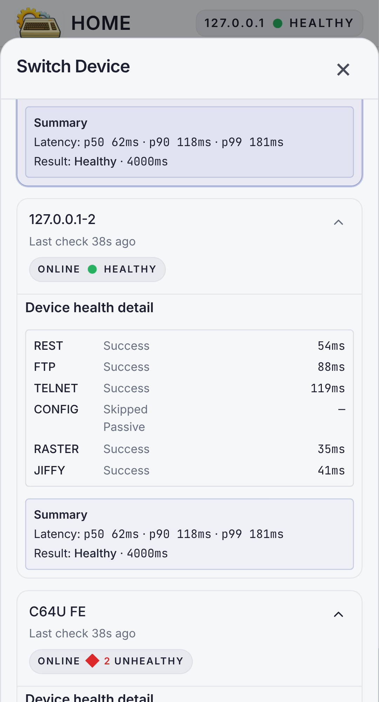</td>
  </tr>
</table>

## Display Profiles

The layout adapts automatically based on viewport width: Small (phones), Standard (large phones and small tablets), and Large (tablets and desktops). Override in **Settings > Display Profile**.

<table>
  <thead>
    <tr>
      <th align="left">Small display</th>
      <th align="left">Standard display</th>
      <th align="left">Large display</th>
    </tr>
  </thead>
  <tbody>
    <tr>
      <td valign="top">
        
      </td>
      <td valign="top">
        
      </td>
      <td valign="top">
        
      </td>
    </tr>
  </tbody>
</table>

## Keyboard & Keypad Navigation

C64 Commander can be operated with a hardware keyboard, D-pad/joystick, or
numeric keypad.

The visible highlight shows the selected control; use
Up/Down to move, OK/Enter to open a card or activate a control, and Back/Escape
to leave a card, close a dialog, or go back. A soft-key guidance bar appears only
while key navigation is active and clears immediately on touch/mouse input.

Disable it in **Settings > Experimental > Keyboard and keypad navigation** if a
device should remain touch-only. Numeric-keypad T9 text entry is reserved for
keypad-first mode; hardware keyboard typing remains literal.

## Troubleshooting

### Can't reach the device

- Confirm the C64 Ultimate and your device are on the same network.
- Verify the IP address or hostname in **Settings > Device > Connection**.

### Device becomes unresponsive

C64 Commander includes **Device Safety** controls under **Settings > Device Safety** to throttle REST and FTP traffic. REST mutations use a single in-flight lane; presets and advanced controls tune FTP concurrency and backoff behavior.

- **Presets**: Relaxed, Balanced (default), Conservative.
- **Advanced controls**: FTP concurrency, read coalescing, cooldowns, backoff strategy, circuit-breaker thresholds, discovery probe interval.
- The Relaxed preset can overwhelm some setups. Start with Balanced or Conservative.

### iOS specifics

- **App expired**: SideStore refreshes every 7 days automatically.
- **Account/App ID limits**: Remove unused sideloaded apps and retry.
- **Install/signing errors**: Re-download the IPA and verify its checksum.
- **Telnet-backed controls**: Power Cycle, Clear Flash, and other Telnet-only actions use the native socket bridge on iOS and Android. Support is discovered from the connected device's live Telnet menu graph, so device-specific gaps stay visible as disabled controls with inline explanation instead of disappearing.

## For Developers

- [Documentation index](docs/index.md)
- [DeepWiki architecture and design guide](https://deepwiki.com/chrisgleissner/c64commander)
- [Developer guide](docs/developer.md)
- [Chaos/fuzz testing](docs/testing/chaos-fuzz.md)

## Advanced Topics

Network security, web server configuration, authentication, and Linux auto-update are covered in [docs/advanced.md](docs/advanced.md).

## Acknowledgments

### High Voltage SID Collection (HVSC)

The [High Voltage SID Collection](https://hvsc.c64.org) is an archive of C64 SID music. C64 Commander integrates HVSC for browsing, searching, and playing SID tunes with metadata and song-length support.

### Commodore and the C64 Ultimate

Thanks to [Commodore](https://commodore.net) for creating the Commodore 64 and to the creators of the C64 Ultimate for extending the platform with modern hardware.

### Third-Party Libraries

C64 Commander uses many open-source libraries. Notices are generated via `scripts/generate-third-party-notices.mjs` and published as [THIRD_PARTY_NOTICES.md](THIRD_PARTY_NOTICES.md).

## License

GPL v3. See [LICENSE](LICENSE).
