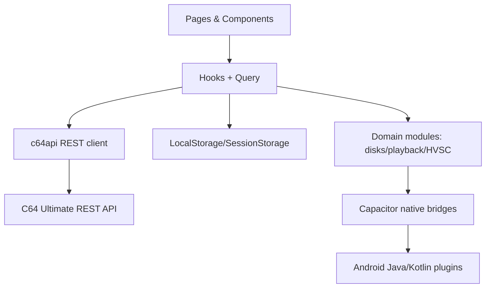
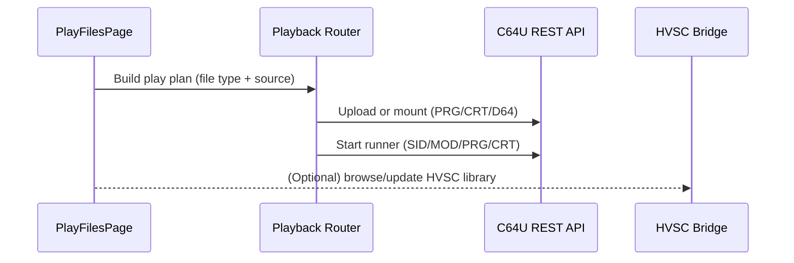
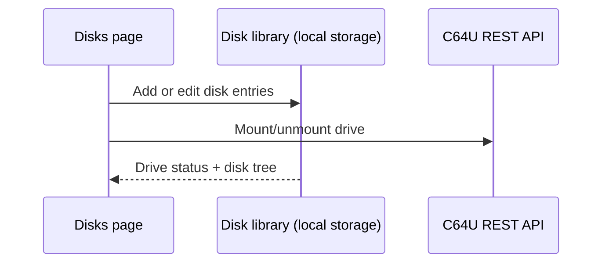
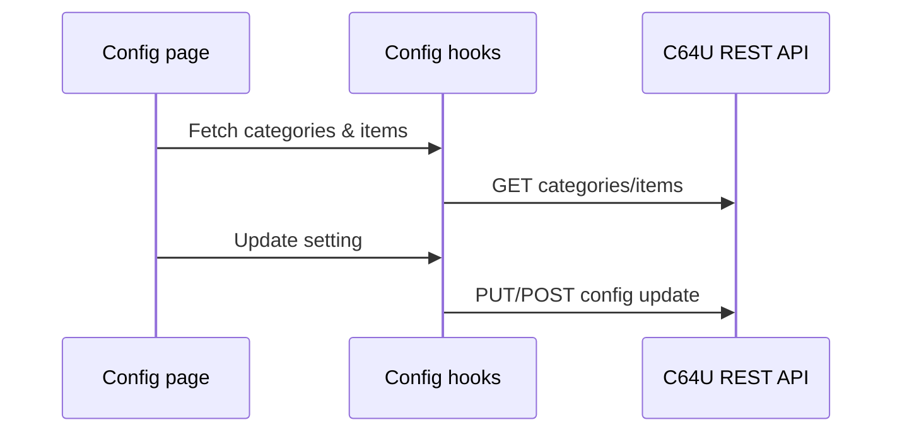

# Architecture Overview

C64 Commander is a React + Vite + Capacitor app that controls a C64 Ultimate device via its REST API. It runs as a web app in a Capacitor shell on Android with optional native bridges (FTP, HVSC ingestion).

## Stack and Layers

- **UI**: React pages in [src/pages](../src/pages) with shared components in [src/components](../src/components).
- **State + data fetching**: React hooks in [src/hooks](../src/hooks) backed by TanStack Query.
- **API client**: REST client in [src/lib/c64api.ts](../src/lib/c64api.ts).
- **Domain modules**: playback, disks, HVSC, config, and logging in [src/lib](../src/lib).
- **Native bridges**: Capacitor plugins in [src/lib/native](../src/lib/native) and Android implementations under [android/app/src/main/java](../android/app/src/main/java).

## High-level data flow

## Playback flow (Play page)

## Disk management flow

## Configuration flow

## Crash reporting

- **Android production crashes** are surfaced via **Google Play Console** (Android Vitals) once distributed through Play.
- **In-app diagnostics** are available in Settings, allowing users to share logs via email without sending automatic crash traces to external services.
