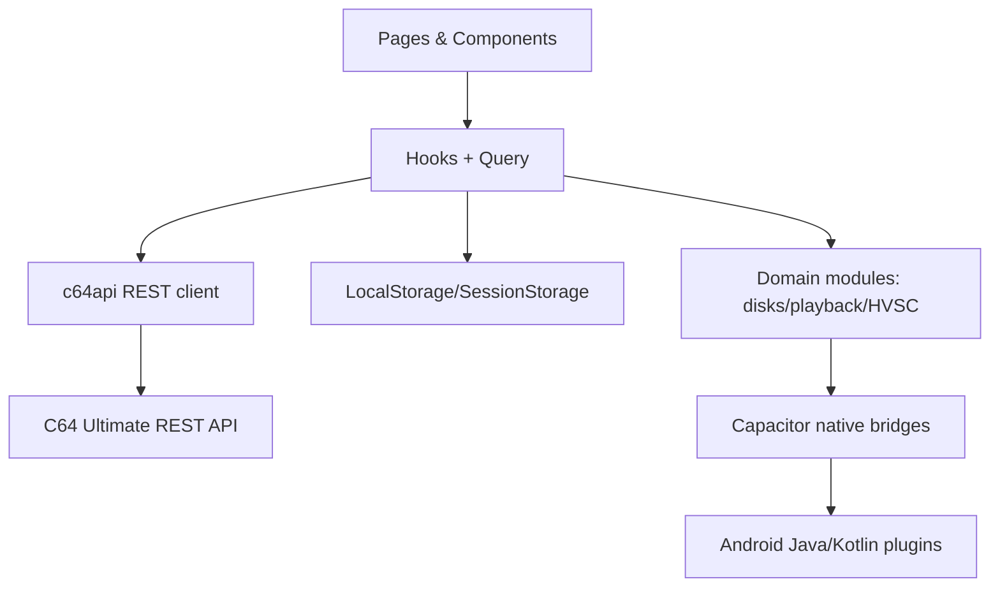
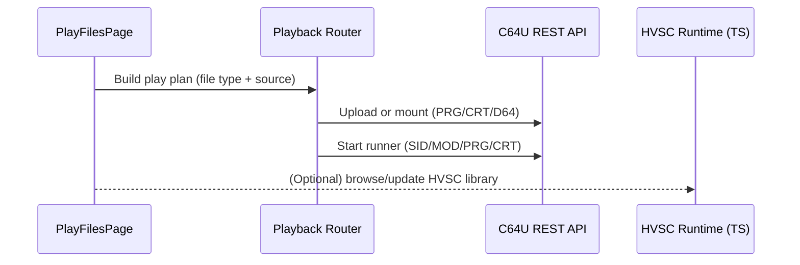
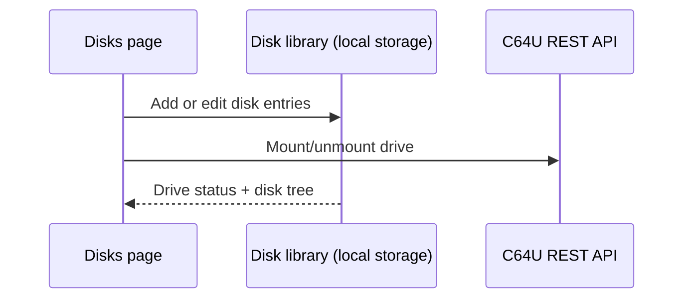
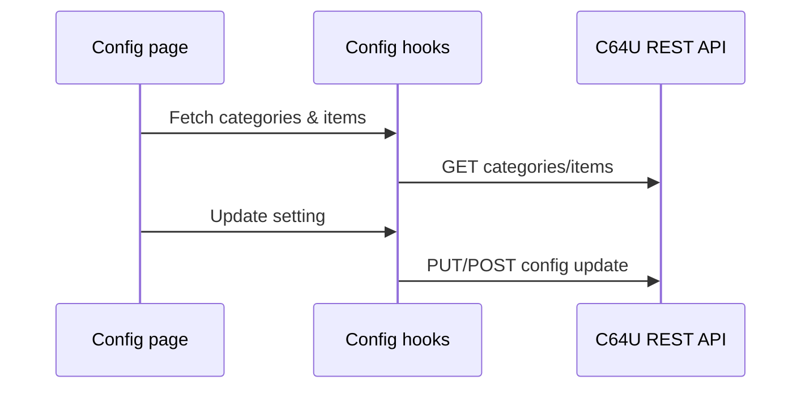

# Architecture Overview

C64 Commander is a React + Vite + Capacitor app that controls a C64 Ultimate device via its REST API. It runs as a web app in a Capacitor shell on Android with optional native bridges (FTP, folder picker). HVSC ingestion and indexing run in TypeScript with the app filesystem as the source of truth.

## Stack and Layers

- **UI**: React pages in [src/pages](../src/pages) with shared components in [src/components](../src/components).
- **State + data fetching**: React hooks in [src/hooks](../src/hooks) backed by TanStack Query.
- **API client**: REST client in [src/lib/c64api.ts](../src/lib/c64api.ts).
- **Domain modules**: playback, disks, HVSC, config, and logging in [src/lib](../src/lib).
- **Native bridges**: Capacitor plugins in [src/lib/native](../src/lib/native) and Android implementations under [android/app/src/main/java](../android/app/src/main/java).
- **Secure storage**: Device password is stored via the SecureStorage bridge (Android Keystore); localStorage only tracks a `c64u_has_password` flag for presence.

## High-level data flow

## Playback flow (Play page)

## Disk management flow

## Configuration flow

## Play Page Browsing and Playlist Spec

### SID terminology (normative)

- **SID file**: one `.sid` binary file (PSID/RSID container) from any source.
- **SID track**: one app-level canonical track record created from a SID file for playlist/query/storage.
- **SID song**: one playable subsong inside a SID track, selected by `songNr` (1-based).

Cardinality rules:

- One SID file maps to one SID track.
- One SID track maps to one or more SID songs.

### 1. Source model (normative)

The Play page exposes exactly three source kinds:

- `ultimate` (C64U filesystem via FTP bridge)
- `local` (device storage; SAF or file entries)
- `hvsc` (ingested HVSC library in app storage)

All three sources implement the same browse contract in TypeScript:

- `listEntries(path)` -> immediate folder/file children
- `listFilesRecursive(path, options)` -> recursive file enumeration
- `rootPath`, `id`, `type`, `isAvailable`

UI behavior must not diverge by source kind. Source kind affects data access only, not browse mechanics.

### 2. Browse UX contract (normative)

On Play page ingest flow:

1. User opens Add Items.
2. User selects a source.
3. User navigates using the same controls (`Root`, `Up`, `Refresh`, folder open, selection).
4. User confirms selection.
5. Selected files are ingested into the playlist.

Rules:

- No source-specific browse UI for normal ingest.
- Same loading/empty/error semantics across all sources.
- Source identity is secondary metadata only.

### 3. Playlist ingest contract (normative)

Ingest converts selected files into canonical playlist track references:

- Canonical metadata (title, artist when available, released, duration, size, path, subsong info) is normalized at ingest time.
- Source-specific handles (FTP path, SAF URI, HVSC virtual path) are stored as backend refs, not UI labels.
- Playlist rows must render from canonical metadata only.

Target behavior: users can mix items from all sources without any source-specific playlist behavior.

### 3.1 SID header metadata contract (normative)

For `.sid` files, ingestion must parse and normalize PSID/RSID header metadata (v1-v4):

- identity/version: `magicId`, `version`
- playback shape: `songs`, `startSong`, `speed`, `clock`
- chip topology: `sid1Model`, `sid2Model`, `sid3Model`, `sid2Adress`, `sid2Address`, `sidChipCount`
- text metadata: `name`, `author`, `released`

Rules:

- String fields must be decoded from Windows-1252 and normalized to UTF-8 text for storage/search.
- `name`/`author`/`released` must be preserved in SID metadata storage even if UI title policy later differs.
- RSID constraints must be validated and stored as compatibility state (valid/invalid + parser warnings), not silently ignored.
- Parsed SID metadata must be source-agnostic playlist data; source origin remains implementation detail.

### 4. Playlist query contract (normative)

Playlist rendering must be query-driven, not full-array filtering in React memory.

Required query capabilities:

- text search across normalized fields (title, author, released, path, tags, SID metadata facets)
- deterministic ordering (playlist position by default)
- paging/windowing (`limit` + cursor/offset)
- total match count for current filter

Performance rules:

- No O(n) full-list filter on each keypress for large playlists.
- No O(n^2) row derivation in list mapping.
- Virtualized rendering for visible window only.

### 5. Layered architecture (UX -> DB)

| Layer | Responsibility |
| --- | --- |
| UX (`PlayFilesPage`, list components) | Input, selection, playback controls, virtualized result window |
| Application hooks (`useSourceNavigator`, playlist hooks) | Orchestrate browse, ingest, and query states |
| Domain services (`sourceNavigation`, playback, hvsc service, SID parser) | Source adapters, metadata normalization, ingest semantics |
| Repository interfaces (TypeScript) | Source-agnostic data access contracts for tracks/playlists/search |
| Storage engine | Persistent metadata/index/query execution |
| Native bridges | Filesystem/FTP/SAF and platform services |

### 6. Storage and indexing strategy

For large collections/playlists (100k target):

- Persistent metadata/query store must be DB-backed (SQLite on native; compatible web fallback).
- Full-text search index is required for instant text filtering.
- Playlist membership and track metadata are stored separately.
- Large playlists must not be persisted as full JSON blobs in localStorage.
- Physical table/schema definitions are specified in [db.md](db.md) and are authoritative for repository implementations.

TypeScript remains the business-logic source of truth via repository interfaces; DB choice is an implementation detail behind adapters.

## Crash reporting

- **Android production crashes** are surfaced via **Google Play Console** (Android Vitals) once distributed through Play.
- **In-app diagnostics** are available in Settings, allowing users to share logs via email without sending automatic crash traces to external services.
