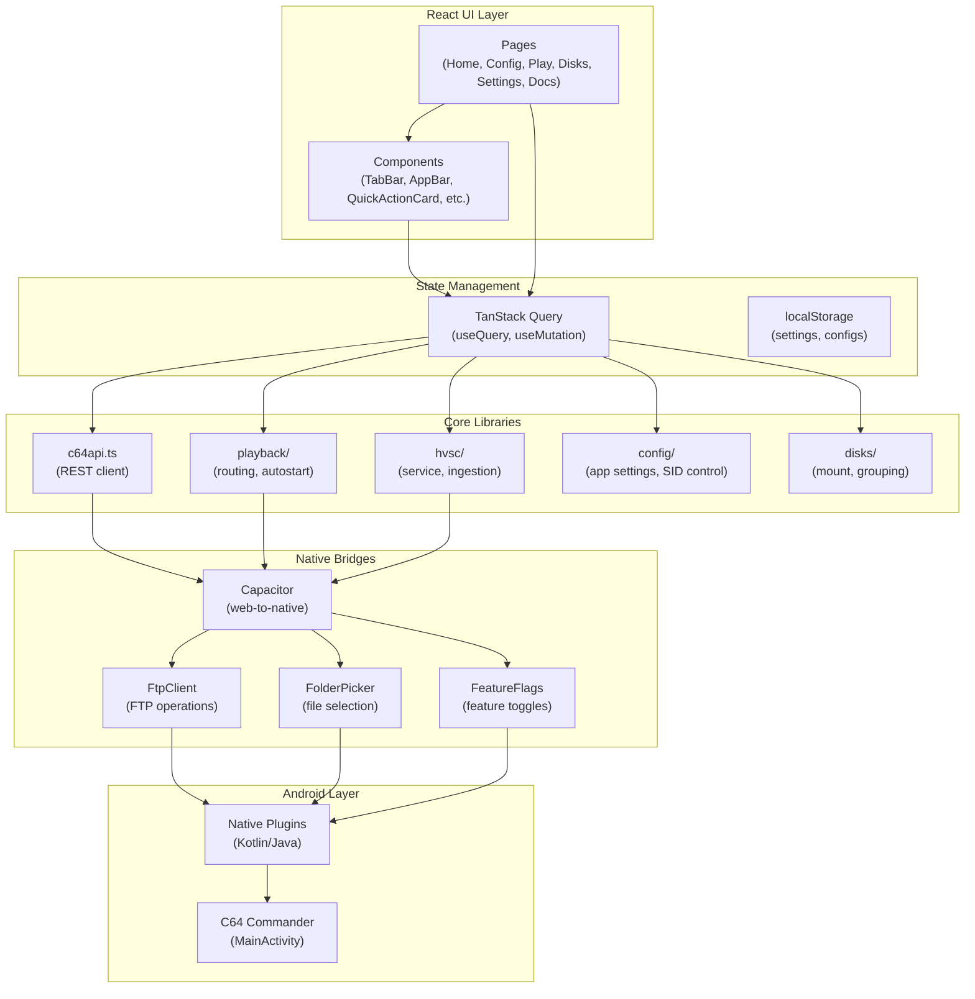
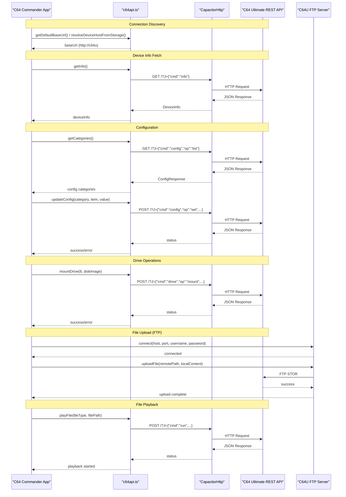
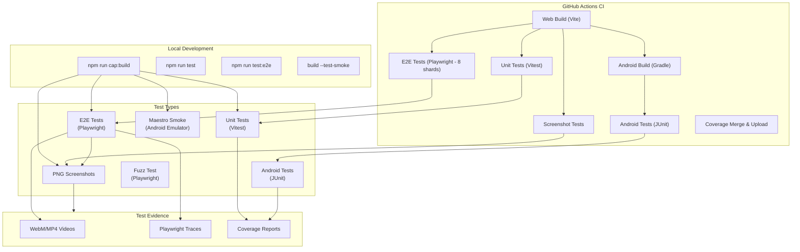
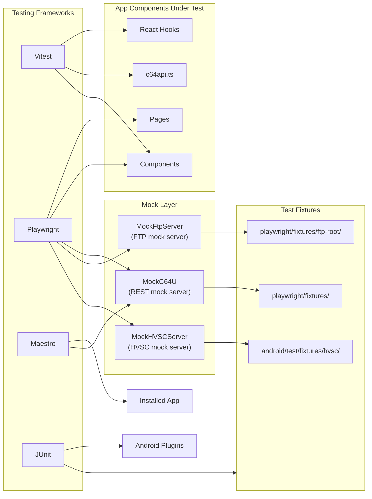

# C64 Commander Developer Guide

This guide covers development workflows for C64 Commander contributors.

## Prerequisites

- Node.js 18+ and npm
- JDK 17 (for Android builds)
- Android SDK (for device builds)
- git

## Quick start

Clone the repository and build:

```bash
git clone https://github.com/chrisgleissner/c64commander.git
cd c64commander
./build
```

This runs the full build pipeline: dependencies, web build, Capacitor sync, tests, and debug APK.

## Formatting

Repository formatting is standardized with Prettier + ESLint:

```bash
npm run format
npm run format:check
```

The `./build` script runs `npm run format` automatically before build steps (use `--skip-format` to bypass).

## Manual SID playback (local file)

If you need to validate the exact local SID upload/playback path without launching the full app UI, use the
manual playback script:

```bash
scripts/manual-play-sid.sh /path/to/song.sid
```

Optional inputs:

```bash
export C64U_HOST=192.168.1.50
export C64U_PASSWORD=your-password
scripts/manual-play-sid.sh /path/to/song.sid --song 1 --duration-ms 180000
```

Notes:
- `C64U_HOST`, `C64U_DEVICE_HOST`, or `C64U_BASE_URL` control the target device.
- `C64U_PASSWORD` is optional.
- `--song` and `--duration-ms` (or `C64U_SONGNR` / `C64U_DURATION_MS`) are optional.

## HVSC duplicate file name scan

To list HVSC file name frequencies from `songlengths.txt`/`Songlengths.txt`:

```bash
python3 scripts/hvsc_filename_frequency.py /path/to/HVSC
```

To print only duplicate file names:

```bash
python3 scripts/hvsc_filename_frequency.py /path/to/HVSC --duplicates-only
```

The script also accepts a direct Songlengths file path:

```bash
python3 scripts/hvsc_filename_frequency.py /path/to/HVSC/DOCUMENTS/Songlengths.md5 --duplicates-only
```

## HVSC ingestion completeness contract

- HVSC ingestion now tracks strict counters for every SID candidate in each archive:
  - `totalSongs`, `ingestedSongs`, `failedSongs`, `songlengthSyntaxErrors`.
- Any SID write/index failure increments `failedSongs` and is treated as ingestion failure.
- Cleanup deletion failures and songlength reload failures are fatal and move ingestion to `error`.
- `Songlengths.md5` syntax errors are tolerated: they increment `songlengthSyntaxErrors`, are logged at WARN, and do not block a `ready` result when `failedSongs` is zero.
- Result counters are stored in `HvscStatus.ingestionSummary` and surfaced in the HVSC controls UI and install/ingest toast messages.

### HVSC index persistence

- HVSC media index storage now uses app data filesystem persistence (`Directory.Data`) rather than localStorage.
- The index exposes a paged folder listing primitive (`getHvscFolderListingPaged`) used as the scalable browse entrypoint; legacy `getHvscFolderListing(path)` remains as a compatibility wrapper.
- Folder adjacency is now persisted in a dedicated browse index sidecar (`hvsc/index/hvsc-browse-index-v1.json`) and updated during ingestion (additions + deletions), removing O(totalSongs) scans for each folder listing request.
- SID header metadata is parsed during ingestion (PSID/RSID v1-v4) and stored with browse index song rows, including model/clock fields, Windows-1252 text metadata, RSID validity, parser warnings, and generated subsong rows.
- Startup now performs deterministic index migration/integrity flow: migrate legacy `c64u_media_index:v1` snapshots once, run sampled filesystem spot-checks against browse index entries, and force a rebuild when corruption is detected.

## Playback auto-advance under lock/background

### Completion signal decision (2026-02)

Primary signal: **duration-based due time** computed in JS (from Songlengths / HVSC metadata / fallback duration).

Why:
- The published C64U REST API spec in `doc/c64/c64u-openapi.yaml` documents runner *start* endpoints (e.g. `/v1/runners:sidplay`) but does not expose a reliable runner/player state endpoint that can be polled for an authoritative "finished" signal.
- WebView timers are the only cross-platform completion mechanism available in the browser layer.

Secondary watchdog (Android only): **foreground service dueAtMs watchdog**.

Why:
- On some devices and power modes, WebView JS timers may be throttled while backgrounded or locked.
- A foreground service + partial wakelock reduces throttling and provides a secondary wake-up path.

### How it works

- The playback controller assigns an `autoAdvanceGuard` with an absolute `dueAtMs` for song categories.
- `PlayFilesPage` reconciles playback state via `syncPlaybackTimeline()`:
  - Updates elapsed counters.
  - If `Date.now() >= guard.dueAtMs` and the guard is still valid, it triggers `handleNext('auto')` immediately.
- Reconciliation triggers:
  - A periodic interval while playing.
  - `visibilitychange`, `focus`, and `pageshow` when the app returns to the foreground.
  - Android watchdog event `backgroundAutoSkipDue` emitted by the BackgroundExecution foreground service.

### OEM battery constraints

Even foreground services can be constrained by OEM power management (Doze, App Standby buckets, aggressive battery savers).

Expected behavior:
- If `BackgroundExecution.start()` fails or the service is killed, playback continues using JS-only reconciliation.
- Failures are logged with lifecycle state and failure classification to aid triage.

### Manual validation (Maestro / ADB)

Lock/unlock cannot be fully validated in CI. For local Android validation:

1. Start playback on the Play Files page with a short-duration SID.
2. Lock the device (example): `adb shell input keyevent 26`.
3. Wait until after the track duration.
4. Unlock the device.
5. Verify the playlist advanced exactly once.

If you create/update a Maestro flow for this, follow `doc/testing/maestro.md` and keep the flow runnable locally.

## UI typography stability

Root cause (resolved): the app bar and several UI labels used the `font-mono` class, but JetBrains Mono is not bundled. When styles re-applied after interactions, browsers swapped to the default monospace fallback, causing visible font shifts and header height changes. The fix standardizes UI labels/values on the sans-serif stack (`Inter` → `Arial` → system) and removes monospace usage from standard UI elements.

VS Code workspace settings in `.vscode/settings.json` enable:

- format on save
- ESLint fix on save
- TypeScript/JavaScript: built-in formatter + ESLint fixes
- YAML and GitHub workflow YAML: Prettier (2-space indent, double quotes)
- JSON/Markdown: built-in VS Code formatters
- Kotlin: format on save is enabled; no repo-enforced Kotlin formatter is configured

## build - One-stop build tool

All common development tasks use `./build`:

### Build variants

```bash
./build                  # Full build: deps, build, web + Android unit tests, APK
./build --skip-tests     # Skip all tests
./build --skip-apk       # Build without APK generation
```

### Testing

```bash
./build --test-unit      # Unit tests only (vitest)
./build --test-e2e       # E2E tests only (Playwright, no screenshots)
./build --test-e2e-ci    # Full CI mirror: screenshots + e2e + validation
./build --test-e2e --validate-evidence  # Validate Playwright evidence structure
./build --test-unit --android-tests  # Run Android instrumentation tests (requires device/emulator)
./build --test-unit --coverage       # Web + Android coverage checks
./build --test-fuzz      # Fuzz Test runner (mock target only)
./build --test-contract --c64u-target mock --contract-mode safe --contract-auth off  # Contract test harness
```

### Android

```bash
./build --emulator       # Launch Android emulator
./build --install-apk        # Build and install APK to connected device
./build --device-id R5CRC3ZY9XH --install-apk  # Install to specific device
./build --test-smoke          # Run emulator smoke tests (mock target only)
./build --test-smoke --c64u-target real  # Run mock + real target smoke tests
./build --test-smoke --c64u-target real --c64u-host C64U
./build --test-smoke --c64u-target real --c64u-host auto  # External mock for emulator
```

Notes:
- `./build --test-maestro-*` auto-starts the Android emulator if none is running and uses it unless `--test-device-id` is provided.

Read `doc/testing/maestro.md` before writing or editing Maestro flows.

You can also run the Maestro flows directly from repo root:

```bash
maestro test .maestro
```

Maestro smoke evidence (screenshots + logs + meta) is written to:

```
test-results/evidence/maestro/<flow-name>/<deviceType>/
```

Raw Maestro runner output is written to:

```
test-results/maestro/
```

### Screenshots

```bash
./build --screenshots    # Update app screenshots in doc/img
./build --screenshots-only  # Capture screenshots only (no tests or APK)
```

Notes:
- `--screenshots` keeps the default full pipeline and then captures screenshots.
- `--screenshots-only` skips unit tests, E2E tests, and Android builds.
- `--test-e2e` runs Playwright without screenshots.
- `--test-e2e-ci` mirrors CI (screenshots + E2E + evidence validation).
- Screenshot output is organized under `doc/img/app/<page>/<section>.png` for easy browsing.

### Video walkthrough

```bash
./build --video   # Record a Playwright walkthrough video
```

Notes:
- Video output is written to `test-results/evidence/playwright/<testId>/<deviceId>/video.webm`.
- The walkthrough is driven by `playwright/video.spec.ts` and tagged with `@video`.

## Test architecture

### Unit tests (Vitest)

Location: `tests/unit/` and `src/**/*.{test,spec}.{ts,tsx}`

Run:

```bash
./build --test-unit
```

### E2E tests (Playwright)

Location: `playwright/*.spec.ts`

Key concepts:

- Strict UI monitoring: tests fail on console warnings/errors
- Evidence folders: `test-results/evidence/playwright/<testId>/<deviceId>/`
- Numbered screenshots: `01-step.png`, `02-step.png`, etc.
- Video recording: `video.webm` per test
- Trace files: `trace.zip` for debugging
- Trace opt-ins:
  - `enableTraceAssertions(testInfo)` for in-test semantic trace assertions
  - `enableGoldenTrace(testInfo)` for curated golden trace compare/record flow (registry-gated)
  - They are independent; use both when a test needs assertion coverage plus golden regression coverage

Run:

```bash
./build --test-e2e           # E2E only
./build --test-e2e-ci        # Full CI mirror
./build --test-e2e --validate-evidence  # Validate evidence structure
```

Evidence structure:

```
test-results/
  evidence/
    playwright/
      <testId>/
        <deviceId>/
          screenshots/
            01-<step>.png
            02-<step>.png
          video.webm
          trace.zip
          error-context.md  (only on failure)
          meta.json
playwright-report/
  index.html
```

Android emulator smoke evidence:

```
test-results/
  maestro/                 # raw Maestro output (runner-owned)
  evidence/
    maestro/
      <flow-name>/
        <deviceType>/
          screenshots/
            01-<step>.png
            02-<step>.png
          video.mp4         # optional (only if recorded)
          error-context.md
          meta.json
```

Android emulator smoke tests are Maestro flows under `.maestro/` (read `doc/testing/maestro.md` before editing):

```
.maestro/
  smoke-launch.yaml
  smoke-file-picker.yaml
  smoke-playback.yaml
  subflows/
    launch-and-wait.yaml
    common-navigation.yaml
```

Each flow is a standalone smoke test; shared steps live in subflows.

### Android JVM + instrumentation tests

Location: `android/app/src/test/java/`

Run:

```bash
./build
./build --android-tests
```

## Evidence validation

Validate that all test evidence folders have correct structure:

```bash
./build --validate-evidence
node scripts/validate-android-emulator-evidence.mjs
```

Checks:

- Every folder has at least one PNG
- All files have valid signatures (PNG/MP4/WEBM/ZIP)
- No zero-byte files

## CI workflow

CI runs on every push with two parallel jobs:

1. **Web tests** (unit + Playwright) producing Playwright evidence + report
2. **Android build** (Gradle tests + APK/AAB)

Artifacts:

- `playwright-test-results` - Evidence folders + raw Playwright outputs
- `playwright-report` - HTML test report
- `c64commander-<version>-debug.apk` - Debug APK (version resolved from tag/env/package.json)
- Release APK/AAB artifacts on tag builds when signing secrets are present (named `c64commander-<version>.apk`)

Performance notes:

- `PLAYWRIGHT_SKIP_BUILD=1` lets Playwright reuse a prebuilt `dist/` (build first).
- `PLAYWRIGHT_WORKERS` overrides Playwright worker count (default caps at 4).
- `GRADLE_MAX_WORKERS` caps Gradle workers (used by `build` and CI).
- The workflow supports a `package_manager` input for `workflow_dispatch` to compare `npm` vs `bun` install speed.

## CI + Coverage

Local reproduction (web coverage):

```bash
npm install
npm run test:coverage
VITE_COVERAGE=true VITE_ENABLE_TEST_PROBES=1 npm run build
VITE_COVERAGE=true npm run test:e2e
npx nyc report --temp-dir .nyc_output --report-dir coverage/e2e --reporter=lcov --reporter=text-summary
npx lcov-result-merger "coverage/{lcov.info,e2e/lcov.info}" coverage/lcov-merged.info
EXPECT_WEB_COVERAGE=1 node scripts/verify-coverage-artifacts.mjs
COVERAGE_MIN=75 node scripts/check-coverage-threshold.mjs
```

Local reproduction (Android coverage):

```bash
./build --coverage
```

Coverage outputs:

- Unit coverage: `coverage/lcov.info`
- E2E coverage: `coverage/e2e/lcov.info`
- Merged coverage (Codecov): `coverage/lcov-merged.info`
- Android Jacoco XML: `android/app/build/reports/jacoco/jacocoTestReport/jacocoTestReport.xml`

CI guardrails:

- `scripts/verify-coverage-artifacts.mjs` fails if expected coverage files are missing or empty.
- `scripts/check-coverage-threshold.mjs` enforces minimum line coverage (default 80%).
- `scripts/report-coverage.mjs` lists lowest-covered files to target for additional tests.

Download artifacts:

```bash
gh run list --workflow android-apk.yaml --limit 5
gh run download <run-id> --name playwright-evidence --dir /tmp/c64-evidence
gh run download <run-id> --name playwright-report --dir /tmp/c64-report
```

Validate downloaded evidence:

```bash
cd /tmp/c64-evidence
node /path/to/c64commander/scripts/validate-playwright-evidence.mjs
```

## Mock mode (internal testing)

The app includes a developer mode with mocked C64U REST + FTP servers:

1. Open Settings → About section
2. Tap 7 times quickly to unlock developer mode
3. Enable "Mock C64U" toggle
4. App connects to 127.0.0.1 with fixture-backed mock servers

Fixtures:

- REST config: `tests/mocks/mockC64Server.ts`
- FTP files: `playwright/fixtures/ftp-root/`

## FTP bridge overrides (Settings)

When troubleshooting FTP connectivity, the Settings → Connection page includes fields for:

- **FTP port** (default 21)
- **FTP bridge URL** (optional proxy/bridge)

These overrides are stored locally and take effect immediately for FTP listings and transfers.

## Project structure

```
src/
  components/       # React components (UI, disks, lists, item selection)
  hooks/            # React hooks (TanStack Query + custom hooks)
  lib/              # Core logic modules
    c64api.ts       # C64U REST API client
    config/         # Configuration utilities
    disks/          # Disk management logic
    hvsc/           # HVSC (High Voltage SID Collection) support
    native/         # Capacitor native bridge interfaces
    playback/       # File playback routing
    sid/            # SID music utilities
    sources/        # Song source abstractions
  pages/            # Route pages (Home, Config, Play, Disks, Settings, Docs)
  types/            # TypeScript type definitions

playwright/         # E2E tests (Playwright)
tests/              # Unit tests (Vitest)
android/            # Android/Capacitor project + JVM tests
doc/                # Documentation
scripts/            # Build and test scripts
.maestro/           # Maestro smoke tests (Android emulator)
```

## Architecture diagrams

### Overall app architecture



### C64 Ultimate interaction flow



### Testing architecture



### Testing interactions with app



## Code conventions

- **TypeScript** for all source code
- **React** with hooks (no class components)
- **TanStack Query** for server state
- **Tailwind CSS** for styling
- **Shadcn/ui** for component library
- **Vitest** for unit tests
- **Playwright** for E2E tests

## Adding E2E tests

1. Create test file in `playwright/*.spec.ts`
2. Use helper functions from `playwright/testArtifacts.ts`:
   - `startStrictUiMonitoring(page, testInfo)` in beforeEach
   - `attachStepScreenshot(page, testInfo, 'step-name')` for screenshots
   - `assertNoUiIssues(page, testInfo)` in afterEach
   - `finalizeEvidence(page, testInfo)` in afterEach
   - `allowWarnings(testInfo, 'reason')` for expected errors

Example:

```typescript
import { test, expect, type Page, type TestInfo } from '@playwright/test';
import { assertNoUiIssues, attachStepScreenshot, finalizeEvidence, startStrictUiMonitoring } from './testArtifacts';

test.describe('My feature', () => {
  test.beforeEach(async ({ page }: { page: Page }, testInfo) => {
    await startStrictUiMonitoring(page, testInfo);
  });

  test.afterEach(async ({ page }: { page: Page }, testInfo) => {
    try {
      await assertNoUiIssues(page, testInfo);
    } finally {
      await finalizeEvidence(page, testInfo);
    }
  });

  test('does something', async ({ page }: { page: Page }, testInfo) => {
    await page.goto('/');
    await attachStepScreenshot(page, testInfo, 'initial-state');

    await page.click('[data-testid="my-button"]');
    await attachStepScreenshot(page, testInfo, 'after-click');

    await expect(page.locator('[data-testid="result"]')).toBeVisible();
    await attachStepScreenshot(page, testInfo, 'final-state');
  });
});
```

## Troubleshooting

### Playwright install fails

```bash
npx playwright install
```

### Android build fails with Gradle errors

```bash
cd android
./gradlew clean
cd ..
./build
```

### Tests fail with "Port 4173 already in use"

```bash
lsof -i :4173  # Find process
kill <PID>     # Kill it
```

### Evidence validation fails

Check for missing videos or corrupted files:

```bash
find test-results/evidence/playwright -name "video.webm" | wc -l  # Should match test count
find test-results/evidence/playwright -name "*.png" -size 0       # Should be empty
```

## Contributing

1. Create feature branch
2. Make changes
3. Run full build: `./build --test-e2e-ci`
4. Ensure all tests pass
5. Commit and push
6. Create pull request
7. Wait for CI to pass

## Release process

Releases are created via GitHub Actions on tag push:

```bash
git tag v0.2.0
git push origin v0.2.0
```

CI builds and uploads APK to the release.
