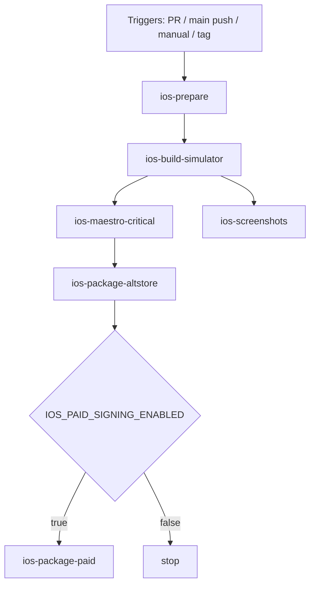
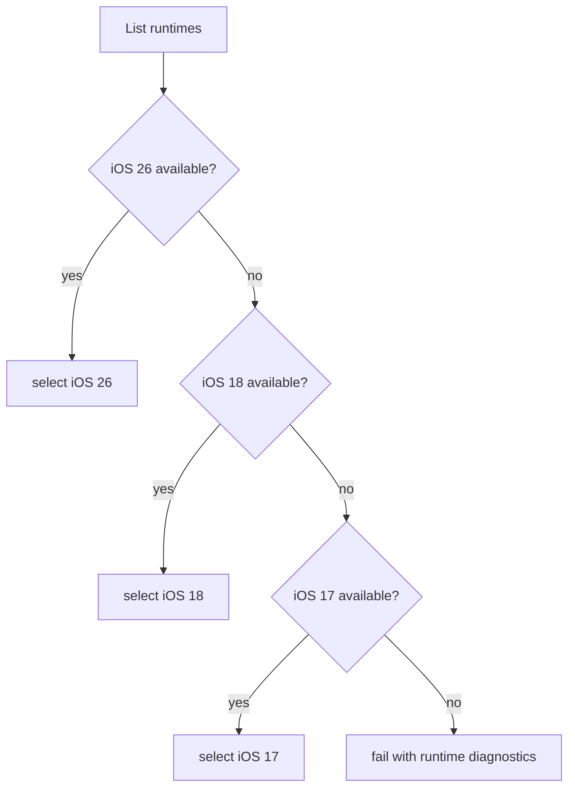
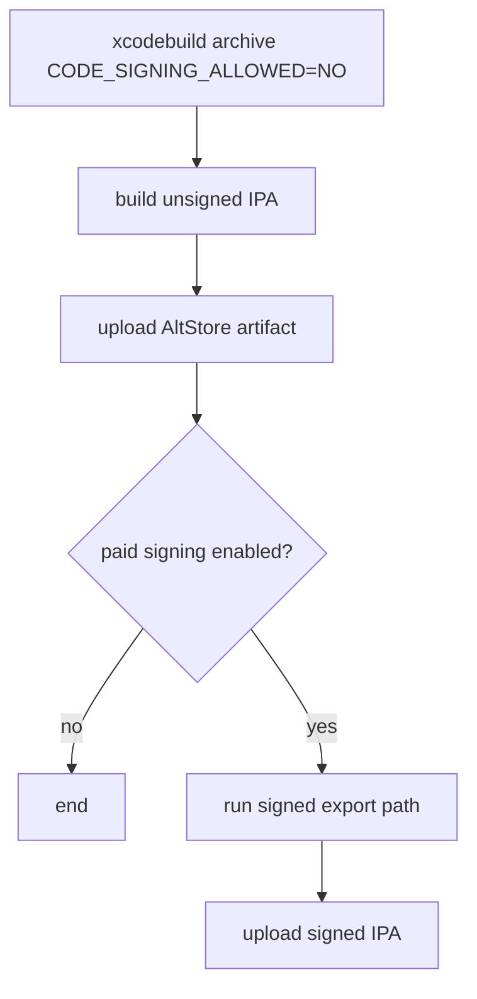

# iOS Porting Research (AltStore-first, CI-driven, low divergence)

Date: February 12, 2026
Owner: Research only (no code changes)

## 1. Scope and confirmed constraints

This document is based on your stated decisions:

- Build and test must run on GitHub-hosted CI runners. Local development is Kubuntu 24.04.
- iOS target path is AltStore first (no paid Apple Developer Program initially).
- Workflow should be ready for paid Apple Developer Program later, but disabled by default.
- Keep Android as the primary platform.
- Add iOS coverage only for high-value and iOS-native flows.
- Minimize Android/iOS divergence as a hard design rule.
- Prefer existing frameworks (Playwright + Maestro), avoid framework sprawl.
- iOS simulator should be used for tests and key screenshots.
- Target compatibility baseline: iOS 17/18. You also want visual checks against iPhone 13 with iOS 26 style/runtime when available.
- User-facing Demo Mode is deferred on iOS for now; Android Demo Mode remains unchanged in the current codebase.

## 2. Feasibility summary

- CI-only iOS is feasible, but requires macOS runners with Xcode.
- Docker on Linux is not a viable substitute for iOS simulator execution.
- AltStore-first distribution is feasible with CI-generated IPA artifacts and user-side AltStore signing/install.
- Current codebase already has good native abstraction boundaries, but several Android-native plugins are missing iOS implementations.
- Playwright should remain web-focused. Native iOS app automation should be Maestro.

## 3. Current repository state relevant to iOS

### 3.1 Native platform status

- `@capacitor/ios` is already present in `package.json`.
- No `ios/` native project exists yet.
- Android native plugins are registered in `android/app/src/main/java/uk/gleissner/c64commander/MainActivity.kt`.
- Native bridge layer already exists in `src/lib/native/` and is the correct seam for parity work.

### 3.2 Android-coupled behavior hotspots

High-coupling areas that need iOS strategy:

- Folder/content access via SAF semantics in:
  - `src/lib/native/folderPicker.ts`
  - `src/lib/sourceNavigation/localSourcesStore.ts`
  - `src/lib/sourceNavigation/localSourceAdapter.ts`
  - `src/lib/playback/localFilePicker.ts`
  - `src/lib/disks/localDiskPicker.ts`
  - `src/lib/machine/ramDumpStorage.ts`
- Android native FTP plugin expected by:
  - `src/lib/native/ftpClient.ts`
  - `src/lib/ftp/ftpClient.ts`
- Background execution service used by playback timing resilience:
  - `src/lib/native/backgroundExecution.ts`
  - `src/lib/native/backgroundExecutionManager.ts`
- Secure storage currently has only an in-memory iOS TS fallback:
  - `src/lib/native/secureStorage.ios.ts`

### 3.3 Existing test stack status

- Playwright currently exercises web flows and screenshot generation (`playwright.config.ts`, `playwright/screenshots.spec.ts`).
- Maestro flows are Android-oriented today (`.maestro/*.yaml`, `.maestro/config.yaml`, `scripts/run-maestro*.sh`).
- No iOS simulator CI test lane exists.

## 4. External constraints and implications

### 4.1 macOS is mandatory for iOS simulator and Xcode tooling

Implication:

- iOS build/simulator jobs must run on GitHub `macos-*` runners.
- Linux Docker path should be treated as not applicable for iOS simulator execution.

### 4.2 GitHub macOS runner software is time-variant

Implication:

- Do not hardcode one iOS runtime string without runtime discovery.
- Pin runner image + Xcode selection logic and add a runtime resolver step.

### 4.3 AltStore free-account realities

Implication:

- CI should publish IPA artifacts suitable for AltStore sideloading.
- Plan for 7-day refresh and active app ID limits for non-paid Apple IDs.

### 4.4 Playwright is browser automation, not native app automation

Implication:

- Keep Playwright for web surface/screenshots.
- Use Maestro for native iOS simulator flows and native app screenshots.

### 4.5 ATS on iOS blocks cleartext by default

C64 Commander talks to C64U over local HTTP. iOS ATS policy must be configured explicitly in iOS app `Info.plist`, or network requests can fail.

## 5. Required adjustments (detailed)

## 5.1 Bootstrap iOS platform

1. Generate iOS platform once and commit it:
   - `npm run build`
   - `npx cap add ios`
   - `npx cap sync ios`
2. Keep native regeneration deterministic:
   - Add npm scripts:
     - `cap:add:ios`
     - `cap:open:ios`
     - `cap:sync:ios`
     - `ios:build:sim`
     - `ios:build:device`
3. Ensure app id and display name stay shared from Capacitor config.

## 5.2 Enforce low-divergence architecture rule

Do not add platform branching in page-level UI unless unavoidable.

Use this policy:

- Keep existing TS bridge interfaces unchanged.
- Implement iOS plugins using the same Capacitor plugin names and method contracts.
- If iOS cannot support exact Android semantics, normalize behavior at bridge layer and return contract-compatible payloads.
- Add capability detection in one place (`src/lib/native/platform.ts` + optional `capabilities` helper), not scattered feature checks.

## 5.3 iOS native parity audit and action plan

| Area | Current state | iOS action | Risk | Acceptance criteria |
|---|---|---|---|---|
| `FolderPicker` plugin | Android SAF only | Implement iOS plugin with same methods: `pickDirectory`, `pickFile`, `listChildren`, `readFile`, `readFileFromTree`, `writeFileToTree`, `getPersistedUris` using security-scoped URLs/bookmarks | High | Local source/disks/play import + RAM dump file selection work on iOS simulator without UI divergence |
| `FtpClient` plugin | Android native + web bridge fallback | Implement iOS native FTP plugin matching `listDirectory`/`readFile` contract | High | FTP browsing and file read work in iOS critical flows |
| `SecureStorage` | iOS TS fallback is in-memory | Replace with real iOS Keychain plugin | High | Password survives app relaunch on iOS |
| `FeatureFlags` | No iOS native plugin; defaults on error | Implement iOS persistence (UserDefaults) under same plugin name | Medium | Feature flag set/read survives relaunch |
| `BackgroundExecution` | Android service + web no-op fallback | Short-term: iOS no-op with explicit ios mapping in plugin registration; long-term optional native background strategy | Medium | Playback does not crash; explicit log when iOS no-op path is active |
| `DiagnosticsBridge` | Android bridge only; JS side currently swallows addListener errors | Keep optional on iOS; enforce non-silent catch behavior in JS bridge | Medium | No silent exception swallowing; deterministic diagnostics behavior |
| `MockC64U` | Android native mock server | Defer iOS `MockC64U` parity in initial iOS release scope because user-facing iOS Demo Mode is out of scope | Medium | iOS release scope remains focused on real-device usage; demo-mode backend parity is not required for initial ship |

## 5.4 iOS networking and policy adjustments

1. ATS/HTTP policy:
   - Add explicit ATS exceptions for local C64U HTTP traffic in `ios/App/App/Info.plist`.
2. Local network behavior:
   - Validate and add iOS network usage descriptions if runtime prompts are encountered.
3. Capacitor HTTP:
   - Keep current `CapacitorHttp` strategy and validate parity with iOS runtime.

## 6. CI design (GitHub-hosted, implementation-ready)

Create a dedicated workflow: `.github/workflows/ios-ci.yaml`.

Keep Android workflow unchanged as primary and independent.

## 6.1 Trigger model

- `pull_request`
- `push` to `main`
- `workflow_dispatch`
- optional `push tags: ["*"]` for release artifacts

## 6.2 Job topology

1. `ios-prepare` (macOS)
2. `ios-build-simulator` (macOS)
3. `ios-maestro-critical` (macOS)
4. `ios-screenshots` (macOS)
5. `ios-package-altstore` (macOS)
6. `ios-package-paid` (macOS, disabled by default)

Use `needs` so simulator test and screenshots run only after successful simulator build.

### Workflow graph (job DAG)

## 6.3 Job details and commands

### Job: `ios-prepare`

Purpose: deterministic toolchain + dependencies + iOS sync.

Steps:

- Checkout repo at CI SHA.
- Setup Node 20 with npm cache.
- `npm ci`
- `npm run build`
- If `ios/` missing in checkout artifact path, run `npx cap add ios`.
- Always run `npx cap sync ios`.
- Archive `ios/` and `dist/` as artifacts for downstream jobs (or repeat in each job for simplicity).

### Job: `ios-build-simulator`

Purpose: build `.app` for iOS simulator.

Steps:

- Restore repo and dependencies.
- Resolve runtime dynamically:
  - Read available runtimes via `xcrun simctl list runtimes`.
  - Selection policy:
    1. Prefer iOS 26 runtime if installed.
    2. Else prefer iOS 18 runtime.
    3. Else prefer iOS 17 runtime.
    4. Else fail with explicit diagnostics and runtime list.
- Use iPhone 13 devicetype if available; otherwise fail explicitly.
- Create simulator:
  - `xcrun simctl create "C64-iPhone13" "iPhone 13" "$IOS_RUNTIME_ID"`
  - `xcrun simctl boot "$SIM_UDID"`
- Build app:
  - `xcodebuild -workspace ios/App/App.xcworkspace -scheme App -configuration Debug -destination "id=$SIM_UDID" -derivedDataPath ios/build build`
- Export path artifact:
  - `ios/build/Build/Products/Debug-iphonesimulator/App.app`

### Job: `ios-maestro-critical`

Purpose: run high-value iOS native flows in simulator.

Steps:

- Install Maestro CLI.
- Boot simulator from created UDID (or recreate deterministically).
- Run iOS-tagged flows only:
  - `maestro test .maestro --include-tags ios,ci-critical-ios --format junit --output test-results/maestro/ios-junit.xml`
- Ensure `ci-critical-ios` includes a Demo Mode flow that validates mock startup + playable state.
- Capture artifacts:
  - `test-results/maestro/**`
  - `test-results/evidence/maestro/**`
- Validate evidence with an iOS-aware validator script (parallel to Android evidence validator).

### Job: `ios-screenshots`

Purpose: produce a small, realistic iOS screenshot set.

Approach:

- Use Maestro for deterministic navigation.
- Use `takeScreenshot` in flows for evidence snapshots.
- For curated iOS captures, also run `xcrun simctl io "$SIM_UDID" screenshot <path>` after deterministic navigation points.

Output paths:

- Evidence snapshots: `test-results/evidence/maestro/...`
- Curated iOS screenshot artifact payload: `test-results/artifacts/ios-screenshots/...`

Initial required screenshot set (small/high-value):

- `test-results/artifacts/ios-screenshots/home/01-overview.png`
- `test-results/artifacts/ios-screenshots/play/01-overview.png`
- `test-results/artifacts/ios-screenshots/play/import/01-local-picker.png`
- `test-results/artifacts/ios-screenshots/disks/01-overview.png`
- `test-results/artifacts/ios-screenshots/settings/01-overview.png`

### Job: `ios-package-altstore`

Purpose: produce AltStore-consumable IPA artifact without paid signing.

Build strategy:

- Build arm64 device binary for `iphoneos` with signing disabled.
- Create unsigned IPA by zipping `Payload/App.app`.

Command pattern:

- `xcodebuild -workspace ios/App/App.xcworkspace -scheme App -configuration Release -sdk iphoneos -archivePath ios/build/App.xcarchive archive CODE_SIGNING_ALLOWED=NO`
- Package:
  - `mkdir -p ios/build/Payload`
  - `cp -R ios/build/App.xcarchive/Products/Applications/App.app ios/build/Payload/`
  - `(cd ios/build && zip -r c64commander-altstore-unsigned.ipa Payload)`

Artifacts:

- `c64commander-altstore-unsigned.ipa`
- `sha256.txt`
- optional generated `altstore-source.json` fragment for releases

### Job: `ios-package-paid` (disabled)

Purpose: easy future switch to paid Apple Developer Program distribution.

Gate:

- `if: vars.IOS_PAID_SIGNING_ENABLED == 'true'`

Secrets expected (document now, use later):

- certificate and provisioning secrets (or App Store Connect API path)
- team id, bundle id mapping

Behavior:

- Run signed archive/export path and upload signed IPA artifact.
- Keep disabled until secrets and paid membership are provided.

## 6.4 Runtime management policy

Because runner images evolve:

- Always print installed Xcode version and runtimes.
- Prefer runtime discovery over hardcoding.
- If required runtime missing, optionally call:
  - `sudo xcodebuild -downloadPlatform iOS`
- Keep hard timeout and clear error log if runtime installation fails.

### Workflow graph (runtime resolver)

### Workflow graph (packaging/signing)

## 7. Test strategy with Android as primary

## 7.1 Matrix policy

- Android remains full primary coverage and release gate.
- iOS adds focused regression gate for high-value/native paths only.

## 7.2 iOS critical flow set (initial)

Implement these Maestro iOS flows first:

1. `ios-smoke-launch`:
   - launch app, verify tabs and basic navigation.
2. `ios-local-import`:
   - open local import path, pick folder/file, confirm entries appear.
3. `ios-ftp-browse`:
   - browse remote directory and open one file metadata path.
4. `ios-secure-storage-persist`:
   - set password, relaunch app, confirm password retrieval path works.
5. `ios-diagnostics-export`:
   - trigger diagnostics export/share path and verify no crash/error state.
6. `ios-playback-basics`:
   - start playback, pause, next item.
7. `ios-demo-mode-core`:
   - force demo path, verify internal mock backend starts, and verify playable demo state.

Tagging policy:

- `ios`: all iOS flows
- `ci-critical-ios`: only CI gating subset
- `slow`: excluded by default

## 7.3 Playwright role on iOS path

- Do not use Playwright for native app automation.
- Keep Playwright as web regression + broad screenshot system.
- If needed, add an `iphone-webkit` project for browser rendering spot checks only (not native app parity claims).

## 8. Screenshot strategy (realistic iPhone framing)

Given your requirement for realistic iPhone-like screenshots:

- Use iPhone 13 simulator device type for baseline captures.
- Use highest available runtime on runner (prefer iOS 26 when installed).
- Keep compatibility execution on iOS 18/17 where available.

Determinism controls:

- Fixed locale/timezone (`en-US`, `UTC`).
- Disable animations where feasible.
- Seed deterministic mock data before capture.
- Capture after UI idle checks.

Publication policy:

- Android screenshot set remains primary documentation set.
- iOS screenshots are exposed as CI artifacts by default (`ios-screenshots` job), not committed to the repo.
- Optional manual promotion of selected iOS screenshots to docs can be done later when intentionally requested.

## 9. AltStore-first release flow

## 9.1 Immediate path (no paid account)

- CI publishes unsigned AltStore-target IPA artifact.
- User installs via AltStore workflow using Apple ID signing on their side.
- Document known non-paid constraints: limited active app IDs and periodic refresh.

## 9.2 Future paid path (prewired, disabled)

- Keep disabled `ios-package-paid` job in workflow.
- Enabling becomes config/secrets toggle only, not a redesign.

## 10. Minimal-divergence coding rules for implementation phase

When implementation starts, enforce these rules:

1. No feature forks in page components for Android vs iOS unless unavoidable.
2. Keep shared TypeScript API contracts unchanged.
3. Add iOS native implementations behind existing bridge files.
4. Centralize platform capability checks.
5. Every catch must rethrow with context or log with stack/context (no silent catches).
6. Keep Maestro flow structure shared via subflows; fork only selector-level differences.

## 11. Proposed phased execution plan

## Phase 1: Platform bootstrap and CI skeleton

Deliverables:

- `ios/` project committed.
- `ios-ci.yaml` with `ios-prepare` + `ios-build-simulator` jobs green.

Done when:

- Simulator `.app` builds on GitHub macOS runner from clean checkout.

## Phase 2: Native parity foundations

Deliverables:

- iOS `SecureStorage`, `FeatureFlags`, `FolderPicker`, and `MockC64U` parity.
- ATS policy configured.

Done when:

- iOS launch + local import + storage persistence + Demo Mode internal mock flows pass.

## Phase 3: iOS CI gating flows and screenshots

Deliverables:

- iOS Maestro critical flows in CI.
- iOS screenshot subset generated and uploaded.

Done when:

- `ios-maestro-critical` and `ios-screenshots` jobs are stable.

## Phase 4: AltStore artifact lane + paid-signing toggle

Deliverables:

- Unsigned AltStore IPA artifact in CI releases.
- Disabled paid-signing job ready for activation.

Done when:

- Tag builds publish IPA artifact + checksum.

## 12. Risks and mitigations

- Risk: GitHub macOS runtime drift breaks specific iOS version selection.
  - Mitigation: runtime discovery + clear fail logs + optional runtime download step.
- Risk: Folder access semantics mismatch between Android SAF and iOS security-scoped bookmarks.
  - Mitigation: contract-preserving bridge layer and iOS-specific persistence tests.
- Risk: ATS/local network policy blocks C64U HTTP.
  - Mitigation: explicit Info.plist ATS configuration and CI smoke check against mock endpoint.
- Risk: Free Apple ID limitations affect sideload usability.
  - Mitigation: document operational limits and keep paid-signing lane prewired but off.

## 13. Clarifications and decisions to lock during implementation

1. iOS mock target source for CI (decision):
   - Decision: implement native iOS `MockC64U` plugin parity so Demo Mode works on iOS without external dependencies.
   - `external Node mock server` remains optional for CI harness use (e.g., specific integration checks), not as the primary Demo Mode backend.
2. iOS 17 lane policy when runtime unavailable on hosted runners (clarified):
   - `hard fail` means the workflow fails immediately if iOS 17 runtime is missing.
   - `soft-skip with warning` means iOS 17-specific compatibility checks are skipped, a visible warning is emitted, and the rest of the workflow continues.
   - Recommendation: hard-fail when no supported runtime is available at all; soft-skip only the dedicated iOS 17 compatibility lane when 18/26 lanes are still healthy.
3. Screenshot publication policy (decision):
   - Decision: artifact-only.
   - Implementation meaning: `ios-screenshots` always uploads the curated screenshot pack as a CI artifact; no automatic commit to `doc/img/`.

## 14. Sources

- GitHub-hosted runner labels and environment docs:
  - https://docs.github.com/actions/using-github-hosted-runners/about-github-hosted-runners
- GitHub runner image support policy:
  - https://github.com/actions/runner-images
- Apple Xcode support matrix (simulator/runtime support ranges):
  - https://developer.apple.com/support/xcode
- Apple ATS behavior (cleartext blocked by default):
  - https://developer.apple.com/documentation/bundleresources/information-property-list/nsapptransportsecurity
- Capacitor iOS platform docs:
  - https://capacitorjs.com/docs/ios
- Capacitor iOS plugin implementation tutorial:
  - https://capacitorjs.com/docs/plugins/tutorial/ios-implementation
- Maestro iOS app build/install guidance (`.app` + simulator):
  - https://docs.maestro.dev/getting-started/build-and-install-your-app/ios
- Maestro install page (physical iOS not supported):
  - https://docs.maestro.dev/getting-started/installing-maestro
- Maestro screenshot command:
  - https://docs.maestro.dev/api-reference/commands/takescreenshot
- Playwright browser-focused scope:
  - https://playwright.dev/docs/browsers
- AltStore source format and installation/restriction docs:
  - https://docs.altstore.io/distribute-your-apps/make-a-source
  - https://faq.altstore.io/release-notes/altstore-classic/v2.2.2
  - https://faq.altstore.io/developers/error-codes
- Apple distribution provisioning profile background:
  - https://developer.apple.com/help/account/provisioning-profiles/create-an-app-store-provisioning-profile/

## 15. iOS Porting Risk Analysis (codebase-grounded)

Rating scale used:

- Likelihood: `Low` / `Medium` / `High`
- Impact: `Low` / `Medium` / `High`
- Overall: `Low` / `Medium` / `High` / `Critical`

### 15.1 Ranked risk matrix

| ID | Risk | Code evidence | Likelihood | Impact | Overall | Suggested solution | Done when |
|---|---|---|---|---|---|---|---|
| R1 | Missing iOS native plugin implementations will hard-fail key features | `src/lib/native/ftpClient.ts:43`, `src/lib/native/featureFlags.ts:17`, `src/lib/native/mockC64u.ts:21`, `src/lib/native/folderPicker.ts:101` | High | High | Critical | Implement iOS plugins with identical method contracts and payloads before enabling iOS gating | iOS simulator can complete local import, FTP browse, feature-flag read/write, and mock-mode startup flows |
| R2 | Credential persistence is not real on iOS (in-memory only) | `src/lib/native/secureStorage.ios.ts:11` | High | High | Critical | Replace TS fallback with native Keychain-backed `SecureStorage` plugin | Password survives app relaunch and simulator reboot test |
| R3 | Local folder import semantics are Android/Web-centric; iOS picker behavior may diverge | `src/lib/sourceNavigation/localSourcesStore.ts:146`, `src/lib/sourceNavigation/localSourcesStore.ts:199`, `src/lib/playback/localFilePicker.ts:73`, `src/lib/disks/localDiskPicker.ts:100` | High | High | High | Implement iOS `FolderPicker` with security-scoped bookmarks and directory traversal parity; keep UI unchanged | Same local source/add-items UX works on iOS with persisted access after relaunch |
| R4 | RAM dump folder write path is Android-only and will regress on iOS | `src/lib/machine/ramDumpStorage.ts:100`, `src/lib/machine/ramDumpStorage.ts:128` | High | Medium | High | Add iOS-capable folder/file write path (or explicitly gate feature in UI with clear message) | No broken settings actions on iOS; behavior is either functional or explicitly unavailable with rationale |
| R5 | C64U communication uses cleartext HTTP; ATS can block iOS runtime traffic | `src/lib/c64api.ts:28`, `src/lib/c64api.ts:243` | High | High | High | Add explicit ATS policy for local device traffic in `Info.plist`; verify with simulator integration test against mock C64U | Connection and control requests succeed on iOS without ATS runtime errors |
| R6 | Background execution semantics differ (Android service vs iOS no-op fallback) | `src/lib/native/backgroundExecution.ts:28`, `src/lib/native/backgroundExecution.web.ts:14`, `src/pages/PlayFilesPage.tsx:335` | Medium | High | High | Define iOS behavior contract now: no-op with explicit logging short-term, optional native background mode later | Auto-advance behavior on iOS is deterministic and documented; tests assert expected behavior |
| R7 | Exception handling policy violation exists in native diagnostics bridge (`catch` without logging/rethrow) | `src/lib/native/diagnosticsBridge.ts:68` | Medium | High | High | Replace silent catch with structured `warn`/`error` logging including context and stack | No silent catches remain in iOS-touching code paths |
| R8 | iOS CI lane is absent, so regressions will ship undetected | `.github/workflows/android-apk.yaml:1` (Android-only), no iOS workflow present | High | High | High | Add `ios-ci.yaml` with simulator build + Maestro critical flows + screenshot artifacts + AltStore artifact packaging | PRs run iOS jobs on macOS and block on failures for selected iOS critical tests |
| R9 | Existing Maestro config/flows are Android-specific and not reusable as-is for iOS | `.maestro/config.yaml:16`, `doc/testing/maestro.md:20`, `.maestro/smoke-hvsc-mounted.yaml:37` | High | Medium | High | Add iOS tags/subflows and selector variants; keep shared flow structure where possible | iOS-tagged Maestro suite runs green without Android selectors/permissions assumptions |
| R10 | Runtime/version drift on GitHub macOS runners can break deterministic iOS testing | chapter 6 runtime fallback policy; no runtime resolver implemented yet | Medium | Medium | Medium | Keep explicit runtime discovery + fallback (26→18→17) + fail-fast diagnostics in workflow | CI logs selected runtime/device every run and fails with actionable output if unavailable |
| R11 | AltStore free-account constraints can make release usability brittle | AltStore-first distribution path and free-signing constraints | Medium | Medium | Medium | Publish operational guidance (refresh cadence, app-id limits) and keep paid-signing lane prewired but disabled | Release notes include operator checklist; paid lane can be activated by flag/secrets only |
| R12 | UX/wording still contains Android-specific terminology that will look incorrect on iOS | `src/lib/sourceNavigation/sourceTerms.ts:8` | Medium | Low | Medium | Replace Android-specific labels with platform-neutral copy; keep platform-specific details contextual | iOS UI has no Android-only wording in user-facing copy |

### 15.2 Priority order (implementation sequence)

1. `R1` + `R2` + `R5` (functional blockers)
2. `R3` + `R4` + `R8` + `R9` (feature parity and testability)
3. `R6` + `R7` (runtime reliability and policy compliance)
4. `R10` + `R11` + `R12` (operational hardening and polish)

### 15.3 Risk response strategy

- Avoid codebase divergence by implementing parity in existing bridge interfaces first, not page-level forks.
- Gate iOS release confidence on a small but strict critical-flow suite (native import, FTP, credentials, playback basics, diagnostics).
- Treat any silent exception path as release-blocking for iOS workstreams.
