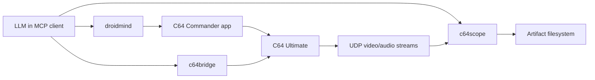
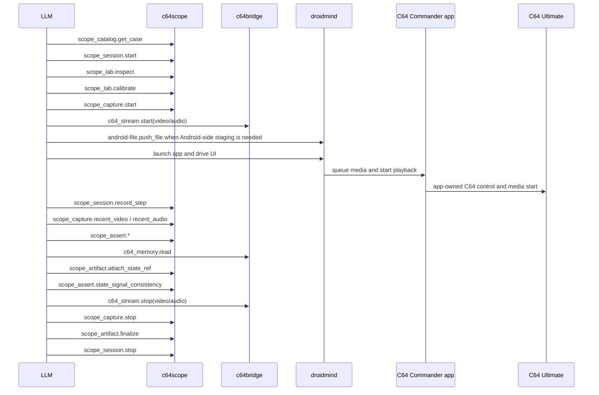
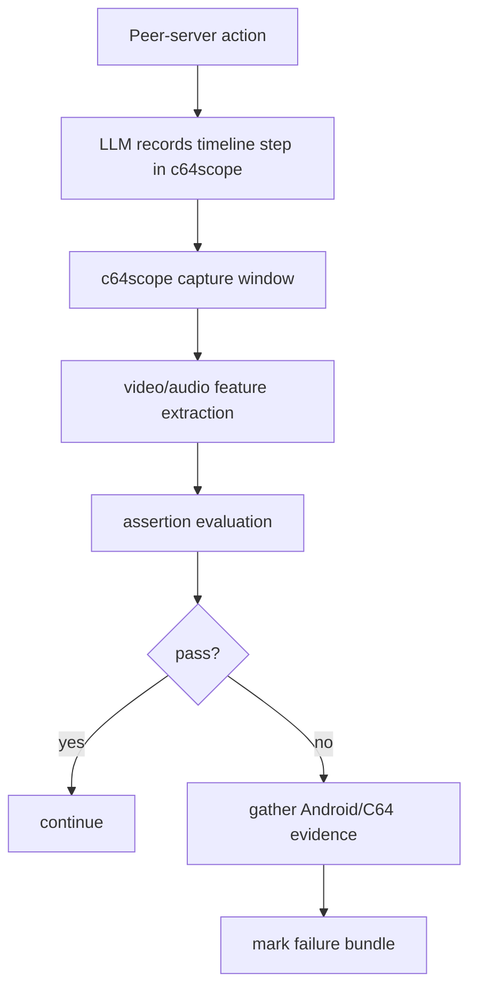
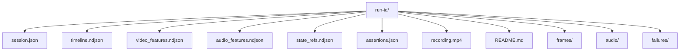

# Agentic Test Architecture

## Goal

Enable a single LLM to run fully autonomous tests against:

- the real Android device running C64 Commander
- the real C64 Ultimate
- the C64 Ultimate's emitted video and audio streams

using only three peer MCP servers (i.e. "agents"):

1. `c64bridge`
2. `droidmind`
3. `c64scope`

## Constraints

- Do not extend `c64bridge`.
- Do not extend `droidmind`.
- Do not duplicate their tool surfaces.
- Keep `c64scope` in its own top-level repo folder.
- Keep orchestration LLM-driven.
- Do not depend on Maestro or ad hoc shell orchestration for the baseline design.

## Architectural Decision

The LLM is the only orchestrator.

The three MCP servers are peers. Each owns one domain:

| Server | Owns | Must not own |
| --- | --- | --- |
| `c64bridge` | fast direct-C64 gap fillers: stream start/stop, RAM reads, emergency recovery, infrastructure-only calibration | primary product-validation control path, normal media start/stop, app-owned queue behavior |
| `droidmind` | Android control, app lifecycle, screenshots, logcat, diagnostics, and therefore the primary path for driving C64 Commander | direct C64 control outside the app path, physical verdicts |
| `c64scope` | capture, signal features, assertions, artifact bundles, test-case playbooks | C64 control, Android control |

## App-First Product-Validation Rule

The product under test is C64 Commander.

That means physical tests must prefer the app's own capabilities whenever they exist. The point is not merely to observe real C64 output; it is to prove that the app can drive the device correctly.

Therefore:

- use C64 Commander for normal C64 control
- use C64 Commander for media start and stop
- use C64 Commander for playlist and queue behavior
- use `c64bridge` only where the app currently has a real gap or an unacceptable loop cost

Current accepted `c64bridge` gaps:

- fast RAM assertions
- fast stream start and stop
- emergency recovery
- infrastructure-only calibration runs

## System Topology



## Why The LLM Must Orchestrate

No server has enough context to own the full run alone.

- `c64bridge` can fill the remaining direct-C64 gaps, but using it as the primary control path would bypass the app behavior we actually need to test.
- `droidmind` can operate C64 Commander and gather Android evidence, but it cannot interpret C64 signal correctness by itself.
- `c64scope` can capture and assert signals, but it cannot know which peer-server actions happened unless the LLM tells it.

The LLM is therefore the only component that can:

- choose the next tool call
- correlate intent across domains
- keep the app as the default control path
- record semantically meaningful steps
- decide when a failure is infrastructural versus product behavior

## Discovery Model

The LLM must be able to discover the tools it needs without out-of-band human explanation.

Discovery happens in three layers.

### 1. MCP-native tool discovery

The MCP client already exposes the full tool lists from all three servers.

This gives the LLM the primitive surface.

### 2. `c64scope` playbook discovery

`c64scope` adds repository-specific resources that explain how to combine the primitive surfaces:

- `c64scope://playbooks/autonomous-physical-testing`
- `c64scope://playbooks/mixed-format-playback`
- `c64scope://catalog/test-cases`
- `c64scope://catalog/assertions`

This is the missing semantic layer.

The playbooks must explicitly encode the app-first rule so the LLM discovers it instead of improvising around it.

### 3. IDE agent bootstrap files

Repository-local agent files should tell Copilot or OpenCode how to start the session and how to respect boundaries.

Repository-local bootstrap files:

- [c64scope-delivery-prompt.md](./c64scope-delivery-prompt.md)
- [.github/prompts/autonomous-physical-playback.prompt.md](../../../.github/prompts/autonomous-physical-playback.prompt.md)
- [.opencode/agents/c64-physical-test-orchestrator.md](../../../.opencode/agents/c64-physical-test-orchestrator.md)

## Session Model

The LLM runs every physical test as an explicit session.



## Why `record_step` Is Mandatory

Because the servers are peers, `c64scope` cannot observe peer-server calls automatically. Without an explicit timeline API, the final artifact set would know what the signals looked like but not why the LLM expected them.

Minimal rule:

- after every meaningful `c64bridge` or `droidmind` action, the LLM records one semantic step in `c64scope`

Examples:

- `Uploaded queue assets into app-visible storage`
- `Started stream receivers and enabled C64U video/audio streaming`
- `Tapped Play on queue item 3/7 in C64 Commander`
- `Read screen RAM after progression timeout`

## Control Patterns

There are only two valid control patterns.

### Pattern A: App-driven playback

Use when validating the real product behavior.

1. `droidmind` launches C64 Commander and drives the UI.
2. C64 Commander performs normal C64 control, queue construction, and media start/stop.
3. `c64bridge` is used only for supporting gap-fill operations such as stream start/stop, fast RAM read, or recovery.
4. `c64scope` proves emitted A/V correctness and progression.

Pattern A is the default and preferred path.

### Pattern B: Direct C64 calibration

Use when validating infrastructure or isolating failures.

1. `c64bridge` starts a known fixture directly.
2. `c64scope` validates capture and assertion behavior.
3. `droidmind` is optional.

Pattern B exists only to distinguish product bugs from lab or receiver bugs. It is not the primary product-validation path.

## Baseline Autonomous Regression

The first required real regression is a mixed-format playback queue containing:

- PRG
- CRT
- MOD
- SID
- D64
- D71
- D81

### Test intent

Prove that the app and hardware together can:

1. start playback for each queued item
2. produce the expected short A/V signature for each item
3. progress automatically to the next item
4. complete the queue in order without stalling

In this regression, those behaviors must be exercised through C64 Commander itself wherever the app already supports them.

### Required evidence per item

For each playlist item the run must capture:

- one timeline step describing how playback of the item was triggered or detected
- one video signature match or transition proof
- one audio signature match or an explicit silence expectation
- one progression proof into the next item, except for the final item

### Required evidence per run

- session metadata
- ordered timeline
- full C64 video/audio feature streams
- final MP4 of the C64 signal output
- Android screenshots and log references on anomalies
- machine-readable assertion results
- human-readable README

## Mixed-Format Progression Strategy

The queue needs a manifest that `c64scope` can expose through `scope_catalog.get_case`.

The manifest should define, for each item:

- logical ID
- source path
- staging method
- media type
- trigger method
- expected start window
- expected video signature
- expected audio signature
- minimum playback duration
- maximum progression timeout

Example shape:

```json
{
  "id": "playback-smoke-mixed-01",
  "items": [
    {
      "id": "clip-01-prg",
      "type": "prg",
      "path": "/USB0/physical-tests/clip-01.prg",
      "staging": "prepositioned-c64u-storage",
      "trigger": "c64commander-ui",
      "expectedVideo": { "dominantColour": 6 },
      "expectedAudio": { "frequencyHz": 440, "toleranceHz": 8 },
      "minDurationMs": 3000,
      "progressionTimeoutMs": 8000
    }
  ]
}
```

`c64scope` owns the manifest. The other servers do not.

Media should be made available to the app in one of two ways:

- preposition it on C64U storage so C64 Commander can browse and start it
- place it via `adb` into Android storage that C64 Commander can access

The app should then be used to start playback.

## Assertion Pipeline



## Failure Handling

Failures divide into three classes.

### Product failure

The app or device behavior is wrong, but the lab is healthy.

Examples:

- wrong item starts
- queue stalls
- wrong media order
- wrong screen content
- wrong audio emitted

### Infrastructure failure

The physical test infrastructure is unhealthy.

Examples:

- packet loss above threshold
- receivers never started
- `ffmpeg` missing
- UDP target mismatch

### Ambiguous failure

The run cannot prove the cause from current evidence.

Examples:

- app log shows playback start, but signal never changes and packet loss spikes
- signal changes, but item order is unclear because the timeline is incomplete

`c64scope` must classify the failure. The LLM can then decide whether to retry, gather more evidence, or stop.

## Artifact Layout



## IDE Agent Files

### Delivery prompt

[c64scope-delivery-prompt.md](./c64scope-delivery-prompt.md) is the implementation-facing briefing for any LLM that must introduce `c64scope` and carry the work to real-hardware completion.

It defines:

1. required repository reading in `doc/`
2. non-negotiable server-boundary rules
3. phase-by-phase delivery expectations
4. completion and validation discipline

### Copilot prompt file

[autonomous-physical-playback.prompt.md](../../../.github/prompts/autonomous-physical-playback.prompt.md) gives Copilot a concrete startup routine:

1. inspect `c64scope` playbooks
2. start a session
3. start capture
4. use C64 Commander as the normal control path via `droidmind`
5. use `c64bridge` only for fast stream and RAM gaps
6. record steps into `c64scope`
7. assert progression and finalize artifacts

### OpenCode agent file

[c64-physical-test-orchestrator.md](../../../.opencode/agents/c64-physical-test-orchestrator.md) does the same for OpenCode-style agent spawning.

## Client Registration Examples

These are example snippets only. They document the intended three-server shape without changing the repository's active MCP configuration.

### VS Code Copilot example

```json
{
  "servers": {
    "c64bridge": {
      "command": "node",
      "args": ["<path-to-c64bridge>/dist/index.js"]
    },
    "droidmind": {
      "command": "python",
      "args": ["-m", "droidmind", "--transport", "stdio"]
    },
    "c64scope": {
      "command": "npm",
      "args": ["run", "start:mcp", "--prefix", "./c64scope"]
    }
  }
}
```

### OpenCode example

```json
{
  "mcpServers": {
    "c64bridge": {
      "command": "node",
      "args": ["<path-to-c64bridge>/dist/index.js"]
    },
    "droidmind": {
      "command": "python",
      "args": ["-m", "droidmind", "--transport", "stdio"]
    },
    "c64scope": {
      "command": "npm",
      "args": ["run", "start:mcp", "--prefix", "./c64scope"]
    }
  }
}
```

## Minimal Operating Procedure For The LLM

1. Read `c64scope` case metadata first.
2. Never invent wrapped tools like `play_media` or `start_physical_test` if the three servers already expose the required primitives.
3. Treat C64 Commander as the default C64 control path.
4. Start `c64scope` capture before starting `c64bridge` streaming.
5. Use `c64bridge` only for fast stream control, fast RAM assertions, or recovery.
6. Record meaningful peer actions in the `c64scope` timeline.
7. Stop streams cleanly before finalizing artifacts.

## Result

This architecture preserves the user's constraints exactly:

- three MCP servers only
- no extension of the other two servers
- no duplicated tool surfaces
- clean separation in the repository
- fully autonomous LLM-driven physical tests against real hardware
- C64 Commander remains the primary control path under test
