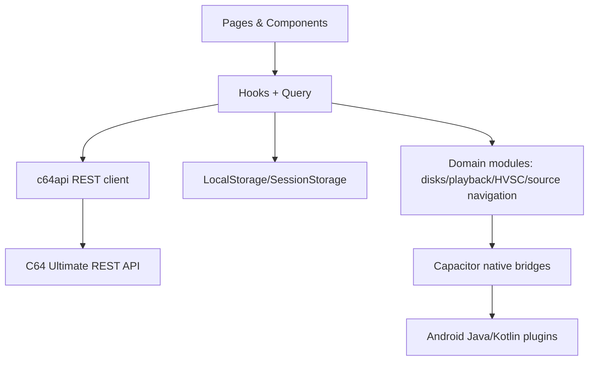
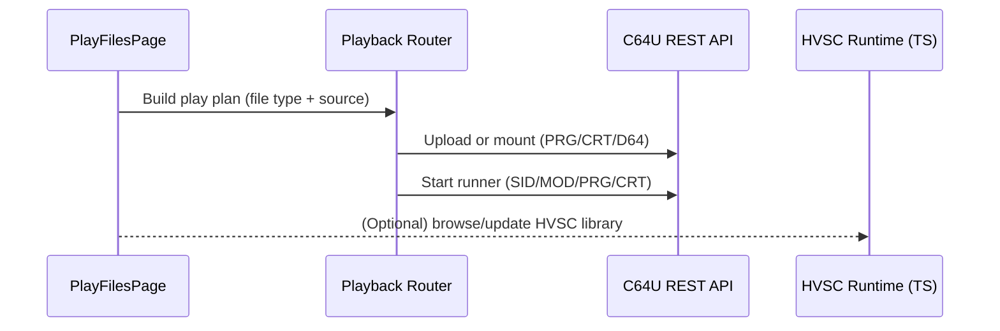
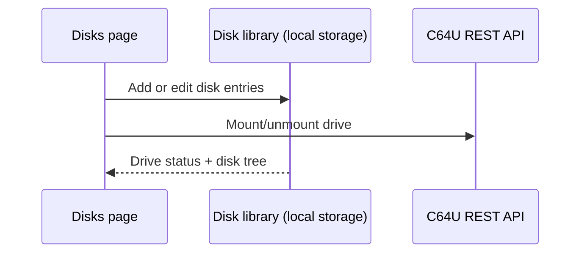
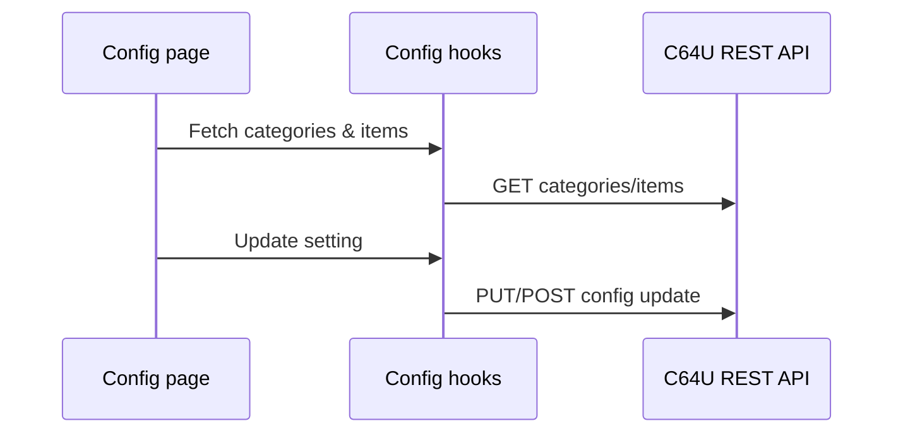

# Architecture Overview

C64 Commander is a React + Vite application that targets three runtimes from the same TypeScript codebase:

- Web via the bundled Vite app and local web server
- Android via Capacitor plus native plugins
- iOS via Capacitor, using the TypeScript implementations where no native bridge exists

The core app controls a C64 Ultimate over REST and FTP, keeps app-local state in browser/native storage, and layers optional native bridges on top for platform-specific capabilities such as FTP access, secure storage, diagnostics bridging, background execution, and HVSC ingestion. HVSC ingestion and indexing run in TypeScript by default; on Android a native `HvscIngestionPlugin` (Kotlin) is selected at runtime when the Capacitor plugin is available (`resolveHvscIngestionMode` in `src/lib/hvsc/hvscIngestionRuntime.ts`).

## Runtime and stack summary

- **UI/runtime**: React 18, React Router 6, Vite 5, Capacitor 6
- **State and forms**: TanStack Query, React Hook Form, Zod
- **UI primitives**: Tailwind CSS, Radix UI, shadcn-style component patterns, Framer Motion
- **Core domain modules**: `src/lib/c64api.ts`, `src/lib/playback/`, `src/lib/hvsc/`, `src/lib/disks/`, `src/lib/config/`, `src/lib/sourceNavigation/`
- **Native implementations**: Android Kotlin/Java plugins under `android/app/src/main/java/uk/gleissner/c64commander/`
- **Observability**: `src/lib/logging.ts`, `src/lib/diagnostics/`, `src/lib/tracing/`

## Display profile resolution

Display-profile resolution is centralized in `src/lib/displayProfiles.ts` and exposed to the UI through `src/hooks/useDisplayProfile.tsx`.

- Viewport width in CSS pixels resolves to one of three internal profiles: `compact`, `medium`, or `expanded`.
- A persisted user override may replace the automatic profile with `Auto`, `Small display`, `Standard display`, or `Large display` from Settings.
- Shared layout boundaries such as page containers, action grids, split sections, and profile-sensitive dialogs consume the resolved profile instead of performing ad hoc breakpoint checks.

This profile layer sits above the existing viewport-validation infrastructure rather than replacing it.

- Playwright dual-resolution and overflow checks still validate concrete viewport behavior.
- The display-profile resolver gives those viewport tests a stable semantic target, so Compact, Medium, and Expanded behavior can be asserted directly without scattering width heuristics throughout feature code.
- Screenshot and layout validation remain viewport-driven, while profile-aware tests verify that the correct layout mode is selected and preserved when overrides are used.

## Stack and Layers

- **UI**: React pages in [src/pages](../src/pages) with shared components in [src/components](../src/components).
- **State + data fetching**: React hooks in [src/hooks](../src/hooks) backed by TanStack Query.
- **API client**: REST client in [src/lib/c64api.ts](../src/lib/c64api.ts).
- **Domain modules**: playback, disks, HVSC, config, source navigation, SID utilities, and logging in [src/lib](../src/lib).
- **Native bridges**: Capacitor plugins in [src/lib/native](../src/lib/native) and Android implementations under [android/app/src/main/java](../android/app/src/main/java).
- **Secure storage**: Device password is stored via the SecureStorage bridge (Android Keystore); localStorage only tracks a `c64u_has_password` flag for presence.

## High-level data flow

## External systems and persistence

| Concern                | Current implementation                                                                                                                          |
| ---------------------- | ----------------------------------------------------------------------------------------------------------------------------------------------- |
| C64U control plane     | REST API via `src/lib/c64api.ts`, documented in `docs/c64/c64u-openapi.yaml` and `docs/c64/c64u-rest-api.md`                                    |
| C64U file access       | FTP via `src/lib/ftp/ftpClient.ts` and `src/lib/native/ftpClient.ts`; Android native implementation in `FtpClientPlugin.kt`                     |
| HVSC acquisition       | Release discovery and download via `src/lib/hvsc/hvscReleaseService.ts`; extraction/indexing in `src/lib/hvsc/`                                 |
| Local app state        | localStorage/sessionStorage-backed stores plus repository abstractions under `src/lib/playlistRepository/`, `src/lib/disks/`, and config stores |
| Secure secrets         | `src/lib/secureStorage.ts` with native secure-storage bridge; local storage only tracks password presence metadata                              |
| Diagnostics and traces | Structured logs via `src/lib/logging.ts` and diagnostics/tracing modules under `src/lib/diagnostics/` and `src/lib/tracing/`                    |
| Crash visibility       | In-app diagnostics plus platform-level telemetry such as Android Vitals when the distribution channel provides it                               |

## Playback flow (Play page)

## Disk management flow

## Configuration flow

## Play Page Browsing and Playlist Spec

### SID terminology (normative)

- **SID file**: one `.sid` binary file (PSID/RSID container) from any source.
- **SID track**: one app-level canonical track record created from a SID file for playlist/query/storage.
- **SID song**: one playable subsong inside a SID track, selected by `songNr` (1-based).

Cardinality rules:

- One SID file maps to one SID track.
- One SID track maps to one or more SID songs.

### 1. Source model (normative)

The Play page exposes exactly three source kinds:

- `ultimate` (C64U filesystem via FTP bridge)
- `local` (device storage; SAF or file entries)
- `hvsc` (ingested HVSC library in app storage)

All three sources implement the same browse contract in TypeScript:

- `listEntries(path)` -> immediate folder/file children
- `listFilesRecursive(path, options)` -> recursive file enumeration
- `rootPath`, `id`, `type`, `isAvailable`

UI behavior must not diverge by source kind. Source kind affects data access only, not browse mechanics.

### 2. Browse UX contract (normative)

On Play page ingest flow:

1. User opens Add Items.
2. User selects a source.
3. User navigates using the same controls (`Root`, `Up`, `Refresh`, folder open, selection).
4. User confirms selection.
5. Selected files are ingested into the playlist.

Rules:

- No source-specific browse UI for normal ingest.
- Same loading/empty/error semantics across all sources.
- Source identity is secondary metadata only.

### 3. Playlist ingest contract (normative)

Ingest converts selected files into canonical playlist track references:

- Canonical metadata (title, artist when available, released, duration, size, path, subsong info) is normalized at ingest time.
- Source-specific handles (FTP path, SAF URI, HVSC virtual path) are stored as backend refs, not UI labels.
- Playlist rows must render from canonical metadata only.

Target behavior: users can mix items from all sources without any source-specific playlist behavior.

### 3.1 SID header metadata contract (normative)

For `.sid` files, ingestion must parse and normalize PSID/RSID header metadata (v1-v4):

- identity/version: `magicId`, `version`
- playback shape: `songs`, `startSong`, `speed`, `clock`
- chip topology: `sid1Model`, `sid2Model`, `sid3Model`, `sid2Adress`, `sid2Address`, `sidChipCount`
- text metadata: `name`, `author`, `released`

Rules:

- String fields must be decoded from Windows-1252 and normalized to UTF-8 text for storage/search.
- `name`/`author`/`released` must be preserved in SID metadata storage even if UI title policy later differs.
- RSID constraints must be validated and stored as compatibility state (valid/invalid + parser warnings), not silently ignored.
- Parsed SID metadata must be source-agnostic playlist data; source origin remains implementation detail.

### 4. Playlist query contract (normative)

Playlist rendering must be query-driven, not full-array filtering in React memory.

Required query capabilities:

- text search across normalized fields (title, author, released, path, source locator, category)
- deterministic ordering (playlist position by default; title and path as alternatives)
- paging/windowing (`limit` + `offset`)
- total match count for current filter

Performance rules:

- No O(n) full-list filter on each keypress for large playlists.
- No O(n^2) row derivation in list mapping.
- Virtualized rendering for visible window only.

#### Current implementation status

The production query engine satisfies the above contract through the IndexedDB playlist repository:

- **Search**: substring matching on a pre-computed search-text field (concatenation of title, author, released, path, source locator, category). Runs in chunked 200-item batches within IndexedDB transactions, not as a single in-memory array filter.
- **Sort orders**: three pre-computed sort permutations (`playlist-position`, `title`, `path`) stored alongside playlist items, enabling deterministic ordering without runtime sort.
- **Pagination**: offset/limit with total match count. Cursor/keyset paging is a future enhancement; offset paging is proven at 100k-item scale.
- **Category filter**: exact-match filtering on track category (e.g., `song`, `mod`).
- **Tested at scale**: 100k playlist query windows, deterministic paging, clamped edge cases.

Full-text search (FTS5/trigram) and cursor/keyset paging remain aspirational improvements documented in [db.md](db.md). The current substring + chunked-scan approach is the proven production design.

### 5. Layered architecture (UX -> DB)

| Layer                                                                    | Responsibility                                                    |
| ------------------------------------------------------------------------ | ----------------------------------------------------------------- |
| UX (`PlayFilesPage`, list components)                                    | Input, selection, playback controls, virtualized result window    |
| Application hooks (`useSourceNavigator`, playlist hooks)                 | Orchestrate browse, ingest, and query states                      |
| Domain services (`sourceNavigation`, playback, hvsc service, SID parser) | Source adapters, metadata normalization, ingest semantics         |
| Repository interfaces (TypeScript)                                       | Source-agnostic data access contracts for tracks/playlists/search |
| Storage engine                                                           | Persistent metadata/index/query execution                         |
| Native bridges                                                           | Filesystem/FTP/SAF and platform services                          |

### 6. Storage and indexing strategy

For large collections/playlists (100k target):

- Persistent metadata/query store uses IndexedDB with normalized records (tracks, playlist items, sessions, sort orders stored as separate keyed entries).
- Text search uses pre-computed substring matching on concatenated metadata fields, executed in chunked 200-item IndexedDB transactions.
- Playlist membership and track metadata are stored separately with batch upsert (500-track chunks).
- Large playlists are never persisted as full JSON blobs in localStorage.
- Pre-computed sort permutations (playlist-position, title, path) are stored alongside playlist data to avoid runtime sorting.

HVSC browse uses an in-memory JSON snapshot rebuilt from the native HVSC index (SQLite on Android; TypeScript-ingested on Web/iOS). Browse queries filter and paginate the snapshot with substring matching and offset/limit. The HVSC index itself is authoritative storage written during ingestion.

TypeScript remains the business-logic source of truth via repository interfaces; storage engine choice is an implementation detail behind adapters.

#### Future design (aspirational)

[db.md](db.md) defines a full relational schema with SQLite FTS5 for instant text filtering, cursor/keyset paging, and SID metadata facet search. This is the target design for scaling beyond the current proven bounds. The current IndexedDB + in-memory architecture is the production baseline.

## Crash reporting

- **Android production crashes** are surfaced via **Google Play Console** (Android Vitals) once distributed through Play.
- **In-app diagnostics** are available in Settings, allowing users to share logs via email without sending automatic crash traces to external services.

## HVSC platform support contract

| Capability           | Android              | iOS                | Web                   |
| -------------------- | -------------------- | ------------------ | --------------------- |
| Native HVSC plugin   | Yes                  | Yes                | No                    |
| Large-archive ingest | Native (streaming)   | Native (streaming) | Blocked (5 MiB limit) |
| HVSC metadata DB     | SQLite               | SQLite             | In-memory             |
| Baseline recovery    | Staged + atomic swap | Staged (planned)   | N/A (no large ingest) |

### Web platform limitations

Web has no native HVSC ingestion plugin. The non-native (JavaScript) extraction path is:

- **Blocked in production** — `resolveHvscIngestionMode()` throws `NON_NATIVE_HVSC_INGESTION_UNSUPPORTED_MESSAGE` unless explicitly overridden via `VITE_ENABLE_NON_NATIVE_HVSC_INGESTION=1`.
- **Size-guarded** — `MAX_BRIDGE_READ_BYTES` (5 MiB) is enforced at download pre-flight and file read-back. Archives exceeding this limit are rejected before any I/O.
- **Test-only override** — the override flag is available only for controlled testing and dev mode. It is not exposed in production builds.

This is an intentional design decision. The HVSC full-archive baseline (~50 MB compressed, ~60k songs) exceeds what browser-based JavaScript extraction can handle reliably within the target memory/time envelope. Native platforms handle this via streaming extraction with native SQLite metadata writes.
