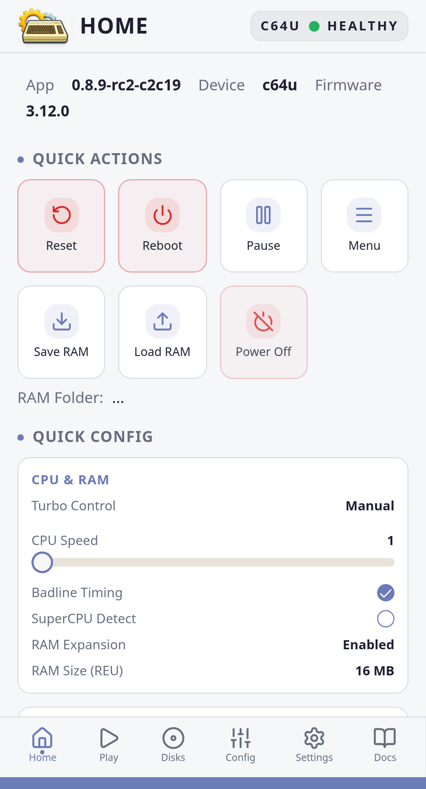
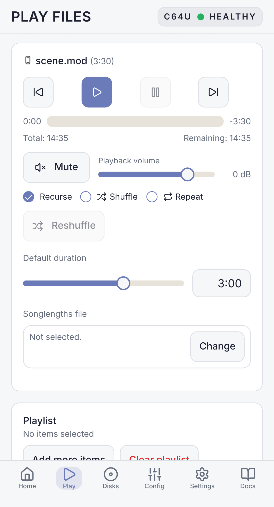
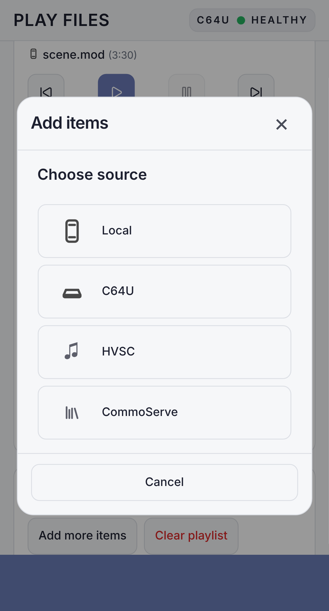
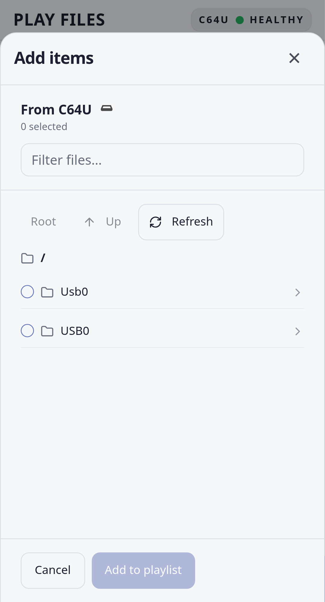
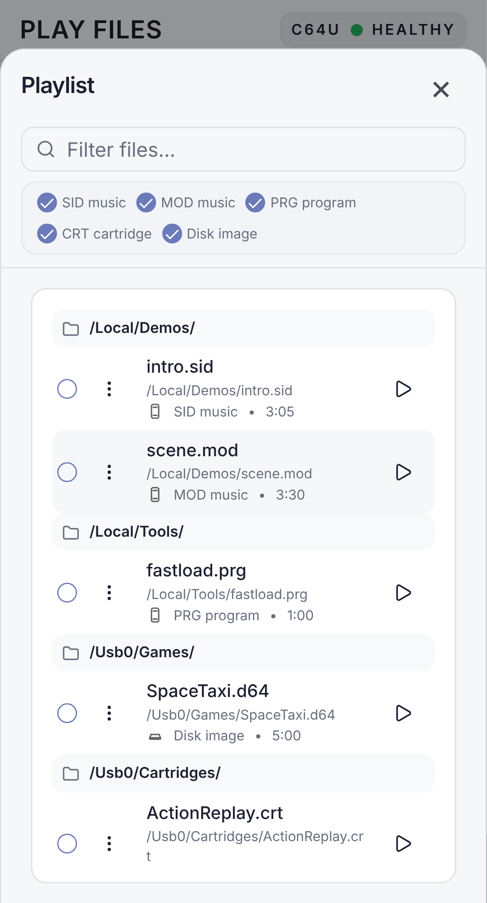
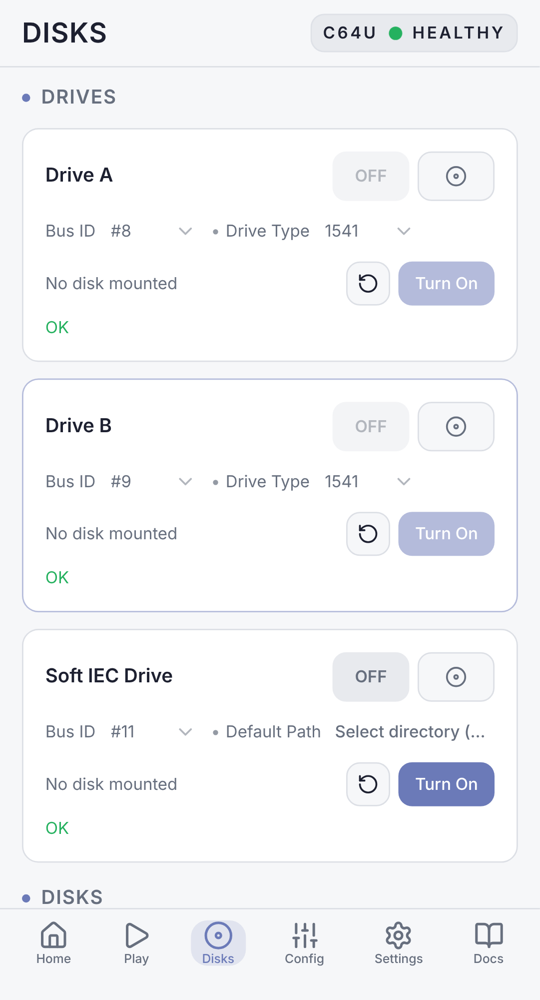
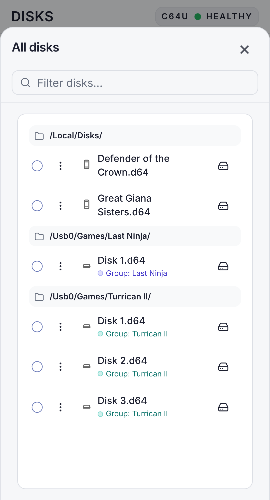
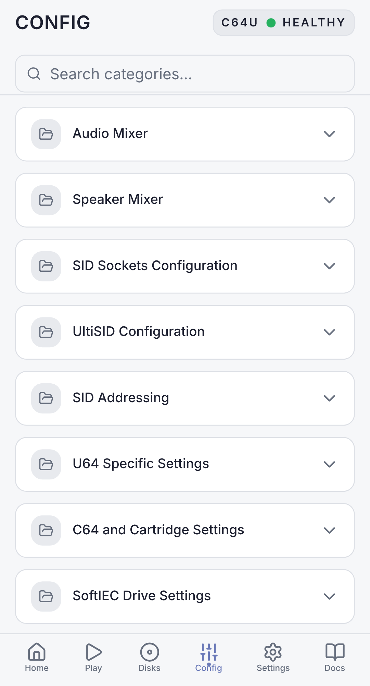
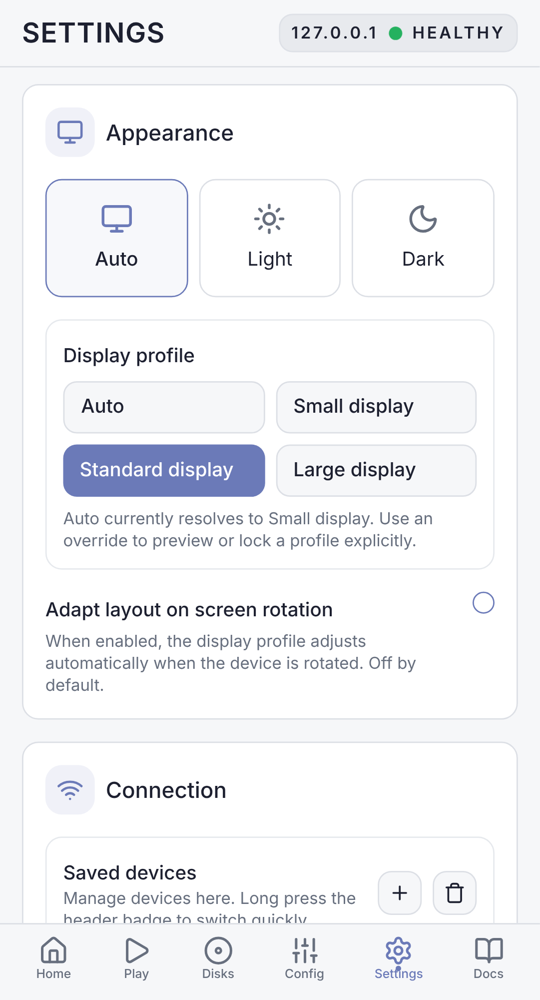
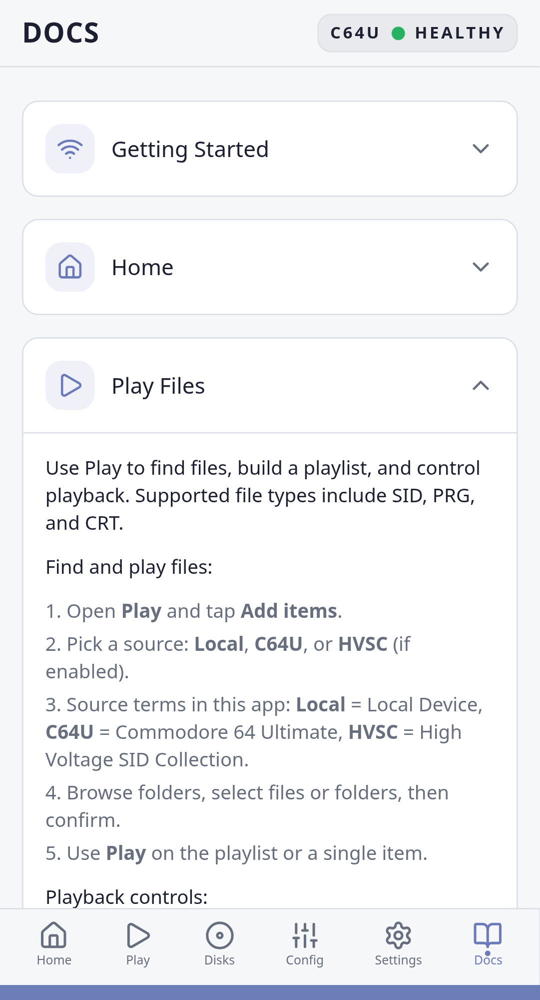

# C64 Commander Manual

Connect, control, play, mount, and diagnose a Commodore 64 Ultimate, Ultimate 64, Ultimate 64 Elite, Ultimate 64 Elite II, or Ultimate-II+(L).

## Table of Contents

- [Welcome](#welcome)
- [Before You Start](#before-you-start)
- [First Connection](#first-connection)
- [Your First Tour](#your-first-tour)
- [Everyday Flows](#everyday-flows)
- [Safe Device Use](#safe-device-use)
- [Troubleshooting](#troubleshooting)
- [Feature Reference](#feature-reference)
- [Keyboard and Directional Input Reference](#keyboard-and-directional-input-reference)
- [File and Source Reference](#file-and-source-reference)
- [Status and Safety Reference](#status-and-safety-reference)

## Welcome

C64 Commander controls a Commodore 64 Ultimate, Ultimate 64, Ultimate 64 Elite, Ultimate 64 Elite II, or Ultimate-II+(L) from one app.

The main jobs are:

- **Control**: reset, reboot, menu, drives, printer, SID, streams, RAM, and configuration.
- **Files and playback**: playlists, Local, C64U, HVSC, CommoServe, and disk collections.
- **Diagnostics**: health checks, logs, traces, errors, latency, and device switching.

Start with the walkthrough if you are new to the app. Use the reference sections when you already know what you want to do.

## Before You Start

### Supported Machines

C64 Commander is the broad edition. It works with the Commodore 64 Ultimate, Ultimate 64, Ultimate 64 Elite, Ultimate 64 Elite II, and Ultimate-II+(L).

The app may call the device-file source **C64U** in lists and pickers. In that place, read it as storage on the connected Ultimate-family device, reached through FTP.

Connection has three parts: the app device, the connected Ultimate-family device, and the local network between them.

Put the device running the app and the connected Ultimate-family device on the same Wi-Fi or wired LAN. Then open **Network Services & Timezone** on the target device.

Enable the services the app uses:

- **Web Remote Control Service**: required for most control and status operations.
- **FTP File Service**: needed for device file browsing, playlists, and disk collections.
- **Telnet Remote Menu Service**: used for advanced menu-backed actions when those actions are enabled.

Note the IP address under **Wired Network Setup** or **WI-FI Network Setup**. You may need it if local discovery cannot see the target device.

## First Connection

Start C64 Commander. If no saved device is reachable, it scans the local network for supported devices.

If devices are found:

1. Choose **Use** to connect now.
2. Choose **Save** to keep the device for later.
3. If the device is password-protected, enter its network password when asked.

If no devices are found, C64 Commander opens a manual setup prompt.

Enter a hostname such as `c64u`, `u64`, or `u2`, or an IP address such as `192.168.1.64`, then choose **Connect**. If the device answers but requires a password, the same dialog asks for it before saving and connecting.

A healthy badge at the top right confirms that the active device is responding. You can scan again later from **Settings > Connection > Discover devices**.

## Your First Tour

### The Header Badge

The top-right badge shows the current device status: healthy, degraded, unhealthy, or offline. Tap it to open Diagnostics. Long-press it, press `#`, or use the Quick Menu to open Device Switcher.

### Home

Home groups the day-to-day controls.

Start at the top. The system strip confirms which app build, device, and firmware you are using. Below it, Quick Actions give you the familiar front-panel moves: Reset, Reboot, Pause/Resume, Menu, RAM snapshots when enabled, and power actions when the device supports them.

Keep moving down and you reach Quick Config. These are the settings you are likely to touch in the middle of a session: CPU speed, RAM expansion, joystick swap, serial bus mode, video output, scan lines, or interface behavior.

The lower cards cover drives, printer, SID mixer, streams, and configuration actions. **Save to flash** writes the current device settings to flash on the connected Ultimate-family device when you need an explicit save.

### Play

Play is for building a playlist and running it.

Choose **Add items**, then choose a source.

The picker stays inside that source, so **Up** never escapes into a different place by accident. Select files or folders, confirm, then play from the playlist. Use View all when the playlist grows.

Playback supports SID, MOD, PRG, CRT, and disk images. SID files can expose subsongs. When songlength metadata is available, the app shows duration and can advance more predictably.

A playlist can stay tiny for one song or become a queue for a whole session.

When the list is short, use the main Play page. When it grows, open **View all**. The larger view gives you room to scan, filter, select, remove, and reorder without losing the playback controls.

Add broadly, then filter narrowly. Add a folder, an album, or a set of related files. Then filter by title, path, source, type, or archive result.

The filter changes the visible list, not the playlist itself. Clearing it brings the full queue back.

Each playlist item keeps its origin. Local files remain local, C64U files point back to the device, archive results remember their source, and SID entries can retain songlength and subsong information.

Use playback controls for the session: play or pause, previous or next, shuffle, repeat, and volume. Use item actions for one entry: remove it, inspect it, choose a subsong, or apply an item-specific playback setting where available.

For SID files, watch duration and subsong information. A SID may contain one tune or several. Songlength data makes advancing through the list less like guesswork.

For disk images, Play is convenient when you are launching or testing. Disks is better when drive setup, grouping, or collection work matters.

### Disks

Disks manages drives and disk images.

Use drive cards to turn drives on or off, set bus ID and drive type, mount and eject images, reset drives, and set a Soft IEC path. Use **Add disks** to build a disk collection from the available sources.

For multi-disk titles, put related disks in a group. Once grouped, the drive controls can rotate through them.

Organize the disk collection around the titles you use.

Add a single image, a folder of images, or an archive search result. Then filter by name, path, source, or group. Filtering helps you find; it does not delete or move anything.

Mounting is the central Disks action. Choose the disk, choose the target drive, and mount. Eject when you want the drive empty again.

If a title uses several disks, assign the related entries to the same group. Use rotation later to move to disk 2 or disk 3.

Drive settings live beside the collection because they shape how mounted images behave. Bus ID, drive type, enable state, reset, and Soft IEC path all matter when software expects a particular drive setup.

Use Disks for collection work because the collection, filters, grouping, and mount flow are on the same page.

### Config

Config is the complete configuration tree.

Search for a category, open it, and edit rows directly. The app chooses the right control for each item: slider, switch, select, or text field.

A change is sent to the active device immediately. The firmware applies it at once.

Use **Save to flash** when **Auto save config** is **Ask** or **No**, or when you want to force a flash save now. To make configuration changes save themselves, set **Auto save config** to **Yes**. On a Commodore 64 Ultimate, set it at **C= + RESTORE > User interface > Auto save config**. C64 Commander mirrors that menu in Config as **User interface > Auto save config**. On other supported devices, search Config for **Auto Save Config** if the menu naming differs.

Use Config when you know the setting exists but not where the device menu hides it. Search reduces the tree to matching categories and rows. After changing a value, wait for the write to finish before changing another related setting.

Config writes to the active device; it does not edit a draft. Use Config for precise or uncommon settings, and page-specific controls for routine changes.

### Settings

Settings controls app behavior and saved connection details.

Connection settings live here, along with display profile, full-screen behavior, diagnostics options, feature toggles, archive settings, notifications, and Device Safety.

If the device is hard to reach, start in **Connection**. If it is reachable but fragile, start in **Device Safety**.

Settings also holds saved devices. Use it to edit a name, host, HTTP port, FTP port, Telnet port, or password. When you save and connect, the app probes the device and reports whether the chosen services answer.

Display settings are local to the app. They do not change the C64 Ultimate. Use them to choose the display profile, full-screen behavior, notification style, and how dense the interface should feel.

Feature toggles appear only when a feature is safe for normal users to change in this variant. If a feature is not supported by this variant, it is absent from Settings and from this manual.

### Docs

Docs is the built-in help page.

It covers setup, Home, Play, Disks, Config, Settings, Diagnostics, and disk swapping.

### Diagnostics

Diagnostics shows connection health, recent activity, and failures.

Open it when a control fails, playback does not start, a file transfer stalls, or the badge looks unhealthy. It includes Problems, Actions, Logs, Errors, Traces, health checks, latency views, heat maps, filters, Share, and Clear.

Start with Problems when you want a plain-language summary. Move to Errors when something failed. Use Traces when timing, request order, or endpoint behavior matters. Health checks are the quickest way to confirm whether REST, FTP, and Telnet are alive.

The Share action packages useful evidence. Use it before restarting the app if you are investigating a recurring issue, because the most useful details are often the last few actions before a failure.

### Device Switching

Device Switcher is for homes with more than one saved Ultimate-family device.

Open it from the badge long-press, `#`, or Quick Menu. Expand a row for more detail.

## Everyday Flows

### Connect by Hand

1. Open **Settings > Connection** or use the startup prompt when discovery finds nothing.
2. Enter a hostname or IP address.
3. Choose **Save & Connect** or **Connect**.
4. Enter the network password if prompted.

Preferred path: use startup discovery first, then manual host entry if discovery finds nothing.

### Maintain Saved Devices

1. Open **Settings > Connection**.
2. Review the saved-device list.
3. Edit names and ports so each device is recognizable.
4. Use **Save & Connect** after changing the active device.
5. Remove stale devices when they are no longer on your network.

Preferred path: Settings for editing, Device Switcher for choosing.

### Reboot and Return to Work

1. Open **Home**.
2. Choose **Reboot**.
3. Confirm.
4. Watch the badge until the device returns healthy.

Preferred path: Home Quick Actions. Use Diagnostics only if the device does not return.

### Play a SID or Program

1. Open **Play**.
2. Choose **Add items**.
3. Choose Local, C64U, HVSC, or CommoServe.
4. Select files or folders.
5. Confirm and press Play.

Preferred path: Play. Use C64U source for files already on the target device; use Local for files on the Android device.

### Build a Playlist from Folders

1. Open **Play > Add items**.
2. Choose the source that owns the folder.
3. Navigate into the folder.
4. Select the files or folders you want.
5. Confirm the selection.
6. Open **View all** if the list is long.

Preferred path: Add a folder first, then filter the playlist to choose what to play next.

### Filter and Clean a Playlist

1. Open **Play > View all**.
2. Type a few characters from the title, path, source, or file type.
3. Review the filtered rows.
4. Remove unwanted rows or clear the filter to return to the full list.

Preferred path: filter before removing. A filter changes only what you can see.

### Work with SID Subsongs

1. Add one or more SID files to Play.
2. Select the SID item.
3. Choose the subsong or playback option if the file exposes one.
4. Use duration information when available to decide whether to repeat, skip, or continue.

Preferred path: keep SID work in Play; use HVSC preparation only when the library itself needs attention.

### Mount a Disk

1. Open **Disks**.
2. Add disks if the collection is empty.
3. Open the drive mount action.
4. Choose a disk.

Preferred path: Disks. Home also shows drive shortcuts, but Disks gives the clearest collection view.

### Build a Disk Collection

1. Open **Disks > Add disks**.
2. Choose Local, C64U, HVSC, or CommoServe.
3. Select disk images or folders.
4. Confirm the selection.
5. Use **View all** to inspect the collection.

Preferred path: Disks for collection work; Play for launch-oriented queues.

### Filter, Group, and Rotate Disks

1. Open the disk collection view.
2. Filter by title, path, source, or group.
3. Assign related disks to the same group.
4. Mount the first disk.
5. Use rotation controls when the title asks for the next disk.

Preferred path: group related disks before you need to swap them.

### Mount to a Specific Drive

1. Open **Disks**.
2. Confirm the target drive is enabled.
3. Check bus ID and drive type if the software is particular.
4. Choose the disk image.
5. Mount it to the intended drive.

Preferred path: adjust drive setup before mounting.

### Change a Common Setting

1. Try **Home > Quick Config** first.
2. If the setting is not there, open **Config** and search.
3. Change the value.
4. Use **Save to flash** if **Auto save config** is **Ask** or **No** and the change should survive a device reboot or power cycle.

Preferred path: Home for common settings; Config for the full tree.

### Save Device Configuration

Use this flow when **Auto save config** is **Ask** or **No**, or when you want to force a flash save now.

1. Make the changes you need on Home or Config.
2. Confirm the device is healthy.
3. Open **Home > Config actions**.
4. Choose **Save to flash**.

Preferred path: set **Auto save config** to **Yes** when you want the firmware to save changes automatically. On a Commodore 64 Ultimate, set it at **C= + RESTORE > User interface > Auto save config**. C64 Commander mirrors that menu in Config as **User interface > Auto save config**. On other supported devices, search Config for **Auto Save Config** if the menu naming differs.

### Investigate a Problem

1. Tap the header badge or press `*`.
2. Run a health check.
3. Review Problems, Errors, and Traces.
4. Share diagnostics if you need support.

Preferred path: Diagnostics from the badge.

### Export Useful Diagnostics

1. Open **Diagnostics**.
2. Check Problems and Errors.
3. Open Traces if request order matters.
4. Use **Share** before clearing logs.

Preferred path: Share before restart when you are trying to preserve evidence.

## Safe Device Use

C64 Commander uses normal REST, FTP, and Telnet requests, but the connected Ultimate-family device firmware can still become unresponsive under some network conditions. The app reduces risk by pacing traffic and surfacing errors.

Good habits:

- avoid repeating the same command while the device is already busy;
- use Device Safety presets instead of raising concurrency aggressively;
- choose Balanced only for Ultimate 64-family firmware newer than 3.15;
- choose Conservative for older firmware, unknown firmware, Wi-Fi, or a first setup;
- power-cycle the target device if all TCP services stop responding while ping still works.

The CPU speed setting can briefly drop the network while the device applies a clock change. Wait for the app to reconnect.

## Troubleshooting

### Discovery finds nothing

- Confirm both devices are on the same network.
- Check that Web Remote Control Service is enabled.
- Enter the hostname or IP address manually.
- Try the IP address if the hostname does not resolve.

### Password required

Enter the network password configured on the C64 Ultimate. If the saved password stops working, the app asks again.

### File browsing fails

- Confirm FTP File Service is enabled.
- Check the FTP port in Settings.
- Reconnect from Settings if the device was restarted.

### Playback does not start

- Check that the device is connected and healthy.
- Confirm the selected file type is supported.
- For local files, reselect the source if Android storage permission was lost.
- For disk images, confirm the target drive is available.

### Controls look disabled

Some controls appear only when the connected device reports support. Others are disabled while an operation is running or when no matching item exists.

### Device stops answering

Open Diagnostics if possible and check recent REST/FTP/Telnet activity. If HTTP, FTP, and Telnet all refuse connections while ping still works, manually power-cycle the connected Ultimate-family device.

## Feature Reference

Preferred locations are marked first.

| Feature | Where to find it | Notes |
| --- | --- | --- |
| Connect to a device | **Startup discovery**, Settings > Connection | Use startup discovery first. Use Settings for later edits. |
| Manual host/IP entry | **Startup prompt when no devices are found**, Settings > Connection | Startup prompt is fastest on first run; Settings is best for saved-device maintenance. |
| Network password | **Startup prompt or auth popup**, Settings > Connection | The app asks only when needed. |
| Switch saved device | **Header badge long-press / `#`**, Settings > Connection | Use Device Switcher for fast switching; Settings for editing. |
| Reset / Reboot / Pause / Menu | **Home > Quick Actions** | Main daily control path. |
| Power Cycle | **Home > Quick Actions** | Optional. Enable it in Settings > Experimental Features. |
| Clear-RAM reboot | **Home > Quick Actions** | Optional. Enable it in Settings > Experimental Features. |
| Save / Load RAM | **Home > Quick Actions** | On by default. You can change it in Settings > Stable Features. |
| CPU speed and turbo | **Home > Quick Config**, Config | Home is preferred for common changes. |
| Video mode and scan lines | **Home > Quick Config**, Config | Home is preferred. |
| Joystick, serial bus, cartridge, user port | **Home > Quick Config**, Config | Home is preferred. |
| Drive power, bus, type, reset | **Disks**, Home > Drives | Disks is preferred for drive work; Home is good for quick checks. |
| Mount/eject disks | **Disks**, Home > Drives | Disks gives the clearest disk collection view. |
| Disk groups and rotation | **Disks** | Set a group in the disk collection, then rotate from drive controls. |
| Printer controls | **Home > Printer**, Config | Home is preferred. |
| SID mixer | **Home > SID / Audio mixer**, Config > Audio Mixer | Home is preferred for live mixing. |
| Streams | **Home > Streams**, Config | Visible when the device exposes streaming support. |
| Save/load device config | **Home > Config actions** | Use Save to flash when Auto save config is Ask or No, or when you want to force a flash save now. |
| App-stored config snapshots | **Home > Config actions** | Local app snapshots, separate from device flash. |
| Advanced config file actions | **Home > Config actions** | Optional. Enable it in Settings > Experimental Features. |
| Advanced drive shortcuts | **Home > Drives** | Optional. Enable it in Settings > Experimental Features. |
| Advanced printer shortcuts | **Home > Printer** | Optional. Enable it in Settings > Experimental Features. |
| Full configuration tree | **Config** | Use search, open a category, edit rows. |
| Add playlist items | **Play > Add items** | Sources: Local, C64U, HVSC, CommoServe. |
| Playback controls | **Play** | Play, pause, previous/next, shuffle, repeat, duration, and volume. |
| HVSC preparation | **Play**, Settings > HVSC | On by default. You can change it in Settings > Stable Features. |
| CommoServe | **Play > Add items**, Disks > Add disks, Settings > Online Archive | On by default. You can change it in Settings > Stable Features. |
| Demo Mode | **Settings > Connection** | Optional. Enable it in Settings > Stable Features. |
| Background playback scheduling | **Play**, Android app permissions | Always enabled in this variant. |
| Display profile and theme | **Settings > Appearance** | Medium screenshots in this manual match this guide's presentation. |
| Device Safety | **Settings > Device Safety** | Use Balanced for Ultimate 64-family devices when they run firmware newer than 3.15, where the relevant fixes are available from nightly builds. Otherwise use Conservative. |
| Diagnostics | **Header badge / `*`**, Settings > Diagnostics | Badge is preferred for fast access. |
| Logs, traces, errors, health checks | **Diagnostics** | Use filters and Share for support. |
| Built-in help | **Docs** | Good for quick reminders inside the app. |

## Keyboard and Directional Input Reference

On by default. You can change it in Settings > Experimental Features. Directional navigation works with D-pad keys, arrow keys, and compatible hardware keyboards.

### Directional Pad

| Key | What it does |
| --- | --- |
| Up / Down | Move through the current page, card, list, or dialog. |
| Left / Right | Adjust sliders, tabs, and segmented controls. Otherwise move to a nearby control. |
| OK / Center / Enter | Enter a group, open a select, press a button, or toggle a switch. |
| Back / Escape | Close the top dialog, leave a field, leave a group, or go back. |
| Menu / Context Menu | Open the focused item menu; if none exists, open the Quick Menu. |

The rule is simple: **OK goes in, Back comes out**.

### Number Keys

Outside text fields, number keys jump to pages:

| Key | Page |
| --- | --- |
| 1 | Home |
| 2 | Play |
| 3 | Disks |
| 4 | Config |
| 5 | Settings |
| 6 | Docs |

### Star and Pound

| Key | Outside text fields | Inside text fields |
| --- | --- | --- |
| `*` | Open Diagnostics | Type `*` when the field accepts it |
| `#` | Open Device Switcher | Type `#` when the field accepts it |

### Quick Menu

Press Menu when no focused control has its own menu. The Quick Menu offers page jumps, Diagnostics, and Device Switcher when more than one device is saved.

## File and Source Reference

| Source | Used in | Meaning |
| --- | --- | --- |
| Local | Play, Disks | Files and folders available to the Android device running the app. |
| C64U | Play, Disks | Files on the connected Ultimate-family device through FTP. |
| HVSC | Play | On by default. You can change it in Settings > Stable Features. SID library browsing after preparation. |
| CommoServe | Play, Disks | On by default. You can change it in Settings > Stable Features. Online archive search. |

Supported playback/import types include SID, MOD, PRG, CRT, D64, G64, D71, G71, and D81. Disk collection workflows focus on disk images: D64, G64, D71, G71, and D81.

## Status and Safety Reference

| Signal | Meaning | Best next step |
| --- | --- | --- |
| Healthy badge | The selected device is responding. | Continue normally. |
| Degraded badge | Some check or recent activity suggests trouble. | Open Diagnostics. |
| Unhealthy badge | The selected device is not responding correctly. | Run a health check; verify network services. |
| Offline state | No live connection is active. | Use discovery, manual host entry, or Settings > Connection. |
| 401/403 password prompt | The device requires its network password. | Enter the target device network password. |
| TCP refused while ping works | The target device TCP stack may be wedged. | Stop traffic and power-cycle the device. |
| CPU-speed network drop | Firmware may briefly drop network while applying clock changes. | Wait for reconnect before changing more settings. |
