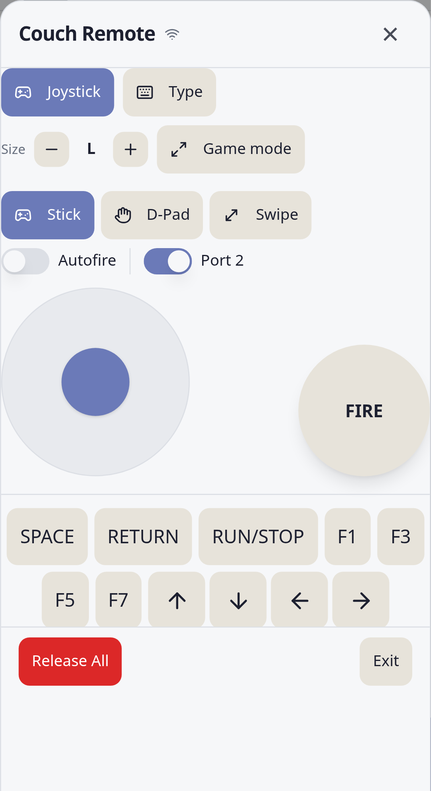
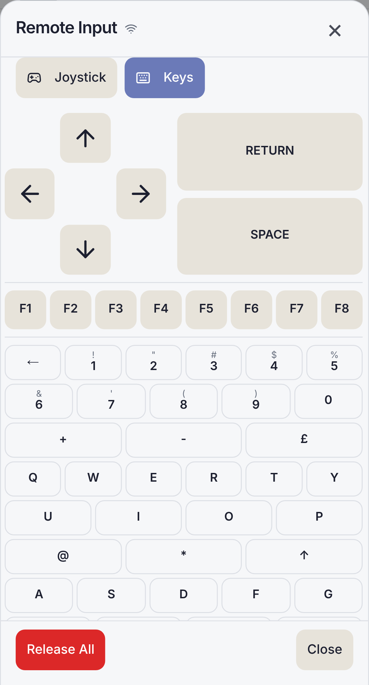
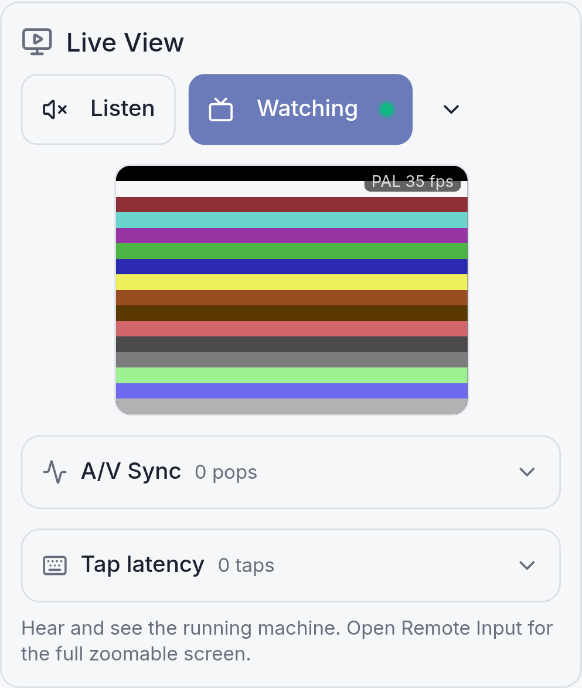
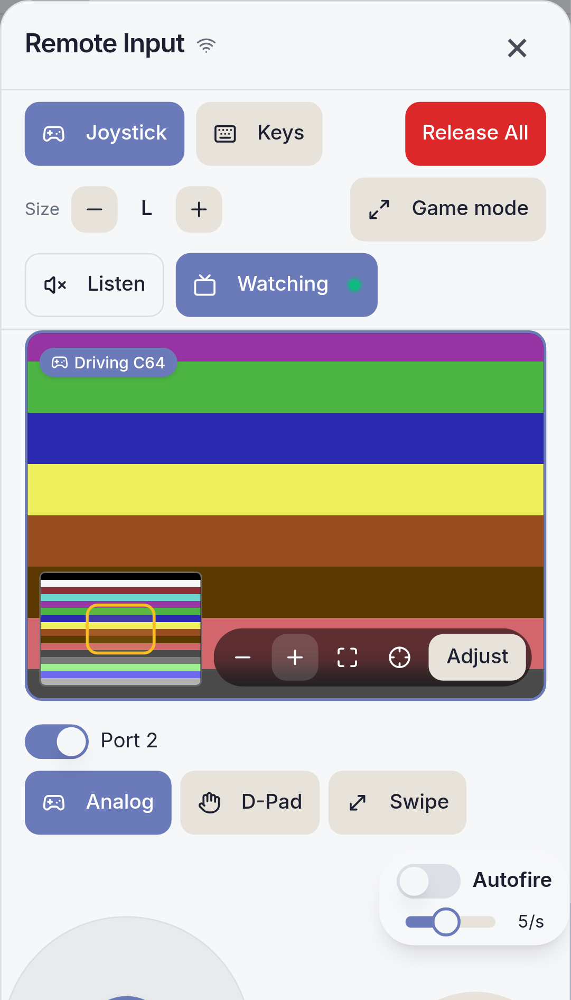

# C64 Commander Manual

Connect, control, play, mount, and diagnose a Commodore 64 Ultimate, Ultimate 64, Ultimate 64 Elite, Ultimate 64 Elite II, or Ultimate-II+(L).

## Table of Contents

- [Welcome](#welcome)
- [Before You Start](#before-you-start)
- [First Connection](#first-connection)
- [Your First Tour](#your-first-tour)
- [Everyday Flows](#everyday-flows)
- [In Depth](#in-depth)
- [Safe Device Use](#safe-device-use)
- [Troubleshooting](#troubleshooting)
- [Appendices](#appendices)
  - [Feature Reference](#feature-reference)
  - [Keyboard and Directional Input Reference](#keyboard-and-directional-input-reference)
  - [File and Source Reference](#file-and-source-reference)
  - [Network Ports and Services](#network-ports-and-services)
  - [Device Safety Modes](#device-safety-modes)
  - [Drive Types and Disk Formats](#drive-types-and-disk-formats)
  - [Snapshot Types and Memory Ranges](#snapshot-types-and-memory-ranges)
  - [Health Check Probes](#health-check-probes)
  - [Status and Safety Reference](#status-and-safety-reference)

## Welcome

C64 Commander controls a Commodore 64 Ultimate, Ultimate 64, Ultimate 64 Elite, Ultimate 64 Elite II, or Ultimate-II+(L) from one app.

The main jobs are:

- **Control**: reset, reboot, menu, drives, printer, SID, streams, RAM, and configuration.
- **Files and playback**: playlists, Local, C64U, HVSC, CommoServe, and disk collections.
- **Diagnostics**: health checks, logs, traces, errors, latency, and device switching.

Start with the walkthrough if you are new to the app. Use the reference sections when you already know what you want to do.

## Before You Start

### Supported Machines

C64 Commander is the broad edition. It works with the Commodore 64 Ultimate, Ultimate 64, Ultimate 64 Elite, Ultimate 64 Elite II, and Ultimate-II+(L).

The app may call the device-file source **C64U** in lists and pickers. In that place, read it as storage on the connected Ultimate-family device, reached through FTP.

Connection has three parts: the app device, the connected Ultimate-family device, and the local network between them.

Put the device running the app and the connected Ultimate-family device on the same Wi-Fi or wired LAN. Then open **Network Services & Timezone** on the target device.

Enable the services the app uses:

- **Web Remote Control Service**: required for most control and status operations.
- **FTP File Service**: needed for device file browsing, playlists, and disk collections.
- **Telnet Remote Menu Service**: used for advanced menu-backed actions when those actions are enabled.

Note the IP address under **Wired Network Setup** or **WI-FI Network Setup**. You may need it if local discovery cannot see the target device.

## First Connection

Start C64 Commander. If no saved device is reachable, it scans the local network for supported devices.

If devices are found:

1. Choose **Use** to connect now.
2. Choose **Save** to keep the device for later.
3. If the device is password-protected, enter its network password when asked.

If no devices are found, C64 Commander opens a manual setup prompt.

Enter a hostname such as `c64u`, `u64`, or `u2`, or an IP address such as `192.168.1.64`, then choose **Connect**. If the device answers but requires a password, the same dialog asks for it before saving and connecting.

A healthy badge at the top right confirms that the active device is responding. You can scan again later from **Settings > Connection > Discover devices**.

## Your First Tour

### The Header Badge

The top-right badge shows the current device status: healthy, degraded, unhealthy, or offline. Tap it to open Diagnostics. Long-press it, press `#`, or use the Quick Menu to open Device Switcher.

### Home

Home groups the day-to-day controls.

Start at the top. The system strip confirms which app build, device, and firmware you are using. Below it, Quick Actions give you the familiar front-panel moves: Reset, Reboot, Pause/Resume, Menu, RAM snapshots when enabled, and power actions when the device supports them.

Keep moving down and you reach Quick Config. These are the settings you are likely to touch in the middle of a session: CPU speed, RAM expansion, joystick swap, serial bus mode, video output, scan lines, or interface behavior.

The lower cards cover drives, printer, SID mixer, streams, and configuration actions. **Save to flash** writes the current device settings to flash on the connected Ultimate-family device when you need an explicit save.

Quick Actions also holds **Remote Input**, a second-screen joystick and keyboard for the C64. It has its own walkthrough in [Remote Input](#remote-input), later in this guide.

### Play

Play is for building a playlist and running it.

Choose **Add items**, then choose a source.

The picker stays inside that source, so **Up** never escapes into a different place by accident. Select files or folders, confirm, then play from the playlist. Use View all when the playlist grows.

Playback supports SID, MOD, PRG, CRT, and disk images. SID files can expose subsongs. When songlength metadata is available, the app shows duration and can advance more predictably.

A playlist can stay tiny for one song or become a queue for a whole session.

When the list is short, use the main Play page. When it grows, open **View all**. The larger view gives you room to scan, filter, select, remove, and reorder without losing the playback controls.

Add broadly, then filter narrowly. Add a folder, an album, or a set of related files. Then filter by title, path, source, type, or archive result.

The filter changes the visible list, not the playlist itself. Clearing it brings the full queue back.

Each playlist item keeps its origin. Local files remain local, C64U files point back to the device, archive results remember their source, and SID entries can retain songlength and subsong information.

Use playback controls for the session: play or pause, previous or next, shuffle, repeat, and volume. Use item actions for one entry: remove it, inspect it, choose a subsong, or apply an item-specific playback setting where available.

For SID files, watch duration and subsong information. A SID may contain one tune or several. Songlength data makes advancing through the list less like guesswork.

For disk images, Play is convenient when you are launching or testing. Disks is better when drive setup, grouping, or collection work matters.

### Disks

Disks manages drives and disk images.

Use drive cards to turn drives on or off, set bus ID and drive type, mount and eject images, reset drives, and set a Soft IEC path. Use **Add disks** to build a disk collection from the available sources.

For multi-disk titles, put related disks in a group. Once grouped, the drive controls can rotate through them.

Organize the disk collection around the titles you use.

Add a single image, a folder of images, or an archive search result. Then filter by name, path, source, or group. Filtering helps you find; it does not delete or move anything.

Mounting is the central Disks action. Choose the disk, choose the target drive, and mount. Eject when you want the drive empty again.

If a title uses several disks, assign the related entries to the same group. Use rotation later to move to disk 2 or disk 3.

Drive settings live beside the collection because they shape how mounted images behave. Bus ID, drive type, enable state, reset, and Soft IEC path all matter when software expects a particular drive setup.

Use Disks for collection work because the collection, filters, grouping, and mount flow are on the same page.

### Config

Config is the complete configuration tree.

Search for a category, open it, and edit rows directly. The app chooses the right control for each item: slider, switch, select, or text field.

A change is sent to the active device immediately. The firmware applies it at once.

Use **Save to flash** when **Auto save config** is **Ask** or **No**, or when you want to force a flash save now. To make configuration changes save themselves, set **Auto save config** to **Yes**. On a Commodore 64 Ultimate, set it at **C= + RESTORE > User interface > Auto save config**. C64 Commander mirrors that menu in Config as **User interface > Auto save config**. On other supported devices, search Config for **Auto Save Config** if the menu naming differs.

Use Config when you know the setting exists but not where the device menu hides it. Search reduces the tree to matching categories and rows. After changing a value, wait for the write to finish before changing another related setting.

Config writes to the active device; it does not edit a draft. Use Config for precise or uncommon settings, and page-specific controls for routine changes.

### Settings

Settings controls app behavior and saved connection details.

Connection and saved devices live here, along with Appearance (display profile, theme, full-screen, and screen orientation), Notifications, Diagnostics options, Device Safety and network timing, Play and Disk behavior, the HVSC and Online Archive sources, feature toggles, Settings transfer, and an About panel. **Settings transfer** exports every app preference to a file you can import onto another phone or tablet, so a second device starts up already configured.

If the device is hard to reach, start in **Connection**. If it is reachable but fragile, start in **Device Safety**.

Settings also holds saved devices. Use it to edit a name, host, HTTP port, FTP port, Telnet port, or password. When you save and connect, the app probes the device and reports whether the chosen services answer.

Display settings are local to the app. They do not change your C64. Use them to choose the display profile, full-screen behavior, notification style, and how dense the interface should feel.

Feature toggles appear only when a feature is safe for normal users to change in this variant. If a feature is not supported by this variant, it is absent from Settings and from this manual.

### Docs

Docs is the built-in help page.

It covers setup, Home, Play, Disks, Config, Settings, Diagnostics, and disk swapping.

### Diagnostics

Diagnostics shows connection health, recent activity, and failures.

Open it when a control fails, playback does not start, a file transfer stalls, or the badge looks unhealthy. It includes Problems, Actions, Logs, Errors, Traces, health checks, latency views, heat maps, filters, Share, and Clear.

Start with Problems when you want a plain-language summary. Move to Errors when something failed. Use Traces when timing, request order, or endpoint behavior matters. Health checks are the quickest way to confirm whether REST, FTP, and Telnet are alive.

The Share action packages useful evidence. Use it before restarting the app if you are investigating a recurring issue, because the most useful details are often the last few actions before a failure.

For a closer look, see [Reading Diagnostics](#reading-diagnostics) and [Sharing a Diagnostics Report](#sharing-a-diagnostics-report) in the In Depth chapter.

### Device Switching

Device Switcher is for homes with more than one saved Ultimate-family device.

Open it from the badge long-press, `#`, or Quick Menu. Expand a row for more detail.

See [Switching Between Devices](#switching-between-devices) in the In Depth chapter for the full story.

## Everyday Flows

### Connect by Hand

1. Open **Settings > Connection** or use the startup prompt when discovery finds nothing.
2. Enter a hostname or IP address.
3. Choose **Save & Connect** or **Connect**.
4. Enter the network password if prompted.

Preferred path: use startup discovery first, then manual host entry if discovery finds nothing.

### Maintain Saved Devices

1. Open **Settings > Connection**.
2. Review the saved-device list.
3. Edit names and ports so each device is recognizable.
4. Use **Save & Connect** after changing the active device.
5. Remove stale devices when they are no longer on your network.

Preferred path: Settings for editing, Device Switcher for choosing.

### Reboot and Return to Work

1. Open **Home**.
2. Choose **Reboot**.
3. Confirm.
4. Watch the badge until the device returns healthy.

Preferred path: Home Quick Actions. Use Diagnostics only if the device does not return.

### Play a SID or Program

1. Open **Play**.
2. Choose **Add items**.
3. Choose Local, C64U, HVSC, or CommoServe.
4. Select files or folders.
5. Confirm and press Play.

Preferred path: Play. Use C64U source for files already on the target device; use Local for files on the Android device.

### Build a Playlist from Folders

1. Open **Play > Add items**.
2. Choose the source that owns the folder.
3. Navigate into the folder.
4. Select the files or folders you want.
5. Confirm the selection.
6. Open **View all** if the list is long.

Preferred path: Add a folder first, then filter the playlist to choose what to play next.

### Filter and Clean a Playlist

1. Open **Play > View all**.
2. Type a few characters from the title, path, source, or file type.
3. Review the filtered rows.
4. Remove unwanted rows or clear the filter to return to the full list.

Preferred path: filter before removing. A filter changes only what you can see.

### Work with SID Subsongs

1. Add one or more SID files to Play.
2. Select the SID item.
3. Choose the subsong or playback option if the file exposes one.
4. Use duration information when available to decide whether to repeat, skip, or continue.

Preferred path: keep SID work in Play; use HVSC preparation only when the library itself needs attention.

### Mount a Disk

1. Open **Disks**.
2. Add disks if the collection is empty.
3. Open the drive mount action.
4. Choose a disk.

Preferred path: Disks. Home also shows drive shortcuts, but Disks gives the clearest collection view.

### Build a Disk Collection

1. Open **Disks > Add disks**.
2. Choose Local, C64U, HVSC, or CommoServe.
3. Select disk images or folders.
4. Confirm the selection.
5. Use **View all** to inspect the collection.

Preferred path: Disks for collection work; Play for launch-oriented queues.

### Filter, Group, and Rotate Disks

1. Open the disk collection view.
2. Filter by title, path, source, or group.
3. Assign related disks to the same group.
4. Mount the first disk.
5. Use rotation controls when the title asks for the next disk.

Preferred path: group related disks before you need to swap them.

### Mount to a Specific Drive

1. Open **Disks**.
2. Confirm the target drive is enabled.
3. Check bus ID and drive type if the software is particular.
4. Choose the disk image.
5. Mount it to the intended drive.

Preferred path: adjust drive setup before mounting.

### Change a Common Setting

1. Try **Home > Quick Config** first.
2. If the setting is not there, open **Config** and search.
3. Change the value.
4. Use **Save to flash** if **Auto save config** is **Ask** or **No** and the change should survive a device reboot or power cycle.

Preferred path: Home for common settings; Config for the full tree.

### Save Device Configuration

Use this flow when **Auto save config** is **Ask** or **No**, or when you want to force a flash save now.

1. Make the changes you need on Home or Config.
2. Confirm the device is healthy.
3. Open **Home > Config actions**.
4. Choose **Save to flash**.

Preferred path: set **Auto save config** to **Yes** when you want the firmware to save changes automatically. On a Commodore 64 Ultimate, set it at **C= + RESTORE > User interface > Auto save config**. C64 Commander mirrors that menu in Config as **User interface > Auto save config**. On other supported devices, search Config for **Auto Save Config** if the menu naming differs.

### Investigate a Problem

1. Tap the header badge or press `*`.
2. Run a health check.
3. Review Problems, Errors, and Traces.
4. Share diagnostics if you need support.

Preferred path: Diagnostics from the badge.

### Export Useful Diagnostics

1. Open **Diagnostics**.
2. Check Problems and Errors.
3. Open Traces if request order matters.
4. Use **Share** before clearing logs.

Preferred path: Share before restart when you are trying to preserve evidence.

## In Depth

The tour showed you where everything lives, and the flows above are quick recipes. A few features reward a closer look. This chapter takes its time with them.

### Remote Input

Remote Input turns your phone or tablet into a second-screen controller for the C64. It is handy when you are sitting across the room from the machine, when no joystick is plugged in, or when you just want to type a command without reaching for the real keyboard.

Open it in either of two places:

- From **Home**, tap the **Remote Input** tile in Quick Actions.
- From **Play**, tap the **Remote Input** button that appears while an item is playing.

Each place opens its own copy of the controller, so a key you are holding in one never leaks into the other.

At the top of the sheet you choose between two modes, **Joystick** and **Keys**.

**Joystick** puts a stick and a large **FIRE** button on the screen. You can:

- choose how the stick behaves with **Analog**, **D-Pad**, or **Swipe**;
- send the signal to **Port 1** or **Port 2** with the port toggle (most games read Port 2);
- resize the controls from M up to XXL with the **Size** stepper (L by default);
- turn on **Autofire** and set its rate from 1 to 10 presses per second (the default is 5, and you can also set it in Settings).

A companion quick-keys bar beside the joystick keeps the keys you reach for mid-game one tap away — RUN/STOP, SPACE, RETURN, the function keys f1 to f8, the cursor keys, and the CTRL, C=, and SHIFT modifiers — so you can nudge a menu or answer a prompt without leaving the joystick. For distraction-free play, tap **Game mode**: the app hides every other control and anchors the stick and FIRE button to the edges of the screen for no-look thumbs. Leave it with **Exit game mode** or your device's Back button. Both release everything you were holding.

**Keys** shows a full Commodore 64 keyboard, including the SHIFT, CTRL, and C= modifiers, SHIFT LOCK, the function keys f1 to f8, and RESTORE. Tap a modifier once to arm it for the next key, or hold it down to chord.

Full Joystick relay uses the device's `machine:input` REST endpoint. It needs recent firmware: a Commodore 64 Ultimate on firmware **1.2.0** or newer, or an Ultimate 64, Ultimate 64 Elite, or Ultimate 64 Elite II on firmware **3.15** or newer. The Ultimate-II+(L) cannot relay a joystick at all: as a cartridge it cannot change the state of the C64's CIA 1 input chip, so it has no `machine:input` support. On the Ultimate-II+(L), and on any device running older firmware, the app automatically falls back to **Keys** only. That fallback types by placing characters into the C64's KERNAL keyboard buffer. It is ideal for BASIC, where you can type commands, `LOAD`, and `RUN`, but most games read the keyboard and joystick hardware directly and will not respond to it. RUN/STOP and RESTORE are also unavailable in the fallback. If the device is password-protected, enter its password in Settings first, because both Joystick and Keys need it.

Remote Input is careful never to leave a key or direction stuck on the real C64. Everything you are holding is released automatically when you close the sheet, switch mode or port, switch to another device, or send the app to the background. If a message does not reach the device, the header shows **Reconnecting…** until the next one gets through. And at any moment you can tap **Release All** to let go of every key and button at once.

To steer a game you have just launched:

1. On **Play**, start the game, then tap **Remote Input**.
2. Choose **Joystick** and set the port (most games use **Port 2**).
3. Pick a movement style, then play with the stick and **FIRE**.
4. Tap **Release All**, or close the sheet, when you finish.

On by default. You can change it in Settings > Stable Features.

### Live View

Your C64 can send its own sound and picture out across your network, and Live View brings them straight back into the app — so you can hear a tune or watch the screen without wiring up a speaker or a second television.

It is one shared session. Start it in a single place and it keeps playing wherever you go; there is never a second copy fighting for the same stream. You will find it just below the Quick Actions on **Home**, with two switches:

- **Listen** turns the sound on. It asks for almost no room — a lit button and a small live dot — so it is perfect for keeping half an ear on a game or a SID tune while you get on with something else. Wander to another page and a matching dot appears in the top bar to remind you it is still playing; a tap on it stops everything at once.
- **Watch** turns the picture on. A small preview of the C64 screen appears just beneath the switches; tap the chevron beside it to grow that preview in place.

#### The immersive screen

Open **Remote Input** while **Watch** is on and the picture stretches to fill the width of the sheet, above the joystick and keyboard — a proper screen for playing a game or driving a program you are typing into.

Move around it however suits you. On a touchscreen, **pinch** to zoom, **drag** to slide the picture about, and **double-tap** to jump straight in on a spot — a second double-tap fits the whole screen back on. A small map in the corner shows which part you are looking at; drag its rectangle to leap somewhere else in an instant. Switch on **Follow** and the view drifts along on its own to wherever the action is — a lovely way to keep the cursor in sight as you type.

#### Driving the C64, or adjusting the view

When you steer your phone or tablet with a physical keypad, those same keys could either work the C64 or move the picture, so Live View makes the difference impossible to mistake. The mirror wears a coloured border that tells you at a glance which one you are doing: a **blue “Driving C64”** border means your keys go straight to the machine, as usual; an **amber “Adjusting view”** border means your keys zoom and pan the picture instead.

Press the **menu key** — or the on-screen **Adjust** button — to switch between the two. You are never stranded looking at a frozen game: adjusting view slips quietly back to driving on its own after a short pause. While the border is amber, the keypad moves the view like this:

| Key | What it does |
| --- | --- |
| **2**, or D-pad up | Pan up |
| **8**, or D-pad down | Pan down |
| **4**, or D-pad left | Pan left |
| **6**, or D-pad right | Pan right |
| **3** or **9** | Zoom in |
| **1** or **7** | Zoom out |
| **0**, **5**, or the centre/OK key | Fit the whole screen back on |
| the **menu** key | Return to driving the C64 |

The same four moves have on-screen buttons too — **＋** and **−** to zoom, **⤢** to fit, and **◎** to turn Follow on and off — so a touchscreen and a keypad reach every control.

Live View is optional and starts switched off. The device streams to two network ports (11000 for the picture, 11001 for the sound); if your setup needs different ones, you can change them in **Settings**, under Play and disk behaviour. Live View borrows the same feeds as **Streams** (below), and while it is playing it takes charge of them — see there for how the two work together.

Optional. Enable it in Settings > Experimental Features.

### Streams

Your C64 can send what it is doing out across the network. **Home > Streams** exposes three feeds — **VIC** (the live video picture), **Audio** (the SID output), and **Debug** (a low-level trace for developers). Point a feed at a destination address, press **Start**, and it streams there; **Stop** ends it. The card appears only when the connected device advertises streaming support.

Live View (above) plays those same **VIC** and **Audio** feeds inside the app, so the two are careful never to fight over one stream. Turn Live View on and it takes charge of the feed it needs: that row shows a small **Live View** badge and turns read-only, so nothing you do here can pull the picture or sound out from under it. Your own target is remembered, and the moment you stop Live View the row hands control straight back to you.

### The SID Audio Mixer

Your C64 makes its sound with a SID chip, and can host more than one. **Home > SID / Audio mixer** is a live mixing desk: a **master volume** for everything, and, for each SID it reports, that chip's own **volume** and **stereo position**. Slide one SID toward the left speaker and another toward the right for true stereo, or pull one down to let the other lead. Changes are heard at once, and the same controls appear in **Config > Audio Mixer** if you prefer the full tree.

### The Virtual Printer

A C64 once talked to a Commodore printer over the serial bus; yours emulates one so you never need the vintage hardware. **Home > Printer** picks the **emulation** (such as Commodore MPS), sets the printer's **bus ID**, and manages its output: **Flush** commits what has been printed so far, **Eject** finishes the page, and **Reset** clears the emulated printer.

### RAM Snapshots

A RAM snapshot is a copy of what is in your C64's memory right now, saved onto your phone or tablet so you can put it back later. It is the nearest thing the app has to a save-and-restore button for programs that have none of their own.

Both actions live in **Home > Quick Actions**: **Save RAM** to capture, and **Load RAM** to restore. The device must be connected and not busy. The app pauses the machine for the transfer and resumes it afterwards, so a running program is not disturbed.

When you tap **Save RAM**, the app asks which region of memory to capture:

- **CPU + RAM Snapshot** (when the device supports it) freezes the running program and stores the full 64K of memory together with the processor's registers, so it can later resume exactly where it left off. It is best for BASIC and simple programs; fast-action games may not resume cleanly.
- **Program Snapshot** stores almost all of memory (everything but the stack). A good all-round choice.
- **Basic Snapshot** stores just the BASIC program and its variables.
- **Screen Snapshot** stores the current screen and its colours.
- **Custom Snapshot** lets you type the exact address ranges you want.

Snapshots are kept on your phone or tablet, not on the C64. Each one is named automatically from its type and the date and time, and if something is playing its title becomes the label. You can add or change a **Comment** on any snapshot later. The app keeps up to 100 snapshots and quietly drops the oldest once that fills.

**Load RAM** opens your snapshot library. Filter it by name or by type, then tap a snapshot to restore it. The app asks you to confirm first, because restoring overwrites the matching memory on the C64. It writes back only the bytes the snapshot holds, and it deliberately leaves the CIA timers alone so the cursor keeps its normal blink. A CPU snapshot resumes the program; if that is not possible the app restores the memory alone and tells you so. From the same library you can edit a snapshot's comment or remove ones you no longer need with the trash icon.

On by default. You can change it in Settings > Stable Features.

### Drives and Disk Images

C64 Commander gives your C64 up to two disk drives, and the **Disks** page drives both. Each drive card is a small control panel of its own.

Turn a drive on or off with its power control — a drive must be **on** before it can mount anything. Give it a **bus ID** (8, 9, 10, or 11) so software can find it; the first drive is usually 8. Set its **type** to match the image you are loading — a 1541 for D64 and G64 disks, a 1571 for D71, or a 1581 for D81 — and use **Reset** to restart just the drive's own processor, the gentlest way to recover a confused drive without disturbing the C64.

Mounting is the heart of the page. Choose a disk from your collection, choose the drive, and mount it; **Eject** empties the drive again. A disk that already lives on the connected Ultimate-family device mounts in place, while a **Local** or archive disk is copied across first — and anything a program writes back to it is saved to your original when you eject, so high scores and saved games survive.

For a title that spans several disks, drop the related images into one **group**. Grouped disks add **rotate** controls to the drive card, so when a program asks for the next disk you can swap without hunting through the collection. A drive can also read loose files straight from a folder on the device through its **Soft IEC** path, which suits large collections that are not packed into disk images.

### Content Explorer

Content Explorer is a set of additive tools for working with the programs *inside* disk images and launching them safely. Each part is optional and independent — turn on only the ones you want in **Settings**, and the rest stay out of the way.

#### Looking Inside a Disk

Mounting a disk image gives you the whole disk. Disk Explorer instead looks *inside* one so you can pick a single program to launch. On **Disks**, open a disk image's menu and choose **Open (Disk Explorer)…**; the app lists every file on the disk, each with its type, its size in blocks, and — for a program — its load address.

Each launchable file offers three actions:

- **Run** loads the program into the C64's memory and starts it.
- **Load** loads it into memory without starting it — handy for monitors and development.
- **Mount & Load** mounts the whole disk, resets the machine, waits for BASIC, then types the LOAD and RUN for you — the right choice for titles that load in several stages.

Only a proper **PRG** program can be launched directly. Other file types show a short note explaining why they cannot, and an unclosed "splat" file — one that was never finished being written — cannot be launched either.

On by default. You can change it in Settings > Stable Features.

#### Launch Safety

Some setups have a freezer cartridge (Action Replay / Retro Replay style) configured. On those, launching a program directly can occasionally reset into the cartridge's own menu instead — which looks exactly like the app misbehaving. Launch Safety prevents that: around every direct launch it briefly *parks* the configured cartridge, then restores it afterwards. It never writes to the device's saved (flash) settings, so a power cycle always brings the cartridge back, and when no cartridge is configured it does nothing at all. This happens automatically; there is no per-launch control.

One advanced option sits in **Settings**, under Play and disk behaviour: **Answer cartridge boot menu after reset**. It is off by default and helps only one narrow case — a cartridge that shows a boot menu when the machine resets, which could otherwise swallow the LOAD that Mount & Load types. Turn it on to choose the **menu key** (F1–F8, RETURN, or SPACE) and a **boot settle** time; the app then presses that key after a Mount & Load reset to clear the menu first. Leave it off unless you run such a cartridge.

On by default. You can change it in Settings > Stable Features.

#### Searching Inside Disk Images

By default, searching your media matches disk images by their file name. Turn on **Search inside disk images** — in **Settings**, under Play and disk behaviour — and search also reaches the programs *inside* your `.d64`, `.d71`, and `.d81` images. A match found inside a disk is shown as **DISK → PROGRAM**, so you can see exactly which disk holds the program you want, then Run or Load it just like any other.

Optional. Enable it in Settings > Experimental Features.

#### Creating a Blank Disk

Need a fresh disk to save to? On **Disks**, choose **New disk** to format a blank image on the device. Pick the **type** — D64 (1541), D71 (1571), D81 (1581), or DNP (CMD native) — give it a **file name**, and set a **disk label** of up to 16 characters (it defaults to the file name). A D64 lets you choose the number of **tracks** (35 to 41, usually 35); a DNP requires a track count (1 to 255); D71 and D81 need none. Finally pick a real **storage folder** on the device, such as USB0 — the top-level `/` is only a virtual list of drives and cannot hold files. The app creates the image and mounts it ready to write to.

On by default. You can change it in Settings > Stable Features.

### File Sources

Everything you play or mount comes from a **source**, and each source keeps to its own picker so a wrong turn never lands you somewhere unexpected.

- **Local** — files and folders on the phone or tablet running the app.
- **C64U** — files on the connected Ultimate-family device, reached over FTP.
- **HVSC** — the High Voltage SID Collection, the definitive archive of C64 music. Prepare it once from **Settings > HVSC**; afterwards the app checks for updates on its own, and browsing shows song durations and subsongs.
- **CommoServe** — an online archive you search by name, pulling disks and programs straight into a playlist or disk collection. Set its address in **Settings > Online Archive**.

### Configuration and Saving

Two ideas make the configuration tree easy to live with: where a change goes, and how to keep it.

Every change — on Home, on Disks, or in Config — is sent to the running device at once and takes effect immediately. But the device holds two copies of its settings: the **live** ones it is using now, and a **flash** copy it reloads at power-on. A change is live instantly; it survives a reboot or power cycle only once it reaches flash.

You manage that from **Home > Config actions**. **Save to flash** writes the current live settings to flash now — reach for it when **Auto save config** is Ask or No. The app can also keep named **configuration snapshots** on the phone or tablet, separate from the device's flash: save the current setup, then load it back later to restore a whole configuration at once.

### Reading Diagnostics

Diagnostics is your window into the health of the connection and everything the app has recently done. It slides up from the bottom of the screen. Reach it by tapping the header badge, pressing `*`, choosing **Diagnostics** in Settings, or tapping any error notification.

The panel has three parts, from top to bottom:

- The **health header** shows the current state (Healthy, Degraded, Unhealthy, or Offline), which device it refers to, and when it was last checked. Tap **Run health check** to test the connection now. The check probes REST, FTP, and Telnet, plus three C64-specific signals (CONFIG, RASTER, and JIFFY), and reports each result with its timing and the overall latency. Expand the header to see every probe in detail.

The CONFIG probe does more than read: it nudges a live setting by a hair, reads it back to confirm the device really applied the change, then restores the original value. On a device with an LED strip — the case light or the keyboard LEDs — you will see the lights **pulse once** as it runs, a tiny visible heartbeat that tells you the connection is alive at a glance.
- The **Filters** bar narrows what you see below. Filter by device, by activity type (Problems, Actions, Logs, Traces), by contributor (App, REST, FTP, Telnet), or by severity (Errors, Warnings, Info). One-tap **Errors only** and **Problems only** shortcuts are there too.
- The **Activity** list gathers problems, actions, logs, and traces together. Tap any row to expand it for the full details.

The **⋯** menu in the corner collects extra views (Connection details, health history, latency, and the REST, FTP, and Config heat maps) alongside the Share and Clear actions. To send this information on for help, see the next section.

### Sharing a Diagnostics Report

When something goes wrong, the most useful evidence is usually the last handful of actions before the failure, so capture it before you clear anything or restart the app. The activity list is rebuilt fresh each time you open Diagnostics, and **Clear all** wipes it for good.

To share a report about a recent error:

1. Open **Diagnostics** (tap the header badge, press `*`, or tap the error notification).
2. Tap **Run health check** so the report carries a fresh connection test.
3. Use the **Errors only** or **Problems only** filter to confirm the failure is captured.
4. Open the **⋯** menu and choose **Share all** to send everything, or **Share filtered** to send only the rows you filtered to.
5. Pick an app in your device's share sheet (mail, chat, or notes) to send or save the report.

The report is a small ZIP file holding the app's logs, traces, errors, and recent actions, along with a health snapshot and details about your app version, your device, and the active C64 (its name, host address, and firmware). It does not include your network password. It can, however, contain your device's hostname or IP address, so share it only with people you trust or with support.

Use **Clear all** afterwards for a clean slate. It asks you to confirm, then shows **Diagnostics cleared** when done.

### Switching Between Devices

If you have saved more than one device, the Device Switcher lets you hop between them without opening Settings.

Open it in any of three ways, whenever more than one device is saved:

- **Long-press the header badge** (a short tap opens Diagnostics instead).
- Press **`#`** on a hardware keyboard or keypad.
- Choose **Switch device** in the Quick Menu.

The switcher checks each saved device for you and refreshes every ten seconds while it is open. Each row shows the device's name, a status pill (**Selected**, **Verifying**, **Offline**, or **Mismatch**), a live health badge, and a short summary such as how many health probes passed or when the device was last seen. The device you are using is highlighted. Tap the chevron to expand a row and see every health probe in detail, which is handy for telling a sleeping device from one that is genuinely unreachable.

Tap a device to switch to it. Before anything else the app safely lets go of any input you were holding on the old device, stops tracking its playback and pause state, retargets to the new device's address and ports, and then checks that the new device answers. While that happens the target shows a **Verifying** pill; once it responds, it becomes the active device.

Saved devices themselves are created and edited in **Settings > Connection**, under **Saved devices**. There you can add a device, edit its **Device name**, **Hostname / IP**, and **HTTP**, **FTP**, and **Telnet** ports, set an optional **Network Password**, or delete one you no longer use. A device is saved only once it answers, so the list never fills with machines that are not really there. With a single device saved there is nothing to switch to, so the switcher stays out of your way.

## Safe Device Use

C64 Commander uses normal REST, FTP, and Telnet requests, but the connected Ultimate-family device firmware can still become unresponsive under some network conditions. The app reduces risk by pacing traffic and surfacing errors.

Good habits:

- avoid repeating the same command while the device is already busy;
- leave Device Safety on Auto, and only raise concurrency once the device and network have proved steady;
- drop to Conservative for older or unknown firmware, Wi-Fi, or a first setup;
- power-cycle the target device if all TCP services stop responding while ping still works.

**Device Safety** in Settings governs how hard the app pushes the device. Its five modes trade speed for caution by capping how many requests run at once and pacing them, and they also tune caching, cooldowns, and backoff. **Auto** is recommended: it picks the right mode from the connected device and its firmware. The full list is in [Device Safety Modes](#device-safety-modes).

The CPU speed setting can briefly drop the network while the device applies a clock change. Wait for the app to reconnect.

## Troubleshooting

### Discovery finds nothing

- Confirm both devices are on the same network.
- Check that Web Remote Control Service is enabled.
- Enter the hostname or IP address manually.
- Try the IP address if the hostname does not resolve.

### Password required

Enter the network password configured on the connected Ultimate-family device. If the saved password stops working, the app asks again.

### File browsing fails

- Confirm FTP File Service is enabled.
- Check the FTP port in Settings.
- Reconnect from Settings if the device was restarted.

### Playback does not start

- Check that the device is connected and healthy.
- Confirm the selected file type is supported.
- For local files, reselect the source if Android storage permission was lost.
- For disk images, confirm the target drive is available.

### Controls look disabled

Some controls appear only when the connected device reports support. Others are disabled while an operation is running or when no matching item exists.

### Remote Input joystick is unavailable

The **Joystick** tab appears only when the connected device supports the `machine:input` endpoint. **Keys** always works.

- Confirm the firmware supports it: a Commodore 64 Ultimate on 1.2.0 or newer, or an Ultimate 64 on 3.15 or newer. The Ultimate-II+(L) has no joystick relay.
- If the device is password-protected, enter its password in Settings; both Joystick and Keys need it.
- Otherwise the app stays in **Keys** mode and types through the C64 keyboard buffer, which suits BASIC but not most games.

### Device stops answering

Open Diagnostics if possible and check recent REST/FTP/Telnet activity. If HTTP, FTP, and Telnet all refuse connections while ping still works, manually power-cycle the connected Ultimate-family device.

## Appendices

The rest of this guide is reference material for when you want the exact answer. Skim the tour to get going, then come back here for the specifics.

### Feature Reference

Preferred locations are marked first.

| Feature | Where to find it | Notes |
| --- | --- | --- |
| Connect to a device | **Startup discovery**, Settings > Connection | Use startup discovery first. Use Settings for later edits. |
| Manual host/IP entry | **Startup prompt when no devices are found**, Settings > Connection | Startup prompt is fastest on first run; Settings is best for saved-device maintenance. |
| Network password | **Startup prompt or auth popup**, Settings > Connection | The app asks only when needed. |
| Switch saved device | **Header badge long-press / `#`**, Settings > Connection | Use Device Switcher for fast switching; Settings for editing. |
| Reset / Reboot / Pause / Menu | **Home > Quick Actions** | Main daily control path. |
| Power Cycle | **Home > Quick Actions** | Optional. Enable it in Settings > Experimental Features. |
| Clear-RAM reboot | **Home > Quick Actions** | Optional. Enable it in Settings > Experimental Features. |
| Save / Load RAM | **Home > Quick Actions** | On by default. You can change it in Settings > Stable Features. |
| Remote Input | **Home > Quick Actions**, Play (while an item plays) | On by default. You can change it in Settings > Stable Features. Joystick needs firmware 1.2.0 or newer on a Commodore 64 Ultimate, or 3.15 or newer on an Ultimate 64; otherwise only Keys are available. |
| CPU speed and turbo | **Home > Quick Config**, Config | Home is preferred for common changes. |
| Video mode and scan lines | **Home > Quick Config**, Config | Home is preferred. |
| Joystick, serial bus, cartridge, user port | **Home > Quick Config**, Config | Home is preferred. |
| Drive power, bus, type, reset | **Disks**, Home > Drives | Disks is preferred for drive work; Home is good for quick checks. |
| Mount/eject disks | **Disks**, Home > Drives | Disks gives the clearest disk collection view. |
| Disk groups and rotation | **Disks** | Set a group in the disk collection, then rotate from drive controls. |
| Printer controls | **Home > Printer**, Config | Home is preferred. |
| SID mixer | **Home > SID / Audio mixer**, Config > Audio Mixer | Home is preferred for live mixing. |
| Streams | **Home > Streams**, Config | Visible when the device exposes streaming support. |
| Save/load device config | **Home > Config actions** | Use Save to flash when Auto save config is Ask or No, or when you want to force a flash save now. |
| App-stored config snapshots | **Home > Config actions** | Local app snapshots, separate from device flash. |
| Disk Explorer (launch a program inside a disk) | **Disks > disk menu > Open (Disk Explorer)** | On by default. You can change it in Settings > Stable Features. |
| Create a blank disk | **Disks > New disk** | On by default. You can change it in Settings > Stable Features. |
| Search inside disk images | **Settings > Play and disk behavior** | Optional. Enable it in Settings > Experimental Features. |
| Launch Safety (cartridge parking) | Automatic; boot-menu answer in **Settings > Play and disk behavior** | On by default. You can change it in Settings > Stable Features. |
| Live View — Audio Mirror | **Settings > Experimental Features** | Optional. Enable it in Settings > Experimental Features. |
| Live View — Video Mirror | **Settings > Experimental Features** | Optional. Enable it in Settings > Experimental Features. |
| Advanced config file actions | **Home > Config actions** | Optional. Enable it in Settings > Experimental Features. |
| Advanced drive shortcuts | **Home > Drives** | Optional. Enable it in Settings > Experimental Features. |
| Advanced printer shortcuts | **Home > Printer** | Optional. Enable it in Settings > Experimental Features. |
| Full configuration tree | **Config** | Use search, open a category, edit rows. |
| Add playlist items | **Play > Add items** | Sources: Local, C64U, HVSC, CommoServe. |
| Playback controls | **Play** | Play, pause, previous/next, shuffle, repeat, duration, and volume. |
| HVSC preparation | **Play**, Settings > HVSC | On by default. You can change it in Settings > Stable Features. |
| CommoServe | **Play > Add items**, Disks > Add disks, Settings > Online Archive | On by default. You can change it in Settings > Stable Features. |
| Demo Mode | **Settings > Connection** | Optional. Enable it in Settings > Stable Features. |
| Background playback scheduling | **Play**, Android app permissions | Always enabled in this variant. |
| Display profile and theme | **Settings > Appearance** | Medium screenshots in this manual match this guide's presentation. |
| Device Safety | **Settings > Device Safety** | Leave it on Auto (recommended); Auto uses Conservative for a Commodore 64 Ultimate, and Balanced for an Ultimate 64-family device on firmware newer than 3.15. See Device Safety Modes. |
| Diagnostics | **Header badge / `*`**, Settings > Diagnostics | Badge is preferred for fast access. |
| Logs, traces, errors, health checks | **Diagnostics** | Use filters and Share for support. |
| Built-in help | **Docs** | Good for quick reminders inside the app. |

### Keyboard and Directional Input Reference

On by default. You can change it in Settings > Experimental Features. Directional navigation works with D-pad keys, arrow keys, and compatible hardware keyboards.

#### Directional Pad

| Key | What it does |
| --- | --- |
| Up / Down | Move through the current page, card, list, or dialog. |
| Left / Right | Adjust sliders, tabs, and segmented controls. Otherwise move to a nearby control. |
| OK / Center / Enter | Enter a group, open a select, press a button, or toggle a switch. |
| Back / Escape | Close the top dialog, leave a field, leave a group, or go back. |
| Menu / Context Menu | Open the focused item menu; if none exists, open the Quick Menu. |

The rule is simple: **OK goes in, Back comes out**.

#### Number Keys

Outside text fields, number keys jump to pages:

| Key | Page |
| --- | --- |
| 1 | Home |
| 2 | Play |
| 3 | Disks |
| 4 | Config |
| 5 | Settings |
| 6 | Docs |

#### Star and Pound

| Key | Outside text fields | Inside text fields |
| --- | --- | --- |
| `*` | Open Diagnostics | Type `*` when the field accepts it |
| `#` | Open Device Switcher | Type `#` when the field accepts it |

#### Quick Menu

Press Menu when no focused control has its own menu. The Quick Menu offers page jumps, Diagnostics, and Device Switcher when more than one device is saved.

### File and Source Reference

| Source | Used in | Meaning |
| --- | --- | --- |
| Local | Play, Disks | Files and folders available to the Android device running the app. |
| C64U | Play, Disks | Files on the connected Ultimate-family device through FTP. |
| HVSC | Play | On by default. You can change it in Settings > Stable Features. SID library browsing after preparation. |
| CommoServe | Play, Disks | On by default. You can change it in Settings > Stable Features. Online archive search. |

Supported playback/import types include SID, MOD, PRG, CRT, D64, G64, D71, G71, and D81. Disk collection workflows focus on disk images: D64, G64, D71, G71, and D81.

| Format | Kind | Notes |
| --- | --- | --- |
| SID | Music | One or more subsongs; durations shown when songlength data is available. |
| MOD | Music | Amiga-style tracker module. |
| PRG | Program | A single loadable program. |
| CRT | Cartridge | Cartridge image; started as if you inserted a cartridge. |
| D64, G64 | Disk | 1541 single-sided disk image. |
| D71, G71 | Disk | 1571 double-sided disk image. |
| D81 | Disk | 1581 3.5-inch disk image. |

### Network Ports and Services

These are the defaults the app expects. Change them per device in **Settings > Connection** if yours differ.

| Service | Default port | Used for |
| --- | --- | --- |
| Web Remote Control (REST) | 80 | Control, status, and configuration — required. |
| FTP File Service | 21 | Browsing and transferring files, playlists, and disks. |
| Telnet Remote Menu | 23 | Advanced menu-backed actions, when those are enabled. |

### Device Safety Modes

Set the mode in **Settings > Device Safety**. Higher concurrency is faster but pushes the device harder; the presets also tune caching, cooldowns, and backoff.

| Mode | Requests at once | Use it when |
| --- | --- | --- |
| Auto | Chosen for you | Always a safe default — picks Conservative or Balanced from the device and its firmware. Recommended. |
| Relaxed | Up to 3 | The device and network are proven fast and stable, and you accept higher risk. |
| Balanced | Up to 2 | A Commodore 64 Ultimate on firmware 1.2.0 or newer, or an Ultimate 64-family device on 3.15 or newer. |
| Conservative | 1 (serialized) | A first setup, Wi-Fi, or firmware you do not yet trust. Maximum safety. |
| Troubleshooting | 1 (serialized) | You are chasing a problem and want extra debug logging. |

### Drive Types and Disk Formats

Set a drive's type on the **Disks** page to match the image you are mounting.

| Drive type | Disk images | Description |
| --- | --- | --- |
| 1541 | D64, G64 | The classic single-sided 5.25-inch drive. |
| 1571 | D71, G71 | Double-sided 5.25-inch drive. |
| 1581 | D81 | High-capacity 3.5-inch drive. |

### Snapshot Types and Memory Ranges

**Save RAM** offers these capture types. The app keeps up to 100 snapshots on your phone or tablet and drops the oldest once that fills.

| Snapshot | Captures | Memory range |
| --- | --- | --- |
| CPU + RAM | Full memory plus the CPU registers; can resume where it left off (when the device supports it). | $0000–$FFFF + registers |
| Program | Almost all of memory, skipping the stack. A good all-round choice. | $0000–$00FF, $0200–$FFFF |
| Basic | The BASIC program and its variables. | $002B–$0038, $0801–$9FFF |
| Screen | The current screen and its colours. | VIC bank, $D000–$D02E, $D800–$DBFF, $DD00–$DD01 |
| Custom | Exactly the address ranges you type. | User-defined |

### Health Check Probes

Run a health check from **Diagnostics** to test the connection. Each probe reports its own result and timing.

| Probe | What it checks |
| --- | --- |
| REST | The Web Remote Control service answers. |
| FTP | The FTP file service answers. |
| Telnet | The Telnet menu service answers. |
| CONFIG | Writes a live setting, reads it back, and restores it — proving the device applies changes. A device with an LED strip pulses once as it runs. |
| RASTER | The VIC-II raster line is available — the video chip is running. |
| JIFFY | The KERNAL jiffy clock is ticking, which also reports the machine's uptime. |

### Status and Safety Reference

| Signal | Meaning | Best next step |
| --- | --- | --- |
| Healthy badge | The selected device is responding. | Continue normally. |
| Degraded badge | Some check or recent activity suggests trouble. | Open Diagnostics. |
| Unhealthy badge | The selected device is not responding correctly. | Run a health check; verify network services. |
| Offline state | No live connection is active. | Use discovery, manual host entry, or Settings > Connection. |
| 401/403 password prompt | The device requires its network password. | Enter the target device network password. |
| TCP refused while ping works | The target device TCP stack may be wedged. | Stop traffic and power-cycle the device. |
| CPU-speed network drop | Firmware may briefly drop network while applying clock changes. | Wait for reconnect before changing more settings. |
