# C64 Commander Manual

Play SID music, run games and demos, mount disks, and control a Commodore 64 Ultimate, Ultimate 64, Ultimate 64 Elite, Ultimate 64 Elite II, or Ultimate-II from one app.

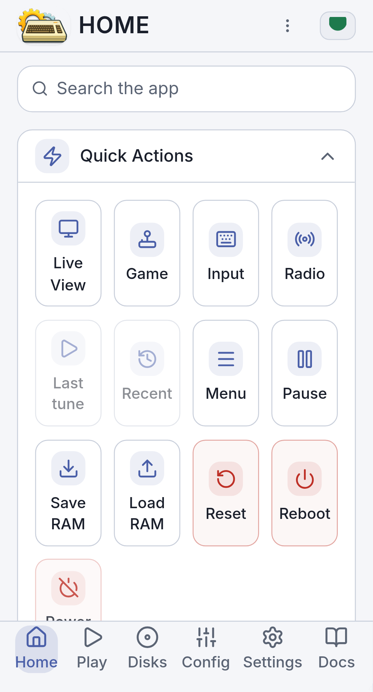

## Table of Contents

- [Welcome](#welcome)
- [Before You Start](#before-you-start)
- [First Connection](#first-connection)
- [Your First Tour](#your-first-tour)
- [Everyday Flows](#everyday-flows)
- [In Depth](#in-depth)
- [Safe Device Use](#safe-device-use)
- [Troubleshooting](#troubleshooting)
- [Appendices](#appendices)
  - [Feature Reference](#feature-reference)
  - [Keyboard and Directional Input Reference](#keyboard-and-directional-input-reference)
  - [File and Source Reference](#file-and-source-reference)
  - [Network Ports and Services](#network-ports-and-services)
  - [Device Safety Modes](#device-safety-modes)
  - [Drive Types and Disk Formats](#drive-types-and-disk-formats)
  - [Snapshot Types and Memory Ranges](#snapshot-types-and-memory-ranges)
  - [Health Check Probes](#health-check-probes)
  - [Status and Safety Reference](#status-and-safety-reference)

## Welcome

C64 Commander puts your C64 on the screen in your hand: its music, its games, its disks and its settings, over your own network and nobody else’s.

It does three things.

- **It plays.** SID music, games, demos and disk images, from your own files, from the machine itself, or from the great free archives.
- **It controls.** Reset, reboot, the menu, the drives, the printer, the SID mixer, memory and every setting the machine has.
- **It explains.** When something will not answer, health checks, logs and traces say what happened and where.

Read the tour if the app is new to you: it is short, and it goes page by page. Come back to the reference chapters when you already know what you want and only need to find it.

## Before You Start

### Supported Machines

C64 Commander is the broad edition. It works with the Commodore 64 Ultimate, Ultimate 64, Ultimate 64 Elite, Ultimate 64 Elite II, and Ultimate-II.

The app may call the device-file source **C64U** in lists and pickers. In that place, read it as storage on the connected Ultimate-family device, reached through FTP.

Three things have to meet: the device running the app, the connected Ultimate-family device, and the network between them.

Put the device running the app and the connected Ultimate-family device on the same Wi-Fi or wired network. Then, on the machine itself, open **Network Services & Timezone**.

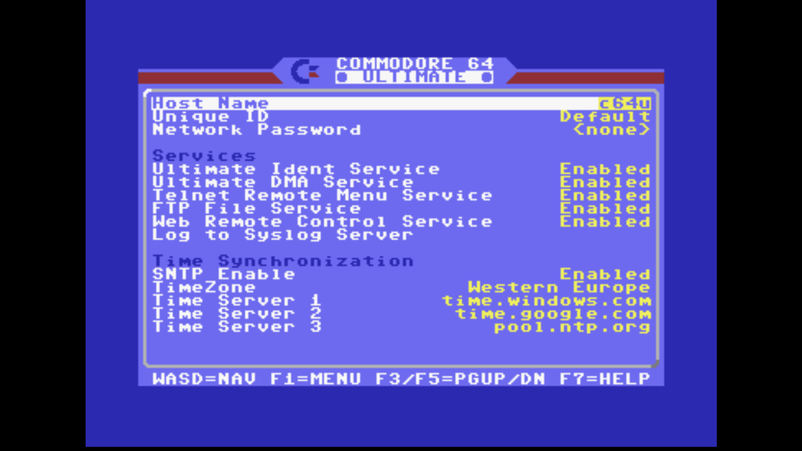

Enable the services the app uses:

- **Web Remote Control Service** carries almost everything: the controls, the status, the settings. The app needs it.
- **FTP File Service** carries the files, so the app can browse the machine, build playlists and mount disks.
- **Telnet Remote Menu Service** carries a handful of extra actions that reach into the device menu. Turn it on if you want those.

Note the IP address under **Wired Network Setup** or **WI-FI Network Setup**. You will want it if the app cannot find the connected Ultimate-family device by itself.

## First Connection

Start C64 Commander. If no saved device is reachable, it scans the local network for supported devices.

If devices are found, the app opens **Choose your C64**:

1. Choose **Use** to connect now.
2. Choose **Save** to keep the device for later.
3. If the device is password-protected, enter its network password when asked.

If no devices are found, C64 Commander opens **No C64 found**, a manual setup prompt.

Enter a hostname such as `c64u`, `u64`, or `u2`, or an IP address such as `192.168.1.64`, then choose **Connect**. If the device answers but requires a password, the same dialog asks for it before saving and connecting.

A healthy badge at the top right confirms that the active device is responding. You can scan again later from **Settings → Connection → Discover devices**.

## Your First Tour

### The Header Badge

The badge at the top right says how the current device is: healthy, degraded, unhealthy, or offline. Tap it to open Diagnostics — and, when the app is offline, to try the connection again. Long-press it, press `#`, or use the Quick Menu to open the Device Switcher.

### Finding Your Way

You do not have to know where a thing lives to reach it. Search covers every page, every card, every setting the app owns, every setting your machine reports, and every tune, disk and program you have. Type two or three letters and pick the answer.

There are three ways in, and they open the same thing:

- The **search field** at the top of Home. Tapping it opens search over the whole screen, so the results are not squeezed into the strip above the on-screen keyboard.
- The first entry of the **Quick Menu**, whichever way you opened that menu.
- The **`7`** key. It works even with directional navigation switched off.

Up and Down move through the results while the text stays where it is, so you can keep typing; OK opens what is selected, and Back closes search. Results are grouped, and the group with the best match comes first — typing `radio` offers **Start SID Radio** ahead of a tune with the word in its title.

**A result you cannot use is still listed, and it says why.** "Needs a connected C64 Ultimate", "Needs the HVSC music collection installed", "Live View is turned off in Settings". Picking one of those takes you to the setting that would enable it rather than doing nothing. Something that vanishes when it is unavailable teaches you nothing about what the app can do.

With the box empty, search offers the four things worth doing first and the searches you have run before.

### The Tour

The first time you open C64 Commander it offers a short guided walk through the app — the real app, not pictures of it. It goes to each page, puts a spotlight on what it is talking about, and explains it in a line or two.

A step counter at the bottom says where you are, and **Skip**, **Back** and **Next** are always there; on a keypad, Left and Right are Back and Next, OK is Next, and the Back key leaves. You can stop at any point.

It is not a one-off. Start it again whenever you like from the card at the top of **Docs**, or from **Settings → About → Take the tour**. If you took it before your C64 was connected, the steps that needed one explained themselves instead of pointing at anything; Home offers those again, once, the first time a machine answers.

### Home

Home groups the day-to-day controls.

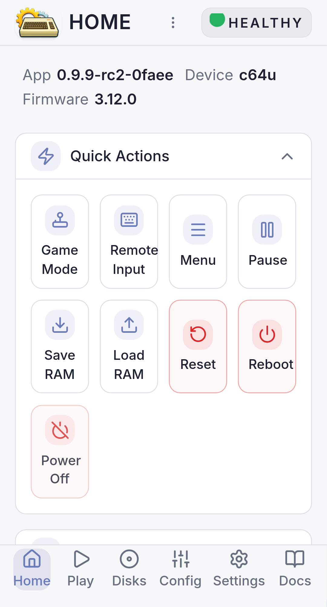

Start at the top. The search field comes first, and under it **Quick Actions** — one grid holding the machine's own controls and, at the end of them, four tiles that need no C64 at all. **Radio** starts a SID Radio station, thousands of tunes played on this device with no network and no hardware. **Resume tune** picks up the last tune where it stopped, and names it — two words, because the machine's own Pause control renames itself to Resume while the C64 is paused. **Recent** is the way back to anything you have opened before. **Live View** goes to the card that brings the machine's picture and sound into the app. A tile you cannot use right now is still there, greyed, saying what it is waiting for.

Quick Actions run from the ones you reach for most to the ones you reach for rarely: **Game** and **Input**, which sit together as two ways into the same second screen, then Menu, Pause/Resume and the RAM snapshot actions, then the four that need no C64 — Radio, Resume tune, Recent and Live View — and then, in their own band, the ones that interrupt whatever the machine is doing: Reset, Reboot, and Power Off where the device supports it. Nothing that stops your C64 sits next to something that does not. The system strip, which confirms which app build, device and firmware you are using, is at the foot of the page: it is read when something is wrong or before an upgrade, and not otherwise.

Two more actions can join that last band: a **Reboot (Clr Mem)** that wipes memory on the way, and **Power Cycle**. Both go through the Telnet menu service rather than the web service, so they start out switched off; turn them on in Settings → Experimental Features once Telnet is enabled on the device.

Directly below sits **Live View**, which brings the sound and the picture of the running machine into the app. It is a card like the ones below it and starts closed, so tap its header to reach the switches inside; while it is playing, a **Reset** in that header stops both feeds without opening it. It has a chapter of its own later on.

Keep going and the rest of Home is a set of cards, each its own labeled chapter you open or close by tapping its header. **CPU & RAM** holds the processor speed, turbo behavior and the RAM expansion. **Video**, directly followed by **Audio**, holds the output mode, resolution and scan lines, and then the SID mixer's channel strips — audio and video sit together because that is how most people think about them. **Ports** holds the joystick swap, the serial bus, the cartridge preference and the user port. **User Interface** rounds the group out, and, on a machine that has them, so does **Lighting**, for the case and keyboard lights.

Which of these start open and which start closed is chosen once, for a first-time visit, in favor of the cards most people touch every session; every card is closed or opened the same way, by tapping its header, and the app remembers what you left open from then on — a card you never use can stay out of the way, and one you always want stays exactly where you put it. On the compact display profile, where there is the least room, opening one card closes the others, so the list of titles stays on screen around whatever is open. **Expand all sections** and **Collapse all sections** in the Quick Menu do the whole page at once. Everything here is in Config as well; these cards just save you the search.

**With no C64 connected**, Home rearranges. The search field stays where it is, and so do Radio, Resume and Recent, because none of them needs a machine — they are drawn on their own, below a card explaining how to connect one. The machine's controls and its cards are drawn as titles with nothing inside them, under a line saying so, and the system information at the foot of the page drops to the app version alone. Nothing is lost: whichever cards you had open are open again the moment your C64 answers. The app waits a few seconds before rearranging, so a brief network hiccup does not shuffle the page under you, and it goes back the instant the machine is there again.

The remaining cards cover drives, the printer, streams, and **Config actions**. That last one holds **Save**, which writes the current settings into flash on the connected Ultimate-family device so they survive a power cycle, along with Load, Reset, Revert, and the app's own named configuration snapshots.

The **Game** and **Input** tiles open the second-screen joystick and keyboard for the C64. Both have their own walkthrough in [Remote Input](#remote-input), later in this guide.

### Play

Play is for building a playlist and running it.

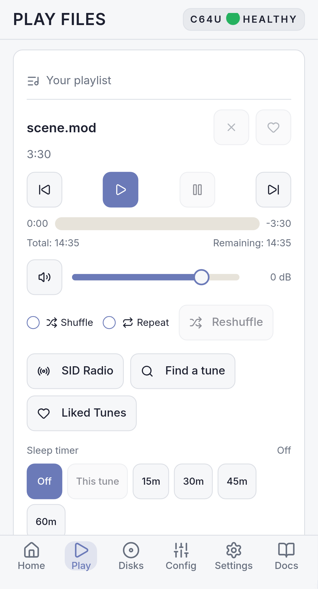

Choose **Add items** — it reads **Add more items** once there is something in the list — and then choose a source.

The picker stays inside the source you chose, so **Up** never escapes into somewhere else by accident. Tick files or folders and confirm. **Include subfolders** decides whether a ticked folder means that folder alone or everything beneath it, which is the difference between adding twelve files and adding twelve thousand.

One useful shortcut: if the only thing you have ticked is a single program, cartridge or disk, the confirm button reads **Play** instead of **Add to playlist**, and the machine starts it there and then.

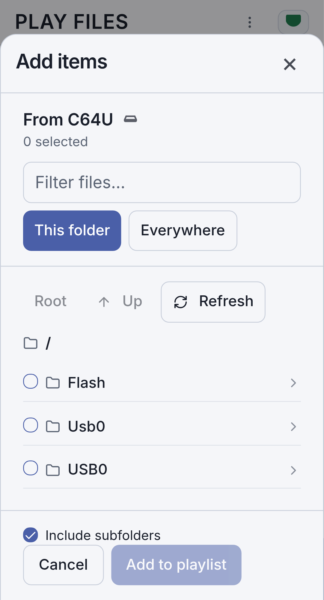

Play handles SID and MOD music, PRG programs, CRT cartridges, and disk images. A SID file can hold several separate pieces of music, which this guide calls tunes. Where the length of a tune is known, the app shows it and moves on at the right moment instead of guessing.

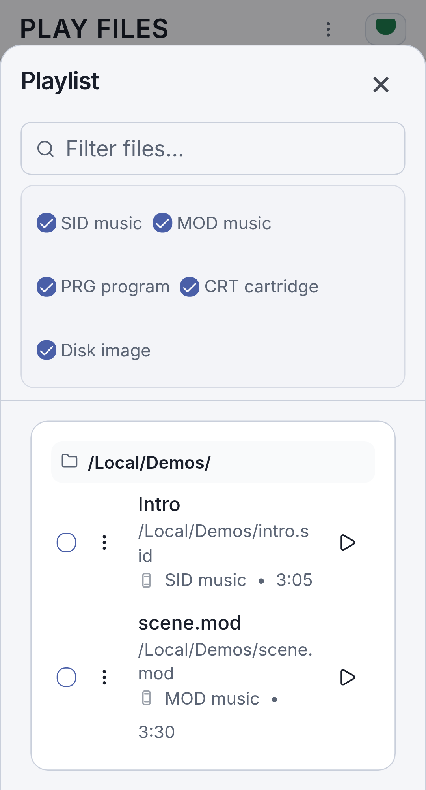

A playlist can stay tiny — one song — or become the queue for a whole evening.

While it is short, stay on the main Play page. When it grows, open **View all**, which gives you room to scan, filter, select and remove without losing sight of the playback controls. How many rows appear before you need View all is up to you: **Settings → Play and Disk → List preview limit** starts at 50.

Add broadly, then filter narrowly. Add a whole folder, then type a few characters to narrow it down: the filter matches the title, the path, the source and the kind of file.

Filtering changes only what you can see, never the playlist itself. Clear the box and the full queue comes back.

Every item remembers where it came from. Local files stay local, C64U files point back at the device, archive results remember their source, and SID entries carry their tune and length information with them.

Rows read as titles rather than file names: `Bossa_in_Do_2SID.sid` appears as *Bossa in Do*, with a small badge where a tune uses more than one SID chip. **Settings → Play and Disk → Friendly SID names** puts the file names back if you would rather see them.

The transport controls run the session: play, stop, pause and resume, previous and next, shuffle, repeat, reshuffle, and volume. Beside them sit a **sleep timer**, a **default duration** for anything whose real length is unknown, and a **songlengths file** you can point at by hand if you have one.

Each row has its own menu, holding the item's details and its **playback config** — a device configuration the app can apply before that one item runs. To take items out of the list, tick them and choose **Remove selected items**.

Playback carries on when you leave the app or lock the phone, and the playlist and your place in it are still there the next time you open it.

Play is the quick way to start a disk and see what it does. Disks is the place to go when the drives, the grouping or the collection itself is what you are after.

### Disks

Disks is where the drives and your disk images live.

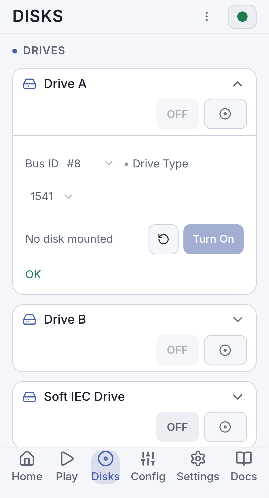

The page has three drive cards — **Drive A**, **Drive B**, and a **Soft IEC** drive that reads loose files straight from a folder rather than from a disk image. Each card turns its drive on or off, sets its bus ID and type, mounts and ejects, and resets. Power and the mounted disk stay on the card header, so whether a drive is on and whether it holds a disk can both be seen and changed without opening the card. **Drive A** starts open and the other two start closed. Below them, **Add disks** builds a collection from the sources you have.

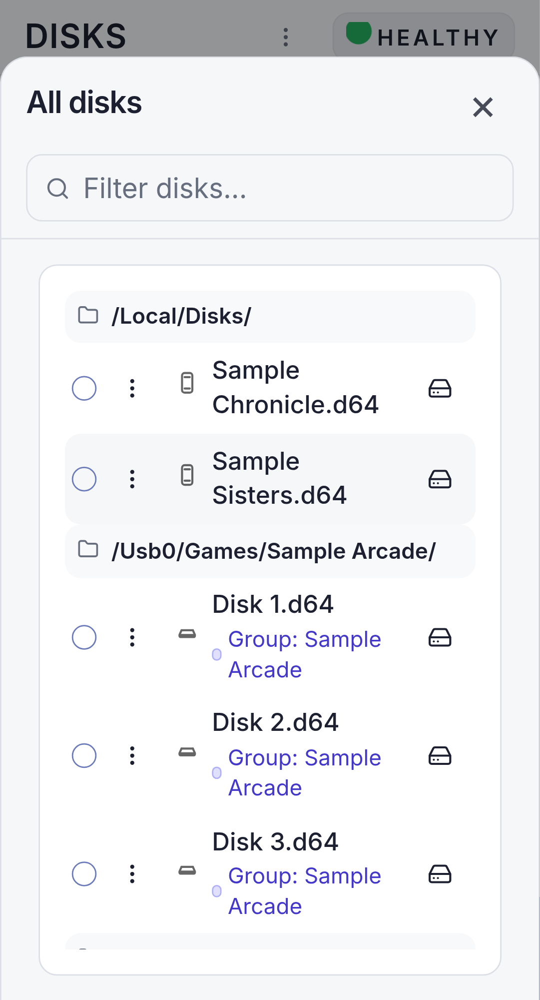

Add a single image, a folder of them, or a result from the online archive. Adding a folder also groups what it finds: disks whose names share a prefix, or that share a folder, are put in one group for you, so a multi-disk title usually arrives ready to rotate through.

Filter by name, path or group to find something. Filtering never deletes or moves anything.

Mounting is what the page is for. Choose the disk, choose the drive, mount it; **Eject** empties the drive again. Each disk's own menu also offers **Rename disk**, which changes how the collection lists it and leaves the file itself alone.

Drive settings sit beside the collection because they decide how a mounted image behaves. Bus ID, drive type, power, reset and the Soft IEC path all matter when a program expects a particular setup.

Come to Disks whenever more than one image is involved. The collection, its filters, the groups and the mounting are all on one page, so nothing sends you away halfway through.

### Config

Config is the complete configuration tree.

Search for a category, open it, and edit the rows directly. Each item gets the control that suits it — a slider, a select, a checkbox, a text field, or a masked field for a password. Every category the device reports has a card of its own, named after that category, and the app remembers which cards you left open.

A change goes to the device the moment you make it. Most take effect at once; a few, the cartridge choice among them, are stored now and take effect at the next reset.

Turn on **Keep device settings after a restart** in **Settings → Device Safety** to have the app save every device setting it changes, or use **Save** in the Config card to write the current settings to flash once. The machine's own **Auto save config** does not cover this. It decides whether the machine saves changes you make in its on-screen setup menu, and has no effect on changes made from the app. On a Commodore 64 Ultimate, set it at **C= + RESTORE → User interface → Auto save config**. C64 Commander mirrors that menu in Config as **User interface → Auto save config**. On other supported devices, search Config for **Auto Save Config** if the menu naming differs.

Config is where you look when you know a setting exists but not where the device menu keeps it. The search box narrows the tree to the pages and groups whose names match; open one to see its rows. After changing a value, let the write finish before changing a related one.

Config edits the live device, not a draft. Use it for the precise and the uncommon, and use the page controls for everything routine.

### Settings

Settings controls app behavior and saved connection details.

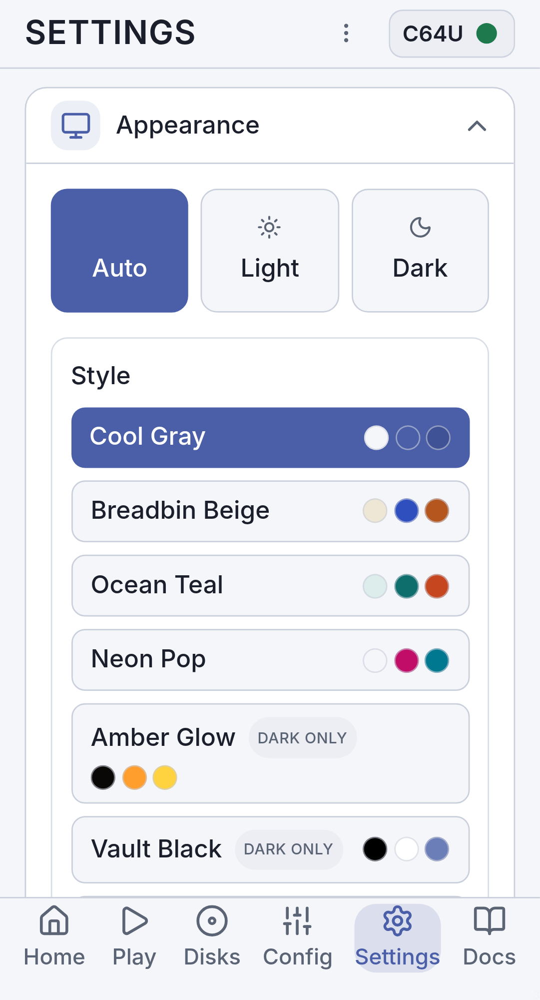

Settings is a list of chapters rather than one long page of controls. Each heading says in one line what its chapter decides, so you can find the right one without reading the others. **Connection** is open on your first visit; the rest start closed, and whatever you leave open is still open next time.

The chapters are **Appearance**, **Connection**, **Diagnostics**, **Play and Disk**, **Stable Features**, **Experimental Features**, **SID Radio**, **HVSC**, **Online Archive**, **Device Safety**, **Notifications**, and **About**. The two feature chapters show how many of their switches are on — 3/7, say — so you can tell at a glance without opening them.

If the device is hard to reach, start in **Connection**. If it answers but feels fragile, start in **Device Safety**.

**Connection** also holds your saved devices: their name, host, HTTP, FTP and Telnet ports, and network password. Saving checks that the web service answers before the device is kept; FTP and Telnet are stored as given and are tested by a health check.

**Appearance** is local to the app and never touches your C64. It sets the theme, the style, the text size, the display profile, card descriptions, whether the app runs full screen, and whether it follows the phone's rotation or stays in portrait or landscape.

**Style** is a set of colours, corner rounding and shading — a look, layered on top of **Theme**, which stays the light-or-dark switch. Pick one directly, or choose **Match my device** to follow the Color Scheme your C64 Ultimate is already set to; that reads the device once when you connect, not continuously, and falls back with a note if it can't be read yet. A few styles come in one shade only, in which case Theme is disabled and Settings says why.

There are seven:

| Style | What it is |
| --- | --- |
| Cool Grey | Neutral, blue-leaning grey. The one the app starts with. |
| Breadbin Beige | The warm beige of the original case. |
| Ocean Teal | Deep blue-green with a warm coral highlight. |
| Neon Pop | Bright and saturated. Dark only. |
| Amber Glow | An amber monitor. Dark only. |
| Vault Black | Near-black with a two-tone band. Dark only. |
| High Contrast | Maximum legibility: heavy edges, strong text, no soft fills. |

**Cool Grey**, **Ocean Teal** and **High Contrast** were called Modem Grey, Petrol Teal and Full Sun in earlier releases. Only the names changed — the colours are identical, and whichever you had chosen is still the one you have.

**Text size** enlarges every part of the app: **Default**, or **Large**, which is about a seventh larger. Reach for it when the app is harder to read than you would like; the display profile beside it changes the layout rather than the type. The sizes stop where they do because the app is measured at each one on the smallest screen it supports, and a size that cut a label in half would not be an accessibility setting. If the tab bar along the bottom does run out of room it scrolls sideways rather than pushing a tab off the edge, and reaching a page another way — the Quick Menu, a number key, or a link from elsewhere in the app — scrolls that tab into view, so the bar always shows you where you are.

**Card descriptions** is the one-line summary under each card's title, on every page built from cards. It starts off, because on a small screen it costs about half the height of every closed card; turn it on if you would rather read what a card holds than remember it. The Quick Menu switches the same thing on and off without leaving the page you are on.

**Diagnostics** opens the diagnostics panel, switches debug logging on, and — this is where it lives, despite the name — carries **Settings transfer**. That exports your app settings, feature switches and device-safety tuning to a file you can import onto another phone or tablet. Saved devices and passwords are deliberately left out, so the file is safe to move about.

**Notifications** decides whether you see every message or only errors, and how long each one stays on screen. **About** shows the version and links to the open source licenses.

Feature switches appear only where a feature is safe for anyone to change. A feature this edition does not support is absent from Settings and from this manual.

#### Making settings stick

A setting you change from the app reaches the connected Ultimate-family device at once — the colors, the video mode, the LED lights and the rest all change as you make them. By default that is as far as it goes: switch the machine off and on, and it comes back the way it was. Nothing you try from the app is permanent, which makes it a safe place to experiment.

**Keep device settings after a restart**, in **Settings → Device Safety**, changes that. With it on, every device setting the app changes is also written to the machine's own storage, so it survives a power cycle, exactly as though you had saved it from the machine's setup menu.

Turn it on deliberately. It is not hard to save a setting that leaves the machine awkward to use, and once saved it comes back that way every time. The way out is to hold **RESTORE** while you switch the connected Ultimate-family device on: it then starts with its default settings instead of the saved ones, which is enough to get you back to a working machine. Nothing is erased — your saved values are still there — so you can put the setting right and save it again.

### Docs

Docs is the built-in help page — the short version of this manual, always with you.

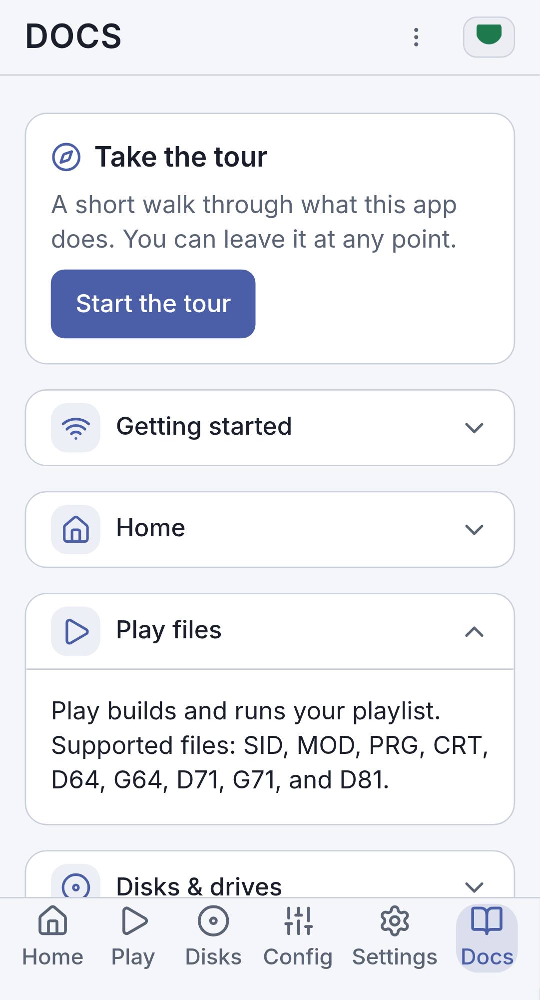

It covers setup, Home, Play, Disks, Config, Settings, Diagnostics and disk swapping, and ends with links to the official device manuals and reference material.

### Diagnostics

Diagnostics shows the health of the connection, what the app has been doing, and anything that has failed.

Open it when a control does nothing, playback will not start, a file transfer stalls, or the badge stops looking healthy. Inside are the health check, four kinds of activity — Problems, Actions, Logs and Traces — filters, latency and heat-map views, Share, and Clear.

Start with Problems for a plain-language summary. Filter to errors when something has failed. Use Traces when the timing or the order of requests is what matters. And a health check is the quickest way to see whether the web, FTP and Telnet services are alive.

**Share** packages the evidence. Use it before you restart the app, because the details that explain a failure are usually the last few actions before it.

For a closer look, see [Reading Diagnostics](#reading-diagnostics) and [Sharing a Diagnostics Report](#sharing-a-diagnostics-report) in the In Depth chapter.

### Device Switching

Device Switcher is for homes with more than one saved Ultimate-family device.

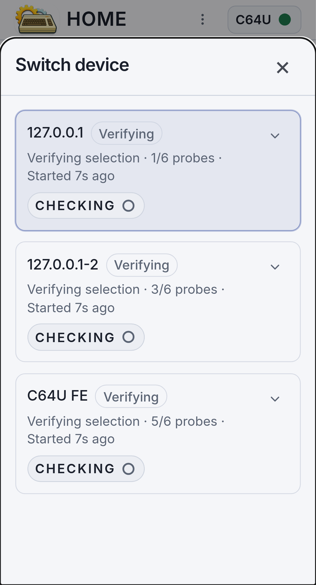

Open it from the badge long-press, `#`, or Quick Menu. Expand a row for more detail.

See [Switching Between Devices](#switching-between-devices) in the In Depth chapter for the full story.

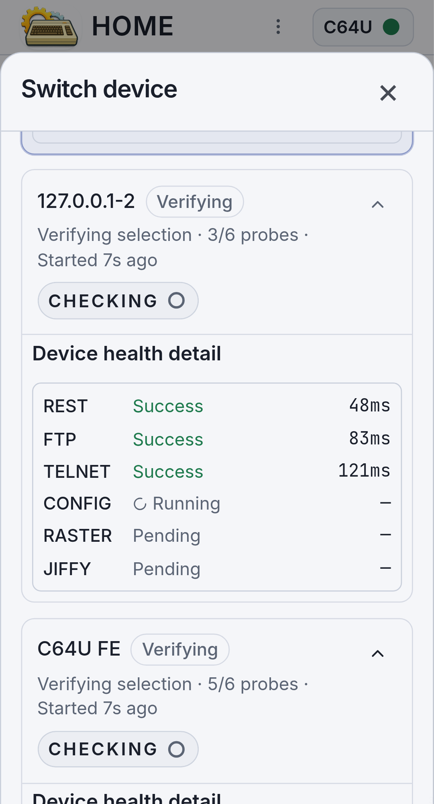

## Everyday Flows

### Connect by Hand

1. Open **Settings → Connection** or use the startup prompt when discovery finds nothing.
2. Enter a hostname or IP address.
3. Choose **Save & Connect** or **Connect**.
4. Enter the network password if prompted.

Preferred path: use startup discovery first, then manual host entry if discovery finds nothing.

### Maintain Saved Devices

1. Open **Settings → Connection**.
2. Review the saved-device list.
3. Give each device a name you will recognize, and check its ports.
4. Use **Save & Connect** after changing the active device.
5. Remove any device that is no longer on your network.

Preferred path: Settings for editing, Device Switcher for choosing.

### Reboot and Carry On

1. Open **Home**.
2. Choose **Reboot**.
3. Confirm.
4. Watch the badge until the device returns healthy.

Preferred path: Home Quick Actions. Use Diagnostics only if the device does not return.

### Play a SID or Program

1. Open **Play**.
2. Choose **Add items**.
3. Choose Local, C64U, HVSC, or CommoServe.
4. Select files or folders.
5. Confirm and press Play.

Preferred path: Play. Use C64U source for files already on the target device; use Local for files on the device running the app.

### Build a Playlist from Folders

1. Open **Play → Add items**.
2. Choose the source that owns the folder.
3. Navigate into the folder.
4. Select the files or folders you want.
5. Confirm the selection.
6. Open **View all** if the list is long.

To search rather than browse, type in the box at the top and choose **Everywhere**. **This folder** narrows what is on screen; **Everywhere** searches the whole source, which for HVSC means the whole archive — some sixty thousand files — by title or composer. Sources that have to be read folder by folder — a folder on your device, or the card in your C64 — offer a **Scan** button instead of searching as you type, because that search has to walk the whole source rather than consult an index.

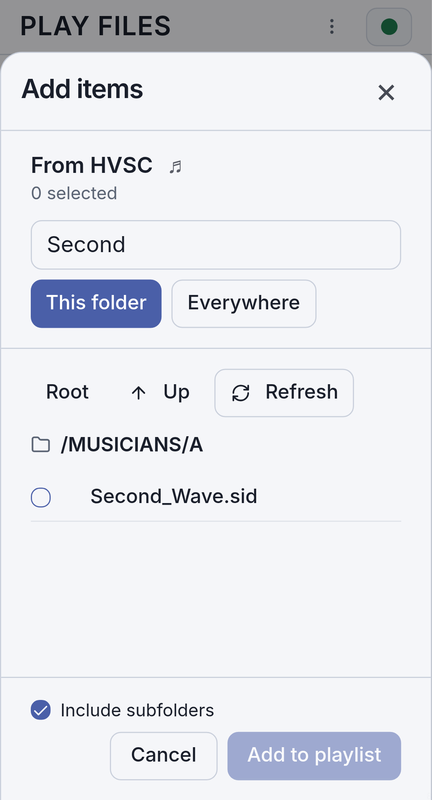

Preferred path: Add a folder first, then filter the playlist to choose what to play next.

### Filter and Clean a Playlist

1. Open **Play → View all**.
2. Type a few characters from the title, the path, the source, or the kind of file.
3. Review the rows that remain.
4. Tick the ones you do not want and choose **Remove selected items**, or clear the filter to bring the whole list back.

Preferred path: filter before removing. A filter changes only what you can see.

### Choose a Tune Inside a SID

1. Add one or more SID files to Play and start one.
2. On the Now Playing card, tap the tune position — **1/19** — to list every tune in the file, with its name and its length.
3. Tap a tune to play it, or use **Play all 19 tunes** to add the whole file to the playlist in order.

Preferred path: choose tunes from the Now Playing card. The playlist rows have no tune chooser.

### Mount a Disk

1. Open **Disks**.
2. Add disks if the collection is empty.
3. Open the drive mount action.
4. Choose a disk.

Preferred path: Disks. Home also shows drive shortcuts, but Disks gives the clearest collection view.

### Build a Disk Collection

1. Open **Disks → Add disks**.
2. Choose Local, C64U, or CommoServe.
3. Select disk images or folders.
4. Confirm the selection.
5. Use **View all** to inspect the collection.

Preferred path: Disks to build a collection; Play to queue things up and start them.

### Filter, Group, and Rotate Disks

1. Open the disk collection view.
2. Filter by name, path, or group.
3. Check the groups the app assigned when you added the folder, and move any stragglers into the right one.
4. Mount the first disk.
5. Use rotation controls when the title asks for the next disk.

Preferred path: group related disks before you need to swap them.

### Mount to a Specific Drive

1. Open **Disks**.
2. Check that the drive you want is switched on.
3. Check its bus ID and type if the program is particular.
4. Choose the disk image.
5. Mount it to the intended drive.

Preferred path: adjust drive setup before mounting.

### Change a Common Setting

1. Try Home's own cards first — CPU & RAM, Video, Audio, Ports, User Interface, Lighting.
2. If the setting is not there, open **Config** and search.
3. Change the value.
4. Use **Save** in the Config actions card if the change should survive a device reboot or power cycle, unless **Keep device settings after a restart** is already on.

Preferred path: Home for common settings; Config for the full tree.

### Save Device Configuration

Use this flow to write the current settings to flash once. A device setting changed from the app is applied straight away but is not saved unless you save it, so without this the machine's next power-up brings back what it had before.

1. Make the changes you need on Home or Config.
2. Confirm the device is healthy.
3. Open the **Config** card on Home.
4. Choose **Save** in the Config card.

Preferred path: turn on **Keep device settings after a restart** in **Settings → Device Safety** and the app saves for you, a moment after your changes settle.

### Investigate a Problem

1. Tap the header badge or press `*`. If the app is offline, that tap also tries the connection again, and asks for the password if the device wants one.
2. Run a health check.
3. Review Problems, Errors, and Traces.
4. Share diagnostics if you need support.

Preferred path: Diagnostics from the badge.

### Export Useful Diagnostics

1. Open **Diagnostics**.
2. Check Problems and Errors.
3. Open Traces if request order matters.
4. Use **Share** before clearing logs.

Preferred path: Share before restart when you are trying to preserve evidence.

## In Depth

The tour showed you where everything lives, and the flows above are quick recipes. A few features reward a closer look. This chapter takes its time with them.

### SID Music

A **SID** — short for **Sound Interface Device** — is the sound chip in every Commodore 64. It has three voices, and the music written for it keeps growing. The same name covers the files that hold that music: each one is a small program that drives the chip. Tens of thousands of them live in one free archive, the **High Voltage SID Collection**, or **HVSC**.

Your C64 will play any of it, and so will your phone or tablet for most tunes. This section covers playing that music yourself. The next one, **SID Radio**, covers letting the app choose it for you.

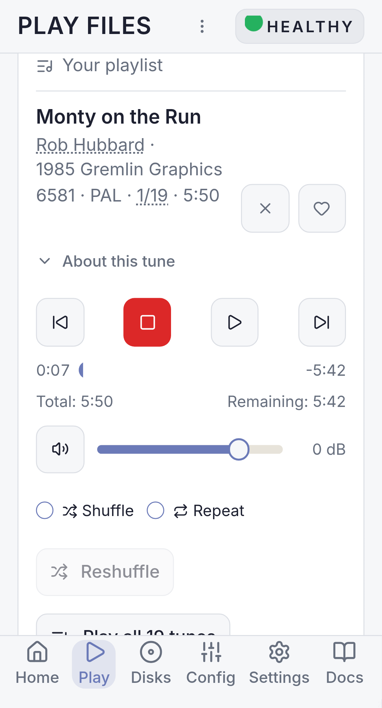

#### Where the music plays

When a SID tune is playing, the Play page shows an **output button** beside the volume slider, marked with the destination the sound is going to. Press it to choose:

- **Here** — your phone or tablet plays the tune itself. Your C64 need not even be switched on.
- **C64** — your C64 plays it, through its own SID chip.
- **Both** — your C64 plays it and also sends the sound across your network, so you hear it in both places.

**Both** is offered when Live View and its audio are switched on, and it takes itself away again if your C64 declines to send the sound. The sound leaves the machine over its **Ethernet** connection, so a C64 that is only on Wi-Fi cannot supply it. The output button appears for SID tunes alone — programs and disks always run on the C64, because that is the only machine that can run them.

To play music on its own, your phone or tablet needs a copy of two programs built into every C64: the **KERNAL** and **BASIC** ROMs. Many tunes call into them, and without them those tunes start and then play nothing. The ROMs are under copyright and cannot be shipped with an app, so C64 Commander reads them from your own machine — by itself, the first time you play a tune here while the C64 is connected. There is nothing to set up. The copies stay on your phone or tablet, and are never uploaded, never shared, and never included in a diagnostics report. Read them only from a machine that is yours, or that you have permission to use.

#### Moving around inside a tune

These apply to tunes playing on your phone or tablet. On the C64 the buttons step from one tune to the next and no further.

- **Press and hold the next or previous button** to wind forwards or backwards, about five seconds at a time, for as long as you hold on. A short tap still skips.
- **Tap the progress bar** anywhere to jump there, or hold and slide along it. The music picks up wherever you let go.
- Jumping *forward* past the part that has already been prepared takes a moment, because the music has to be worked out from that point on. The timer holds at the last note you heard while the bar shows the progress. Jumping back is immediate.

#### The sound itself

**Volume** and **Mute** follow whichever machine is sounding: playing here, they change this tune alone and leave your ringer and notifications as they were; playing on the C64, they move the machine’s own mixer. Your phone or tablet will either play a tune itself or play the sound sent from your C64, never both at once — whichever you start last takes over.

The rest is under **Settings → SID Radio**. **Crossfade** overlaps one tune into the next, both audible while the first fades away: **Off** for a clean cut, or **Short** (0.6s), **Medium** (1.5s), **Long** (3s), or **Longest** (4s). It starts at Off. Only your phone or tablet can sound two tunes at once, so the control is grayed out while the output is set to the C64.

There are two versions of the SID chip — the **6581** and the **8580** — and music written for one sounds a little different on the other. Most files say which the composer used, and those always play on the chip they name. For the many older files that say nothing, turn on **Match my Commodore 64** and the app reads the chip out of your own machine; **Otherwise use** picks between 6581 and 8580 for when it has not read one yet. A line underneath tells you which is in use at the moment.

#### The SID Audio Mixer

A C64 can have more than one SID chip. **Home → Audio** gives you a **master volume**, plus a **volume** and **stereo position** for each SID your machine reports. Pan one SID left and another right for stereo, or turn one down so the other leads. Changes take effect immediately, and the same controls appear in **Config → Audio Mixer**.

### SID Radio

The High Voltage SID Collection holds around sixty thousand files and close to ninety thousand tunes, which is far too many to browse. SID Radio plays it like a radio station: pick a mood, or a tune you already like, and the app keeps finding more music of the same kind. There is no playlist to build, and nothing is downloaded as you listen — once the collection is on your device, the app already knows which tunes resemble one another.

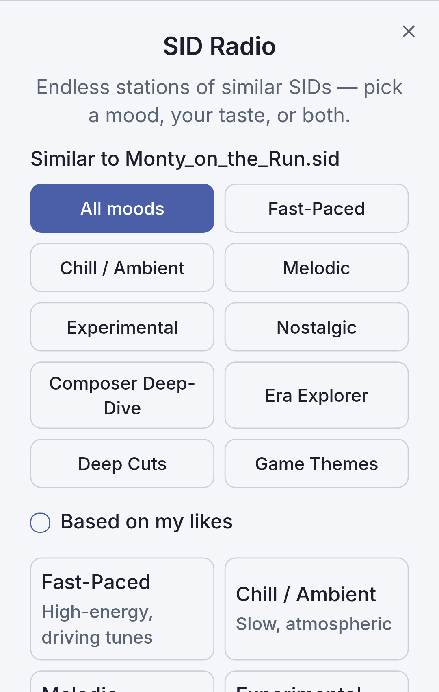

#### Starting a station

Go to the **Play** page, tap **SID Radio**, and pick what you are in the mood for:

- **A mood.** Nine of them: Fast-Paced, Chill / Ambient, Melodic, Experimental, Nostalgic, Composer Deep-Dive, Era Explorer, Deep Cuts, and Game Themes. Each draws on tens of thousands of tunes.
- **From tunes you like.** This unlocks once five tunes carry a heart, and builds a station out of them.
- **Surprise me.** Anything at all.

Switch on **Based on my likes** to tilt any mood toward your own taste. The station keeps the mood's name; what changes is the music it reaches for.

You can also start from whatever is already playing. Tap **More like this** and the station follows that tune. It appears whenever a SID the collection recognizes is playing, including while another station is running.

#### Telling it what you like

While a tune plays, a heart and a cross appear just above its title, at the right-hand edge of the card. Tap the **heart** to add it to your **Liked Tunes** list. Tap the **cross** to skip it: the station moves on immediately and avoids similar tunes. Both are optional; the station plays happily if you only listen.

Your choices stay on your phone or tablet. They are attached to the music itself rather than to a file name, so they survive an update to the collection even if the tune has moved. **Liked Tunes** is an ordinary playable list: play it, shuffle it, or take a tune off it again. To start over, **Settings → SID Radio → Clear my rankings** removes every heart and cross at once.

#### What a station will and will not do

**It never repeats itself.** No tune twice, and only one tune from any one file for the whole session.

**It skips very short pieces.** The collection includes jingles, sound effects and test tones alongside the music. Anything under fifteen seconds is skipped; change that under **Settings → SID Radio → Shortest tune to play**, or set it to zero to hear everything.

**It can run out.** A station follows a chain of similar tunes, and occasionally — usually after many skips in one session — it reaches the end of that chain. The app tells you, and you can pick another mood.

While a station runs it chooses what comes next, so Shuffle, Repeat and Reshuffle step out of the way; they come back, with your settings intact, the moment you stop it. The line at the top of the Now Playing card says where the music is coming from — tap it to see why this tune was chosen, or **Stop** beside it to end the station. Each station starts fresh, so the same mood gives you different music every time.

#### Finding one particular tune

To play one specific piece, tap **Find a tune** and type part of a title or a composer's name. The app searches the whole collection rather than one folder, which matters because the archive is filed by composer.

Any part of a word will do, in any case, and accents are ignored: "oorni" finds Lasse Öörni, "mando" finds Commando. Add a second word to narrow the search — "hubbard commando" matches both.

Tap a result and it plays immediately. Your station keeps its place and carries on when the tune ends. To hear more music like the one you found, tap the radio icon beside it — it is there for any tune the collection can start a station from. With nothing typed, the sheet lists what you have heard recently, which is how you find your way back to something that has already played.

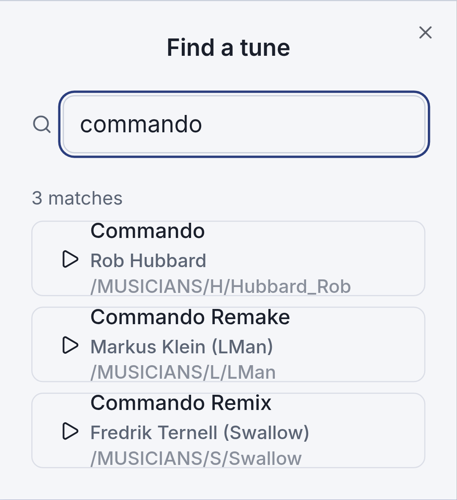

#### More than one tune per file

Many SID files hold several tunes — a title screen, a high-score jingle, a loading tune, sometimes twenty more. The second line under the title shows which one is playing and how many there are: **1/19**.

Tap **Play all 19 tunes** to add them all to your playlist in order, each with its own length and name. They then behave like any other tracks. The button disappears once you have added them.

To go straight to one tune, tap that **1/19**. It lists every tune in the file with its number, its name where there is one, and its length; tap one to play it. Lengths vary a lot — a five-minute piece and a one-second jingle in the same file is normal — so it is worth checking before you choose.

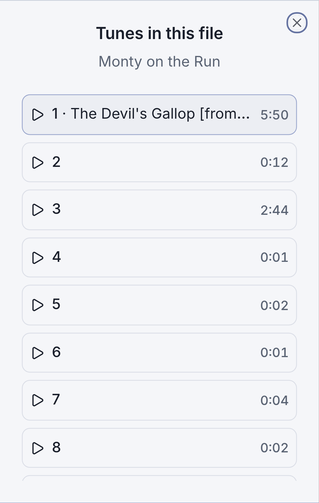

#### What the tune is, and who wrote it

The line under the title comes from the SID file itself: the composer, the year and publisher, the chip it asks for, whether it was written for **PAL** or **NTSC**, which tune of the file is playing, and its length. Anything the file does not record is left out rather than guessed at.

Two things a SID file cannot record have been documented separately by the archive's editors. Both sit under **About this tune**, below the line described above. Tap it to open them and tap it again to fold them away; it starts folded so that the transport and the progress bar are still on screen on a small phone. It appears only for tunes the archive describes, which is about a third of them.

The first is whether a tune is an arrangement, and of whose music. Much C64 music is a cover — of pop records, film scores or arcade originals — and the name in the file is whoever wrote the C64 version. Rob Hubbard's *Commando* is an example: he did write the C64 version, but the music is Tamayo Kawamoto's, from the arcade game. Where the archive records this, opening **About this tune** shows it: **BGM1 · music by Tamayo Kawamoto**.

The second is what the individual tunes inside a file are called, so a list of nineteen numbered rows becomes a title screen, a high-score jingle and a game-over sting. Any note the editors left about a tune is shown underneath. Short notes appear in full; longer ones are trimmed and marked **Show more**, and tapping the note shows the rest.

Tapping the composer's name opens the search with that name filled in.

#### Stopping later

A station never stops on its own, which is less than ideal if you are listening at bedtime. Under the transport controls on Play there is a **Sleep timer**: choose **This tune** to stop when the current one finishes, or 15, 30, 45 or 60 minutes. It says what it will do and counts down while it waits; **Off** cancels it.

### Live View

Your C64 can send its own sound and picture out across your network, and Live View brings them straight back into the app — so you can hear a tune or watch the screen without wiring up a speaker or a second television.

It is one shared session. Start it in a single place and it keeps playing wherever you go; there is never a second copy fighting for the same stream. You will find it just below the Quick Actions on **Home**, as a card that starts closed; tap its header to open it. Inside are two switches:

- **Listen** turns the sound on. It asks for almost no room — a lit button and a small live dot — so it is perfect for keeping half an ear on a game or a SID tune while you get on with something else. Wander to another page and a matching dot appears in the top bar to remind you it is still playing; a tap on it stops everything at once.
- **Watch** turns the picture on. A small preview of the C64 screen appears just beneath the switches; tap the chevron beside it to grow that preview in place.

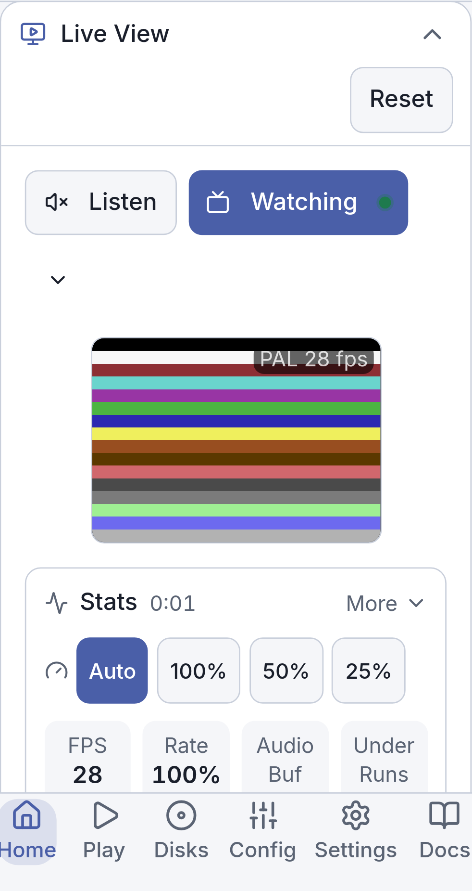

While the sound or the picture is playing, a **Reset** appears in the card's header and stops both of them, so the mirror can be turned off without opening the card again. And if what you started stops reaching the device running the app — the network drops out, or the machine is switched off — Live View reports that the stream stopped arriving, rather than leaving a frozen picture under a switch that still reads as playing.

#### The immersive screen

Open **Remote Input** while **Watch** is on and the picture sits above the joystick and the keyboard — a proper screen for playing a game or following a program you are typing into. Enter **Game Mode** and it takes the whole sheet.

Move around it however suits you. On a touchscreen, **pinch** to zoom, **drag** to slide the picture about, and **double-tap** to jump straight in on a spot — a second double-tap fits the whole screen back on. A small map in the corner shows which part you are looking at; drag its rectangle to leap somewhere else in an instant. Switch on **Follow** and the view drifts along on its own to wherever the action is — a lovely way to keep the cursor in sight as you type.

**Lock on** goes one better while you are playing. Follow on its own drifts toward whatever moved, which is the wrong thing in a game where everything moves at once. Press and hold your character instead — or, with no touchscreen, line the crosshair at the middle of the view up on it with the direction keys and press **OK** — and the view stays with that one character while enemies move around it. It survives the character flashing, changing colour, animating, moving fast, wrapping round the screen edge, and being hidden for a moment. The status line reads **Hold on your character** until something is locked, then **Locked on**. Tap that, ask for the whole screen back, or press **OK** again to let go, and the view returns to ordinary following rather than sitting on empty background.

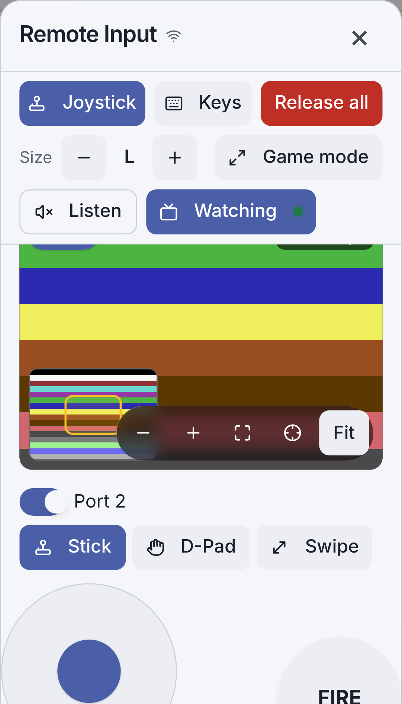

#### Driving the C64, or adjusting the view

When you steer your phone or tablet with a physical keypad, those same keys could drive the C64 or move the picture, so Live View makes the difference impossible to mistake. The mirror wears a colored border, and a matching label in the corner of the picture, that tell you at a glance which one you are doing: **blue**, marked **“C64”**, means your keys go straight to the machine, as usual; **amber**, marked **“View”**, means your keys zoom and pan the picture instead.

Press `*` or the **menu key**, or the on-screen **Fit** button, to change between the two. You are never stranded in front of a frozen game: adjusting the view returns to driving on its own after a short pause. While the border is amber, the keypad moves the view like this:

| Key | What it does |
| --- | --- |
| **2**, or D-pad up | Pan up |
| **8**, or D-pad down | Pan down |
| **4**, or D-pad left | Pan left |
| **6**, or D-pad right | Pan right |
| **3** or **9** | Zoom in |
| **1** or **7** | Zoom out |
| **0**, **5**, or the center/OK key | Fit the whole screen back on |
| the **menu** key | Return to driving the C64 |

In **Game Mode**, while the border is blue and the keys are driving the C64, `#` brings the quick keys and the **Watch** and **Listen** switches up over the bottom of the picture, and puts them away again — so the picture and the sound can be turned off and on without a touchscreen.

The same four moves have on-screen buttons: **plus** and **minus** to zoom, the **fit-to-screen** button to bring the whole screen back, and **follow** to turn Follow on and off. A touchscreen and a keypad each reach every control. However large you make the game controls, the picture stays in full view above them; the controls never creep up and cover it.

#### Smooth playback, and what it costs

Live View keeps the **sound** running smoothly above everything else. If a packet of audio goes missing on the network it fills the tiny gap so cleanly you will not hear a click, and it never lets the picture run away and leave the sound trailing behind.

The sound plays through a **fast, low-latency path**, so what you hear follows your keypresses closely: the app holds far less sound waiting to play than ordinary in-app audio does. Three switches in **Settings → Play and Disk** control this side of things, and all three start on. **Low-latency audio (native)** is the fast path itself. **Fast video (native assembly)** builds the picture the same way, and is what lets it reach the full 50 frames a second of a PAL machine. **Input priority (instant joystick)** hands the joystick and keyboard the right of way: while you are driving, the picture gives up a few frames so your input reaches the machine at once, then climbs straight back. Turn one off to compare, or if it misbehaves on your device.

One number sits beside them: the **audio network buffer**, 60 milliseconds to begin with. It is how much sound the app holds in hand against a network that delivers in fits and starts. Lower it for the shortest possible delay, raise it if the sound breaks up.

Your C64 sends color *numbers* rather than colors, so something has to decide what shade to paint each one. That choice is **Screen colors**, the first row of the **Video** card on the Home page. It shows the palette in use and all sixteen of its colors; tap it to choose another.

A palette can apply in two places, and **Show on** decides which of them — the same question the Play page asks about a tune. **Local** changes the picture in Live View on your device and touches nothing else. **Remote** changes what the connected Ultimate-family device itself draws, so the television in the room changes too. **Both** does each of them.

The list starts with **Follow the C64**, which is where it begins: Live View simply paints whatever palette the machine is set to, so your phone and your television match. Below that are nine bundled palettes — warmer, cooler, monochrome, and so on — each with all sixteen of its colors shown before you choose. Any palette already installed on the connected Ultimate-family device is listed too, under **Already on this C64**.

Sending a palette to the machine copies a small file to its storage and changes the picture straight away. Whether it is still there after you switch the machine off is a separate question, answered by **Keep device settings after a restart** in **Settings → Device Safety** — see *Making settings stick*.

The **picture** is the demanding part, so you get a say in how much of it to draw. Open **Stats** — it appears under Live View while it is playing — and choose a **Video frame rate**:

- **Auto** plays every frame it can, eases off when your device is under strain, and climbs back to full speed as soon as there is room to spare. Leave it here.
- **100%**, **50%**, and **25%** cap the picture at the full rate, half, or a quarter of what the C64 is sending. A lower setting is gentler on the battery and on older phones and leaves more headroom for the game you are driving. Even at a manual cap the app will still drop below it for a moment if that is what it takes to keep the sound perfect — the sound always comes first.

**Stats** also shows, at a glance and over the last few minutes, how the stream is doing: the picture's frame rate, how full the audio buffer is, any packets lost on the network and how they were smoothed over, and the app's own load. The sound and the picture cross the network as two separate streams, so **More** counts their losses apart: **Dropped pkts** under **Audio**, and **Lost pkts** under **Video**. Open or close it as you like — it is built to be light enough that watching it costs the stream nothing. If you ever need to send in a report, **Export diagnostics** saves all of it as a small file.

#### Checking the sound and picture yourself

Under Live View are three checks you can run whenever something seems off. They come with the app; **A/V Sync tests** in Settings → Experimental Features hides them if you would rather not see them.

- **A/V sync** and **Tap latency** answer *when*: how far apart the sound and picture are, and how long it takes a keypress to come back to you.
- **Tone & color ladder** answers *what*. It plays a short tune on your C64 — a scale from C3 up to C4 and back, half a second a note — and changes the screen color on every single note, stepping through all sixteen C64 colors as it goes. Because the C64 changes the note and the color at the very same instant, anything that arrives out of step arrived that way across your network.

The ladder grades what comes back and shows you five numbers: how many notes were **in tune**, how far off the **pitch** was, whether notes ran **long or short**, whether the two deliberate **silent gaps** really were silent, and how far apart the **sound and picture** were. Wrong pitches, notes running long, or a gap that is not silent all point the same way — the sound is being corrupted on the way to you rather than merely delayed. The most common cause by far is a second machine on your network streaming into the same place, and this check makes that obvious in one run.

Live View is ready as it stands. The picture and the sound stay off until you press **Watch** or **Listen**, so nothing crosses the network until you ask for it. The device sends to two network ports — 11000 for the picture, 11001 for the sound — and **Settings → Play and Disk** changes them if those numbers are already spoken for. Live View borrows the same feeds as **Streams** below, and while it plays it takes charge of them; see there for how the two share.

**Live View** itself is in Settings → Stable Features, and turning it off hides the whole thing. **Audio Mirror** and **Video Mirror**, in Experimental Features, choose which of the two feeds it offers.

### Streams

Your C64 can send what it is doing out across the network. **Home → Streams** offers three feeds: **VIC**, the picture; **Audio**, the sound of the SID; and **Debug**, a low-level trace for developers. Point a feed at an address, press **Start**, and it goes there; **Stop** ends it. The card appears when the connected device says it can stream.

Live View plays those same **VIC** and **Audio** feeds inside the app, and the two never fight over one stream. Turn Live View on and it takes charge of the feed it needs: that row wears a small **Live View** badge and stops accepting changes, so nothing here can pull the picture or the sound out from under it. Your own address is remembered, and the moment you stop Live View the row hands control back.

### Remote Input

Remote Input turns your phone or tablet into a second-screen controller for the C64. It is handy when you are sitting across the room from the machine, when no joystick is plugged in, or when you just want to type a command without reaching for the real keyboard.

Open it from either of two places:

- From **Home**, tap **Game** — the first tile in Quick Actions — or **Input** further along the same row. The tiles carry one word each; both open the same second screen, Game Mode set up for playing and Remote Input with everything on show.
- From **Play**, tap **Remote Input** or **Game Mode** while an item is playing. The Play buttons keep the full names; only the Home tiles are shortened.

Each place opens its own copy of the controller, so a key you are holding in one never leaks into the other.

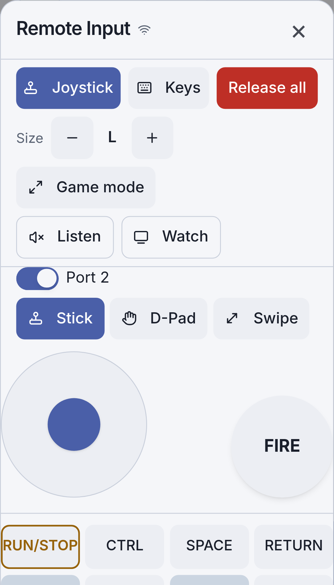

At the top of the sheet you choose between two modes, **Joystick** and **Keys**.

**Joystick** puts a stick and a large **FIRE** button on the screen. You can:

- choose how the stick behaves with **Stick**, **D-Pad**, or **Swipe**;
- send the signal to **Port 1** or **Port 2** with the port toggle (most games read Port 2);
- resize the controls from M up to XXL with the **Size** stepper (L by default);
- turn on **Autofire** and set its rate between 1 and 10 presses a second. Few C64 games ask for autofire, so the button is hidden until you turn on **Show Autofire button** in **Settings → Play and Disk**, where the rate also lives. It starts at 5.

A quick-keys bar beside the joystick keeps the keys you reach for mid-game one tap away: RUN/STOP, SPACE, RETURN, the function keys f1 to f8, the cursor keys, and the CTRL, C= and SHIFT modifiers. Nudge a menu or answer a prompt without leaving the joystick.

#### Game Mode

**Game Mode** is the app set up for playing: the picture and the sound as you last left them, everything else out of the way, and whichever controls suit how you are driving. It takes one action — the **Game** tile on Home, the **Game Mode** button on Play, or the `0` key from anywhere — and leaves you playing with nothing else to press. Starting a program, a cartridge or a disk can open it for you as well; **Settings → Play and Disk → Enter Game Mode when a game starts** decides.

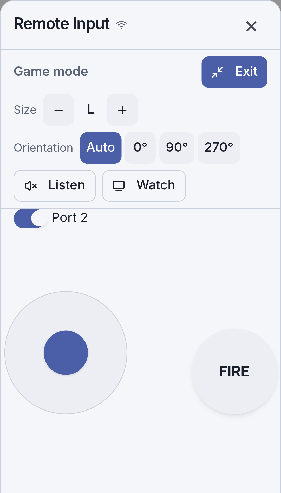

The on-screen joystick stays where it is until you pick up the keys. Play with the touchscreen and it is there; steer the game with a physical key and it steps aside so the picture has the whole screen, and touching it brings it straight back. Nothing else moves it — opening Game Mode with the `0` key does not count as playing on the keys. To decide yourself, press **Hide joystick** or **Show joystick** on the Game Mode toolbar for the game you are playing, or set **Settings → Play and Disk → On-screen joystick in Game mode** to **Visible** or **Hidden** instead of **Auto**.

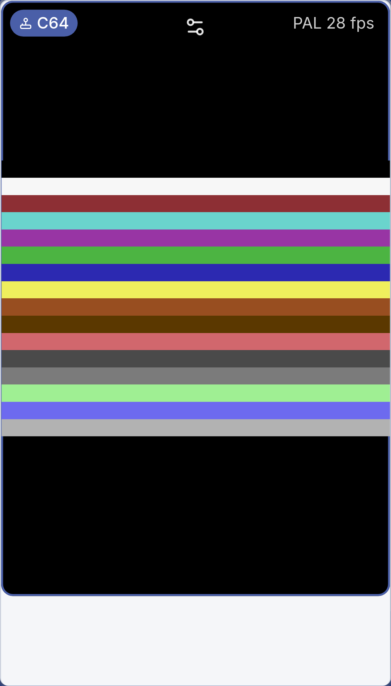

With the controls out of the way, three keys still reach everything. `#` brings RETURN, SPACE, the rest of the quick keys and the **Watch** and **Listen** switches up over the bottom of the picture, and puts them away again. `*`, or the menu key, changes between driving the C64 and adjusting the view. **Back** leaves. The floating **cog** button at the top of the picture brings the whole toolbar back, and **Show joystick** on that toolbar brings the on-screen joystick back.
Set the joystick to **Hidden** with the picture switched off and Game Mode has nothing to draw, so the space says so: it tells you the picture is off, and carries the **Watch** and **Listen** switches and the quick keys, all reachable without a touchscreen. The game keeps taking your keys the whole time. Turn **Watch** on and the picture takes the space instead.

Playing on a television? Turn **Watch** off once and Game Mode will keep opening without the picture — the controls take the space instead, so it is never blank.

#### Steering with a physical keyboard

**Settings → Play and Disk → Joystick keys** decides which keys steer. **Classic T9** uses 2, 4, 6 and 8 with 5 as fire, and adds the diagonals on 1, 3, 7 and 9. **Diamond (8-centered)** uses the four keys around 8, with 8 itself as fire. **Custom** lets you press the key you want for each direction. A hardware D-pad always steers as well, whatever you choose here. The mapping turns with your device, so you only ever set it up one way up, and the **Orientation** control in Game Mode's toolbar pins it — **Auto**, **0°**, **90°** or **270°** — where the sensor cannot tell.

Leave with **Exit**, at the top of the Game Mode toolbar, or your device's Back button. Both release everything you were holding. Closing the sheet also stops the picture and sound if Game Mode was what started them, and leaves them running if they were already on before you arrived.

**Keys** shows a full Commodore 64 keyboard, including the SHIFT, CTRL, and C= modifiers, SHIFT LOCK, the function keys f1 to f8, and RESTORE. Tap a modifier once to arm it for the next key, or hold it down to chord.

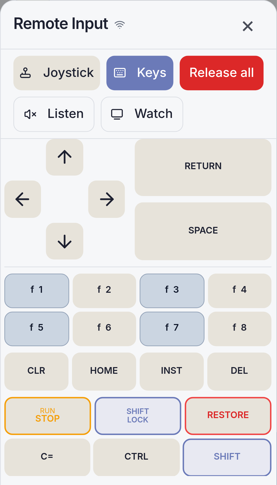

Full Joystick relay uses the device's `machine:input` REST endpoint. It needs recent firmware: a Commodore 64 Ultimate on firmware **1.2.0** or newer, or an Ultimate 64, Ultimate 64 Elite, or Ultimate 64 Elite II on firmware **3.15** or newer. The Ultimate-II cannot relay a joystick at all: as a cartridge it cannot change the state of the C64's CIA 1 input chip, so it has no `machine:input` support. On the Ultimate-II, and on any device running older firmware, the app automatically falls back to **Keys** only. That fallback types by placing characters into the C64's KERNAL keyboard buffer. It is ideal for BASIC, where you can type commands, `LOAD`, and `RUN`, but most games read the keyboard and joystick hardware directly and will not respond to it. RUN/STOP and RESTORE are also unavailable in the fallback. If the device is password-protected, enter its password in Settings first, because both Joystick and Keys need it.

Remote Input is careful never to leave a key or direction stuck on the real C64. Everything you are holding is released automatically when you close the sheet, switch mode or port, switch to another device, or send the app to the background. If a message does not reach the device, the header shows **Reconnecting…** until the next one gets through. And at any moment you can tap **Release All** to let go of every key and button at once.

_Availability: on by default. You can turn it off in Settings → Stable Features._

### File Sources

Everything you play or mount comes from a **source**, and each source keeps to its own picker so a wrong turn never lands you somewhere unexpected.

- **Local** — files and folders on the phone or tablet running the app.
- **C64U** — files on the connected Ultimate-family device, reached over FTP.
- **HVSC** — the High Voltage SID Collection, the definitive archive of C64 music. Choose it once from **Add items** and it fetches and indexes itself; a card at the foot of the Play page — closed until you open it — shows how far it has got, and lets you start, stop or reset it by hand. After that the app watches for updates on its own, and **Settings → HVSC** holds the mirror it downloads from and how often it looks. Browsing then shows song lengths and the tunes inside each file.
- **CommoServe** — an online archive you search by name, pulling disks and programs straight into a playlist or disk collection. Set its address in **Settings → Online Archive**.

### A Setting Just for One Item

Some titles want the machine arranged a particular way — a cartridge out, a different processor speed, a joystick in the other port. Rather than remember that every time, attach a device configuration file to the playlist item, and the app applies it before that item runs.

Open a playlist row's menu and choose **Review playback config**. If a `.cfg` file sits beside the program, shares its name, or lives in the same folder, the app has already found it and lists it as a candidate with how confident it is. Take one, or attach a file of your own from this device or from your C64.

The status line says where things stand: **No config**, **Candidates found**, **Config resolved**, **Config edited**, or **Config declined**. **Edit values** changes individual settings on top of the file, **Re-discover** looks again after you have moved files about, and **No config** tells the app to stop offering.

### Drives and Disk Images

C64 Commander gives your C64 two disk drives and a Soft IEC drive, and the **Disks** page has a card for each. Every card is a small control panel of its own.

Turn a drive on or off with its power control; a drive must be **on** before it can mount anything. Give it a **bus ID** so software can find it — the first drive is 8 by convention, and the device tells the app which numbers it will accept. Set its **type** to match the disk: a 1541 for D64 and G64, a 1571 for D71 (it reads D64 too), a 1581 for D81. This list also comes from the device, so a machine that offers more types shows them. **Reset** restarts the drive's own processor and nothing else, which is the gentlest way to bring a confused drive back without disturbing the C64.

You will rarely set any of this by hand. Starting a disk from Play switches the drive on if it is off, and changes its type if the current one cannot read the disk, telling you so as it goes.

Mounting is the heart of the page. Choose a disk from your collection, choose the drive, and mount it; **Eject** empties the drive again. A disk that already lives on the connected Ultimate-family device mounts in place. A **Local** disk is copied across first, and whatever a program writes to it returns to your own file when you eject, so high scores and saved games survive. A disk from the online archive has no file of yours to return to: its changes last only while the app is running, and ejecting it offers you **Save a local copy**.

There are two ways to start a disk once it is mounted, and **Settings → Play and Disk → Disk first-PRG load** chooses between them. **Classic KERNAL load** does what you would do at the keyboard: `LOAD"*",8,1` and `RUN`. **DMA** lifts the first program off the disk and writes it straight into memory, which is far quicker. A few loaders object to arriving that way, so if a disk that used to start no longer does, try the classic route.

For a title that spans several disks, keep the related images in one **group**. Adding a folder does this for you, from the file names or from the folder itself; move any stragglers by hand. A group puts **rotate** controls on the drive card, so when a program asks for the next disk you swap without going near the collection. The **Soft IEC** drive is the other way in: point it at a folder on the device and your C64 reads the loose files inside it directly, which suits a large collection that was never packed into disk images.

### Content Explorer

Content Explorer reaches the programs *inside* a disk image and starts them safely. Each part is optional: turn on the ones you want in **Settings**, and the rest stay out of the way. Searching inside images builds on Disk Explorer, so switch that on first.

#### Looking Inside a Disk

Mounting a disk image gives you the whole disk. Disk Explorer looks *inside* one, so you can pick a single program and start it. On **Disks**, open the menu of a `.d64`, `.d71` or `.d81` image and choose **Open (Disk Explorer)…**. The app lists every file on the disk with its type, its size in blocks, a padlock if it is write-protected, and — for a program — its load address.

Each launchable file offers three actions:

- **Run** loads the program into the C64's memory and starts it.
- **Load** loads it into memory without starting it — handy for monitors and development.
- **Mount & Load** mounts the whole disk, resets the machine, waits for BASIC, then types the LOAD and RUN for you — the right choice for titles that load in several stages.

Only a proper **PRG** program can be launched directly. Other file types show a short note explaining why they cannot, and an unclosed "splat" file — one that was never finished being written — cannot be launched either.

_Availability: on by default. You can turn it off in Settings → Stable Features._

#### Launch Safety

Some machines have a freezer cartridge configured, of the Action Replay or Retro Replay kind. On those, starting a program directly can land you in the cartridge's own menu instead, which looks exactly like the app misbehaving. Launch Safety heads that off: around a direct **Run** or **Load** it *parks* the cartridge, then puts it back. It never writes to the device's saved settings, so a power cycle always restores the cartridge, and where no cartridge is configured it does nothing at all. **Mount & Load** resets the machine in any case and is left alone. All of this happens by itself; there is nothing to press.

One further option sits in **Settings → Play and Disk**: **Answer cartridge boot menu after reset**. It starts off, and helps in one narrow case — a cartridge that puts up a boot menu when the machine resets, which would otherwise swallow the LOAD that Mount & Load types. Turn it on to choose the **menu key** (F1 to F8, RETURN, or SPACE; F7 to start with) and a **boot settle** time, given in milliseconds, between 1000 and 8000 (2800 to start with). The app then presses that key after the reset to clear the menu. Leave it off unless you have such a cartridge.

_Availability: on by default. You can turn it off in Settings → Stable Features._

#### Searching Inside Disk Images

By default, searching your media matches disk images by their file name. Turn on **Search inside disk images** — in **Settings → Play and Disk** — and search also reaches the programs *inside* your `.d64`, `.d71`, and `.d81` images. A match found inside a disk is shown as **DISK → PROGRAM**, so you can see exactly which disk holds the program you want, then Run or Load it just like any other.

_Availability: off to begin with. Turn it on in Settings → Experimental Features._

#### Creating a Blank Disk

Need a fresh disk to save to? On **Disks**, choose **New disk** to format a blank image on the device. Pick the **type** — D64 (1541), D71 (1571), D81 (1581), or DNP (CMD native) — give it a **file name**, and set a **disk label** of up to 16 characters, which follows the file name unless you change it. A D64 lets you choose the number of **tracks**, 35 to 41, and 35 is the usual answer; a DNP needs one between 1 and 255; D71 and D81 need none. Last, type the **storage folder** on the device, which starts at `/USB0` — the top-level `/` is a list of drives and holds no files. **Create & mount** builds the image, adds it to your collection, and mounts it in Drive A ready to write to.

_Availability: on by default. You can turn it off in Settings → Stable Features._

### RAM Snapshots

A RAM snapshot is a copy of what is in your C64's memory right now, saved onto your phone or tablet so you can put it back later. It is the nearest thing the app has to a save-and-restore button for programs that have none of their own.

Both live in **Home → Quick Actions**: **Save RAM** to capture, **Load RAM** to put it back. The device must be connected and idle. The app pauses the machine while the memory crosses the network and starts it again afterwards, so a running program carries on undisturbed.

When you tap **Save RAM**, the app asks which region of memory to capture:

- **CPU + RAM snapshot** freezes the running program and stores the whole 64K of memory together with the processor's registers, so it can pick up exactly where it left off. It suits BASIC and unhurried programs; a fast game may not resume cleanly. Not every machine or every program will give up its processor state, and when that happens the app says so and points you at a Program snapshot instead. Once in a while a program stays frozen afterwards, and the app tells you that too — restore it, or reset the machine.
- **Program Snapshot** stores almost all of memory (everything but the stack). A good all-round choice.
- **Basic Snapshot** stores just the BASIC program and its variables.
- **Screen Snapshot** stores the current screen and its colors.
- **Custom Snapshot** lets you type the exact address ranges you want.

Snapshots live on your phone or tablet, not on the C64. Each is named from its type and the date and time, and if something is playing its title becomes the label. Add or change a **Comment** on any snapshot afterwards. The app keeps a hundred and drops the oldest once that fills.

**Load RAM** opens your snapshot library. Filter it by name or by type, then tap a snapshot to put it back. The app asks you to confirm, because restoring overwrites the matching memory on the C64. It writes only the bytes the snapshot holds, and leaves the CIA timers alone so the cursor keeps its usual blink. A CPU + RAM snapshot resumes the program where it stopped; where that proves impossible the app restores the memory alone and says so. Note that a CPU + RAM snapshot is filed under **Program** in the library, since that is what it holds. The same library edits comments and removes snapshots you have finished with.

_Availability: on by default. You can turn it off in Settings → Stable Features._

### The Virtual Printer

Your C64 prints over the serial bus, and the machine provides the printer itself, so there is no separate box to buy or connect. **Home → Printers** turns it on, picks the **emulation** — a Commodore MPS, say — and sets the **bus ID**, the **output type**, the **ink density** and the character sets. **Reset** clears the printer and starts a fresh page.

One more control, **Flush/Eject**, finishes the current page and sends it on. It goes through the Telnet menu service, so it appears once you turn on **Home printer shortcut actions** in Settings → Experimental Features.

### Configuration and Saving

Two ideas make the configuration tree easy to live with: where a change goes, and how to keep it.

Every change — on Home, on Disks, or in Config — reaches the running device at once, and almost all of them take effect there and then; a few, the cartridge choice among them, wait for the next reset. But the device holds two copies of its settings: the **live** ones it is using now, and a **flash** copy it reloads at power-on. A change is live instantly; it survives a reboot or power cycle only once it reaches flash.

The **Config** card on Home decides which. **Save** writes the live settings into flash now — reach for it when you have left **Keep device settings after a restart** off and want this one change to last. Beside it are **Load** from flash, **Reset** to the factory settings, and **Revert**, which undoes the changes you have made since the last save. The app also keeps its own named **configuration snapshots** on the phone or tablet, apart from the device's flash: save the setup you like, then load it back whenever you want the whole thing at once.

### Switching Between Devices

If you have saved more than one device, the Device Switcher lets you hop between them without opening Settings.

Open it in any of three ways, whenever more than one device is saved:

- **Long-press the header badge** (a short tap opens Diagnostics instead).
- Press **`#`** on a hardware keyboard or keypad.
- Choose **Switch device** in the Quick Menu.

The switcher checks each saved device for you and looks again every ten seconds while it is open. Each row shows the name, a status pill — **Selected**, **Verifying**, **Offline** or **Mismatch** — a health badge, and a short line such as how many checks passed or when the device was last seen. The device you are using is highlighted. Tap the chevron to open a row and read the checks one by one, which tells a sleeping device from one that is genuinely unreachable. To keep the switcher gentle on machines it is only glancing at, these rows check the web and FTP services and read a setting without writing one; the full round of checks, Telnet included, belongs to **Run health check** in Diagnostics.

Tap a device to switch to it. Before anything else the app safely lets go of any input you were holding on the old device, stops tracking its playback and pause state, retargets to the new device's address and ports, and then checks that the new device answers. While that happens the target shows a **Verifying** pill; once it responds, it becomes the active device.

Saved devices are created and edited in **Settings → Connection**, under **Saved devices**. Add one, edit its **Device name**, **Hostname / IP** and its **HTTP**, **FTP** and **Telnet** ports, give it a **Network Password**, or delete one you have finished with. **Save & Connect** waits for the device to answer before keeping it, so the list does not fill with machines that are not there. With a single device saved there is nothing to switch to, and the switcher stays out of your way.

### Reading Diagnostics

Diagnostics is your window into the health of the connection and everything the app has recently done. It slides up from the bottom of the screen. Reach it by tapping the header badge, pressing `*`, choosing **Diagnostics** in Settings, or tapping any error notification.

The panel has three parts, from top to bottom:

- The **health header** shows the state — Healthy, Degraded, Unhealthy or Offline — which device it refers to, and when it was last checked. Tap **Run health check** to test the connection now. The check tries the web, FTP and Telnet services, then three signals from the C64 itself: CONFIG, RASTER and JIFFY. Each reports its own result and timing, alongside the overall latency. Open the header to read them one by one.

The CONFIG check does more than read. It nudges a live setting by a hair, reads it back to confirm the device applied the change, then puts the original value back. On a machine with lights — the case light, or the keyboard — you will see them **pulse once** as it runs, a visible heartbeat that says the connection is alive. On a machine without lights it nudges a mixer volume instead, for about a twelfth of a second.
- The **Filters** bar says how much of the activity you are looking at and opens the filter editor. Filter by device, by kind of activity (Problems, Actions, Logs, Traces), by what raised it (App, REST, FTP, Telnet), or by severity (Errors, Warnings, Info). The editor also holds five one-tap shortcuts: **Errors only**, **Problems only**, **REST**, **FTP**, and **Reset**.
- The **Activity** list gathers problems, actions, logs, and traces together. Tap any row to expand it for the full details.

The three-dot menu in the corner holds the rest: connection details, health history, latency, the REST, FTP and Config heat maps, config drift, decision state, and a way straight to **Manage devices** — alongside Share and Clear. To send any of it on for help, see the next section.

### Sharing a Diagnostics Report

When something goes wrong, the most useful evidence is usually the last handful of actions before the failure, so capture it before you clear anything or restart the app. The activity list is rebuilt fresh each time you open Diagnostics, and **Clear all** wipes it for good.

To share a report about a recent error:

1. Open **Diagnostics** (tap the header badge, press `*`, or tap the error notification).
2. Tap **Run health check** so the report carries a fresh connection test.
3. Use the **Errors only** or **Problems only** filter to confirm the failure is captured.
4. Open the three-dot menu and choose **Share all** for the full report, or **Share filtered** for a plain list of the rows you filtered to.
5. Pick an app in your device's share sheet (mail, chat, or notes) to send or save the report.

**Share all** produces a small ZIP file holding the app's logs, traces, errors and recent actions, a health snapshot, and details of your app version, your phone, and the active C64 — its name, host address and firmware. Your network password is never in it. Its hostname or IP address can be, so send it only to people you trust, or to support.

Use **Clear all** afterwards for a clean slate. It asks you to confirm, then shows **Diagnostics cleared** when done.

## Safe Device Use

C64 Commander uses normal REST, FTP, and Telnet requests, but the connected Ultimate-family device firmware can still become unresponsive under some network conditions. The app reduces risk by pacing traffic and surfacing errors.

Good habits:

- avoid repeating the same command while the device is already busy;
- leave Device Safety on Auto, and only raise concurrency once the device and network have proved steady;
- drop to Conservative for older or unknown firmware, Wi-Fi, or a first setup;
- power-cycle the device if the web, FTP and Telnet services all stop answering while ping still works.

**Device Safety** in Settings decides how hard the app pushes the device. Its five modes trade speed for caution: they cap how many requests run at once, pace them, and set how long the app remembers an answer and how long it waits after a failure. **Auto** reads the model and the firmware and picks for you, and is the one to leave it on. The full list is in [Device Safety Modes](#device-safety-modes). Choosing **Relaxed** asks you to confirm, and leaves a banner while it is in force.

The same chapter also opens up every individual number behind those modes — discovery windows, timeouts, how many requests may run at once, cooldowns, backoff, and the circuit breaker. Leave them alone unless you are chasing a particular fault.

The CPU speed setting can briefly drop the network while the device applies a clock change. Wait for the app to reconnect.

## Troubleshooting

### Discovery finds nothing

- Confirm both devices are on the same network.
- Check that Web Remote Control Service is enabled.
- Enter the hostname or IP address manually.
- Try the IP address if the hostname does not resolve.

### Password required

Enter the network password configured on the connected Ultimate-family device. If the saved password stops working, the app asks again.

### File browsing fails

- Confirm FTP File Service is enabled.
- Check the FTP port in Settings.
- Reconnect from Settings if the device was restarted.

### Playback does not start

- Check that the device is connected and healthy.
- Confirm the selected file type is supported.
- For local files, reselect the source if Android storage permission was lost.
- For disk images, confirm the target drive is available.

### Controls look disabled

Some controls appear only when the connected device reports support. Others are disabled while an operation is running or when no matching item exists.

### Remote Input joystick is unavailable

The **Joystick** tab appears only when the connected device supports the `machine:input` endpoint. **Keys** is always available.

- Confirm the firmware supports it: a Commodore 64 Ultimate on 1.2.0 or newer, or an Ultimate 64 on 3.15 or newer. The Ultimate-II has no joystick relay.
- If the device is password-protected, enter its password in Settings; both Joystick and Keys need it.
- Otherwise the app stays in **Keys** mode and types through the C64 keyboard buffer, which suits BASIC but not most games.

### Device stops answering

Open Diagnostics if possible and check recent REST/FTP/Telnet activity. If HTTP, FTP, and Telnet all refuse connections while ping still works, manually power-cycle the connected Ultimate-family device.

## Appendices

The rest of this guide is reference material for when you want the exact answer. Skim the tour to get going, then come back here for the specifics.

### Feature Reference

Preferred locations are marked first.

| Feature | Where to find it | Notes |
| --- | --- | --- |
| Connect to a device | **Startup discovery**, Settings → Connection | Use startup discovery first. Use Settings for later edits. |
| Manual host/IP entry | **No C64 found** at startup, Settings → Connection | Startup prompt is fastest on first run; Settings is best for saved-device maintenance. |
| Network password | **Startup prompt or auth popup**, Settings → Connection | The app asks only when needed. |
| Switch saved device | **Header badge long-press / `#`**, Settings → Connection | Use Device Switcher for fast switching; Settings for editing. |
| Menu / Pause / Reset / Reboot | **Home → Quick Actions** | The everyday controls. |
| Power Off | **Home → Quick Actions** | Shown where the device can do it. Turning it back on needs the machine itself. |
| Power Cycle | **Home → Quick Actions** | Off to begin with. Turn it on in Settings → Experimental Features. |
| Clear-RAM reboot | **Home → Quick Actions** | Off to begin with. Turn it on in Settings → Experimental Features. |
| Save / Load RAM | **Home → Quick Actions** | On by default. You can turn it off in Settings → Stable Features. |
| Game Mode | **Home → Quick Actions**, Play (while an item plays), `0` | The first tile in Quick Actions, labelled **Game**. Opens the controller with the picture and sound as you last left them. |
| Remote Input | **Home → Quick Actions**, Play (while an item plays) | On by default. You can turn it off in Settings → Stable Features. Joystick needs firmware 1.2.0 or newer on a Commodore 64 Ultimate, or 3.15 or newer on an Ultimate 64; otherwise only Keys are available. |
| CPU speed and turbo | **Home → CPU & RAM**, Config | Home is preferred for common changes. |
| Video mode and scan lines | **Home → Video**, Config | Home is preferred. |
| Joystick, serial bus, cartridge, user port | **Home → Ports**, Config | Home is preferred. |
| Case and keyboard lights | **Home → Lighting**, Config | Shown for machines that have them. |
| Drive power, bus, type, reset | **Disks**, Home → Drives | Disks for the drives themselves; Home for a quick look. |
| Mount and eject disks | **Disks**, Home → Drives | Disks shows the collection most clearly. |
| Disk groups and rotation | **Disks** | Groups are assigned as you add a folder; rotate from the drive card. |
| Soft IEC folder | **Disks** | Read loose files from a folder on the device, with no disk image at all. |
| Printer controls | **Home → Printers**, Config | Home is preferred. |
| SID mixer | **Home → Audio**, Config → Audio Mixer | Home is preferred for live mixing. |
| Streams | **Home → Streams**, Config | Visible when the device exposes streaming support. |
| Save/load device config | **Home → Config actions** | Save writes the current settings to flash. Turn on Keep device settings after a restart to do it automatically. |
| App-stored config snapshots | **Home → Config actions** | Named snapshots kept by the app, apart from the device flash. |
| Disk Explorer (launch a program inside a disk) | **Disks → disk menu → Open (Disk Explorer)** | On by default. You can turn it off in Settings → Stable Features. |
| Create a blank disk | **Disks → New disk** | On by default. You can turn it off in Settings → Stable Features. |
| Search inside disk images | **Settings → Play and Disk** | Off to begin with. Turn it on in Settings → Experimental Features. |
| Launch Safety (cartridge parking) | Automatic; boot-menu answer in **Settings → Play and Disk** | On by default. You can turn it off in Settings → Stable Features. |
| Live View (hear and see the machine) | **Home → Live View**, Play, Remote Input | On by default. You can turn it off in Settings → Stable Features. |
| Live View — Listen | **Home → Live View**; switch in Settings → Experimental Features | On by default. You can turn it off in Settings → Experimental Features. |
| Live View — Watch | **Home → Live View**; switch in Settings → Experimental Features | On by default. You can turn it off in Settings → Experimental Features. |
| Live View checks (A/V sync, tap latency, tone ladder) | **Home → Live View** | On by default. You can turn it off in Settings → Experimental Features. |
| Advanced config file actions | **Home → Config actions** | Off to begin with. Turn it on in Settings → Experimental Features. |
| Advanced drive shortcuts | **Home → Drives** | Off to begin with. Turn it on in Settings → Experimental Features. |
| Advanced printer shortcuts | **Home → Printers** | Off to begin with. Turn it on in Settings → Experimental Features. |
| Full configuration tree | **Config** | Use search, open a category, edit rows. |
| Add playlist items | **Play → Add items** | Sources: Local, C64U, HVSC, CommoServe. |
| Playback controls | **Play** | Play, stop, pause, previous and next, shuffle, repeat, reshuffle, volume. |
| Sleep timer, default duration, songlengths file | **Play** | Beneath the transport controls. |
| Per-item playback config | **Play → item menu** | Apply a device configuration before one playlist item runs. |
| HVSC preparation | **Play → Add items**, card at the foot of Play | On by default. You can turn it off in Settings → Stable Features. Settings → HVSC holds the mirror and the update check. |
| SID Radio | **Play → SID Radio** | Endless stations of similar tunes. Settings → SID Radio tunes it. |
| CommoServe | **Play → Add items**, Disks → Add disks, Settings → Online Archive | On by default. You can turn it off in Settings → Stable Features. |
| Demo Mode | **Settings → Connection** | Off to begin with. Turn it on in Settings → Stable Features. |
| Background playback scheduling | **Play**, Android app permissions | Always on in this edition. |
| Display profile, theme, style, text size, card descriptions, orientation | **Settings → Appearance** | Screenshots in this manual use the medium profile. |
| Settings transfer (export and import) | **Settings → Diagnostics** | App settings, feature switches and safety tuning. Saved devices and passwords stay behind. |
| Notification style and duration | **Settings → Notifications** | Show everything, or errors alone. |
| Device Safety | **Settings → Device Safety** | Leave it on Auto. It starts Conservative while it identifies the device and firmware, then chooses the appropriate profile. See Device Safety Modes. |
| Keep device settings after a restart | **Settings → Device Safety** | Off by default: changes apply at once but a power cycle undoes them. See Making settings stick. |
| Screen colors (palette) | **Home → Video → Screen colors** | Apply to this device, the C64, or both. |
| Diagnostics | **Header badge / `*`**, Settings → Diagnostics | Badge is preferred for fast access. |
| Logs, traces, errors, health checks | **Diagnostics** | Use filters and Share for support. |
| Built-in help | **Docs** | Good for quick reminders inside the app. |

### Keyboard and Directional Input Reference

On by default. You can turn it off in Settings → Experimental Features. Directional navigation answers to D-pad keys, arrow keys, and hardware keyboards. While you are steering by keys, a bar along the bottom shows where you are and what the keys under your thumb will do: Back, Exit, Done or Close on the left; Open, Activate, Edit, Select, Toggle, Adjust or Switch in the middle; Menu on the right where there is one; and, on Home and Play, a reminder that `0` starts Game Mode.

#### Directional Pad

| Key | What it does |
| --- | --- |
| Up / Down | Move through the current page, card, list, or dialog in reading order; the tab bar comes last. |
| Left / Right | Adjust sliders, tabs, and segmented controls. Otherwise move to a nearby control. |
| OK / Center / Enter | Enter a group, open a select, press a button, or toggle a switch. |
| Back / Escape | Close the top dialog, leave a field, leave a group, or go back. |
| Menu / Context Menu | Open the focused item menu; if none exists, open the Quick Menu. |

The rule is simple: **OK goes in, Back comes out**. On a desktop keyboard **F1** and **F2** act as soft keys, and F1 follows the same way out as Back; on a keypad handset F1 and F3 are the transport keys instead (below).

#### Number Keys

Outside text fields — and outside any open dialog or sheet, which keep the keys for themselves — number keys jump to pages, and **0** goes straight to playing:

| Key | Page |
| --- | --- |
| 1 | Home |
| 2 | Play |
| 3 | Disks |
| 4 | Config |
| 5 | Settings |
| 6 | Docs |
| 7 | Search |
| 0 | Game Mode |

`7` opens search, and it keeps working even if you turn directional navigation off — search is how you find your way around when the keys are not doing it for you.

#### Transport Keys

| Key | What it does |
| --- | --- |
| F1 | Play or pause, from any page |
| F3 | Next tune, from any page |

Press either from anywhere and the app goes to Play and does it there. **The Commodore key is not bound yet.** The exact code a given handset sends for it is not known, and guessing would risk taking over a key that already works; **Diagnostics → Key Explorer** reports what any key you press really sends, which is what that decision is waiting on.

#### Star and Pound

| Key | Outside text fields | Inside text fields |
| --- | --- | --- |
| `*` | Open Diagnostics | Type `*` when the field accepts it |
| `#` | Open Device Switcher | Type `#` when the field accepts it |

#### Quick Menu

There are two ways in, and each offers what that way in calls for. Press **Menu** when the selected control has no menu of its own: the Quick Menu then lists the six pages, each with the number key that reaches it directly, followed by Game Mode on `0`, Diagnostics on `*`, and the Device Switcher on `#` when more than one device is saved. Tap the three-dot **Quick Menu** button instead — every page carries one in the top bar, beside the health badge — and the page jumps are left out, since the tab bar is already in front of you; what is left is the actions for the page you are on.

**Search** is the first entry either way in, because someone opening this menu is usually looking for something rather than for a page.

On a page built from cards, both ways in also offer **Expand all sections**, **Collapse all sections**, and **Show card descriptions**. Both section entries are always listed, so the one you want is in the same place every time; whichever of the two would do nothing is shown but unavailable.

### File and Source Reference

| Source | Used in | Meaning |
| --- | --- | --- |
| Local | Play, Disks | Files and folders available on the device running the app. |
| C64U | Play, Disks | Files on the connected Ultimate-family device through FTP. |
| HVSC | Play | On by default. You can turn it off in Settings → Stable Features. SID library browsing after preparation. |
| CommoServe | Play, Disks | On by default. You can turn it off in Settings → Stable Features. Online archive search. |

Supported playback/import types include SID, MOD, PRG, CRT, D64, G64, D71, G71, and D81. Disk collection workflows focus on disk images: D64, G64, D71, G71, and D81.

| Format | Kind | Notes |
| --- | --- | --- |
| SID | Music | One or more tunes; durations shown when songlength data is available. |
| MOD | Music | Amiga-style tracker module. |
| PRG | Program | A single loadable program. |
| CRT | Cartridge | Cartridge image; started as if you inserted a cartridge. |
| D64, G64 | Disk | 1541 single-sided disk image. |
| D71, G71 | Disk | 1571 double-sided disk image. |
| D81 | Disk | 1581 3.5-inch disk image. |

### Network Ports and Services

These are the defaults the app expects. Change them per device in **Settings → Connection** if yours differ.

| Service | Default port | Used for |
| --- | --- | --- |
| Web Remote Control (REST) | 80 | Control, status, and configuration — required. |
| FTP File Service | 21 | Browsing and transferring files, playlists, and disks. |
| Telnet Remote Menu | 23 | Advanced menu-backed actions, when those are enabled. |

### Device Safety Modes

Set the mode in **Settings → Device Safety**. Higher concurrency is faster but pushes the device harder; the presets also tune caching, cooldowns, and backoff.

| Mode | Requests at once | Use it when |
| --- | --- | --- |
| Auto | Chosen for you | The one to leave it on. Reads the model and firmware and picks Conservative or Balanced. Anything it has not yet identified, and every Ultimate-II, stays on Conservative. |
| Relaxed | Up to 3 | The device and network have proved fast and steady, and you accept the higher risk. Asks you to confirm. |
| Balanced | Up to 2 | A Commodore 64 Ultimate on firmware 1.2.0 or newer, or an Ultimate 64-family device on 3.15 or newer. |
| Conservative | 1 at a time | A first setup, Wi-Fi, or firmware you do not yet trust. The safest of the five. |
| Troubleshooting | 1 at a time | You are chasing a fault and want the extra debug logging. |

### Drive Types and Disk Formats

Set a drive's type on the **Disks** page to match the disk you are mounting. The list comes from the connected device, so a machine that offers more types will show them.

| Drive type | Disk images | Description |
| --- | --- | --- |
| 1541 | D64, G64 | Single-sided 5.25-inch drive, and the one most software expects. |
| 1571 | D71, G71, D64 | Double-sided 5.25-inch drive. Reads a 1541 disk as well. |
| 1581 | D81 | High-capacity 3.5-inch drive. |

### Snapshot Types and Memory Ranges

**Save RAM** offers these capture types. The app keeps up to 100 snapshots on your phone or tablet and drops the oldest once that fills.

| Snapshot | Captures | Memory range |
| --- | --- | --- |
| CPU + RAM | All of memory plus the processor registers, so the program can pick up where it stopped. Filed under Program in the library. Some machines and some programs decline; the app says so and suggests a Program snapshot. | $0000–$FFFF + registers |
| Program | Almost all of memory, skipping the stack. A good all-round choice. | $0000–$00FF, $0200–$FFFF |
| Basic | The BASIC program and its variables. | $002B–$0038, $0801–$9FFF |
| Screen | The current screen and its colors. | VIC bank, $D000–$D02E, $D800–$DBFF, $DD00–$DD01 |
| Custom | Exactly the address ranges you type. | User-defined |

### Health Check Probes

Run a health check from **Diagnostics** to test the connection. Each probe reports its own result and timing.

| Probe | What it checks |
| --- | --- |
| REST | The Web Remote Control service answers. |
| FTP | The FTP file service answers. |
| Telnet | The Telnet menu service answers. |
| CONFIG | Writes a live setting, reads it back, and restores it, proving the device applies changes. A machine with lights pulses them once; one without nudges a mixer volume instead. |
| RASTER | The VIC-II raster line is moving, so the video chip is running. Recorded as skipped where the device does not expose it. |
| JIFFY | The KERNAL jiffy clock is ticking, which also reports the machine's uptime. |

### Status and Safety Reference

| Signal | Meaning | Best next step |
| --- | --- | --- |
| Healthy badge | The selected device is responding. | Continue normally. |
| Degraded badge | Some check or recent activity suggests trouble. | Open Diagnostics. |
| Unhealthy badge | The selected device is not responding correctly. | Run a health check; verify network services. |
| Offline state | No live connection is active. | Use discovery, manual host entry, or Settings → Connection. |
| 401/403 password prompt | The device requires its network password. | Enter the network password set on the device. |
| TCP refused while ping works | The network stack on the device may be stuck. | Stop traffic and power-cycle the device. |
| CPU-speed network drop | Firmware may briefly drop network while applying clock changes. | Wait for reconnect before changing more settings. |
