# C64U Remote Manual

Play SID music, run games and demos, mount disks, and control a Commodore 64 Ultimate from one app.

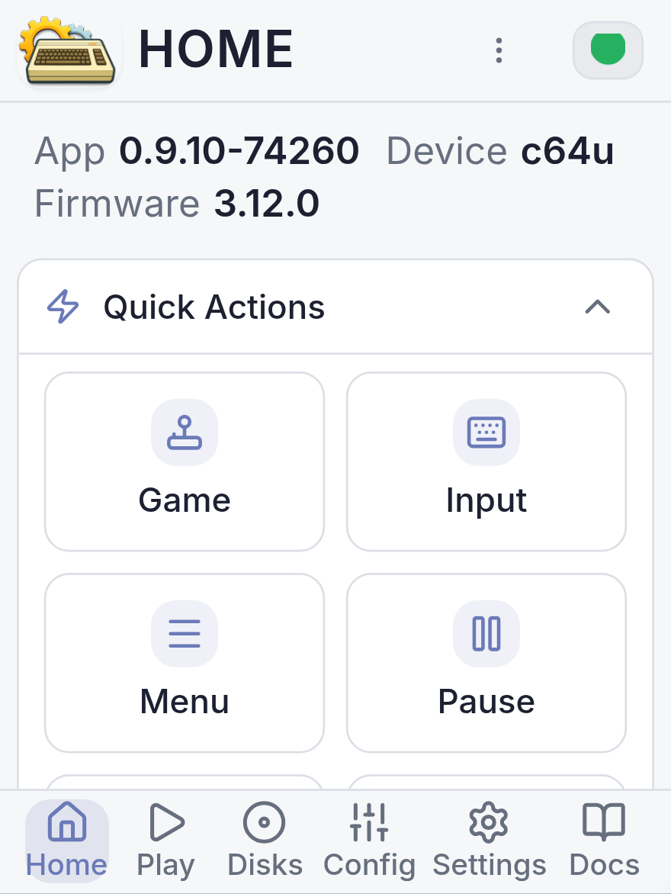

## Table of Contents

- [Welcome](#welcome)
- [Before You Start](#before-you-start)
- [First Connection](#first-connection)
- [Your First Tour](#your-first-tour)
- [Everyday Flows](#everyday-flows)
- [In Depth](#in-depth)
- [Safe Device Use](#safe-device-use)
- [Troubleshooting](#troubleshooting)
- [Appendices](#appendices)
  - [Feature Reference](#feature-reference)
  - [Keyboard and Directional Input Reference](#keyboard-and-directional-input-reference)
  - [File and Source Reference](#file-and-source-reference)
  - [Network Ports and Services](#network-ports-and-services)
  - [Device Safety Modes](#device-safety-modes)
  - [Drive Types and Disk Formats](#drive-types-and-disk-formats)
  - [Snapshot Types and Memory Ranges](#snapshot-types-and-memory-ranges)
  - [Health Check Probes](#health-check-probes)
  - [Status and Safety Reference](#status-and-safety-reference)

## Welcome

C64U Remote puts your C64 at your fingertips: its music, its games, its disks and its settings, over your own home network.

- **It plays.** SID music, games, demos and disk images, from your own files, from the machine itself, or from the great free archives.
- **It controls.** Reset, reboot, the menu, the drives, the printer, the SID mixer, memory, and every setting the machine has.
- **It explains.** When something will not answer, health checks, logs and traces show what happened and where.

New to the app? Start with the next three chapters. They get you connected and then walk you through it one page at a time. Later, when you know what you want, the reference chapters at the back will find it for you quickly.

## Before You Start

### Your C64 Ultimate

C64U Remote is made for controlling a Commodore 64 Ultimate on your local network. It runs on a compact, keypad-first phone, which this guide simply calls your phone.

Three things work together: your phone, the Commodore 64 Ultimate, and the network between them.

First, put the two on the same Wi-Fi or wired network. Then, on the machine itself, open **Network Services & Timezone**.

Turn on the services the app uses:

- **Web Remote Control Service** carries almost everything: the controls, the status, the settings. The app cannot work without it.
- **FTP File Service** carries the files, so the app can browse the machine, build playlists and mount disks.
- **Telnet Remote Menu Service** carries a few extra actions that reach into the device menu. Turn it on if you want them.

Now jot down the IP address shown under **Wired Network Setup** or **WI-FI Network Setup**. You will need it if the app cannot find the Commodore 64 Ultimate by itself.

## First Connection

Next, start C64U Remote. If no saved device is reachable, it scans the local network for a Commodore 64 Ultimate.

If it finds one, the app opens **Choose your C64**:

1. Choose **Use** to connect now.
2. Choose **Save** to keep the device for later.
3. If the device has a password, enter its network password when asked.

If it finds nothing, C64U Remote opens **No C64 found** so you can set it up by hand.

Enter a hostname such as `c64u` or an IP address such as `192.168.1.64`, then choose **Connect**. If the Commodore 64 Ultimate asks for a password, the same dialog asks you for it before saving and connecting.

Now look at the top right of the screen. A green badge there means your C64 is answering. You are ready to go. To scan again later, use **Settings → Connection → Discover devices**.

### Starting With No Network

Start C64U Remote on a phone with no network at all (airplane mode, or Wi-Fi and mobile data both off), and there is nothing to scan for. Instead, the app offers **Demo Mode**: a built-in simulation of a Commodore 64 Ultimate. Choose **Continue in Demo Mode** and the badge reads **DEMO**, so you always know which machine you are looking at.

Try anything the simulator answers for: Home, the configuration, disks and drives, the playlist, Remote Input, the HVSC collection, and Live View, which shows the simulated screen and plays its sound. There is no real 6502 inside, so a program shows a demonstration screen, and a tune plays on your phone's own SID engine.

Close the offer, or choose **Try again** while there is still no network, and the app stays offline without offering Demo Mode again that session. Tunes stored on your phone still play there. When your phone joins a network where your C64 Ultimate answers, the app connects by itself. **Use the simulated device**, behind the connectivity badge, brings Demo Mode back whenever you like.

When you do have hardware, connect to it from **Settings → Connection**. Once the app has reached a real device, it never slips into Demo Mode on its own for the rest of that session. If the network goes away, the device is shown offline, and the app reconnects when the network returns.

The offer keeps coming until you have seen it once and a C64 Ultimate has connected. After that, the app assumes you are simply away from your machine: it shows the device offline without asking, and connects again when it can. **Use the simulated device** and **Preview Demo Mode** still start Demo Mode when you want it.

## Your First Tour

Let's take a walk through the app, one page at a time. First come two things you can reach from anywhere: the badge in the corner, and search.

### The Header Badge

The badge in the top right corner tells you how your C64 is doing: healthy, degraded, unhealthy, or offline. Tap it to open Diagnostics. If the app is offline, the same tap also tries to reconnect.

If you have saved more than one device, the badge does a little more. It shows the name of the device you are using. When the app connects to a device, or you switch to another one, it tells you for a few seconds which device it has reached. To change devices, long-press the badge or press `#`. This opens **Switch device**.

### Finding Your Way

Search covers the whole app: every page, every card, every app setting, your disk collection, the HVSC archive, and the tunes you have liked or played lately. Type two or three letters and pick what you want.

Your machine's own settings join in once the Config page has read them. So if you are hunting for a device setting by name, open **Config** first.

There are three ways to open search:

- Tap the **search field** at the top of Home.
- Choose **Search**, the first entry of the **Quick menu**.
- Press **`7`**, which works even with **Keyboard and keypad navigation** switched off.

Keep typing while you look. Up and Down move through the results without touching your text, OK opens the selected result, and Back closes search. The best match comes first, so typing `radio` offers **Start SID Radio** ahead of any tune with that word in its title.

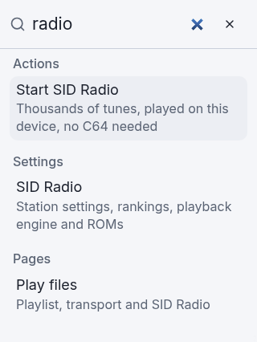

**A result you cannot use yet is still listed, and says what it needs:** "Needs a connected C64 Ultimate", "Needs the HVSC music collection installed", "Live View is turned off in Settings". Pick it, and you land on the setting that turns it on.

Search finds your music too. Pick a tune from the HVSC collection, and **Find a tune** opens on the Play tab with that title filled in.

With the box empty, search suggests four good places to start, then lists your recent searches.

### The Tour

The first time you open C64U Remote, it offers a short guided tour inside the app itself. It visits each page in turn, points at one thing, and explains it in a line or two.

**Next** and **Back** move you along, **Skip** ends the tour, and a counter shows how far you have come. On a keypad, Left and Right are Back and Next, OK is Next, and the Back key leaves. Stop whenever you like.

To take it again, use the card at the top of **Docs**, or go to **Settings → About → Take the tour**. If you took the tour before connecting your C64, Home offers the steps you missed as soon as your machine answers.

### Home

Home groups the day-to-day controls.

At the top is the search field, and under it **Quick Actions**, a grid of tiles in four bands:

- **Watch** first: Live, Game and Input.
- **Listen** next: Radio, Last and Recent.
- Then the everyday controls: Menu, Pause/Resume, and **Backup** and **Restore** for the machine's memory.
- Last come **Reset** and **Power**, which interrupt whatever your C64 is doing.

Three tiles work with no C64 at all. **Radio** starts a SID Radio station of thousands of tunes, played on this device. **Last** picks up your last tune where it stopped, and names it underneath. **Recent** takes you back to anything you have opened before.

**Live** does need a machine. It takes you to the card that brings the C64's picture and sound into the app. A tile you cannot use yet is still there, grayed out, telling you what it needs.

**Game** and **Input** turn the app into a joystick and keyboard for the C64. See [Remote Input](#remote-input).

**Power** opens a sheet with **Reboot** and, where your device supports it, **Power Off**. Those, and **Reset**, ask you to confirm first.

The sheet also holds **Reboot (Clr Mem)**, which wipes memory on the way, and **Power Cycle**. Both work through the Telnet menu service, so switch Telnet on at the machine first. To hide them, turn off **Home clear-RAM reboot action** and **Home power cycle action** in **Settings → Experimental Features**.

Just below sits the **Live View** card, which brings the running machine's sound and picture into the app. It has a chapter of its own: see [Live View](#live-view).

The rest of Home is a stack of cards. Tap a header to open or close one.

- **CPU & RAM**: the processor speed, turbo behavior and the RAM expansion.
- **Ports**: the joystick swap, the serial bus, the cartridge preference and the user port.
- **Video**: the output mode, resolution and scan lines.
- **Audio**: the SID mixer's channel strips.
- **User Interface**: the interface type, navigation style and Color Scheme of the machine's own menus.
- The case and keyboard lights.
- Then drives, the printer, streams, and **Config**, which saves and loads the machine's settings. See [Configuration and Saving](#configuration-and-saving).

The app remembers which cards you left open. **Expand all sections** and **Collapse all sections** in the Quick menu do the whole page at once. Everything here is in Config too; these cards just save you the search.

At the foot of the page, the system strip shows which app build, device and firmware you are on. Check it before an upgrade, or when something seems wrong.

**With no C64 connected**, Home rearranges itself. The search field stays, and so do Radio, Last, Recent and Live, with a card below them that explains how to connect. Live needs a machine, so it is grayed out and reads "Needs a connected C64 Ultimate".

The machine's own cards stay as empty titles under a line that says why, and the system strip shows only the app version.

The moment your C64 answers, your open cards are open again. A brief network hiccup will not shuffle the page under you either: the app waits a few seconds before rearranging, and snaps back the instant your machine returns.

### Play

Play is for building a playlist and running it.

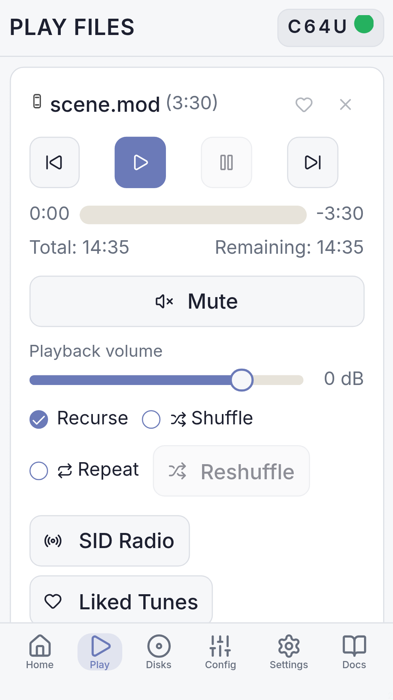

Choose **Add items** (it reads **Add more items** once the list has something in it), then choose a source.

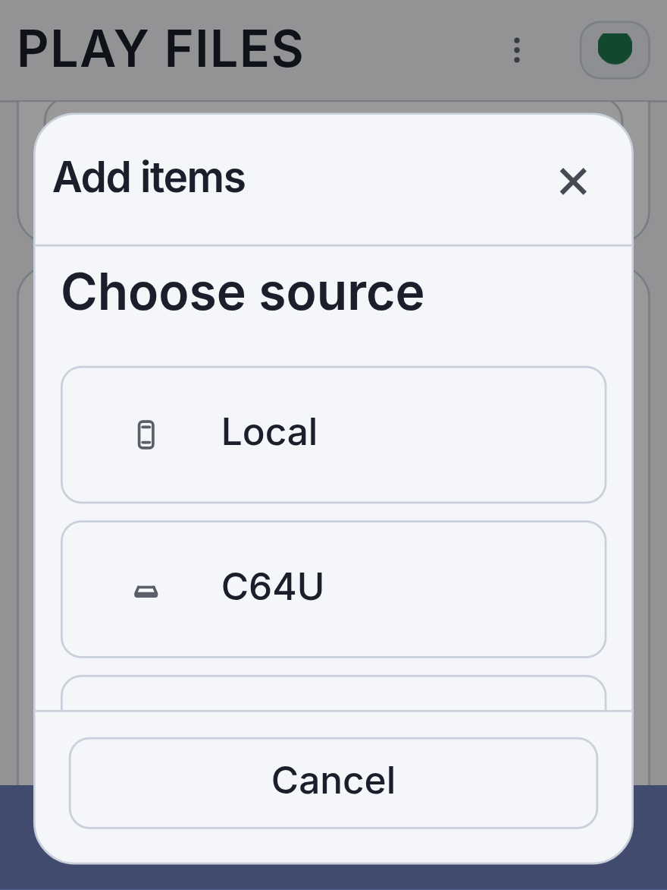

The picker stays inside the source you chose, so **Up** never wanders off somewhere else. Tick files or folders and confirm. **Include subfolders** decides whether a ticked folder means just that folder or everything beneath it. That can be the difference between adding twelve files and twelve thousand.

> **Tip.** Tick a single program, cartridge or disk, and the confirm button reads **Play** instead of **Add to playlist**: the item joins the playlist and the machine starts it right away. A tune, several files, a whole folder, or an online archive result are only added to the queue.

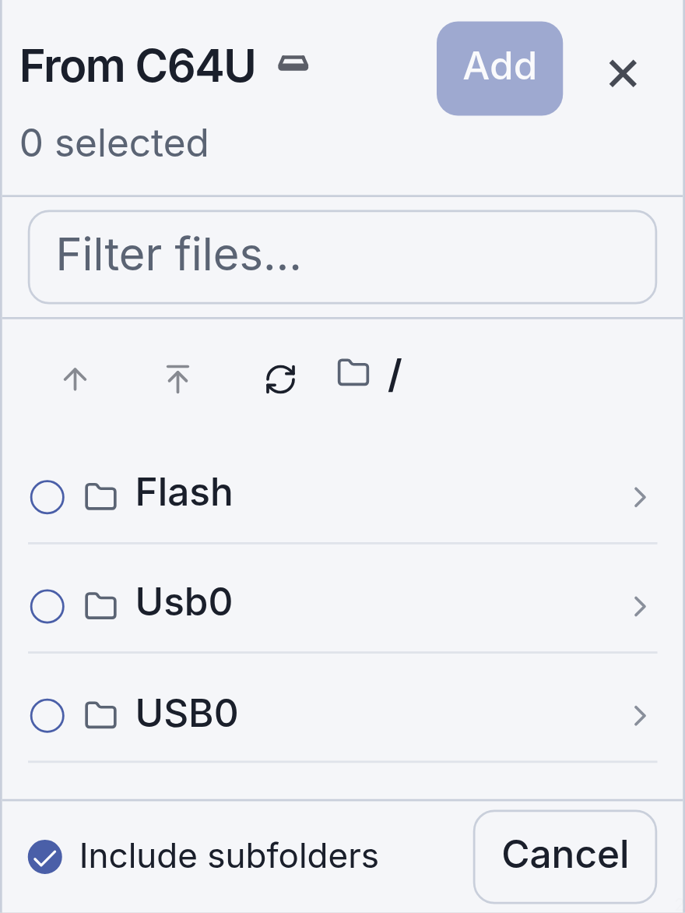

Play handles SID and MOD music, PRG programs, CRT cartridges, and disk images. One SID file can hold several pieces of music, which this guide calls tunes. When the app knows how long a tune is, it shows the length and moves on at the right moment.

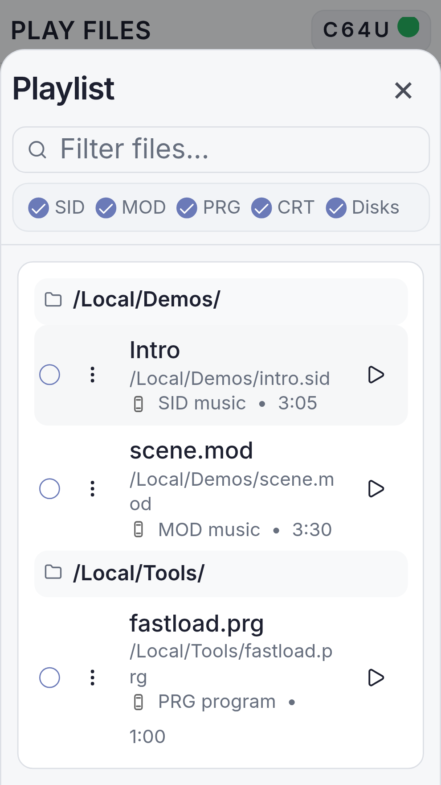

A playlist can hold a single song, or a whole evening's worth.

A short list fits on the Play page. When it grows, open **View all**. There you have room to scan, filter, select and remove, with the playback controls still in sight. **Settings → Play and Disk → List preview limit** sets how many rows Play shows before you need View all; it starts at 50.

> **Tip.** Add broadly, then filter narrowly. Add a whole folder, then type a few letters to narrow it down. The filter matches the title, the path, the source and the kind of file.

A filter only hides rows; it never changes the playlist. Clear the box and the whole queue comes back.

Every item remembers where it came from. Local files stay local, C64U files point back at the device, archive results remember their source, and SID entries carry their tunes and lengths with them.

Rows show titles rather than file names: `Bossa_in_Do_2SID.sid` appears as *Bossa in Do*, with a small badge when a tune uses more than one SID chip. Prefer the file names? Turn off **Settings → Play and Disk → Friendly SID names**.

The transport controls run the show: play, stop, pause and resume, previous and next, shuffle, repeat, reshuffle, and volume. Beneath them sit a **sleep timer**, a **default duration** for anything whose length is unknown, and a **songlengths file** you can choose by hand if you have one.

Each row has its own menu with the item's details and its **playback config**: settings the app applies to the machine just before that item runs. To take items out, tick them and choose **Remove selected items**.

Playback carries on when you leave the app or lock your phone, and your playlist and your place in it are waiting the next time you open it. On Android, a notification names the tune and carries **Pause**, **Next** and **Stop**, so you can run things from the lock screen. When you pause, it stays for ten minutes with **Play** in the first slot; then the session ends, and the next **Play** starts a new one.

Play is the quick way to start a disk and see what it does. When the drives or your disk collection are what you are after, go to Disks.

### Disks

Disks is where the drives and your disk images live.

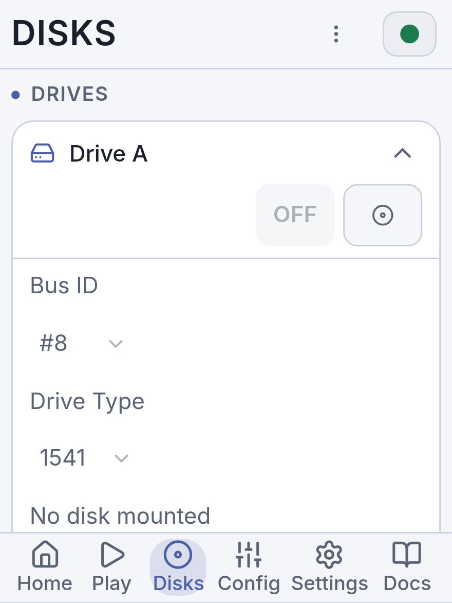

At the top are three drive cards: **Drive A**, **Drive B**, and a **Soft IEC Drive** that reads loose files from a folder instead of a disk image. Each card header shows the drive's power and the mounted disk, so you can check and change both without opening it. **Drive A** starts open, the other two closed.

Below the drives, **Add disks** builds your collection from the sources you have.

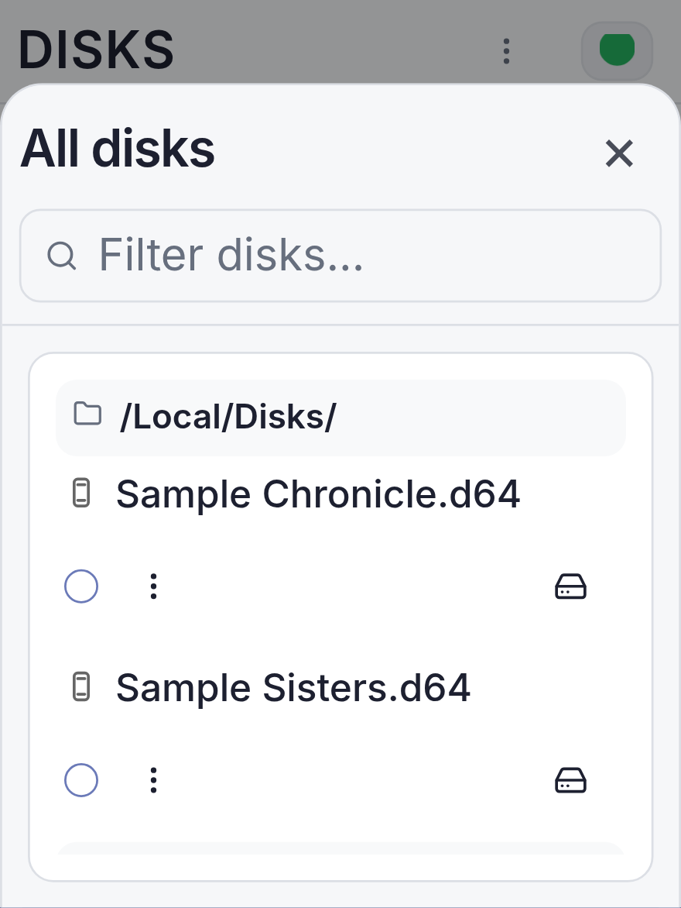

Add a single image, a folder of them, or a result from the online archive. When you add a folder, the app also groups what it finds, so a multi-disk title usually arrives ready to swap through.

Filter by name, path or group to find something. A filter never deletes or moves anything.

Mounting is what the page is for. Choose the disk, choose the drive, mount it; **Eject** empties the drive again. Each disk's menu also offers **Rename disk**, which changes the name in your collection and leaves the file itself alone.

Come to Disks whenever more than one disk is involved: the collection, the groups and the drives are all on one page. The drives themselves are explained in [Drives and Disk Images](#drives-and-disk-images).

### Config

Config holds every setting your machine has, laid out as one searchable tree.

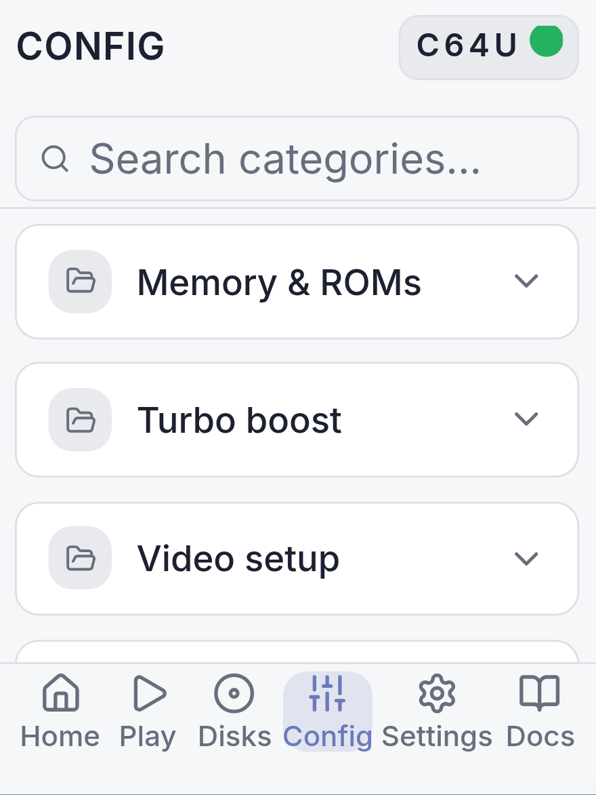

Every category the device reports has a card of its own. Open one and edit its rows directly. Each item gets the control that suits it: a slider, a select, a checkbox, a text field, or a password field that hides what you type. The app remembers which cards you left open.

Config edits the live machine, not a draft. A change goes to the device the moment you make it. Most take effect at once; a few, such as the cartridge choice, wait for the next reset. To make a change survive a power cycle, see [Configuration and Saving](#configuration-and-saving).

Come here when you know a setting exists but not where the device menu keeps it. The search box narrows the tree to the pages and groups whose names match. After changing a value, let the write finish before you change a related one. For everyday settings, the cards on Home are quicker.

### Settings

Settings controls how the app behaves, and holds your saved devices.

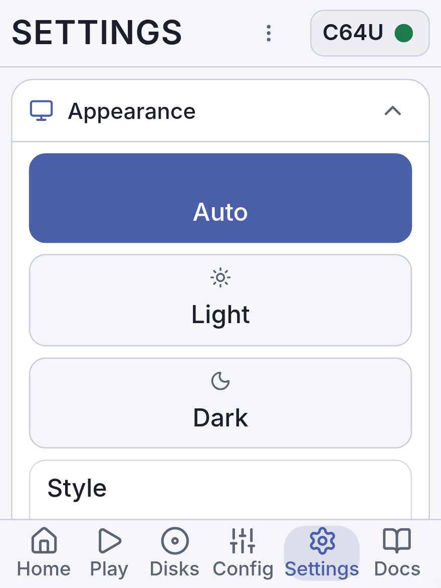

Settings is a list of chapters, each with a one-line summary under its heading. **Connection** is open on your first visit; the rest start closed, and whatever you leave open stays open next time.

The chapters are **Appearance**, **Connection**, **Diagnostics**, **Play and Disk**, **Stable Features**, **Experimental Features**, **SID Radio**, **HVSC**, **Online Archive**, **Device Safety**, **Notifications**, and **About**. The two feature chapters show how many of their switches are on, **8/9 on** for example. **HVSC** and **Online Archive** disappear if you switch their features off.

If the device is hard to reach, start in **Connection**. If it answers but seems fragile, start in **Device Safety**.

**Connection** holds your saved devices: each one's name, host, HTTP, FTP and Telnet ports, and network password. Before keeping a device, the app checks that its web service answers. FTP and Telnet are stored as you typed them, and a health check tests them later.

**Appearance** is local to the app and never touches your C64. It sets the theme, the style, the text size, the display profile, card descriptions, whether the app runs full screen, and whether it turns with your phone or stays in portrait or landscape.

**Style** is a set of colors, corners and shading. It sits on top of **Theme**, which stays your light-or-dark switch. Pick a style, or choose **Match my device** to follow the Color Scheme your C64 Ultimate is set to.

Match my device reads your machine each time you connect. If it cannot read it yet, it keeps the current style and shows a note. Two styles come in one shade only; for those, Theme is grayed out and Settings tells you why.

There are seven styles:

| Style | What it is |
| --- | --- |
| Cool Gray | Neutral, with a cool blue lean. The one the app starts with. |
| Breadbin Beige | The warm beige of the original case. |
| Ocean Teal | Deep blue-green with a warm coral highlight. |
| Neon Pop | Translucent covers by day, arcade cabinet by night. |
| Amber Glow | An amber monitor. Dark only. |
| Vault Black | Near-black with a two-tone band. Dark only. |
| High Contrast | Maximum legibility: heavy edges, strong text, no soft fills. |

**Text size** makes everything in the app bigger. Choose **Default**, or **Large**, which is 15 percent larger. The display profile beside it changes the layout, not the type.

If the tab bar along the bottom runs out of room, it scrolls sideways. Reach a page another way, and its tab scrolls into view.

**Card descriptions** adds a one-line summary under each card's title. It starts off. Turn it on if you would rather read what a card holds than remember it; on a small screen it makes each closed card about half as tall again. The Quick menu switches it too, without leaving the page.

**Diagnostics** opens the diagnostics panel and switches debug logging on. It also holds **Settings transfer**.

Settings transfer saves your app settings, feature switches and device-safety tuning to a file you can import on another phone. Saved devices and passwords are left out, so the file is safe to pass around.

**Notifications** decides whether you see every message or only errors, and how long each stays on screen. **About** shows the version and links to the open source licenses.

Feature switches appear only for features that are safe for anyone to change.

#### Making settings stick

A setting you change from the app reaches the Commodore 64 Ultimate at once: the colors, the video mode, the LED lights and the rest all change as you go.

By default, that is as far as it goes. Switch the machine off and on, and it comes back the way it was. So go ahead and experiment: nothing you try from the app is permanent.

**Keep device settings after a restart**, in **Settings → Device Safety**, changes that. With it on, every device setting the app changes is also saved in the machine's own storage, just as if you had saved it from the machine's setup menu.

> **Take care.** Turn this on deliberately. A setting that makes the machine awkward to use will come back every time you switch on.

If that happens, hold **RESTORE** while you switch the Commodore 64 Ultimate on. It starts with its default settings instead of the saved ones, and you have a working machine again. Nothing is erased: your saved values are still there, so you can put the setting right and save again.

### Docs

Docs is the built-in help page: a pocket version of this manual, inside the app.

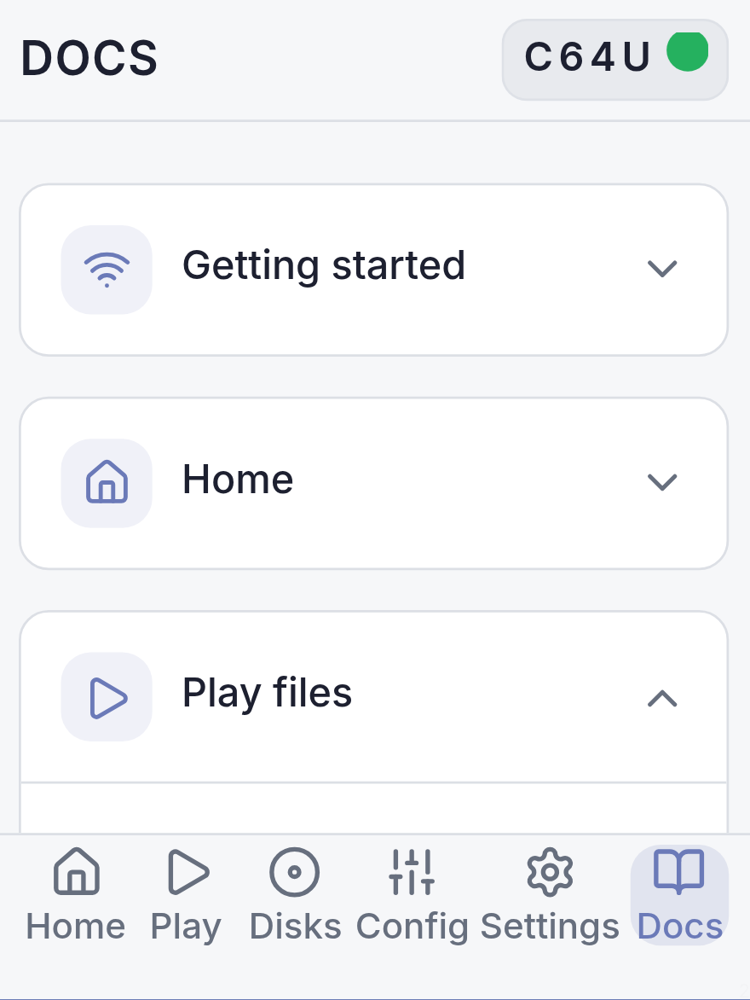

It covers setup, Home, Play, Disks, Config, Settings, Diagnostics and disk swapping.

### Diagnostics

Diagnostics shows how the connection is doing, what the app has been up to, and anything that has failed.

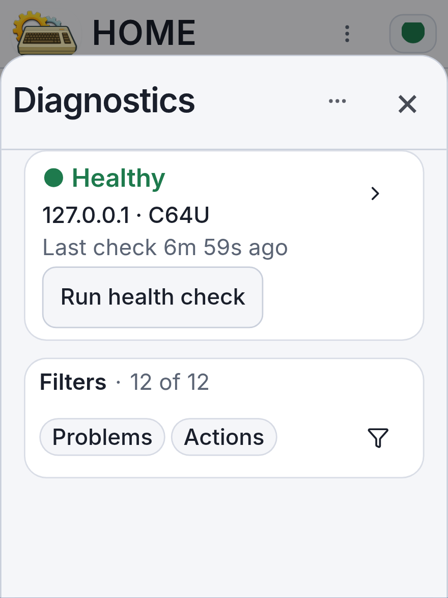

Open it when a control does nothing, playback will not start, a file transfer stalls, or the badge stops looking healthy. Inside are the health check, four kinds of activity (Problems, Actions, Logs and Traces), filters, latency and heat-map views, Share, and Clear.

Start with Problems for a plain-language summary. See [Reading Diagnostics](#reading-diagnostics) for the rest, and [Sharing a Diagnostics Report](#sharing-a-diagnostics-report) when you want help.

### Device Switching

**Switch device** is for homes with more than one saved Commodore 64 Ultimate.

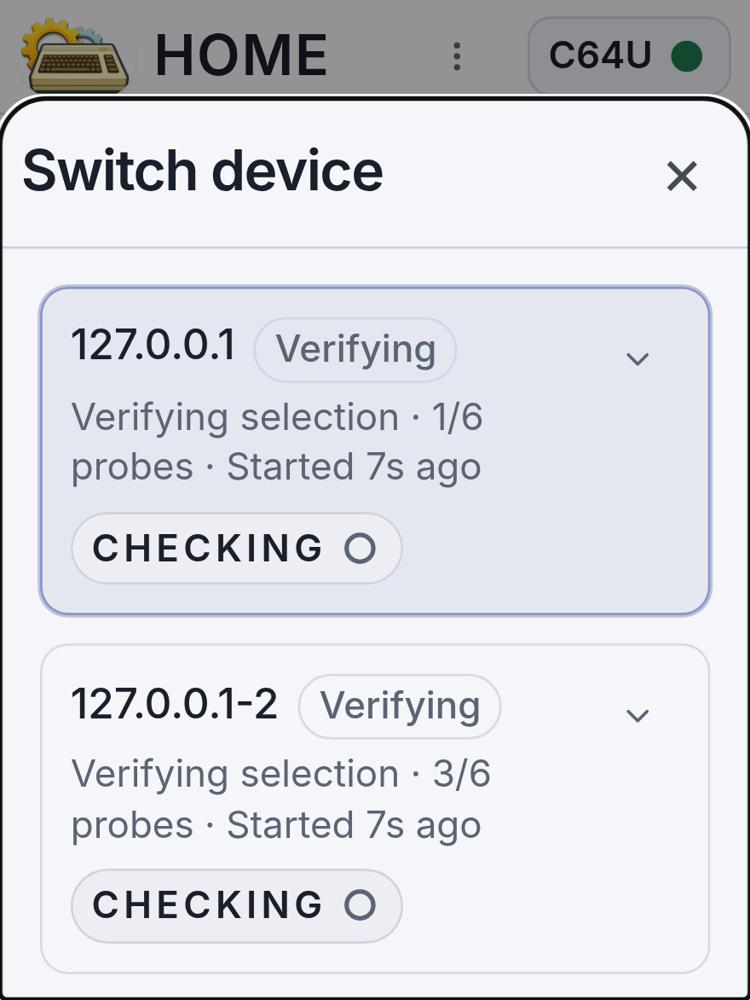

Long-press the badge, press `#`, or choose **Switch device** in the Quick menu. [Switching Between Devices](#switching-between-devices) has the details.

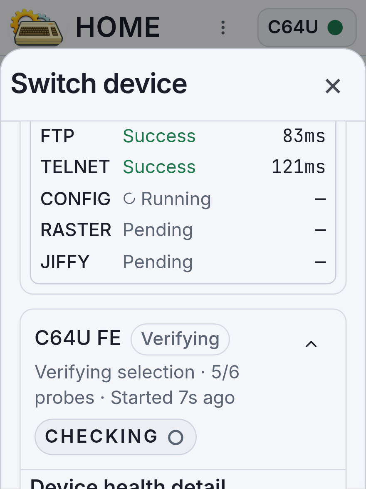

## Everyday Flows

Here are short recipes for the things you will do most. Follow the numbered steps, and that is the whole job. Where the app offers more than one route, the line after the steps says which to take.

### Connect by Hand

1. Open **Settings → Connection**, or use the startup prompt when discovery finds nothing.
2. Enter a hostname or IP address.
3. Choose **Save & Connect** or **Connect**.
4. Enter the network password if asked.

Preferred path: let startup discovery try first, and type the address only if it finds nothing.

### Maintain Saved Devices

1. Open **Settings → Connection**.
2. Review the saved-device list.
3. Give each device a name you will recognize, and check its ports.
4. Choose **Save & Connect** after changing the active device.
5. Remove any device that is no longer on your network.

Preferred path: Settings to edit devices, **Switch device** to move between them.

### Reboot and Carry On

1. Open **Home**.
2. Choose **Power**, then **Reboot**.
3. Confirm.
4. Watch the badge until it shows healthy again.

Preferred path: Home. Open Diagnostics only if the device does not come back.

### Play a SID or Program

1. Open **Play**.
2. Choose **Add items**.
3. Choose Local, C64U, HVSC, or CommoServe.
4. Select files or folders.
5. Confirm, then press Play.

Preferred path: choose C64U for files already on your C64, and Local for files on your phone.

### Build a Playlist from Folders

1. Open **Play → Add items**.
2. Choose the source that owns the folder.
3. Navigate into the folder.
4. Select the files or folders you want.
5. Confirm the selection.
6. Open **View all** if the list is long.

To search instead of browsing, type in the box at the top and choose **Everywhere**. **This folder**, where the box starts, only narrows what is on screen. **Everywhere** searches the whole source by title or composer, which for HVSC means all sixty thousand or so files.

Some sources have to be read one folder at a time, such as a folder on your device or the card in your C64. These offer a **Scan** button instead of searching as you type.

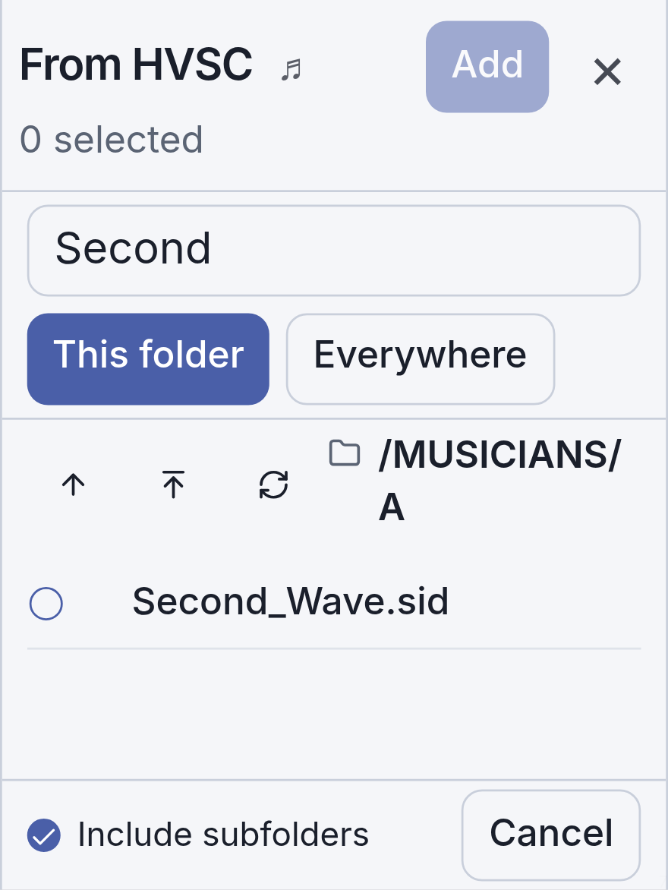

Preferred path: add a whole folder first, then filter the playlist to pick what plays next.

### Filter and Clean a Playlist

1. Open **Play → View all**.
2. Type a few characters from the title, the path, the source, or the kind of file.
3. Review the rows that remain.
4. Tick the ones you do not want and choose **Remove selected items**, or clear the filter to bring the whole list back.

Preferred path: filter first, then remove. The filter alone never removes anything.

### Choose a Tune Inside a SID

1. Add one or more SID files to Play and start one.
2. On the Now Playing card, tap the tune position, **1/19**, to list every tune in the file, with its name and length where the collection knows them.
3. Tap a tune to play it, or use **Play all 19 tunes** to add the whole file to the playlist in order.

Preferred path: the Now Playing card. The playlist rows have no tune chooser.

### Mount a Disk

1. Open **Disks**.
2. Add disks if the collection is empty.
3. Open the drive's mount action.
4. Choose a disk.

Preferred path: Disks. Home has drive shortcuts too, but Disks shows your whole collection.

### Build a Disk Collection

1. Open **Disks → Add disks**.
2. Choose Local, C64U, or CommoServe.
3. Select disk images or folders.
4. Confirm the selection.
5. Use **View all** to inspect the collection.

Preferred path: Disks to build a collection; Play to queue things up and start them.

### Filter, Group, and Rotate Disks

1. Open the disk collection view.
2. Filter by name, path, or group.
3. Check the groups the app made when you added the folder, and move any stragglers into the right one.
4. Mount the first disk.
5. When the program asks for the next disk, use the rotate controls on the drive card.

Preferred path: group related disks before you need to swap them.

### Mount to a Specific Drive

1. Open **Disks**.
2. Check that the drive you want is switched on.
3. Check its bus ID and type if the program is particular.
4. Choose the disk image.
5. Mount it to the intended drive.

Preferred path: set the drive up first, then mount.

### Change a Common Setting

1. Try Home's own cards first: CPU & RAM, Ports, Video, Audio, User Interface.
2. If the setting is not there, open **Config** and search.
3. Change the value.
4. To make the change survive a power cycle, use **Save** (**To flash**) in the **Config** card, unless **Keep device settings after a restart** is already on.

Preferred path: Home for common settings; Config for everything else.

### Save Device Configuration

Use this to save the current settings to flash once, so the machine still has them after its next power-up.

1. Make the changes you need on Home or Config.
2. Confirm the device is healthy.
3. Open the **Config** card on Home.
4. Choose **Save**, the tile marked **To flash**.

Preferred path: turn on **Keep device settings after a restart** in **Settings → Device Safety**, and the app saves for you a moment after your changes settle.

### Investigate a Problem

1. Tap the header badge or press `*`. If the app is offline, that tap also tries to connect again, and asks for the password if the device wants one.
2. Run a health check.
3. Look at Problems, then Errors, then Traces if the order of requests matters.
4. To ask for help, share a report before you clear anything or restart the app. See [Sharing a Diagnostics Report](#sharing-a-diagnostics-report).

Preferred path: Diagnostics from the badge.

## In Depth

Some parts of the app have more to them than a recipe can hold. This chapter covers them in full.

### SID Music

The **SID**, short for **Sound Interface Device**, is the sound chip in every Commodore 64. It has three voices, and people are still writing music for it today. The files that hold that music are called SIDs too: each is a small program that plays the chip. Tens of thousands of them live in one free archive, the **High Voltage SID Collection**, or **HVSC**.

Your C64 plays all of it, and your phone plays most of it. This section is about choosing the music yourself. The next one, **SID Radio**, lets the app choose for you.

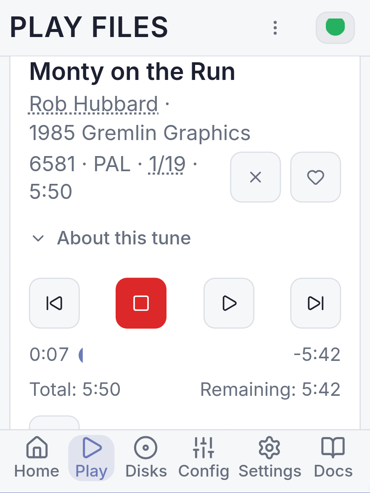

#### Where the music plays

While a SID tune plays, the Play page shows an **output button** beside the volume slider. It names where the sound is going. Press it to choose:

- **Here**: your phone plays the tune itself. Your C64 need not even be switched on.
- **C64**: your C64 plays it on its own SID chip.
- **Both**: your C64 plays it and also sends the sound across your network, so you hear it in both places.

**Both** is offered when the **Live View** and **Audio Mirror** features are on in Settings, as they are to begin with, and the machine can stream. It disappears if your C64 declines to send the sound. The sound leaves the machine over its **Ethernet** connection, so a C64 on Wi-Fi alone cannot send it.

The output button is for SID tunes only. Programs and disks always run on the C64.

To play music by itself, your phone needs copies of two programs built into every C64: the **KERNAL** and **BASIC** ROMs. Many tunes call into them; without them, those tunes start and then play nothing.

The ROMs are under copyright and cannot be shipped with an app, so C64U Remote reads them from your own machine. It does this by itself, the first time you play a tune here while the C64 is connected. There is nothing to set up.

The copies stay on your phone. They are never uploaded, never shared, and never put in a diagnostics report. Read them only from a machine that is yours, or that you have permission to use.

#### Moving around inside a tune

These work for tunes playing on your phone. On the C64, the buttons only step from one tune to the next.

- **Press and hold next or previous** to wind forward or back, about five seconds at a time, for as long as you hold. A short tap still skips.
- **Tap the progress bar** to jump to that spot, or hold and slide along it. The music picks up wherever you let go.
- Jumping *forward* past the part already prepared takes a moment, because the app has to work the music out up to that point. The timer waits at the last note you heard while the bar shows progress. Jumping back is instant.

#### The sound itself

**Volume** and **Mute** follow whichever machine is making the sound. Playing here, they change this tune alone and leave your ringer and notifications as they were. Playing on the C64, they move the machine’s own mixer.

Your phone plays either its own tune or the sound sent from your C64, never both at once. Whichever you start last wins.

The rest is under **Settings → SID Radio**. **Crossfade** blends one tune into the next: **Off** for a clean cut, or **Short** (0.6s), **Medium** (1.5s), **Long** (3s), or **Longest** (4s). It starts at Off.

Only your phone can play two tunes at once, so Crossfade is grayed out while the output is set to **C64** or **Both**.

The SID chip came in two versions, the **6581** and the **8580**, and music written for one sounds a little different on the other. Most files say which chip the composer used, and those always play on it.

Many older files say nothing. For those, turn on **Match my Commodore 64** and the app reads the chip from your own machine. Until it has, **Otherwise use** picks 6581 or 8580. A line underneath tells you which is in use.

#### The SID Audio Mixer

A C64 can have more than one SID chip. **Home → Audio** gives you a **master volume**, plus a **volume** and **stereo position** for each SID your machine reports. Pan one SID left and another right for stereo, or turn one down so the other leads. You hear each change at once. The same controls are in **Config → Audio Mixer**.

### SID Radio

HVSC holds around sixty thousand files, and even more tunes, since many files hold several. That is far too many to browse, so SID Radio plays it like a radio station: pick a mood, or a tune you already like, and the app keeps finding more music of the same kind.

There is no playlist to build, and nothing downloads while you listen. Once the collection is on your device, the app already knows which tunes sound alike.

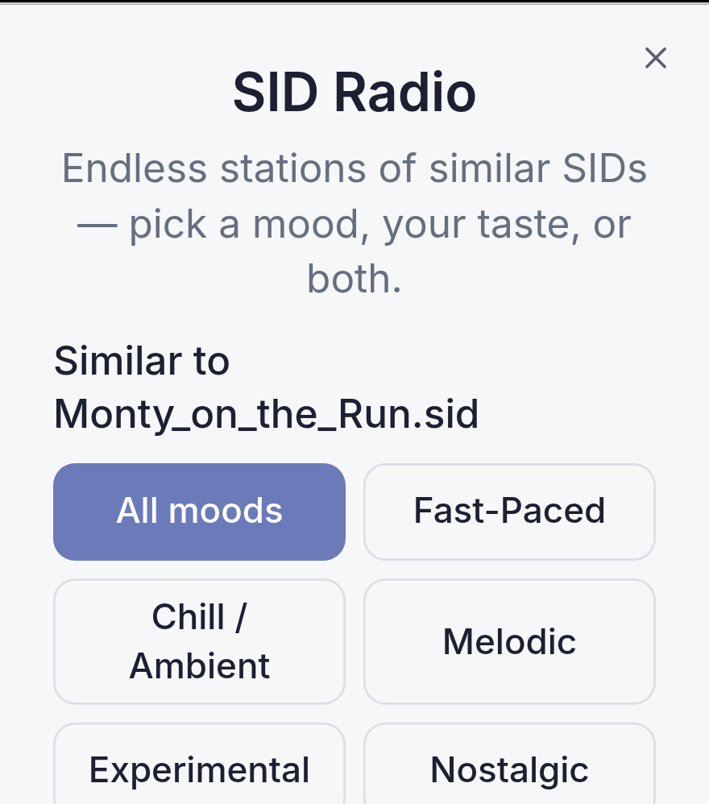

#### Starting a station

Go to the **Play** page, tap **SID Radio**, and pick what you are in the mood for:

- **A mood.** There are nine: Fast-Paced, Chill / Ambient, Melodic, Experimental, Nostalgic, Composer Deep-Dive, Era Explorer, Deep Cuts, and Game Themes. Each draws on tens of thousands of tunes.
- **From tunes you like.** Once five tunes carry a heart, this builds a station from them.
- **Surprise me.** Anything at all.

Switch on **Based on my likes** to tilt any mood toward your own taste. The station keeps the mood's name, but reaches for music closer to what you like.

You can also start from whatever is playing now. Tap **More like this**, and the station follows that tune. The button appears whenever a SID the collection recognizes is playing, even during another station.

#### Telling it what you like

While a tune plays, a heart and a cross appear just above its title, at the right of the card. Tap the **heart** to add it to your **Liked Tunes** list. Tap the **cross** to skip it: the station moves on at once and steers away from similar tunes. You need not do either; the station plays happily if you just listen.

Your choices stay on your phone. They belong to the music itself, not to a file name, so they survive an update to the collection even if the tune moves.

**Liked Tunes** is an ordinary list: play it, shuffle it, or take a tune off it. To start over, **Settings → SID Radio → Clear my rankings** removes every heart and cross at once.

#### What a station will and will not do

**It never repeats itself.** No tune plays twice, and no file gives more than one tune in a session.

**It skips very short pieces.** The collection holds jingles, sound effects and test tones as well as music. Anything under fifteen seconds is skipped. Change that under **Settings → SID Radio → Shortest tune to play**, or set it to zero to hear everything.

**It can run out.** A station follows a chain of similar tunes, and now and then it reaches the end, usually after many skips. The app tells you, and you can pick another mood.

While a station runs, it chooses what comes next, so Shuffle, Repeat and Reshuffle step aside. They come back, settings intact, the moment you stop it.

The line at the top of the Now Playing card says where the music comes from. Tap it to see why this tune was chosen, or tap **Stop** beside it to end the station. Each station starts fresh, so the same mood brings different music every time.

#### Finding one particular tune

To play one particular piece, tap **Find a tune** and type part of a title or a composer's name. The app searches the whole collection, not just one folder. That matters, because the archive is filed by composer.

Any part of a word will do, in upper or lower case, and accents are ignored: "oorni" finds Lasse Öörni, "mando" finds Commando. Add a second word to narrow it down: "hubbard commando" finds the one that matches both.

Tap a result and it plays at once. Your station keeps its place and carries on when the tune ends. For more music like it, tap the radio icon beside the result, where there is one.

With nothing typed, the sheet lists what you heard recently, so you can find your way back to a tune that has already played.

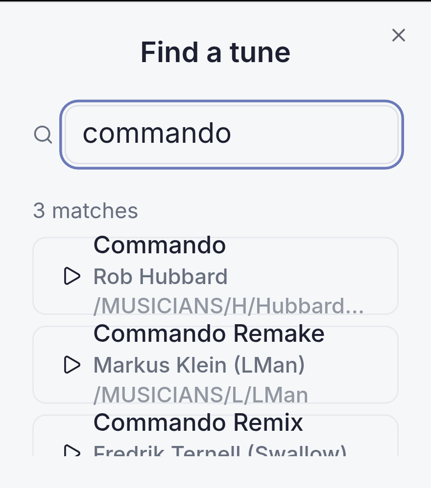

#### More than one tune per file

Many SID files hold several tunes: a title screen, a high-score jingle, a loading tune, sometimes twenty more. The second line under the title shows which one is playing and how many there are: **1/19**.

Tap **Play all 19 tunes** to add them all to your playlist in order, each with its own name and length. From then on they behave like any other tracks, and the button disappears.

To pick just one, tap that **1/19**. You see every tune in the file with its number, its name where it has one, and its length. Check the lengths before you choose: a five-minute piece and a one-second jingle often share a file.

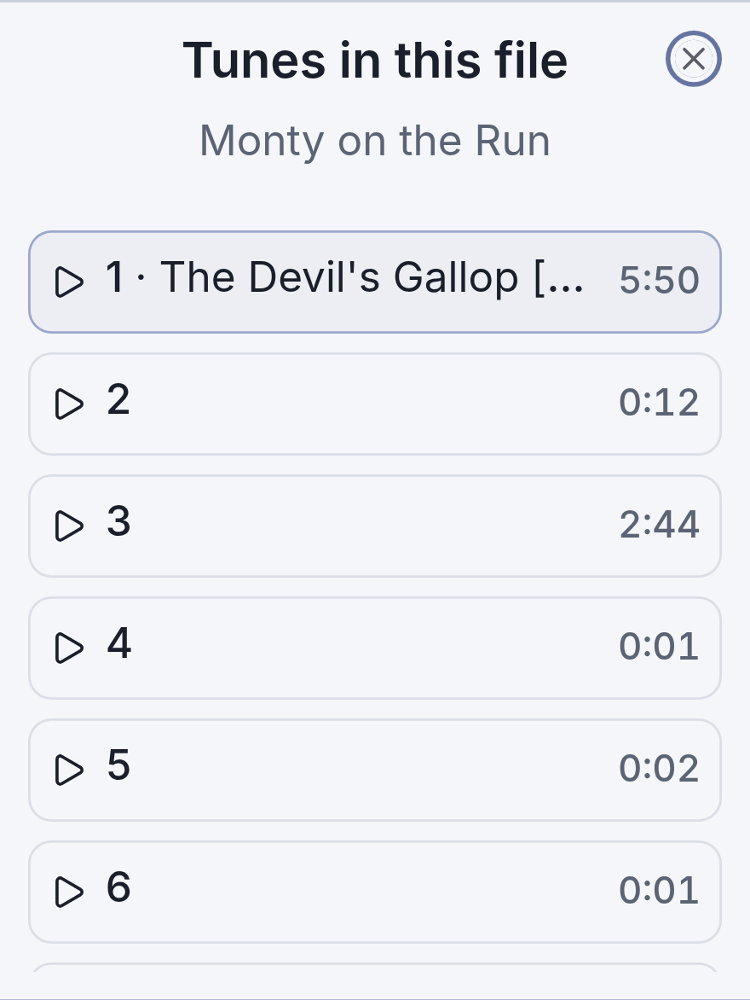

#### What the tune is, and who wrote it

The line under the title comes from the SID file itself: the composer, the year and publisher, the chip it asks for, whether it was written for **PAL** or **NTSC**, which tune is playing, and its length. Anything the file does not record is left out, never guessed. Tap the composer's name, and search opens with that name filled in.

The archive's editors have written down two more things a SID file cannot hold. You find them under **About this tune**, below that line, for about a third of the tunes. It starts folded, so the transport and progress bar stay on screen; tap it to open or close it.

The first is whose music a tune really is. Much C64 music is a cover of a pop record, a film score or an arcade original, and the file names only whoever wrote the C64 version.

Take Rob Hubbard's *Commando*. He wrote the C64 version, but the music is Tamayo Kawamoto's, from the arcade game. **About this tune** shows it: **BGM1 · music by Tamayo Kawamoto**.

The second is what the individual tunes inside a file are called. A list of nineteen numbered rows becomes a title screen, a high-score jingle and a game-over sting. Any note the editors left about a tune appears underneath. Long notes are trimmed and marked **Show more**; tap one to read the rest.

#### Stopping later

A station never stops on its own, so set a **Sleep timer** if you are listening at bedtime. It sits under the transport controls on Play. Choose **This tune** to stop when the current one ends, or 15, 30, 45 or 60 minutes. It counts down while it waits; **Off** cancels it.

### Live View

Your C64 can send its own sound and picture across your network, and Live View brings them into the app. Hear a tune or watch the screen without wiring up a speaker or a second television.

There is only ever one Live View. Start it in one place, and it keeps playing wherever you go in the app.

You find it just below the Quick Actions on **Home**, as a card that starts closed; tap its header to open it. Inside are two switches:

- **Listen** turns the sound on. It takes almost no room, just a lit button and a small live dot, so you can keep half an ear on a game or a SID tune while you do something else. On other pages, a matching dot in the top bar reminds you it is playing; tap it to stop everything at once.
- **Watch** turns the picture on. A small preview of the C64 screen appears beneath the switches; tap the chevron beside it to make it bigger.

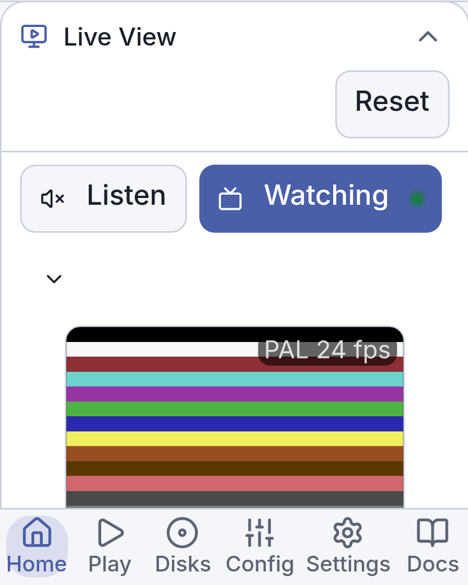

While either is playing, a **Reset** in the card's header stops both, without opening the card.

If the stream stops reaching your phone, because the network drops out or the machine is switched off, Live View tells you so. You never sit in front of a frozen picture wondering.

Live View needs no setting up. Nothing crosses the network until you press **Watch** or **Listen**.

The device sends to two network ports, 11000 for the picture and 11001 for the sound. If those are already taken on your network, change them in **Settings → Play and Disk**.

The **Live View** switch in Settings → Stable Features hides the whole feature. **Audio Mirror** and **Video Mirror**, in Experimental Features, choose which of the two feeds it offers.

#### The immersive screen

Open **Remote Input** while **Watch** is on, and the picture sits above the joystick and keyboard. Now you can see the game you are playing, or the program you are typing. In **Game Mode**, the picture fills the whole sheet.

On a touchscreen, **pinch** to zoom, **drag** to move the picture about, and **double-tap** to zoom in on a spot. Double-tap again to see the whole screen.

A small map in the corner shows which part you are looking at; drag its rectangle to jump elsewhere. Switch on **Follow**, and the view drifts by itself to wherever the action is. That keeps the cursor in sight as you type.

You can also lock the view onto your character. Press and hold the character on the screen. With no touchscreen, use the direction keys to line up the crosshair in the middle of the view, then press **OK**.

The view now travels with that one character while enemies move around it. It hangs on through flashing, color changes, animation, fast movement, a wrap around the screen edge, and a moment out of sight.

The status line reads **Hold on your character** until something is locked, then **Locked on**. **Looking…** means it is still searching, and **Lost it** that the character has gone; both are normal. To let go, tap the status line, ask for the whole screen back, or press **OK** again, and the view goes back to ordinary following.

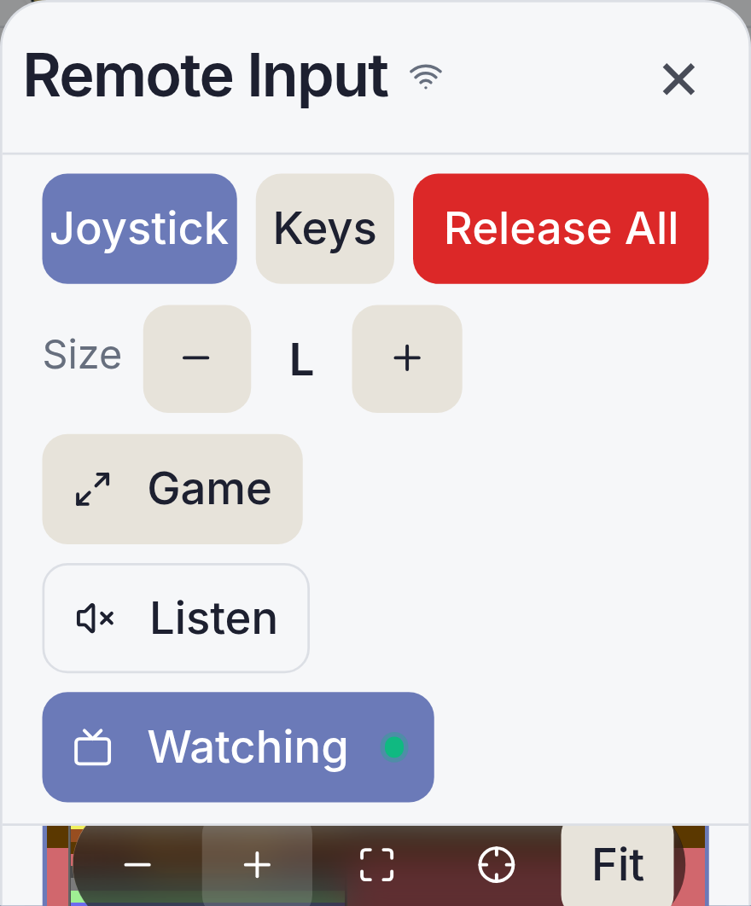

#### Driving the C64, or adjusting the view

On a phone with a physical keypad, the same keys can either drive the C64 or move the picture. A colored border around the picture, with a matching label in the corner, tells you which.

**Blue**, marked **“C64”**, means your keys go straight to the machine. **Amber**, marked **“View”**, means they zoom and pan the picture.

To switch between them, press `*` or the **menu key**, or the on-screen button that reads **Fit** on the way in and **Done** on the way back. After a short pause, the keys go back to driving by themselves, so your game is never left waiting. While the border is amber, the keypad works like this:

| Key | What it does |
| --- | --- |
| **2**, or D-pad up | Pan up |
| **8**, or D-pad down | Pan down |
| **4**, or D-pad left | Pan left |
| **6**, or D-pad right | Pan right |
| **3** or **9** | Zoom in |
| **1** or **7** | Zoom out |
| **0** or **5** | Fit the whole screen back on |
| the **center/OK** key | Lock the view onto what is under the crosshair, or let it go |
| the **menu** key | Return to driving the C64 |

In **Game Mode**, while the border is blue, `#` shows or hides the quick keys and the **Watch** and **Listen** switches over the bottom of the picture. So you can turn the picture and sound on and off without a touchscreen.

The same moves have on-screen buttons too: **plus** and **minus** to zoom, **fit-to-screen** to see the whole screen, and **follow** to turn Follow on and off. However large you make the game controls, they never cover the picture.

#### Smooth playback, and what it costs

Live View puts smooth **sound** first. If a scrap of audio goes missing on the network, it fills the tiny gap so neatly you will not hear a click. And it never lets the picture race ahead and leave the sound behind.

The sound takes a **fast, low-latency path**, so what you hear follows your keypresses closely.

Three switches in **Settings → Play and Disk** control this, and all three start on. **Low-latency audio (native)** is that fast path. **Fast video (native assembly)** builds the picture the same way, and reaches the full 50 frames a second of a PAL machine.

**Input priority (instant joystick)** gives the joystick and keyboard right of way: while you play, the picture drops a few frames so your input lands at once, then catches up. Turn any of the three off to compare, or if one misbehaves on your device.

Beside them is the **audio network buffer**, 60 milliseconds to begin with. It is how much sound the app keeps in hand for a network that delivers in fits and starts. Lower it for the shortest delay; raise it if the sound breaks up.

The **picture** is the hard work, and you decide how much of it to draw. Open **Stats**, under Live View while it plays, and choose a video frame rate with the buttons beside the gauge icon:

- **Auto** plays every frame it can, eases off when your device is busy, and returns to full speed as soon as it can. Leave it here.
- **100%**, **50%**, and **25%** cap the picture at the full rate, half, or a quarter of what the C64 sends. A lower rate is kinder to the battery and to older hardware, and leaves more room for the game. Even so, the app may dip below your cap for a moment to keep the sound clean, because the sound always comes first.

**Stats** also shows how the stream is doing, now and over the last few minutes: the frame rate, how full the audio buffer is, any packets lost on the network and how they were smoothed over, and the app's own load.

Sound and picture travel as two separate streams, so **More** counts their losses separately: **Dropped pkts** under **Audio**, **Lost pkts** under **Video**. Watching it costs the stream nothing. **Export diagnostics** saves it all as a small file.

#### Screen colors

Your C64 sends color *numbers*, not colors, so something has to decide which shade to paint each one. That is **Screen colors**, the first row of the **Video** card on Home. It shows the palette in use with all sixteen colors; tap it to choose another.

**Show on** decides where a palette applies, just as the Play page asks where a tune plays.

**Local** changes only the picture in Live View on your phone. **Remote** changes what the Commodore 64 Ultimate itself draws, so the television in the room changes too. **Both** does both.

The list begins with **Follow the C64**, the starting choice: Live View paints whatever palette the machine uses, so your phone and your television match.

Below it are nine bundled palettes (warmer, cooler, monochrome and more), each showing all sixteen colors before you choose. Palettes already installed on the Commodore 64 Ultimate are listed under **Already on this C64**.

Sending a palette to the machine copies a small file to its storage and changes the picture at once. Whether it survives a power cycle depends on **Keep device settings after a restart**; see [Making settings stick](#making-settings-stick).

#### Checking the sound and picture yourself

Under Live View are three checks you can run whenever something seems off. To hide them, turn off **A/V sync tests** in Settings → Experimental Features.

- **A/V sync** and **Tap latency** answer *when*: how far apart the sound and picture are, and how long a keypress takes to come back to you.
- **Tone & color ladder** answers *what*. It plays a scale on your C64, from C3 up to C4 and back at half a second a note, and changes the screen color with every note, through all sixteen C64 colors. The C64 changes note and color at the very same instant, so anything that arrives out of step got that way on your network.

The ladder grades what comes back and shows five numbers: how many notes were **in tune**, how far off the **pitch** was, whether notes ran **long or short**, whether the two deliberate **silent gaps** really were silent, and how far apart the **sound and picture** were.

Wrong pitches, long notes, or a gap that is not silent all mean the same thing: the sound is being damaged on its way to you, which a delay alone would not do. The usual cause is a second machine on your network streaming to the same place, and one run of this check shows it plainly.

### Streams

Your C64 can send what it is doing across the network. **Home → Streams** offers three feeds: **VIC**, the picture; **Audio**, the sound of the SID; and **Debug**, a low-level trace for developers. Point a feed at an address and press **Start**; **Stop** ends it. The card appears when the connected device says it can stream.

Live View uses the same **VIC** and **Audio** feeds. While it plays, it takes charge of the feed it needs: that row shows a small **Live View** badge and ignores changes, so nothing here can pull the picture or sound away from it.

Your own address is remembered, and the row is yours again the moment you stop Live View.

### Remote Input

Remote Input turns your phone into a joystick and keyboard for the C64. It is handy when you are across the room from the machine, when no joystick is plugged in, or when you just want to type a command.

You can open it from two places:

- On **Home**, tap **Game** or **Input**, the second and third Quick Actions tiles. Both open the same screen: **Game** sets it up for playing (Game Mode), **Input** shows everything (Remote Input).
- On **Play**, tap **Remote Input** or **Game Mode** while an item is playing.

Each place opens its own copy of the controller, so a key held in one never leaks into the other.

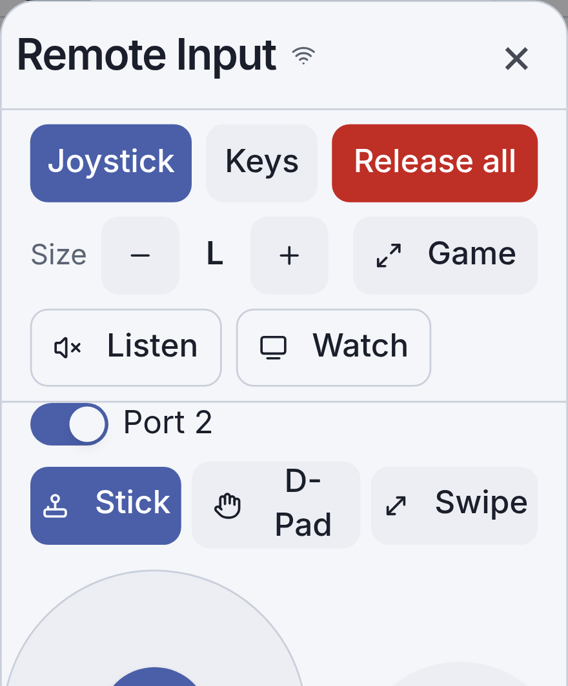

At the top, choose one of two modes: **Joystick** or **Keys**.

**Joystick** puts a stick and a big **FIRE** button on the screen. You can:

- choose how the stick behaves: **Stick**, **D-Pad**, or **Swipe**;
- send it to **Port 1** or **Port 2** with the port toggle (most games read Port 2);
- make the controls bigger or smaller, from M up to XXL, with the **Size** stepper (L to begin with);
- turn on **Autofire**, at 1 to 10 presses a second (5 to begin with). Few C64 games need it, so the button stays hidden until you turn on **Show Autofire button** in **Settings → Play and Disk**, where the rate is set too.

Beside the joystick, a quick-keys bar keeps the keys you need mid-game one tap away: RUN/STOP, SPACE, RETURN, the function keys f1 to f8, the cursor keys, and the CTRL, C= and SHIFT modifiers. Answer a prompt without letting go of the stick.

**Keys** shows a full Commodore 64 keyboard, with the SHIFT, CTRL and C= modifiers, SHIFT LOCK, the function keys f1 to f8, and RESTORE. Tap a modifier once to apply it to the next key, or hold it down while you press another.

The **Joystick** tab needs the device's `machine:input` REST endpoint. The app simply asks for it. If your machine answers, the tab appears; if not, you get **Keys** only. The endpoint arrives with Commodore 64 Ultimate firmware **1.2.0**.

Without `machine:input`, **Keys** types by placing characters in the C64's KERNAL keyboard buffer. That is ideal for BASIC: type a command, then `LOAD` and `RUN`. Most games, though, read the keyboard and joystick hardware directly and never notice it, and RUN/STOP and RESTORE cannot be sent that way.

If the device has a password, enter it in Settings first. Joystick and Keys both need it.

No key is ever left stuck down on the real C64. Everything is released when you close the sheet, change mode or port, switch device, or send the app to the background. If a message does not get through, the header shows **Reconnecting…** until the next one does.

Tap **Release All** at any time to let go of every key and button at once.

_Availability: on by default. Turn it off under **Remote Input** in Settings → Stable Features._

#### Game Mode

**Game Mode** is the app set up for playing: the picture and sound as you last left them, everything else out of the way, and the controls that suit how you play.

Start it with the **Game** tile on Home, the **Game Mode** button on Play (**Game** on a small screen), or the `0` key from anywhere. Starting a program, cartridge or disk can open it too; **Settings → Play and Disk → Enter Game Mode when a game starts** decides whether it does.

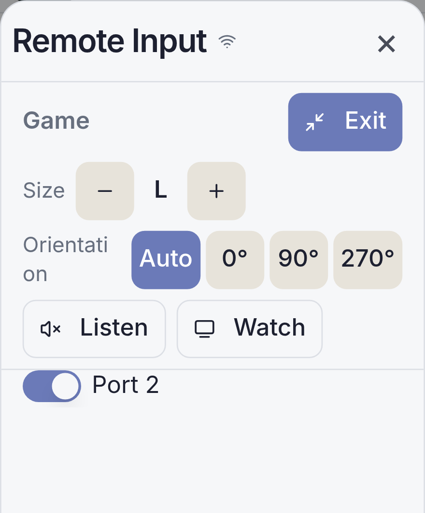

The picture fills the whole screen. Your phone steers with its number keys, so an on-screen joystick would only be in the way. While the picture is on, press **Show joystick** on the Game Mode toolbar to bring one up for this game. To keep it for good, set **Settings → Play and Disk → On-screen joystick in Game mode** to **Visible**.

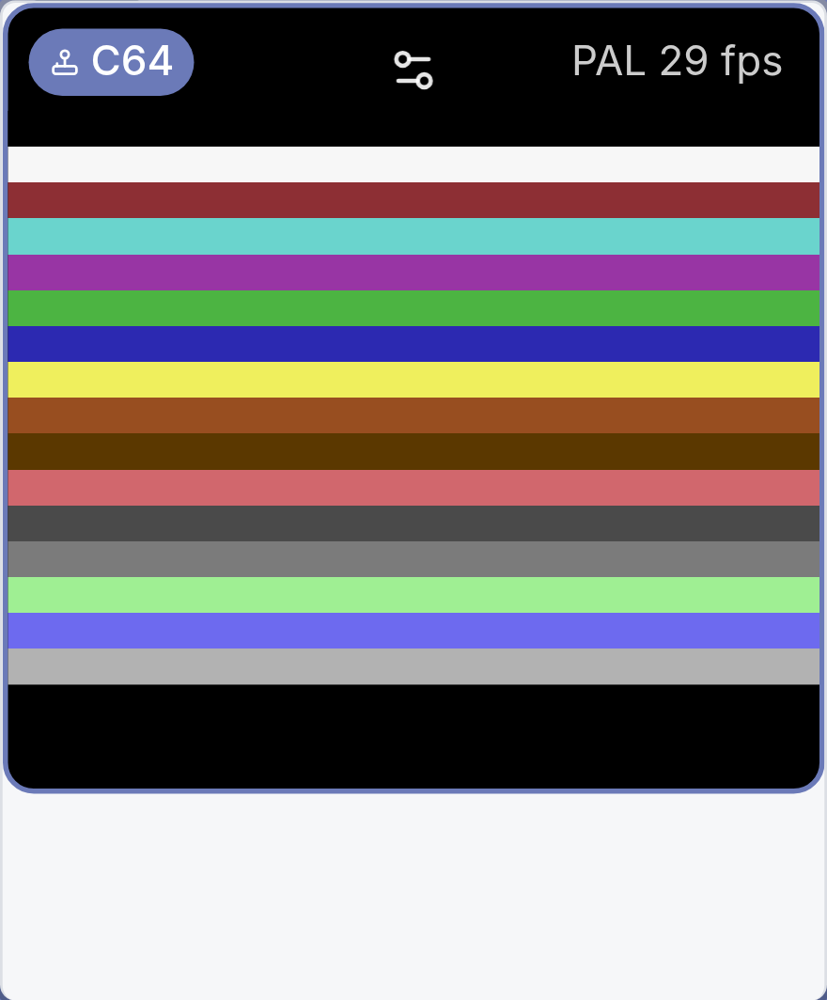

With the controls out of the way, three keys still reach everything. `#` shows or hides RETURN, SPACE, the other quick keys and the **Watch** and **Listen** switches over the bottom of the picture. `*`, or the menu key, switches between driving the C64 and adjusting the view. **Back** leaves.

The floating **Show controls** button, marked with two small sliders at the top of the picture, brings the toolbar back.

Playing on a television instead? Turn **Watch** off once, and Game Mode keeps opening without the picture. The controls fill the space, so it is never blank.

With the joystick **Hidden** and the picture off, there is nothing to draw, so Game Mode says the picture is off and shows the **Watch** and **Listen** switches and the quick keys, all reachable without a touchscreen. The game keeps taking your keys all the while. Turn **Watch** on and the picture takes the space instead.

**Exit**, on the Game Mode toolbar, takes you back to the full Remote Input screen. Your device's Back button closes the sheet and lets go of everything you were holding. When the sheet closes, the picture and sound stop if Game Mode started them; if they were on before, they keep running.

#### Steering with the number keys

The four keys around **8** steer, and **8** itself fires. They form a diamond your thumb can find without looking:

| Key | Direction |
| --- | --- |
| 5 | Up |
| 7 | Left |
| 9 | Right |
| 0 | Down |
| 8 | Fire |

The mapping turns with your phone. Hold it sideways like a gamepad and the keys follow, so up is always up. The picture turns with you, and the rest of the app stays upright:

| Held | Up | Left | Right | Down | Fire |
| --- | --- | --- | --- | --- | --- |
| Upright | 5 | 7 | 9 | 0 | 8 |
| Turned right | 7 | 0 | 5 | 9 | 8 |
| Turned left | 9 | 5 | 0 | 7 | 8 |

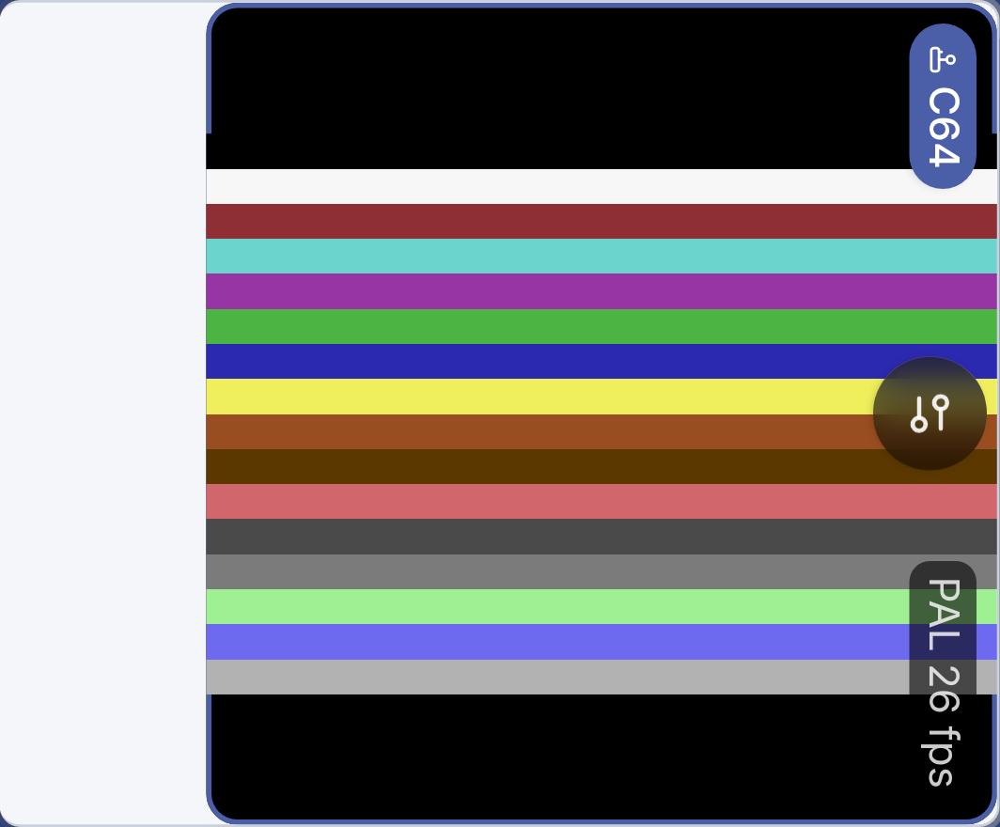

Lying down, or the sensor cannot tell which way up the phone is? The **Orientation** control in Game Mode's toolbar pins the mapping. Choose **Auto**, **0°**, **90°** or **270°**. The choice lasts while the sheet is open, and is forgotten afterward.

To use different keys, open **Settings → Play and Disk → Joystick keys**. It offers **Diamond (8-centred)**, the layout above; **Classic T9**, with 2, 4, 6 and 8 to steer and 5 to fire; and **Custom**, where you press the key you want for each direction. Set it up holding the phone upright; every other way round follows from that.

### File Sources

Everything you play or mount comes from a **source**. Each source has its own picker, so a wrong turn never lands you somewhere unexpected.

- **Local**: files and folders on the phone running the app.
- **C64U**: files on the Commodore 64 Ultimate, reached over FTP.
- **HVSC**: the High Voltage SID Collection, the great archive of C64 music. Choose it once from **Add items**, and it downloads and indexes itself. A card at the foot of the Play page shows how far it has got, and lets you start, stop or reset it by hand. After that the app watches for updates by itself; **Settings → HVSC** sets where it downloads from and how often it looks. When you browse it, you see song lengths and the tunes inside each file.
- **CommoServe**: an online archive you search by name. Pull disks and programs straight into a playlist or disk collection. Set its address in **Settings → Online Archive**.

### A Setting Just for One Item

Some titles want the machine set up a certain way: no cartridge, a different processor speed, the joystick in the other port. Instead of remembering that every time, attach a device configuration file to the playlist item. The app applies it just before that item runs.

Open a playlist row's menu and choose **Review playback config**. If a `.cfg` file sits beside the program, in its folder, or in a folder above it, the app has already found it. It lists each one as a candidate and says how sure it is, with a file of the program's own name first. Take one, or attach your own file from this device or from your C64.

The status line says where things stand: **No config**, **Found nearby, none chosen**, **Config resolved**, **Config edited**, or **Config declined**. **Edit values** changes single settings on top of the file, **Re-discover** looks again after you have moved files, and **No config** tells the app to stop offering.

### Drives and Disk Images

C64U Remote gives your C64 two disk drives and a Soft IEC drive. Each has its own card on the **Disks** page, a small control panel all of its own.

- **Power** turns the drive on or off. A drive must be **on** before it can mount anything.
- **Bus ID** is the number software uses to find the drive. The first drive is 8 by tradition; the device tells the app which numbers it accepts.
- **Drive Type** should match the disk: a 1541 for D64 and G64, a 1571 for D71 (it reads D64 too), a 1581 for D81. This list comes from the device, so a machine that offers more types shows them.
- **Reset** restarts the drive's own processor. It is the gentlest way to bring a confused drive back without disturbing the C64.

You will rarely set any of this by hand. When you start a disk from Play, the app switches the drive on if it is off, and changes its type if the current one cannot read the disk. A change of type is announced, so you know your drive setup was altered.

A disk that already lives on the Commodore 64 Ultimate mounts where it is. A **Local** disk is copied across first. Whatever a program writes to it comes back to your own file when you eject, so your high scores and saved games are safe.

A disk from the online archive has no file of yours to go back to. Its changes last only while the app is running, and ejecting it offers **Save a local copy**.

Once a disk is mounted, there are two ways to start it, and **Settings → Play and Disk → Disk first-PRG load** chooses between them. **Classic KERNAL load** does what you would type yourself: `LOAD"*",8,1` and `RUN`. **DMA** lifts the first program off the disk and writes it straight into memory, which is much quicker.

A few loaders do not like arriving that way. If a disk that used to start no longer does, try the classic route.

For a title that spans several disks, keep the images together in one **group**. Adding a folder does this for you, from the file names or the folder itself; move any stragglers by hand. A group puts **rotate** controls on the drive card, so when a program asks for the next disk, you swap it right there.

The **Soft IEC** drive works differently. Point it at a folder on the device, and your C64 reads the loose files inside it directly. That suits a big collection that was never packed into disk images.

### Content Explorer

Content Explorer is this guide's name for three features that reach the programs *inside* a disk image and start them safely. Each has its own switch in Settings; the line at the end of each section tells you whether it is already on.

#### Looking Inside a Disk

Mounting a disk image gives you the whole disk. Disk Explorer looks *inside* it, so you can pick one program and start it. On **Disks**, open the menu of a `.d64`, `.d71` or `.d81` image and choose **Open (Disk Explorer)…**.

You see every file on the disk with its type, its size in blocks, a **locked** tag if it is write-protected, and, for a program, its load address.

Each program offers three actions:

- **Run** loads the program into the C64's memory and starts it.
- **Load** loads it into memory without starting it, handy for monitors and development.
- **Mount & Load** mounts the whole disk, resets the machine, waits for BASIC, then types the LOAD and RUN for you. Choose it for titles that load in several stages.

Only a proper **PRG** program can be started this way. Other file types show a short note saying why not. An unclosed "splat" file, one that was never finished being written, cannot be started either.

_Availability: on by default. Turn it off under **Disk Explorer** in Settings → Stable Features._

#### Launch Safety

Some machines have a freezer cartridge set up, such as an Action Replay or Retro Replay. On those, starting a program directly can land you in the cartridge's own menu.

Launch Safety prevents that. Around a direct **Run** or **Load**, it *parks* the cartridge, then puts it back. It never changes the device's saved settings, so a power cycle always brings the cartridge back. With no cartridge set up, it does nothing at all.

**Mount & Load** resets the machine anyway, so Launch Safety leaves it alone. All of this happens by itself; there is nothing to press.

While Launch Safety is on, one more option appears in **Settings → Play and Disk**: **Answer cartridge boot menu after reset**. It starts off, and helps in one rare case: a cartridge that shows a boot menu when the machine resets, and so swallows the LOAD that Mount & Load types.

Turn it on, then choose the **menu key** (F1 to F8, RETURN, or SPACE; F7 to begin with) and a **boot settle** time between 1000 and 8000 milliseconds (2800 to begin with). After the reset, the app presses that key to clear the menu. Leave it off unless you have such a cartridge.

_Availability: on by default. Turn it off under **Launch Safety** in Settings → Stable Features._

#### Creating a Blank Disk

Need a fresh disk to save to? Open **Disks** and choose **New disk**, which formats a blank image on the device. Pick the **type**: D64 (1541), D71 (1571), D81 (1581), or DNP (CMD native). Give it a **file name**, and a **disk label** of up to 16 characters, which copies the file name unless you change it.

For a D64, set the number of **tracks**, 35 to 41; 35 is the usual choice. A DNP needs a number between 1 and 255. D71 and D81 need neither.

Last, type the **storage folder** on the device. It starts at `/USB0`; the top-level `/` lists drives and holds no files. **Create & mount** builds the image, adds it to your collection, and mounts it in Drive A, ready to use.

_Availability: on by default. Turn it off under **New disk** in Settings → Stable Features._

### RAM Snapshots

A RAM snapshot is a copy of what is in your C64's memory right now, saved onto your phone so you can put it back later. Think of it as a save button for programs that have none of their own.

You find both buttons in **Home → Quick Actions**: **Backup** to capture, **Restore** to put it back. These are not the same as **Save** and **Load** on the Config card, which store your machine's settings rather than its memory.

Your device must be connected and idle. The app pauses the machine while the memory crosses the network, then lets it carry on, so a running program is not disturbed.

When you tap **Backup**, the app asks which part of memory to capture:

- **CPU + RAM snapshot** freezes the running program and stores the whole 64K of memory together with the processor's registers, so the program can pick up exactly where it stopped. It suits BASIC and unhurried programs; a fast game may not resume cleanly. Some machines and programs will not give up their processor state; the app then says so and suggests a Program snapshot. Once in a while a program stays frozen afterward, and the app tells you that too. Restore it, or reset the machine.
- **Program Snapshot** stores almost all of memory (everything but the stack). A good all-round choice.
- **Basic Snapshot** stores only the BASIC program and its variables.
- **Screen Snapshot** stores the current screen and its colors.
- **Custom Snapshot** lets you type the exact address ranges you want.

Snapshots live on your phone, not on the C64. Each is named after its type, date and time; if something is playing, its title becomes the label. You can add or change a **Comment** later. The app keeps a hundred and drops the oldest when it runs out of room.

**Restore** opens your snapshot library. Filter it by name or type, then tap a snapshot to put it back. The app asks you to confirm first, because restoring overwrites that memory on the C64.

It writes only the bytes the snapshot holds, and leaves the CIA timers alone, so the cursor blinks as usual. A CPU + RAM snapshot resumes the program where it stopped; if that proves impossible, the app restores the memory alone and tells you.

The library is also where you edit comments and delete snapshots you no longer need.

_Availability: on by default. Turn it off under **RAM snapshots** in Settings → Stable Features._

### The Virtual Printer

Your C64 prints over the serial bus, and the machine provides the printer itself. There is no box to buy and nothing to plug in. **Home → Printers** turns it on, picks the **emulation** (a Commodore MPS, for example), and sets the **bus ID**, the **output type**, the **ink density** and the character sets. **Reset** clears the printer and starts a fresh page.

One more control, **Flush/Eject**, finishes the current page and sends it on. It works through the Telnet menu service; turn on **Home printer shortcut actions** in Settings → Experimental Features to see it.

### Configuration and Saving

Your machine keeps two copies of its settings: the **live** ones it is using now, and a **flash** copy it loads at power-on. Every change you make, on Home, on Disks, or in Config, goes live at once. It survives a reboot or power cycle only once it reaches flash.

Turn on **Keep device settings after a restart** in **Settings → Device Safety** to have the app save every device setting it changes, or use **Save** in the Config card to write the current settings to flash once.

The machine's own **Auto save config** does not cover this. It decides whether the machine saves changes you make in its on-screen setup menu, and has no effect on changes made from the app.

Set it on the Commodore 64 Ultimate at **C= + RESTORE → User interface → Auto save config**; the same setting appears in Config as **User interface → Auto save config**.

Beside **Save** on the **Config** card are **Load** from flash, **Reset** to the factory settings, and **Revert**, which puts back the settings the device had when the app first connected to it. The app also keeps its own named **configuration snapshots** on the phone, apart from the device's flash. Save a setup you like, and load the whole thing back whenever you want it.

### Switching Between Devices

If you have saved more than one Commodore 64 Ultimate, **Switch device** lets you hop between them without opening Settings.

With more than one device saved, there are three ways to open it:

- **Long-press the header badge** (a short tap opens Diagnostics instead).
- Press **`#`** on a hardware keyboard or keypad.
- Choose **Switch device** in the Quick menu.

The switcher checks each saved device for you, and again every ten seconds while it is open. Each row shows the name, a status pill (**Selected**, **Verifying**, **Offline** or **Mismatch**), a health badge, and a short note, such as how many checks passed or when the device was last seen. The device you are using is highlighted.

Tap the chevron to open a row and read the checks one by one. That tells a sleeping device from one that cannot be reached at all. These checks are gentle: they try the web and FTP services and read a setting without changing it. For the full round, Telnet included, use **Run health check** in Diagnostics.

Tap a device to switch to it. First the app lets go of any keys you were holding on the old device and stops following its playback. Then it points itself at the new device's address and ports, and checks that it answers. Meanwhile the new device shows a **Verifying** pill; once it responds, it becomes the active device.

You add and edit saved devices in **Settings → Connection**, under **Saved devices**. Set each one's **Device name**, **C64U hostname / IP**, **HTTP**, **FTP** and **Telnet** ports, and **Network Password**, or delete one you no longer need.

**Save & Connect** waits for the device to answer before keeping it. With only one device saved, there is nothing to switch to, and the switcher stays out of your way.

### Reading Diagnostics

Diagnostics slides up from the bottom of the screen. Open it by tapping the header badge, pressing `*`, choosing **Diagnostics** in Settings, or tapping any error notification.

The panel has three parts, from top to bottom:

- The **health header** shows the state (Healthy, Degraded, Unhealthy, Idle, Unavailable, or Offline when there is no connection), which device it is about, and when it was last checked. Tap **Run health check** to test the connection now. The check tries the web, FTP and Telnet services, then three signals from the C64 itself: CONFIG, RASTER and JIFFY. Each reports its own result and timing, beside the overall latency. Open the header to read them one by one.
- The **Filters** bar says how much of the activity you are seeing, and opens the filter editor. Filter by device, by kind of activity (Problems, Actions, Logs, Traces), by where it came from (App, REST, FTP, Telnet), or by severity (Errors, Warnings, Info). The editor also has five one-tap shortcuts: **Errors only**, **Problems only**, **REST**, **FTP**, and **Reset**.
- The **Activity** list gathers problems, actions, logs, and traces together. Problems give a plain-language summary; Traces show the timing and order of requests. Tap any row for the full details.

The CONFIG probe writes as well as reads. It changes a live setting for a moment, reads it back to make sure the device applied it, then puts the original value back.

On a machine with lights, in the case or the keyboard, you will see them **pulse once** as the check runs: a little heartbeat that says the connection is alive. On a machine without lights, it nudges a mixer volume instead, for about a twelfth of a second.

The three-dot menu in the corner holds the rest: connection details, health history, latency, the REST, FTP and Config heat maps, config drift, decision state, **Key Explorer**, a shortcut to **Manage devices**, and Share and Clear.

### Sharing a Diagnostics Report

When something goes wrong, the best clues are usually the last few actions before it. So share them before you clear anything or restart the app. The activity list is rebuilt each time you open Diagnostics, and **Clear all** wipes it for good.

To share a report about a recent error:

1. Open **Diagnostics**.
2. Tap **Run health check**, so the report includes a fresh connection test.
3. Use the **Errors only** or **Problems only** filter to check the failure is there.
4. Open the three-dot menu and choose **Share all** for the full report, or **Share filtered** for a plain list of just the rows you filtered to.
5. Pick an app in the share sheet (mail, chat, or notes) to send or save the report.

**Share all** produces a small ZIP file holding the app's logs, traces, errors and recent actions, a health snapshot, and details of your app version, your phone, and the active C64: its name, host address and firmware. Your network password is never in it. Its hostname or IP address may be, so send it only to people you trust, or to support.

Afterward, use **Clear all** for a clean slate. It asks you to confirm, then shows **Diagnostics cleared**.

## Safe Device Use

C64U Remote talks to the Commodore 64 Ultimate with ordinary REST, FTP and Telnet requests. Even so, the firmware can stop answering under some network conditions. The app lowers that risk by pacing its requests and telling you when something fails.

A few good habits:

- Give a busy device time. Do not send the same command again while it is still working.
- Drop to Conservative for a first setup, for Wi-Fi, or for firmware you do not yet trust.
- If the web, FTP and Telnet services all stop answering while ping still works, power-cycle the Commodore 64 Ultimate.

**Device Safety** in Settings decides how hard the app pushes the device. Its five modes trade speed for caution: they limit how many requests run at once, space them out, and set how long the app remembers an answer and how long it waits after a failure.

Leave it on **Auto**, which reads the model and firmware and picks for you. The full list is in [Device Safety Modes](#device-safety-modes). **Relaxed** asks you to confirm, and shows a banner while it is on.

The same chapter also lets you change every number behind those modes: discovery windows, timeouts, how many requests may run at once, cooldowns, backoff, and the circuit breaker. Leave them alone unless you are chasing a particular fault.

Changing the CPU speed can drop the network for a moment while the device applies it. Just wait for the app to reconnect.

## Troubleshooting

Find your symptom below. If none fits, open Diagnostics. It records what the app asked for and what came back, and that usually shows where the trouble is.

### Discovery finds nothing

- Check that both devices are on the same network.
- Check that Web Remote Control Service is turned on.
- Enter the hostname or IP address by hand.
- If the hostname does not work, try the IP address.

### Password required

Enter the network password set on the Commodore 64 Ultimate. If the saved password stops working, the app asks again.

### File browsing fails

- Check that FTP File Service is turned on.
- Check the FTP port in Settings.
- If the device was restarted, reconnect from Settings.

### Playback does not start

- Check that the device is connected and healthy.
- Check that the file type is one the app plays.
- For local files, choose the source again if Android storage permission was lost.
- For disk images, look at the drive's card on **Disks** for an error message.

### Controls look disabled

Some controls appear only when the connected device can use them. Others are grayed out while something is running, or when there is nothing for them to act on.

### Remote Input joystick is unavailable

The **Joystick** tab is grayed out unless the connected device offers the `machine:input` endpoint; the sheet then opens on **Keys**.

- Confirm the Commodore 64 Ultimate is running firmware 1.2.0 or newer, which is where the endpoint arrives.
- If the device has a password, enter it in Settings; Joystick and Keys both need it.
- Otherwise, **Keys** types through the C64 keyboard buffer, which suits BASIC but not most games.

### Device stops answering

Open Diagnostics if you can, and look at the recent REST, FTP and Telnet activity. If HTTP, FTP and Telnet all refuse to connect while ping still works, switch the Commodore 64 Ultimate off and on again.

## Appendices

The rest of this guide is for looking things up: the numbers, the defaults, and exactly where to find each thing.

### Feature Reference

The best place to look is listed first, in bold.

| Feature | Where to find it | Notes |
| --- | --- | --- |
| Connect to a device | **Startup discovery**, Settings → Connection | Let startup discovery find it first. Use Settings for later changes. |
| Manual host/IP entry | **No C64 found** at startup, Settings → Connection | The startup prompt is quickest the first time. Settings is for looking after saved devices. |
| Network password | **Startup prompt or auth popup**, Settings → Connection | The app asks only when needed. |
| Switch saved device | **Header badge long-press / `#`**, Settings → Connection | **Switch device** to change; Settings to edit. |
| Menu / Pause / Reset | **Home → Quick Actions** | The everyday controls. |
| Reboot | **Home → Quick Actions → Power** | In the Power sheet, with the other heavier controls. |
| Power Off | **Home → Quick Actions → Power** | Shown where the device can do it. To turn it back on, use the machine itself. |
| Power Cycle | **Home → Quick Actions → Power** | On by default. Turn it off under **Home power cycle action** in Settings → Experimental Features. |
| Clear-RAM reboot | **Home → Quick Actions → Power** | On by default. Turn it off under **Home clear-RAM reboot action** in Settings → Experimental Features. |
| Backup / Restore | **Home → Quick Actions** | On by default. Turn it off under **RAM snapshots** in Settings → Stable Features. |
| Game Mode | **Home → Quick Actions**, Play (while an item plays), `0` | In the first band of Quick Actions, labeled **Game**. Opens the controller with the picture and sound as you last left them. |
| Remote Input | **Home → Quick Actions**, Play (while an item plays) | On by default. Turn it off under **Remote Input** in Settings → Stable Features. Joystick works where the machine offers the `machine:input` endpoint, which arrives with firmware 1.2.0; otherwise only Keys are available. |
| CPU speed and turbo | **Home → CPU & RAM**, Config | Home is preferred for common changes. |
| Video mode and scan lines | **Home → Video**, Config | Home is preferred. |
| Joystick, serial bus, cartridge, user port | **Home → Ports**, Config | Home is preferred. |
| Case and keyboard lights | **Home**, Config | A card of their own, after User Interface. |
| Drive power, bus, type, reset | **Disks**, Home → Drives | Disks for the drives themselves; Home for a quick look. |
| Mount and eject disks | **Disks**, Home → Drives | Disks shows the collection most clearly. |
| Disk groups and rotation | **Disks** | Groups are assigned as you add a folder; rotate from the drive card. |
| Soft IEC folder | **Disks** | Read loose files from a folder on the device, with no disk image at all. |
| Printer controls | **Home → Printers**, Config | Home is preferred. |
| SID mixer | **Home → Audio**, Config → Audio Mixer | Home is preferred for live mixing. |
| Streams | **Home → Streams**, Config | Visible when the device exposes streaming support. |
| Save/load device config | **Home → Config** | Save writes the current settings to flash. Keep device settings after a restart does it for you. |
| App-stored config snapshots | **Home → Config** | Named setups kept by the app, apart from the device flash. |
| Disk Explorer (launch a program inside a disk) | **Disks → disk menu → Open (Disk Explorer)** | On by default. Turn it off under **Disk Explorer** in Settings → Stable Features. |
| Create a blank disk | **Disks → New disk** | On by default. Turn it off under **New disk** in Settings → Stable Features. |
| Launch Safety (cartridge parking) | Automatic; boot-menu answer in **Settings → Play and Disk** | On by default. Turn it off under **Launch Safety** in Settings → Stable Features. |
| Live View (hear and see the machine) | **Home → Live View**, Play, Remote Input | On by default. Turn it off under **Live View** in Settings → Stable Features. |
| Live View: Listen | **Home → Live View**; switch in Settings → Experimental Features | On by default. Turn it off under **Audio Mirror** in Settings → Experimental Features. |
| Live View: Watch | **Home → Live View**; switch in Settings → Experimental Features | On by default. Turn it off under **Video Mirror** in Settings → Experimental Features. |
| Live View checks (A/V sync, tap latency, tone ladder) | **Home → Live View** | On by default. Turn it off under **A/V sync tests** in Settings → Experimental Features. |
| Advanced config file actions | **Home → Config** | Off to begin with. Turn it on under **Home advanced config actions** in Settings → Experimental Features. |
| Advanced drive shortcuts | **Home → Drives** | Off to begin with. Turn it on under **Home drive shortcut actions** in Settings → Experimental Features. |
| Advanced printer shortcuts | **Home → Printers** | Off to begin with. Turn it on under **Home printer shortcut actions** in Settings → Experimental Features. |
| Full configuration tree | **Config** | Use search, open a category, edit rows. |
| Add playlist items | **Play → Add items** | Sources: Local, C64U, HVSC, CommoServe. |
| Playback controls | **Play** | Play, stop, pause, previous and next, shuffle, repeat, reshuffle, volume. |
| Sleep timer, default duration, songlengths file | **Play** | Beneath the transport controls. |
| Per-item playback config | **Play → item menu** | Apply a device configuration before one playlist item runs. |
| HVSC preparation | **Play → Add items**, card at the foot of Play | On by default. Turn it off under **HVSC downloads** in Settings → Stable Features. Settings → HVSC holds the mirror and the update check. |
| SID Radio | **Play → SID Radio** | Endless stations of similar tunes. Settings → SID Radio tunes it. |
| CommoServe | **Play → Add items**, Disks → Add disks, Settings → Online Archive | On by default. Turn it off under **CommoServe** in Settings → Stable Features. |
| Demo Mode | **Settings → Connection** | On by default. Turn it off under **Demo Mode** in Settings → Stable Features. Offered when there is no network (see Starting With No Network), and when no C64 Ultimate answers; **Automatic Demo Mode**, in the same section, turns that second offer off. **Preview Demo Mode**, in the same section, switches to it at any time, and **Use the simulated device** appears behind the connectivity badge whenever the app is offline. |
| Background playback scheduling | **Play**, Android app permissions | On by default. Turn it off under **Background Execution** in Settings → Experimental Features. |
| Display profile, theme, style, text size, card descriptions, orientation | **Settings → Appearance** | Screenshots in this manual use the compact profile, the smallest screen the app supports. |
| Settings transfer (export and import) | **Settings → Diagnostics** | App settings, feature switches and safety tuning. Saved devices and passwords stay behind. |
| Notification style and duration | **Settings → Notifications** | Show everything, or errors alone. |
| Device Safety | **Settings → Device Safety** | Leave it on Auto. Auto keeps a Commodore 64 Ultimate on Conservative until its firmware is known to be safe. See Device Safety Modes. |
| Keep device settings after a restart | **Settings → Device Safety** | Off at first: changes apply at once, and a power cycle undoes them. See Making settings stick. |
| Screen colors (palette) | **Home → Video → Screen colors** | Apply to this device, the C64, or both. |
| Diagnostics | **Header badge / `*`**, Settings → Diagnostics | The badge is quickest. |
| Logs, traces, errors, health checks | **Diagnostics** | Filter to find it; Share to send it. |
| Built-in help | **Docs** | Quick reminders inside the app. |

### Keyboard and Directional Input Reference

On by default. Turn it off under **Keyboard and keypad navigation** in Settings → Experimental Features. Directional navigation answers to D-pad keys, arrow keys, and hardware keyboards.

While you are steering by keys, a bar along the bottom shows where you are and what the keys under your thumb will do: Back, Exit, Done or Close on the left; Open, Activate, Edit, Select, Toggle, Adjust or Switch in the middle; Menu on the right where there is one; and, on Home and Play, a reminder that `0` starts Game Mode.

#### Directional Pad

| Key | What it does |
| --- | --- |
| Up / Down | Move through the current page, card, list, or dialog in reading order; the tab bar comes last. |
| Left / Right | Adjust sliders, tabs, and segmented controls. Otherwise move to a nearby control. |
| OK / Center / Enter | Enter a group, open a select, press a button, or toggle a switch. |
| Back / Escape | Close the top dialog, leave a field, leave a group, or go back. |
| Menu / Context Menu | Open the focused item menu; if none exists, open the Quick menu. |

Two keys carry most of it: **D-pad Center/OK goes in, Left Soft Key comes out**, and **Right Soft Key opens choices**. F1 and F3 are separate shortcuts you can set yourself; they never stand in for the soft keys.

#### Number Keys

Outside text fields, the number keys jump to pages, **8** and **9** pause and reset the machine, and **0** goes straight to playing. An open dialog or sheet keeps them for itself:

| Key | What it does |
| --- | --- |
| 1 | Home |
| 2 | Play |
| 3 | Disks |
| 4 | Config |
| 5 | Settings |
| 6 | Docs |
| 7 | Search |
| 8 | Pause or resume the machine |
| 9 | Reset the machine |
| 0 | Game Mode |

`7` opens search even with **Keyboard and keypad navigation** switched off.

#### Function Keys

| Key | What it does |
| --- | --- |
| F1 | Run its normal-navigation assignment (default: Play/Pause) |
| F3 | Run its normal-navigation assignment (default: Next tune) |

Change either one in **Settings → Play and Disk → Remote function keys**. A function-key shortcut acts without changing page. While a C64 keyboard or joystick screen has the keypad, it sends the C64 key with the same label instead. **The Commodore key is not bound yet.** To see what your own keys send, open **Diagnostics → Key Explorer** and press one.

#### Star and Pound

| Key | Outside text fields | Inside text fields |
| --- | --- | --- |
| `*` | Open Diagnostics | Switch the case of the last letter; in host fields, cycle separators such as `.`, `:`, `-`, `_`, `/` |
| `#` | Open **Switch device** when more than one device is saved | Switch between letters and digits |

#### T9 Text Entry

T9 lets you type letters on the number keys in every text field: search, filters, names, passwords and hostnames.

1. Focus a text field.
2. Press a number key repeatedly to step through its letters, then pause or press another key to move on. `0` types a space.
3. Press `#` to switch between letters and digits. Host, address and folder fields start with digits; other fields start with letters.
4. Press `*` in host fields to cycle separators. In other fields, `1` steps through punctuation and symbols such as `@`, `#` and `&`.
5. Press the Right Soft Key to delete the last character. The guidance bar shows **Delete** while it does.
6. Press OK when you are done. In a field on a page, OK and Back both leave the field.

For hostnames, this makes entries such as `c64u` and `192.168.1.64` practical without a touchscreen.

#### Quick menu

There are two ways in. Press **Menu** when the selected control has no menu of its own, and the Quick menu lists **Search** on `7`, the six pages with the number key for each, **Pause / Resume machine** on `8`, **Reset machine** on `9`, Game Mode on `0`, Diagnostics on `*`, and **Switch device** on `#` when more than one device is saved.

Or tap the three-dot **Quick menu** button in the top bar, beside the health badge. Opened that way, the menu skips the page jumps and offers the actions for the page you are on.

Either way, **Search** comes first.

On a page built from cards, both also offer **Expand all sections**, **Collapse all sections**, and **Show card descriptions** (**Hide card descriptions** once they are on). Both section entries are always listed, so each stays in the same place; the one that would do nothing is grayed out.

### File and Source Reference

| Source | Used in | Meaning |
| --- | --- | --- |
| Local | Play, Disks | Files and folders available on your phone. |
| C64U | Play, Disks | Files on the Commodore 64 Ultimate through FTP. |
| HVSC | Play | On by default. Turn it off under **HVSC downloads** in Settings → Stable Features. SID library browsing after preparation. |
| CommoServe | Play, Disks | On by default. Turn it off under **CommoServe** in Settings → Stable Features. Online archive search. |

Play accepts SID, MOD, PRG, CRT, D64, G64, D71, G71, and D81 files. The disk collection holds disk images only: D64, G64, D71, G71, and D81, plus any DNP image you make with **New disk**.

| Format | Kind | Notes |
| --- | --- | --- |
| SID | Music | One or more tunes; durations shown when songlength data is available. |
| MOD | Music | Amiga-style tracker module. |
| PRG | Program | A single loadable program. |
| CRT | Cartridge | Cartridge image; started as if you inserted a cartridge. |
| D64, G64 | Disk | 1541 single-sided disk image. |
| D71, G71 | Disk | 1571 double-sided disk image. |
| D81 | Disk | 1581 3.5-inch disk image. |

### Network Ports and Services

These are the defaults the app expects. If yours differ, change them for that device in **Settings → Connection**.

| Service | Default port | Used for |
| --- | --- | --- |
| Web Remote Control (REST) | 80 | Control, status, and configuration. Required. |
| FTP File Service | 21 | Browsing and transferring files, playlists, and disks. |
| Telnet Remote Menu | 23 | Advanced menu-backed actions, when those are enabled. |

### Device Safety Modes

Set the mode in **Settings → Device Safety**. More requests at once is faster, but pushes the device harder. Each mode also sets caching, cooldowns, and backoff.

| Mode | Requests at once | Use it when |
| --- | --- | --- |
| Auto | Chosen for you | The one to leave it on. Reads the firmware and picks Conservative or Balanced, and stays on Conservative until it knows. |
| Relaxed | Up to 3 | The device and network have proved fast and steady, and you accept the higher risk. Asks you to confirm. |
| Balanced | Up to 2 | A Commodore 64 Ultimate on firmware later than 1.1.0. |
| Conservative | 1 at a time | A first setup, Wi-Fi, or firmware you do not yet trust. The safest of the five. |
| Troubleshooting | 1 at a time | You are chasing a fault and want the extra debug logging. |

### Drive Types and Disk Formats

Set the drive type on the **Disks** page to match the disk you are mounting. The list comes from the connected device, so a machine that offers more types shows them.

| Drive type | Disk images | Description |
| --- | --- | --- |
| 1541 | D64, G64 | Single-sided 5.25-inch drive, and the one most software expects. |
| 1571 | D71, G71, D64 | Double-sided 5.25-inch drive. Reads a 1541 disk as well. |
| 1581 | D81 | High-capacity 3.5-inch drive. |

### Snapshot Types and Memory Ranges

**Backup** offers these capture types. The app keeps up to 100 snapshots on your phone and drops the oldest once that fills.

| Snapshot | Captures | Memory range |
| --- | --- | --- |
| CPU + RAM | All of memory plus the processor registers, so the program can pick up where it stopped. Filed under Program in the library. Some machines and some programs decline; the app says so and suggests a Program snapshot. | $0000–$FFFF + registers |
| Program | Almost all of memory, skipping the stack. A good all-round choice. | $0000–$00FF, $0200–$FFFF |
| Basic | The BASIC program and its variables. | $002B–$0038, $0801–$9FFF |
| Screen | The current screen and its colors. | VIC bank, $D000–$D02E, $D800–$DBFF, $DD00–$DD01 |
| Custom | Exactly the address ranges you type. | User-defined |

### Health Check Probes

Run a health check from **Diagnostics**. Each probe reports its own result and timing.

| Probe | What it checks |
| --- | --- |
| REST | The Web Remote Control service answers. |
| FTP | The FTP file service answers. |
| Telnet | The Telnet menu service answers. |
| CONFIG | Writes a live setting, reads it back, and restores it, proving the device applies changes. A machine with lights pulses them once; one without nudges a mixer volume instead. |
| RASTER | The VIC-II raster line is moving, so the video chip is running. Recorded as skipped where the device does not expose it. |
| JIFFY | The KERNAL jiffy clock is ticking, which also reports the machine's uptime. |

### Status and Safety Reference

| Signal | Meaning | Best next step |
| --- | --- | --- |
| Healthy badge | The selected device is responding. | Continue normally. |
| Degraded badge | Some check or recent activity suggests trouble. | Open Diagnostics. |
| Unhealthy badge | The selected device is not responding correctly. | Run a health check; verify network services. |
| Offline state | No live connection is active. | Use discovery, manual host entry, or Settings → Connection. |
| 401/403 password prompt | The device requires its network password. | Enter the network password set on the Commodore 64 Ultimate. |
| TCP refused while ping works | The network stack on the Commodore 64 Ultimate may be stuck. | Stop traffic and power-cycle the device. |
| CPU-speed network drop | Firmware may briefly drop network while applying clock changes. | Wait for reconnect before changing more settings. |
