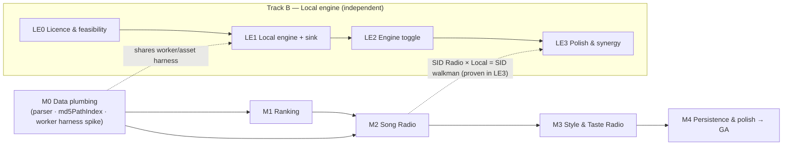

# SID Radio — endless stations of similar SIDs from your rankings

**Status:** Specification (convergence pass 2026-07-24). Implementation order & execution protocol: see `prompt.md`; live task board: `PLANS.md`; append-only history: `WORKLOG.md`.
**Feature flags:** `sidRadioEnabled` (master), `sidRankingEnabled` (the Like / Not-for-me affordance), `localPlaybackEnabled` (the on-device engine — see §12). Canonical names & storage keys: **§0.4**.
**Data dependency:** [`chrisgleissner/sidflow-data`](https://github.com/chrisgleissner/sidflow-data) — the **Tiny** `sidcorr-tiny-1` similarity export (~1.8 MB).
**Code dependency (§12):** [`libsidplayfp/libsidplayfp`](https://github.com/libsidplayfp/libsidplayfp) — GPL-2.0-**or-later** SID player, for on-device playback.

> **Naming.** The user-facing name is **SID Radio**. The obvious "SID Station" is
> avoided because **"SidStation" is a registered Elektron trademark**
> (<https://en.wikipedia.org/wiki/Elektron_SidStation>). The plan folder keeps its
> internal name `docs/plans/sid-station/`; nothing user-visible says "station" as a
> product name. Individual **stations** (e.g. "Fast-Paced Radio") are still called
> stations generically — that word is not the trademark; the compound "SidStation" is.

> **Goal.** Turn the tunes a user likes — and the moods they're in — into an
> **endless, self-refilling queue of similar SIDs**, launched in **one tap**, riding
> entirely on the **existing Play engine**. It must feel like a small, delightful
> convenience layered onto playback, never a second media app.

---

## 0. Reading guide, definitions & canon (read this first)

This section exists so the rest of the spec has **one** source of truth for names,
gates, and ordering. Anything below that disagrees with §0 is a bug in the spec.

### 0.1 How to read this spec

- **§1–§3** — _what_ we build and the data behind it (stable; already validated against
  the `sidcorr-tiny-1` spec).
- **§4–§6** — the principles, UX, and architecture that constrain _how_.
- **§7** — the **test-first rollout**: each milestone leads with the tests/fixtures that
  define "done", then the implementation, then a **test-shaped exit gate**.
- **§8** — the consolidated test strategy & shared fixtures the milestones draw on.
- **§9** — **performance budgets + the Pixel-4 → C64U HIL** that assert them on real
  hardware (mirrors the Live View harness).
- **§10–§11** — risks and the (now-resolved) decisions.
- **§12** — the parallel **on-device playback engine** (its own test-first LE-series).
- **Appendix A** — verified existing touchpoints.

### 0.2 Glossary (used consistently throughout)

| Term              | Meaning                                                                                                                         |
| ----------------- | ------------------------------------------------------------------------------------------------------------------------------- |
| **Station**       | An endless, self-refilling ordered queue of similar SIDs. Three seed kinds: **Song / Style / Taste**.                           |
| **Seed**          | The starting point that produces a station: a tune's `md5_48`, a style bit, or the set of liked tunes.                          |
| **Candidate**     | An `(md5_48, song_index)` a station has scored and ordered but not yet resolved to a path.                                      |
| **Resolved item** | A candidate turned into a `PlaylistItem` via `md5PathIndex` (playable).                                                         |
| **Ranking**       | The user's **Like ♥ / Not-for-me ✕** signal, keyed by **full MD5**. Steers every station; seeds Taste Radio.                    |
| **Style**         | One of the **9 precomputed** persona/mood classifiers baked into the export bitmask. Not user-rated.                            |
| **Engine**        | _Where a SID plays_: **C64** (Ultimate, heard via the audio mirror) or **Local** (on-device WASM, §12). Orthogonal to stations. |
| **`md5_48`**      | First 6 bytes of a SID file's MD5 — the export's file-identity key.                                                             |

### 0.3 Definition of done (the completion gate)

SID Radio is **GA** when every row is green. Each milestone (§7) advances a subset; the
same table is the HIL/CI dashboard (mirrors `docs/plans/live-view` §6 red/green tracking).

| #     | Gate                                                                                                                                                                                                                     | Proven by                                                               | Milestone |
| ----- | ------------------------------------------------------------------------------------------------------------------------------------------------------------------------------------------------------------------------ | ----------------------------------------------------------------------- | --------- |
| G1    | Real `.sidcorr` bundle loads & parses on web + Android + iOS                                                                                                                                                             | §7 M0 exit; parser round-trip test                                      | M0        |
| G2    | `md5_48 → virtualPath` resolves a known HVSC tune on device                                                                                                                                                              | §7 M0 exit; `md5PathIndex` test + device probe                          | M0        |
| G3    | Parse/BFS run **off the main thread** (never block a frame)                                                                                                                                                              | §9 `engineThreadIsMain=false`; refill main-thread task < 16 ms          | M0/M2     |
| G4    | Ranking persists across restart; ♥/✕ never janks                                                                                                                                                                         | §7 M1 exit; `rankingStore` test; HIL soak                               | M1        |
| G5    | Song Radio auto-advances ≥ 30 tracks, genuinely related, no stall                                                                                                                                                        | §9 HIL continuity gate                                                  | M2        |
| G6    | ✕ skips within one track and down-weights                                                                                                                                                                                | §9 HIL skip-latency gate                                                | M2        |
| G7    | Each Style station plays on-vibe; Taste unlocks at threshold                                                                                                                                                             | §7 M3 exit; engine tests + HIL                                          | M3        |
| G8    | Station survives app restart & resumes the chip                                                                                                                                                                          | §7 M4 exit; persistence test                                            | M4        |
| G9    | All perf budgets (§9.2) MEASURED-then-PINNED and asserted on Pixel 4 → C64U                                                                                                                                              | `ci/perf/sid-radio-perf-thresholds.json` + HIL exit 1 on regress        | M2→M4     |
| G10   | Patch coverage ≥ 91 % gate; docs (manual chapter) updated                                                                                                                                                                | CI codecov + manual build                                               | M4        |
| G11   | Station is lean-back: no shuffle control, fresh each start; transport Shuffle/Repeat disabled during a station but normal for finite lists; engine deterministic given `shuffleSeed` (exact resume + reproducible tests) | `stationEngine` determinism test (§8.1) + `--shuffle-replay` HIL (§9.3) | M2        |
| G12   | Station survives an HVSC baseline/update (moved tune keeps radio; removed tune skipped)                                                                                                                                  | `md5PathIndex` re-map test (§8.1) + HVSC-update HIL soak (§9)           | M2/M4     |
| L1–L4 | Local-engine gates                                                                                                                                                                                                       | §12.3                                                                   | Track B   |

### 0.4 Naming & ID canon (single source of truth)

**Feature flags** (localStorage key → semantic constant; follow `appSettings.ts` pattern):

| Storage key                   | Semantic name          | Purpose                                               | Default (rollout → GA) |
| ----------------------------- | ---------------------- | ----------------------------------------------------- | ---------------------- |
| `c64u_sid_radio_enabled`      | `sidRadioEnabled`      | Master flag for all station UI/engine                 | **off → on**           |
| `c64u_sid_ranking_enabled`    | `sidRankingEnabled`    | The ♥/✕ affordance                                    | follows master         |
| `c64u_local_playback_enabled` | `localPlaybackEnabled` | Gates _availability_ of the Local engine toggle (§12) | **off → on**           |

> **Why the emulation default is uniform (for now).** Measured like-for-like, reSIDfp runs at 4.3×
> realtime and SIDLite at 23.8× (`AUDIO-FIDELITY-TEST.md` §6.3a). The keypad variant targets the
> **unreleased** Callback 8020, which cannot be measured — so it defaults to reSIDfp like everything
> else rather than shipping an audible downgrade on a spec-sheet projection. `variants.yaml` carries
> `default_sid_emulation_engine` per variant, so that flips with one line once gate L1 can actually
> be run.

**User-choice setting** (not a flag — a persisted selection):

| Storage key                 | Type                 | Values                   | Default                                                            |
| --------------------------- | -------------------- | ------------------------ | ------------------------------------------------------------------ |
| `c64u_playback_engine`      | `PlaybackEngine`     | `"c64" \| "local"`       | `"c64"`                                                            |
| `c64u_sid_emulation_engine` | `SidEmulationEngine` | `"residfp" \| "sidlite"` | `"residfp"` on every variant (per-variant override exists, unused) |

> The flag `localPlaybackEnabled` decides whether the engine _toggle is shown at all_;
> `c64u_playback_engine` records the user's _choice_. Never conflate them.

**Modules** (canonical paths — used verbatim in §6, §7, §12):

`src/lib/sidRadio/{sidcorrTiny,stationEngine,md5PathIndex,rankingStore,likedTunes,stationQueueProvider,sidRadioStats}.ts`,
`src/lib/sidRadio/sidRadio.worker.ts`, `src/pages/playFiles/hooks/useSidRadio.ts`,
`src/lib/playback/localSidEngine.ts`, `src/lib/playback/localSid.worker.ts`.

**`data-testid` canon** (stable selectors the HIL harness clicks & reads — §9.3):

`now-playing-like`, `now-playing-notforme`, `sid-radio-launcher`,
`sid-radio-style-<styleBit>`, `sid-radio-likes-toggle` (the "based on my likes"
composition toggle), `sid-radio-taste`, `sid-radio-surprise`, `sid-radio-chip`,
`sid-radio-stop`, `liked-tunes` (playable Liked Tunes list, §5.5),
`sid-radio-stats` (JSON blob, §9.4), `playback-engine-c64`, `playback-engine-local`.

### 0.5 Phase dependency graph



Each phase is independently shippable behind its flag and leaves the app fully working
if the next never lands. **M0's worker+asset harness is the shared prerequisite** for both
SID Radio and the Local engine — see the de-risking note in §7 M0.

---

## 1. What we are building (the concept)

A station is an endless queue that keeps playing similar tunes and quietly steers itself
from your reactions. It is defined by **two orthogonal choices**, not three fixed kinds —
this is what lets moods and taste **combine** (e.g. "Fast-Paced, from tunes I like"):

- **Seed source** — where the station starts from: a **Song**, your **Likes**, or a
  **Broad/Surprise** pick.
- **Style filter (optional)** — constrain the whole station to one of the **9 precomputed
  export styles** (Fast-Paced, Melodic, …), or leave it unconstrained.

**Your Likes always steer**, regardless of seed or style. So a Style station is not a
generic "fast-paced" firehose — it is _your_ fast-paced, biased toward what you've liked.

| Named entry                  | = Seed × Style                 | User intent                                                   |
| ---------------------------- | ------------------------------ | ------------------------------------------------------------- |
| **Song Radio**               | Song × (optional style)        | "Keep playing tunes like _this one_."                         |
| **Style Radio**              | Broad **or** Likes × one style | "I'm in a _fast-paced_ mood."                                 |
| **Taste Radio**              | Likes × (optional style)       | "Play me more of what _I_ like."                              |
| **Fast-Paced from my Likes** | Likes × Fast-Paced             | "My taste, but energetic right now." (the composed case — Q4) |

Distinct from a station, **Liked Tunes** is a plain **playable collection** of everything
you've ♥-liked (§5.5): browse it, play it directly (finite list — normal Shuffle/Repeat
apply), or un-like. It is _not_ a radio; it is also the natural seed pool for Taste
stations.

Two independent signals feed all this — do not conflate them:

1. **Export styles (precomputed, ships in the data).** Nine persona/mood classifiers
   baked into the Tiny export as a per-track bitmask. They define the **style filter** and
   admit/reject candidates. The user never rates these; they come from SIDFlow's
   audio+metadata analysis.
2. **User rankings (new, tiny, local).** A **Like ♥ / Not-for-me ✕** affordance the user
   can tap while a tune plays. These are _ambient_ — no setup, no modal, no required
   onboarding. They **populate Liked Tunes**, **seed** Taste stations, and **steer every
   station** including Style stations (Likes boost similar tunes; Not-for-me skips and
   down-weights). This is the literal "based on their rankings" in the request.

The radio metaphor is deliberate: it names a **style station** ("Fast-Paced Radio"), a
**song station** ("Radio based on _Commando_"), a **taste station** ("Radio from tunes you
like"), and every **combination** of the two with one word everyone already understands.

---

## 2. The data: the Tiny `sidcorr-tiny-1` export

Source of truth: `sidflow` repo docs `doc/similarity-export-tiny.md` (schema
`sidcorr-tiny-1`, "Draft (normative)") and the release manifest.

### 2.1 What the current release contains

From `sidcorr-hvsc-full-sidcorr-tiny-1.manifest.json` for the release the app is
pinned to in `src/lib/sidRadio/sidcorrRelease.ts`, `sidcorr-hvsc-full-20260726T203707Z`:

| Field                   | Value                                          |
| ----------------------- | ---------------------------------------------- |
| `schema_version`        | `sidcorr-tiny-1`                               |
| `binary_format_version` | `2`                                            |
| `corpus_version`        | `hvsc`                                         |
| `file_count`            | 61,157                                         |
| `track_count`           | 87,868 (files × subsongs)                      |
| `neighbors_per_track`   | 3                                              |
| `style_count`           | 9                                              |
| `file_id_kind`          | `md5_48` (first 6 bytes of the SID file's MD5) |
| `bundle_bytes`          | 1,834,993 (`content_encoding: identity`)       |
| `bundle_sha256`         | `081664d8…cba7c5`                              |

**Style populations in this release are not usable as they stand:** `theme_hunter`
has 0 members, `composer_focus` 673 (0.8%), and five personas each cover roughly
half the corpus, with `fast_paced` and `slow_ambient` sharing ~9,500 tracks. The
launcher therefore reads the per-style counts before offering a tile (§5.4)
instead of trusting every style to have a station behind it.

### 2.2 Binary layout (little-endian, byte-aligned)

The pinned bundle (§2.1) is **`binary_format_version` 2**. Sections appear in this order,
tightly packed; the parser locates every section from **header offsets/lengths** and infers
the neighbor record width from `neighbors_bytes` (it never hardcodes a row size). v1 bundles
remain readable. (Authoritative: sidflow `doc/similarity-export-tiny.md`; this app:
`src/lib/sidRadio/sidcorrTiny.ts`.)

- **Header (64 B):** magic `SIDTINY1`, `binary_format_version` (2), counts,
  `neighbors_per_track=3`, `file_id_kind=md5_48`, style-table version, section
  offsets/lengths.
- **STYLE_TABLE:** 9 style records — `fast_paced`, `slow_ambient`, `melodic`,
  `experimental`, `nostalgic`, `composer_focus`, `era_explorer`, `deep_discovery`,
  `theme_hunter` — each with a mask bit, kind (audio/metadata/hybrid), and label.
- **FILE_IDENTITY_TABLE:** `fileMd5Prefix[file_count][6]` — raw 6-byte MD5 prefixes
  (~363 KB, incompressible).
- **FILE_TRACK_COUNT_TABLE:** `fileTrackCountMinus1[file_count]` (u8) → resolves a
  global track ordinal to `(fileOrdinal, song_index)`.
- **STYLE_MASK_TABLE:** `styleMask[track_count]` (u16, ~174 KB) — bit _i_ = membership in
  style _i_. **This is the Style-Radio filter.**
- **RATING_TABLE (v2 only):** `compactRating[track_count]` (u16, ~174 KB) — packed
  e/m/c/p nibbles. Sits **between** STYLE_MASK_TABLE and NEIGHBOR_TABLE; absent in v1.
  Parsed into `ratings` but **not used by GA** (see D16).
- **NEIGHBOR_TABLE:** `neighborRecord[track_count][3]` — in v2 each record is **12 bytes**
  per row: a u24 target ordinal **+ a u8 quantized cosine similarity** (~1.01 MiB total,
  1,054,416 B). v1 stores u24-only 9-byte rows. Edges form a **DAG** (targets always have a
  _smaller_ ordinal), rank-ordered, `0xFFFFFF` sentinel padding. The similarity byte is
  hydrated into `neighborSimilarity`/`reverseSimilarity` but **not used by GA scoring**
  (see D16).

**Track identity key = `(md5_48, song_index)`.** Ordinals are sorted by SID path then
subsong. The export does **not** carry HVSC paths — see the join problem in §2.4. The
queue provider therefore carries `song_index` end-to-end (a resolved item is a
`(virtualPath, song_index)` pair), not just the file.

### 2.3 Runtime traversal (how a station is computed)

The spec's own recipe, which we adopt:

1. **Reverse index (built once at load, off-thread):** neighbour edges are a DAG
   pointing to _smaller_ ordinals, so walking similarity _both_ ways needs inversion. The
   worker builds the full reverse CSR (`reverseCount / reverseOffset / reverseSource`,
   ~1.5 MB) **once** at load — trivial against the RAM budget (§2.6) — so per-candidate
   lookups are O(1) random access, never a scan.
2. **Seed → track ordinal(s).** Song seed: SID MD5 → `md5_48` → fileOrdinal → track
   ordinals. Style seed: all tracks whose `styleMask` has that bit. Taste seed: the
   ordinals of the user's liked tunes.
3. **BFS frontier** over forward + reverse edges; **admit** a candidate if it matches
   the active style mask (Style Radio) and is not a Not-for-me / already-played tune.
4. **Score** by multi-seed aggregation `Σ seedWeight × (3 − rank)`; Likes raise
   `seedWeight`, Not-for-me removes/penalises. Emit an ordered candidate stream.

**Determinism (an internal engine property — see §5.3 for the UX).** The candidate order
is a **pure function of `(seed, rankingSnapshot, shuffleSeed)`**: stable tie-break by
ascending ordinal, no wall-clock, insertion-order, or Set-iteration inputs. The only knob
is the explicit `shuffleSeed`. This determinism is **not** exposed as a user "shuffle
toggle" (§5.3 explains why); it exists to buy three concrete things:

- **Fresh variety by default** — each station start draws a _random_ `shuffleSeed`, so the
  same mood/seed feels new each time (the radio norm).
- **Exact resume** — persisting `shuffleSeed` (§ M4) replays the identical continuation
  after an app restart.
- **Reproducible tests/HIL** — pinning `shuffleSeed` makes the emitted sequence
  byte-identical, which G11 (§0.3) and `--shuffle-replay` (§9.3) assert on hardware.

Memory footprint and the cold-format → hot-structure transform are covered in §2.6.

### 2.4 The join problem (core data-plumbing task)

The export identifies a neighbour only by `md5_48`. To **play** it we must resolve
`md5_48 → an HVSC virtual path` that the existing playback router understands.

The app already has the raw material:

- **`Songlengths.md5`** (parsed today by `src/lib/hvsc/hvscSongLengthService.ts`)
  lists, for **every** HVSC file, a comment line with the **path** followed by
  `<full_md5>=<durations>`. That file is the natural, already-ingested source of a
  **`md5_48 → virtualPath[]`** reverse index.
- The app already computes a SID's **full MD5** at playback
  (`computeSidMd5` in `src/lib/sid/sidUtils.ts`) and looks up durations by MD5
  (`getHvscDurationsByMd5Seconds`), proving an MD5-keyed HVSC index already exists.

**Deliverable:** build & persist an `md5_48 → virtualPath[]` index during (or lazily
after) HVSC ingestion, stored alongside `hvscBrowseIndexStore`. 48-bit collisions
across 60 k files are negligible (~1e-5); a prefix that maps to several paths (HVSC
dupes) resolves to any playable one. **Rebuild trigger:** the same
`reloadHvscSonglengthsOnConfigChange(force)` hook that already re-derives the browse
projection re-derives this index, so it is never stale relative to installed HVSC.

### 2.5 HVSC updates & version skew (how the two version lines coexist)

The app maintains HVSC itself on a **baseline + incremental-update** model, entirely
independent of the pinned similarity export. Understanding the interaction is essential —
the two version lines are **deliberately decoupled and reconciled by content-addressing**.

**The app's HVSC update mechanism (verified in `src/lib/hvsc/`):**

- A **baseline** (`HVSC_<v>-all-of-them.7z`) plus a chain of **incremental updates**
  (`HVSC_Update_<n>.7z`), tracked as `installedBaselineVersion` + `installedVersion`
  (`hvscReleaseService.ts`, `hvscStateStore.ts`).
- The app **auto-checks** for newer HVSC every `DEFAULT_HVSC_UPDATE_CHECK_INTERVAL_DAYS`
  (7) and applies updates `installedVersion+1 … updateVersion` sequentially. Each update
  adds / moves / removes files, then **finalize calls
  `reloadHvscSonglengthsOnConfigChange({ force: true })`** (`hvscIngestionRuntime.ts:615,
809`) to re-derive `Songlengths.md5` + the browse projection.

**What this means for SID Radio (the four interactions):**

1. **`md5PathIndex` rides the same finalize hook.** Because it is a projection of
   `Songlengths.md5`, the `md5_48 → virtualPath[]` index rebuilds at the _exact_ point the
   songlengths reload runs — after every baseline install and every incremental update. It
   is therefore **never stale relative to installed HVSC**, whatever version the user is on.
2. **A moved/renamed tune keeps its radio.** HVSC updates frequently relocate files. Since
   station identity is the **content MD5** (not the path), a relocated-but-unchanged tune
   still matches the export; only its path changes, and the rebuilt `md5PathIndex` maps the
   same `md5_48` to the new path. **Stations survive HVSC reshuffles transparently.**
3. **New tunes are playable but not yet radio-seedable.** Files an update adds that the
   pinned export never saw get an `md5_48 → path` entry (playable), but have no neighbours
   → seeding on them falls back to Style/Taste Radio or "No radio for this tune yet". They
   become seedable when a newer sidcorr export (a later `sidflow-data` release) is pinned.
4. **Removed tunes degrade gracefully.** A tune the export lists as a neighbour but that a
   later HVSC update deleted simply fails `md5_48 → path` resolution → the queue provider
   **skips the candidate** and pulls the next. No error, no gap.

**Rankings survive updates unconditionally** — they key on **full MD5** (§5.1), so a Like
follows a tune across any HVSC baseline/update, path change, or re-index.

**Two version lines, both surfaced.** The Settings bundle-status line shows _installed
HVSC version_ (baseline+update) **and** _sidcorr corpus snapshot_ so the (rare) skew is
visible. Refresh cadences are independent: HVSC self-updates ~weekly; the export re-pins
per `sidflow-data` release (decision D4). **No lockstep versioning is ever required.**

**Mid-update robustness.** An HVSC update ingestion is JS-thread-heavy — the class of
work that once starved Remote Input ([[hvsc-hydration-starved-remote-input]]). A running
station tolerates the `md5PathIndex` rebuild: the worker's BFS is independent, and the
queue provider treats "index rebuilding" as a transient — it briefly defers refill (or
resolves against the pre-rebuild snapshot) rather than erroring. Covered by an HIL soak
that starts a station, triggers an HVSC update, and asserts continuity (§9).

### 2.6 Memory & hot-access (RAM is not the constraint; the format is)

**RAM budget: assume ≥ 2 GiB.** The whole export (~1.8 MB) plus the derived reverse index
(~1.5 MB) ≈ **~3.3 MB** resident is trivial and **is held fully in memory** — there is no
paging, no OPFS range-reads, no bounded-working-set eviction. The earlier worry was about
_fit_; that is resolved.

**The real perf insight is format, not size.** The `.sidcorr` layout is optimised to be
**small in cold storage, not fast for hot random access**: neighbour ordinals are
**bit-packed u24**, identities are **raw 6-byte MD5 prefixes**, masks are u16 — compact,
but not aligned for cache-friendly traversal on the refill hot path. So at load the worker
performs a **one-time cold → hot transform** (off the main thread):

- Expand u24 neighbour targets → an aligned **`Uint32Array`** (fast indexed reads).
- Build the reverse CSR once (§2.3 step 1).
- Build a **`md5_48 → fileOrdinal` map** (typed hash or sorted+bisect over the prefix
  table) so seed resolution is O(1)/O(log n), not a linear scan.
- Keep the original packed `ArrayBuffer` only as the identity/style backing store.

Spending a few extra MB of RAM (well within 2 GiB) to make every refill lookup O(1) is the
right trade — it directly buys the §9.2 `lastRefillMs < 150 ms` / `refillMainThreadMaxMs
< 16 ms` budgets. `memoryEstimateBytes` (§9.4) reports the transformed footprint (target
≤ ~8 MB incl. the expanded arrays) purely as an observability check, not a hard limit.

---

## 3. Packaging & compression

The Tiny bundle must ship inside the Android app, the iOS app, and the Docker/web
build. Decision, per the "compress, but don't double-compress" guidance:

**Ship the raw `.sidcorr` as a bundled web asset; rely on each platform's own
packaging compression; add no `.gz` and no runtime decompression.**

| Target           | How it's packaged                                                   | Compression                                                                                                                                                                                        | Our action                                                                               |
| ---------------- | ------------------------------------------------------------------- | -------------------------------------------------------------------------------------------------------------------------------------------------------------------------------------------------- | ---------------------------------------------------------------------------------------- |
| **Android**      | Capacitor copies `public/` → `assets/public/`; packed into APK/AAB. | AGP/aapt **DEFLATE-compresses assets by default**; `.sidcorr` is **not** a default `noCompress` extension, so it is compressed in the APK automatically. WebView `fetch()` inflates transparently. | Assert (test §8.4) `.sidcorr` is **not** in `androidResources.noCompress`. Nothing else. |
| **iOS**          | Capacitor copies `public/` into the app bundle.                     | The distributed **`.ipa` is a ZIP** → compressed for download. Runtime `fetch()` reads it directly.                                                                                                | None.                                                                                    |
| **Docker / web** | Static file served from the web root.                               | Size irrelevant per requirements; optionally `gzip_static` in nginx.                                                                                                                               | Serve as-is.                                                                             |

Why not gzip it ourselves: the two biggest sections (raw MD5 prefixes, packed
neighbour ordinals) are near-incompressible, so a `.gz` would save little **and** it
would force a gunzip step on the hot path. Keeping the raw buffer means the parser
reads a zero-copy `ArrayBuffer` directly.

**Build-time acquisition (not committed to git):** a small
`scripts/fetch-sidcorr.mjs` downloads the pinned release asset into
`public/data/sidcorr/hvsc-tiny.sidcorr`, verifies `bundle_sha256` from the manifest,
and runs before `vite build` / `npx cap copy` (mirrors how HVSC data is fetched, not
vendored). The path is git-ignored. **The sha256 pin is a committed constant**
(`SIDCORR_BUNDLE_SHA256`) so a build fails loudly if the asset drifts. `sidflow-data`
is **GPL-3.0**, compatible with this app's GPL-3.0 — add attribution to
`THIRD_PARTY_NOTICES.md` (already present, 821 lines).

---

## 4. Principles

1. **Ride the existing Play engine.** A station is a **queue provider**, not a new
   player. It feeds `PlaylistItem`s into the current playlist and lets
   `usePlaybackController` (`startPlaylist` / `playItem` / auto-advance guard) do all
   transport, config-apply, muting, and background-execution work. No parallel
   playback path.
2. **Non-invasive & discoverable-where-it-matters.** One ambient rating affordance,
   one launcher, one now-playing station chip. No modal onboarding, no full-screen
   takeover, no obligation to rate anything before pressing play.
3. **Ambient ranking.** Like/Not-for-me is a single tap that never interrupts
   playback. Ratings are optional forever; the feature is fully usable (Song &
   Style Radio) with zero ratings.
4. **User is always in control.** Start/stop from the transport; ✕ skips _now_;
   the station never changes what's playing without the user's tap or a natural
   track end.
5. **Off the main thread.** Bundle parse + BFS run in a **Web Worker**. We have been
   bitten before by HVSC work pegging the JS thread and starving Remote Input
   ([[hvsc-hydration-starved-remote-input]]); the station engine must never block UI.
   **⚠ De-risking note:** the repo has **no Web Worker precedent** today (only a PWA
   _service_ worker). M0 must therefore prove the vite-worker → Capacitor-WebView path
   before any engine logic depends on it (§7 M0, gate G3).
6. **Reuse the design language.** Existing `Button`, `Badge`, `AppSheet`, card, and
   icon primitives. No new visual paradigm.
7. **Content-addressed & offline.** Everything keys on MD5 and runs fully offline
   once the ~1.8 MB bundle is bundled; no network calls at play time.
8. **Prove it on hardware.** Every user-visible claim about continuity, latency, and
   non-starvation is asserted by the Pixel-4 → C64U HIL (§9), not just unit tests.
9. **Radio is lean-back; don't overload "Shuffle."** A station is an endless algorithmic
   stream, so — like Pandora / Spotify / Apple Music radio — it exposes **no shuffle
   control**; its variety is intrinsic (fresh `shuffleSeed` per start). The transport
   **Shuffle/Repeat-all disable while a station drives the queue** and keep their normal
   meaning for finite collections (playlists, Liked Tunes). Determinism (§2.3) is an
   _internal_ property (pure function of `(seed, rankingSnapshot, shuffleSeed)`) powering
   resume + reproducible tests, **not** a user-facing toggle. (§5.3)

---

## 5. UX design

### 5.1 The ambient ranking affordance (`sidRankingEnabled`)

- On the **Now Playing** card, a subtle **♥ / ✕** pair (`now-playing-like` /
  `now-playing-notforme`).
  - **♥ Like** → toast-free, fills the heart; adds the tune to **Liked Tunes** (§5.5),
    seeds Taste, and steers every station.
  - **✕ Not-for-me** → if a station is active, **skips immediately** and down-weights that
    tune's neighbourhood (future refills, Q2); otherwise just records the dislike.
- Optional secondary placement: a small ♥ on playlist / HVSC browse rows (overflow
  menu) so users can rank without opening a tune. (Decision D2 §11 → deferred past GA.)
- Rankings are stored **by full MD5**, so a Like follows a tune across HVSC / local /
  Ultimate sources and survives re-indexing.
- No counts, no stars, no 5-point scale — binary and instant. (A future
  energy/mood self-tag could map to the export's `e/m/c` proxies, but v1 stays
  binary.)

### 5.2 Launching a station (`sidRadioEnabled`)

Two entry points, both one tap; the sheet composes **seed × optional style** (§1) so a
station can be a mood, a taste, or both.

1. **From a tune (Song Radio).** A "**Start Radio**" action (radio glyph) on the Now
   Playing card overflow and on any SID row → endless queue seeded by that tune. If the
   tune is not in the corpus, this falls back gracefully (Q5): "No radio for this tune
   yet", with Style/Taste one tap away.
2. **The SID Radio launcher** (`sid-radio-launcher`). A compact entry in the **Play page
   header** (and, optionally, a Home quick action) opens a lightweight `AppSheet`:
   - **Style stations** — a grid of the 9 mapped styles (`sid-radio-style-<bit>`, §5.4),
     each showing how many tracks that station draws from
     (`sid-radio-style-<bit>-size`), and each disabled if that number is zero.
   - **From tunes you like** (`sid-radio-taste`) — Taste seed; enabled once there are ≥ N
     (default 5, D1) likes, with a gentle "Like a few tunes to unlock" hint otherwise.
   - **A "based on my likes" toggle on the sheet (Q4).** With it on, tapping any style
     tile launches the **composed** station ("Fast-Paced _from your Likes_") — a style
     filter over a Likes seed. Off → a broad style station. Likes still _steer_ either way.
   - **Surprise me** (`sid-radio-surprise`) — a random style / broad Deep-Discovery
     station.

Picking anything starts playback immediately (no confirm step). The sheet is the primary
discovery surface.

### 5.3 The now-playing station chip

When a station is active, the transport shows a subtle chip (`sid-radio-chip`):

```
 ◉ Fast-Paced Radio            ♥   ✕
 ────────────────────────────────────
 ▶  Ancient  (Laxity)      2:41 / 3:00
```

- The chip names the active station and doubles as **Stop Radio** (`sid-radio-stop`).
- ♥ / ✕ steer live; ✕ also skips. (Steer affects _future_ refills, not the visible
  lookahead — Q2.)
- The queue **auto-refills** ahead of the cursor (target lookahead ~10 items), so
  Next/auto-advance always have somewhere to go — the station is endless.
- Tapping the chip expands a one-line **"why this tune"** provenance (Q8): "similar to
  _Commando_" / "matches Fast-Paced" / "a composer you like" — discoverable, never noisy.

**Shuffle & Repeat while a station is active (industry-standard — principle 9).** A
station is a lean-back stream, so it exposes **no shuffle control of its own** and the
**transport Shuffle and Repeat-all are disabled/greyed** while a station drives the queue
(tooltip: "Radio picks the order"), exactly as on Pandora / Spotify / Apple Music radio.
Variety is intrinsic — every station start is fresh (random `shuffleSeed`, §2.3). Repeat-
**one** is likewise disabled during a station (radios don't loop a single track); to loop
a tune, stop the station and play it from a list. Shuffle/Repeat regain their normal
meaning the moment the queue is a **finite** collection again (a playlist or **Liked
Tunes**, §5.5).

### 5.4 Style → friendly-name mapping

| Export style     | UI label               | Blurb                                 |
| ---------------- | ---------------------- | ------------------------------------- |
| `fast_paced`     | **Fast-Paced**         | High-energy, driving tunes            |
| `slow_ambient`   | **Chill / Ambient**    | Slow, atmospheric                     |
| `melodic`        | **Melodic**            | Strong, hummable melodies             |
| `experimental`   | **Experimental**       | Off the beaten track                  |
| `nostalgic`      | **Nostalgic**          | Classic, wistful vibes                |
| `composer_focus` | **Composer Deep-Dive** | Stays close to a composer's signature |
| `era_explorer`   | **Era Explorer**       | Roams a musical era                   |
| `deep_discovery` | **Deep Cuts**          | Rarely-heard corners of HVSC          |
| `theme_hunter`   | **Game Themes**        | Themes & loader tunes                 |

(Labels are UI-side; the keys and mask bit indices come from the export's `STYLE_TABLE`.
A test asserts the 9 tiles map 1:1 onto the parsed `STYLE_TABLE` order — §8.1.)

**Station size, and styles with no station behind them.** The worker counts every
style's members in one pass over `STYLE_MASK_TABLE` at load and returns them on the
`ready` message (`stylePopulations`, keyed by export key). The launcher shows the count
on each tile and **disables a tile whose style has no members**, because that tile is a
station that can never play anything — the pinned release ships `theme_hunter` at 0
(§2.1). **Surprise me** draws only from styles that have members for the same reason.
The `empty` reason from a `compute` remains the backstop for everything the counts
cannot predict (a style filter composed over Likes that admits nothing, an exhausted
station), so a station that goes empty at run time still degrades to the §5.2 Q5 notice.

The counts come from the bundle rather than the manifest's `style_populations`: the
bundle is the only artefact the app ships, it is authoritative for releases predating
that field, and the export gate holds the manifest to a recount from the same table.

### 5.5 Liked Tunes — a playable collection (Q9)

Beyond the in-the-moment ♥/✕, the user can **play just their Liked Tunes** (`liked-tunes`).
This is a **finite, ordinary playlist**, not a radio:

- A **"Liked Tunes"** entry (in the SID Radio launcher and reachable from the ♥ affordance)
  materialises every liked MD5 → `virtualPath` (via `md5PathIndex`) into `PlaylistItem`s
  and plays them through the **existing** `startPlaylist` — so **normal Shuffle and Repeat
  apply here** (this is the intuitive home for "shuffle my likes", §5.3 / principle 9).
- The list is **browsable and manageable**: each row can be **un-liked** (removes it from
  `rankingStore`, so it drops out of Liked Tunes _and_ stops steering stations); tap to
  play from that point.
- Tunes whose MD5 no longer resolves to an installed HVSC path (removed by an HVSC update,
  §2.5) are shown greyed with a "not in current HVSC" note rather than silently dropped.
- Liked Tunes is also the seed pool for **Taste stations** (a diversity-sampled subset,
  Q3) — the same data, two front-ends (a finite list vs an endless station).

This is deliberately cheap: it reuses the playlist engine wholesale and adds only a
rankings→items materialiser plus a simple list view.

---

## 6. Architecture

### 6.1 New modules (`src/lib/sidRadio/`)

| Module                    | Responsibility                                                                                                                                                                                                                                             |
| ------------------------- | ---------------------------------------------------------------------------------------------------------------------------------------------------------------------------------------------------------------------------------------------------------- |
| `sidcorrTiny.ts`          | Zero-copy parser: `ArrayBuffer` → typed-array views over each section + header validation (magic, versions).                                                                                                                                               |
| `stationEngine.ts`        | Reverse-index build; seed resolution; BFS admission by **optional style filter** + ranking steer (Likes always steer); candidate scoring/ordering; a **`shuffleSeed`-seeded** permutation (§2.3). Pure function of `(seed, rankingSnapshot, shuffleSeed)`. |
| `md5PathIndex.ts`         | Build/persist/query `md5_48 → virtualPath[]` from `Songlengths.md5` / browse ingestion; deterministic tie-break (installed-path-preferred, Q6); rebuilds on the HVSC finalize hook (§2.5).                                                                 |
| `rankingStore.ts`         | Like / Not-for-me persistence keyed by full MD5 (IndexedDB via the existing `playlistRepository` infra); backs **Liked Tunes** (§5.5) and Taste seeding.                                                                                                   |
| `likedTunes.ts`           | Materialises `rankingStore` likes → `PlaylistItem`s (via `md5PathIndex`) for the playable Liked Tunes list; a thin adapter over the existing playlist engine, no new transport.                                                                            |
| `stationQueueProvider.ts` | Turns the candidate stream into resolved `(virtualPath, song_index)` `PlaylistItem`s and keeps the playlist refilled ahead of the cursor.                                                                                                                  |
| `sidRadioStats.ts`        | Collects the perf/observability counters (§9.4) and mirrors them to the `sid-radio-stats` DOM blob for HIL/CDP reads.                                                                                                                                      |
| `sidRadio.worker.ts`      | Runs parse + reverse-index + BFS off the main thread; typed postMessage API (§6.5).                                                                                                                                                                        |
| `useSidRadio.ts` (hook)   | Owns worker lifecycle, active-station state; exposes `startSongRadio` / `startStyleRadio` / `startTasteRadio` / `steer` / `stop`; wires into `PlayFilesPage`'s existing `setPlaylist` / `startPlaylist`.                                                   |

### 6.2 Data flow

```mermaid
flowchart LR
  A["hvsc-tiny.sidcorr (bundled asset)"] -->|fetch ArrayBuffer| W[sidRadio.worker]
  R["Songlengths.md5 (already ingested)"] --> M[md5PathIndex]
  U["rankingStore (Like / Not-for-me)"] --> W
  seed["seed: song md5 | style bit | likes"] --> W
  W -->|ordered md5_48 candidates| P[stationQueueProvider]
  M -->|md5_48 -> virtualPath| P
  P -->|PlaylistItem[] refill| PL["PlayFilesPage playlist (setPlaylist)"]
  PL --> C["usePlaybackController: playItem / auto-advance"]
  C -->|track end| P
  P --> S[sidRadioStats] -.->|DOM blob| HIL["sid-radio-stats (CDP)"]
```

### 6.3 Integration seam (deliberately narrow)

The station touches the Play page in exactly one way: it **produces `PlaylistItem`s**
(source `hvsc`) and calls the _existing_ `startPlaylist(items, 0)` / appends via
`setPlaylist`. It subscribes to the same auto-advance signal the playlist already
emits; when the cursor nears the tail it asks the worker for more candidates,
resolves them through `md5PathIndex`, and appends. Everything downstream —
connection, config apply, mute/unmute, background-execution wake lock, "song
categories don't self-stop" handling — is unchanged. This keeps the blast radius
tiny and inherits every hardening fix already in `usePlaybackController`.

`PlaylistItem` needs no schema change: station items are ordinary `hvsc` items
(`category: "sid"`). We add one **optional** field to the session/UI state (not the
item): the active station descriptor
(`{ seedKind, seedLabel, styleBit?, shuffleSeed, rankingSnapshotId, excludeSet }`) — the
exact tuple needed to show the chip and **recompute an identical continuation** on
restart (Q7/D15), persisted via the existing `usePlaybackPersistence` /
`playlistRepository` session record. The full scored queue is _not_ stored.

### 6.4 Settings & flags (`src/lib/config/appSettings.ts`)

Follow the established `localStorage` + `broadcast` pattern (as `saveStreamNativeAudio`
etc.). All keys/defaults are the canon in **§0.4** — this section only says _where_
they surface:

- Surfaced in `SettingsPage.tsx` under a **"SID Radio"** group, with a **"Clear my
  rankings"** action and a **status line** showing both version lines (§2.5): loaded /
  schema version / size / sha-pin match **and** _installed HVSC version_ vs _sidcorr
  corpus snapshot_, so any skew is visible.
- The Local-engine control (`c64u_playback_engine`) surfaces both on the Play page
  (segmented toggle, §12.5) and mirrored under a **"Playback engine"** group in Settings.

### 6.5 Worker message contract (typed, tested)

`sidRadio.worker.ts` exposes a **discriminated-union** message API — one contract test
(§8.3) pins every message shape so the main thread and worker cannot drift:

```
main → worker : { type: "load", bundle: ArrayBuffer, rankings: RankingSnapshot }
main → worker : { type: "seed", seed: SongSeed | StyleSeed | TasteSeed, exclude: md5_48[] }
main → worker : { type: "more", count: number }
main → worker : { type: "steer", md5: string, signal: "like" | "notForMe" }
worker → main : { type: "ready", stats: { bundleLoadMs, reverseIndexMs, memoryEstimateBytes } }
worker → main : { type: "candidates", items: Array<{ md5_48: string; songIndex: number; score: number }> }
worker → main : { type: "empty", reason: "no-neighbours" | "exhausted" }
worker → main : { type: "error", code: string, message: string }
```

The worker owns **no DOM, no fetch of app state** beyond the bundle handed to it —
rankings are passed in and updated via `steer`, keeping it pure and unit-testable in
Node with a synthetic bundle (§8.5).

---

## 7. Rollout phases (test-first)

Every milestone follows the same shape: **(a) Tests & fixtures first** — write the
failing tests and the fixtures that define the contract; **(b) Implement** to green;
**(c) Exit gate** — a _test-shaped_ condition, cross-referenced to §0.3. No milestone is
"done" on code alone; it is done when its gate row is green.

### M0 — Data plumbing + worker/asset harness (no user UI)

**Tests & fixtures first**

- `sidcorrTiny.test.ts`: decode header/sections of a **synthetic fixture** built by
  `tests/fixtures/sidcorr/buildTinyFixture.ts` (§8.5); reject wrong magic / version /
  truncated bundle; assert the 9-style table maps 1:1 to §5.4 labels.
- `md5PathIndex.test.ts`: parse representative `Songlengths.md5` lines (incl.
  multi-path prefixes and the `Commando.sid` line) → correct `md5_48 → virtualPath[]`;
  rebuild-on-`force` re-derives without staleness.
- A **golden smoke test** (opt-in, `SIDCORR_REAL=1`) that parses the _real_ pinned
  bundle and checks `file_count/track_count/neighbors_per_track` against the manifest.

**Implement**

- `scripts/fetch-sidcorr.mjs` + committed `SIDCORR_BUNDLE_SHA256`; wire into build &
  `cap copy`; git-ignore the asset; confirm `THIRD_PARTY_NOTICES.md` attribution.
- `sidcorrTiny.ts` parser; `md5PathIndex.ts` from `Songlengths.md5`.
- **Worker/asset harness spike (de-risking, principle 5):** a minimal
  `sidRadio.worker.ts` that `fetch`es the bundled `.sidcorr`, parses it, and posts
  `{type:"ready", stats}`. Prove it builds under vite and **loads inside the Capacitor
  WebView on Android** (and iOS/web). This unblocks both SID Radio and the Local engine.

**Exit gate (→ G1, G2, G3 partial)**

- Parser round-trips the real bundle; `md5_48 → virtualPath` resolves `Commando.sid`
  on device; the worker posts `ready` with `bundleLoadMs`/`memoryEstimateBytes` from a
  **background thread** (`engineThreadIsMain=false`) on Android, web, and iOS.

### M1 — Ambient ranking (`sidRankingEnabled`)

**Tests & fixtures first**

- `rankingStore.test.ts`: like/dislike/clear round-trip through IndexedDB (fake-indexeddb);
  keyed by full MD5; survives a simulated restart; broadcast fires on change.
- Component test: `now-playing-like` / `now-playing-notforme` toggle state, a11y labels,
  and that ✕ with no active station only records (no transport call).
- Liked-Tunes list test (§5.5): materialises likes → `PlaylistItem`s, un-like removes the
  row and the steer signal, greys tunes whose MD5 no longer resolves (§2.5).

**Implement** — `rankingStore.ts`; ♥/✕ on the Now Playing card; "Clear my rankings" in
Settings; broadcast wiring; the **Liked Tunes** playable list (`liked-tunes`, reusing
`startPlaylist` so normal Shuffle/Repeat apply).

**Exit gate (→ G4)** — likes/dislikes persist across restart; Liked Tunes plays as a
finite list with working Shuffle/Repeat; no jank in the component test; HIL soak (§9)
shows zero Remote-Input starvation while rapidly rating.

### M2 — Song Radio (`sidRadioEnabled`)

**Tests & fixtures first**

- `stationEngine.test.ts` (runs in Node against the synthetic fixture): seed
  resolution, DAG **reverse** traversal, style-mask admission, exclude-set dedupe,
  scoring order, `notForMe` down-weight, and the `empty` fallbacks.
- **Determinism test (G11):** a fixed `(seed, rankingSnapshot, shuffleSeed)` emits a
  byte-identical sequence; a different `shuffleSeed` varies it; tie-break is
  installed-path-preferred then lowest sorted path (Q6/§2.3).
- `stationQueueProvider.test.ts`: refill keeps ~10 lookahead; resolves `(path,
songIndex)`; graceful end-of-candidates; never double-appends.
- Worker contract test (§8.3); "engine never on main thread" assertion (§8.6).

**Implement** — `stationEngine.ts` in the worker (with the `shuffleSeed` permutation,
§2.3); `stationQueueProvider.ts`; `useSidRadio.ts`; "Start Radio" from a tune;
`sid-radio-chip` with Stop and the "why this tune" line; **transport Shuffle/Repeat
disabled while a station drives the queue** (principle 9); ✕ skip + down-weight;
`sidRadioStats.ts` DOM blob.

**Exit gate (→ G5, G6, G9 partial, G11)** — **on Pixel 4 → C64U**, Song Radio yields a
continuous, genuinely related queue that auto-advances **≥ 30 tracks** with no UI stall
(§9 continuity gate); ✕ skips within **one track** (§9 skip-latency gate); refill main-
thread task **< 16 ms**; `--shuffle-replay` confirms determinism + that transport
Shuffle/Repeat are disabled during a station (§9.3). First HIL run MEASURES the perf
budgets; they are then PINNED into `ci/perf/sid-radio-perf-thresholds.json` (§9.2).

### M3 — Style & Taste Radio

**Tests & fixtures first**

- Extend `stationEngine.test.ts`: diversity-sampled Taste aggregation (Q3/D12);
  style-only admission; **composed style × Likes admission** (Q4/D10 — a style filter over
  a Likes seed); Like-boosted `seedWeight`.
- Component test: launcher `AppSheet` — 9 style tiles, the `sid-radio-likes-toggle`
  ("based on my likes") composition control, Taste enable/disable at the threshold,
  Surprise; each tile has its `sid-radio-style-<bit>` testid.

**Implement** — the launcher `AppSheet` with the seed × style composition (§5.2);
style-mask admission; Taste seeding from Likes (diversity-sampled); ranking-based steer
weights applied to every station including Style.

**Exit gate (→ G7)** — each style station plays on-vibe tunes (HIL spot-checks the active
style mask against emitted candidates); **"Fast-Paced from my Likes" composes correctly**
(emitted tunes carry the style bit _and_ skew toward liked neighbourhoods); Taste unlocks
at the like threshold.

### M4 — Persistence & polish → GA

**Tests & fixtures first**

- Persistence test: active station descriptor round-trips through the session record;
  chip resumes after restart.
- Empty/degraded-state component tests ("no radio for this tune", "bundle updating").

**Implement** — persist the active station across restart; resume the chip; optional
Home quick-action; empty/degraded states; Settings bundle-status line; manual chapter.

**Exit gate (→ G8, G9, G10)** — station resumes after restart; **all §9.2 budgets green
on Pixel 4 → C64U**; patch coverage ≥ 91 %; manual subsection published (a new `###`
section under **In Depth**, alongside the existing `### Live View` — the build script
auto-numbers it); the §0.3 table is fully green → flags default **on**.

**Track B (parallel, independent):** the on-device playback engine ships on its own
LE0–LE3 track (§12.3) behind `localPlaybackEnabled`. It is orthogonal to SID Radio —
either can ship first — but landing both unlocks the "SID walkman with no C64" payoff
(proven in LE3, §12.3).

---

## 8. Test strategy & shared fixtures

All milestones draw on this. TDD order is **always** fixture → failing test →
implementation → green → HIL.

### 8.1 Unit (Vitest)

`sidcorrTiny` header/section decode + malformed-bundle rejection + style-label 1:1 +
cold→hot transform correctness (§2.6); `stationEngine` seed resolution, **style×likes
composed admission** (Q4 — a style filter over a Likes seed), DAG reverse traversal,
dedupe, ranking steer (future-refill only, Q2), empty fallbacks, **and the determinism
guarantee** — a fixed `(seed, rankingSnapshot, shuffleSeed)` yields a byte-identical
candidate sequence, while a random `shuffleSeed` varies it (§2.3, principle 9);
`md5PathIndex` parse of representative `Songlengths.md5` lines incl. multi-path prefixes,
deterministic tie-break (installed-path-preferred then lowest sorted path, Q6),
rebuild-on-force, **and path re-mapping after a simulated HVSC update** (same MD5 → new
path, §2.5); `rankingStore` persistence and MD5-key survival across a simulated re-index;
**Liked Tunes materialiser** (rankings → `PlaylistItem`s, un-like removes from both list
and steer, greys unresolved tunes, Q9/§5.5); `stationQueueProvider` refill/lookahead,
end-of-candidates fallback, **and skip-a-candidate when `md5_48 → path` no longer resolves**
(removed-tune case, §2.5).

### 8.2 Component

♥/✕ affordance; launcher sheet incl. the `sid-radio-likes-toggle` composition control;
station chip states + "why this tune" expansion; **transport Shuffle/Repeat disabled while
a station drives the queue and enabled for a finite Liked-Tunes list** (principle 9);
Liked Tunes list (play / un-like / greyed-unresolved); `SettingsPage` group with the
two-version status line (§2.5). Keep patch coverage ≥ the 91 % gate
([[codecov-patch-gate-kotlin-coverage]]).

### 8.3 Worker contract

One test pins every §6.5 message shape (main↔worker) so the two sides cannot drift;
malformed messages produce a typed `error`, never a throw that kills the worker.

### 8.4 Packaging

A build test asserts `.sidcorr` is **absent** from `androidResources.noCompress` and
that `scripts/fetch-sidcorr.mjs` verifies the committed `SIDCORR_BUNDLE_SHA256`
(mismatch → non-zero exit).

### 8.5 Shared fixtures

`tests/fixtures/sidcorr/buildTinyFixture.ts` emits a **tiny, valid** `.sidcorr` (a
handful of files/tracks/styles with a known neighbour DAG) so unit tests never load the
1.8 MB real bundle and assertions are exact. A separate opt-in golden test
(`SIDCORR_REAL=1`) validates the real bundle against the manifest.

### 8.6 "Off the main thread" guard

A test asserts `stationEngine`/parse execute inside the worker (the module exports a
`__runsInWorker` marker and the hook refuses to run the engine synchronously on the main
thread); complemented by the HIL `engineThreadIsMain=false` assertion (§9.4).

### 8.7 HIL (real hardware) — see §9

The functional continuity/skip/starvation gates and all performance budgets are asserted
by `tools/hil/sid_radio_hil.py` on a **Pixel 4 → C64U** (and the Local-engine variant
with no C64). This is the authoritative proof for G5, G6, G9, and the L-gates.

---

## 9. Performance & Hardware-in-the-loop (Pixel 4 → C64U)

This mirrors the Live View harness exactly ([[machine-input-hil-logcat-verification]],
`tools/hil/av_sync_hil.py`, `ci/perf/stream-perf-thresholds.json`): **budgets are
measured on real hardware, pinned with headroom, and asserted — a regression fails the
run (exit 1).** The harness drives the **shipped app** on a physically-connected Pixel 4
(flame) over Wi-Fi, reads on-screen stats via the WebView CDP socket, and clicks real
`data-testid` elements (no raw ADB input).

### 9.1 Why HIL is non-negotiable here

Unit tests prove the engine _logic_; only hardware proves the two things that actually
matter to a user and that we have regressed before: **(1)** the worker never starves
Remote Input / the UI ([[hvsc-hydration-starved-remote-input]]), and **(2)** an endless,
auto-refilling queue stays continuous across ≥ 30 real device launches with real config
apply, mute/unmute, and background-execution wake-lock behaviour.

### 9.2 Performance budgets (MEASURED-then-PINNED)

Proposed budgets below are **targets**; the first M2 HIL run measures the real values on
Pixel 4 → C64U, and we pin the committed threshold _above_ the measured value with
headroom (the Live View methodology — never auto-rewrite a baseline to hide a regress).
Stored machine-readably in **`ci/perf/sid-radio-perf-thresholds.json`** (new file, same
schema as `stream-perf-thresholds.json`: each threshold carries profile/runner/metric/
unit/bound/aggregation/measured metadata).

| Gate                                             | Metric (`sid-radio-stats` key)                     | Bound (aggregation)            | Proposed target                                            |
| ------------------------------------------------ | -------------------------------------------------- | ------------------------------ | ---------------------------------------------------------- |
| Cold bundle load + parse + reverse index         | `bundleLoadMs + reverseIndexMs`                    | p99                            | **< 1500 ms** (off main thread)                            |
| First candidate resolved from seed               | `firstCandidateMs`                                 | p99                            | **< 300 ms**                                               |
| Refill produces next batch                       | `lastRefillMs`                                     | p99                            | **< 150 ms**                                               |
| Refill main-thread task                          | `refillMainThreadMaxMs`                            | max                            | **< 16 ms** (one 60 fps frame)                             |
| ✕-skip → next track launched                     | `skipToLaunchMs`                                   | p99                            | **< 400 ms**                                               |
| Auto-advance continuity                          | `tracksAutoAdvanced` (no stall)                    | count                          | **≥ 30**, zero gaps                                        |
| Engine off main thread                           | `engineThreadIsMain`                               | bool                           | **false**                                                  |
| Steady memory (transformed hot structures, §2.6) | `memoryEstimateBytes`                              | max                            | **≤ ~8 MB** (observability, not a hard cap — 2 GiB budget) |
| Continuity across an HVSC update                 | `tracksAutoAdvanced` while `md5PathIndex` rebuilds | no stall                       | station keeps playing                                      |
| Remote-Input non-starvation                      | machine:input round-trip during a 5-min soak       | no regress vs Live View budget | no "Reconnecting"                                          |

### 9.3 The HIL script — `tools/hil/sid_radio_hil.py`

New sibling of `av_sync_hil.py`, same CLI shape and CDP+testid mechanics:

```bash
pip install websocket-client
python3 tools/hil/sid_radio_hil.py --serial <ADB_SERIAL> \
    --station song --soak-tracks 30 --skips 5      # C64 engine (needs a live C64U)
python3 tools/hil/sid_radio_hil.py --serial <ADB_SERIAL> \
    --station style --style fast_paced --soak-tracks 30
python3 tools/hil/sid_radio_hil.py --serial <ADB_SERIAL> \
    --engine local --station song --soak-tracks 20  # Local engine (no C64 needed, §12)
```

It (1) launches/uses the shipped APK on the Pixel 4; (2) starts the requested station by
clicking `sid-radio-launcher`/`sid-radio-style-<bit>`/"Start Radio"; (3) soaks through N
auto-advances, periodically firing ✕ (`now-playing-notforme`) to measure skip latency;
(4) reads `sid-radio-stats` each tick; (5) asserts every §9.2 threshold and **exits 1**
on regression. Additional scenarios:

- `--shuffle-replay` — (a) assert the transport **Shuffle/Repeat controls are disabled**
  while a station drives the queue, and **enabled** once a finite Liked-Tunes list plays
  (principle 9); (b) start the same seed twice with a **pinned `shuffleSeed`**, capture
  both emitted sequences from `sid-radio-stats`, and assert they are **identical** (the
  G11 determinism guarantee on hardware); (c) start twice with **random** seeds and assert
  the order differs but the tune set overlaps (intrinsic variety).
- `--hvsc-update` — start a station, trigger an HVSC incremental update, and assert the
  station **keeps auto-advancing** while `md5PathIndex` rebuilds (G12, §2.5) with no
  Remote-Input starvation.
- `--soak-seconds` — unattended long station to catch wake-lock / refill drift over time.

README documented in `tools/hil/README.md`.

### 9.4 On-screen stats surface (`sid-radio-stats`)

`sidRadioStats.ts` maintains a hidden JSON blob in the DOM (exactly as Live View exposes
its A/V-sync stats for `av_sync_hil.py`) with: `bundleLoadMs`, `reverseIndexMs`,
`firstCandidateMs`, `lastRefillMs`, `refillMainThreadMaxMs`, `skipToLaunchMs`,
`queueLookahead`, `candidatesEmitted`, `tracksAutoAdvanced`, `skips`,
`engineThreadIsMain`, `memoryEstimateBytes`; plus (Local engine, §12) `renderMsPerSec`,
`audioUnderruns`, `engineSwitchMs`. These double as a **dev Diagnostics panel** so the
same numbers are visible in-app, not only to the harness.

### 9.5 CI status

Like the Live View device-CPU gates, the Pixel-4 HIL is **manual/local** today (no
self-hosted runner). The host-deterministic parts (unit, worker contract, packaging,
off-main-thread guard) run on every build; the on-hardware budgets are gated by the HIL
fixture, run before each release and pinned in-repo.

---

## 10. Risks & mitigations

| Risk                                                                 | Mitigation                                                                                                                                                                         |
| -------------------------------------------------------------------- | ---------------------------------------------------------------------------------------------------------------------------------------------------------------------------------- |
| **No Web Worker precedent in repo** (build/bundle/WebView unknowns)  | M0 worker/asset harness spike gates everything (G3); proven on Android WebView before any engine logic depends on it.                                                              |
| `md5_48 → path` join gaps (dupes / version skew)                     | Content-addressed match; multi-path prefixes resolve to any playable path; missing seeds fall back to Style/Taste Radio with a clear empty state; rebuild-on-force keeps it fresh. |
| Main-thread stall (Remote Input starvation)                          | All parse/BFS in a Web Worker; refills chunked and lookahead-bounded; off-main-thread guard (§8.6) + explicit HIL `engineThreadIsMain`/soak (§9).                                  |
| Bundle staleness vs installed HVSC                                   | MD5 identity tolerates skew; Settings shows bundle version + sha-pin match; refresh via new release + committed sha256 re-pin.                                                     |
| Scope creep into "a second media player"                             | Hard principle: station is only a **queue provider** over the existing engine; no new transport code; single narrow seam (§6.3).                                                   |
| Endless queue + background-execution wake lock                       | Inherits existing `backgroundExecutionPolicy` and the `bg-exec` refcount fixes unchanged; §9.3 `--soak-seconds` soak test for long unattended stations.                            |
| Perf regressions creep in silently                                   | Machine-readable pinned thresholds (§9.2) asserted by HIL exit 1; never auto-rewrite baselines.                                                                                    |
| Trademark                                                            | Name is **SID Radio**; no product surface says "SidStation"/"SID Station".                                                                                                         |
| On-device engine risks (licence, ROMs, SailfishOS, background audio) | Covered in the engine section — see **§12.4**.                                                                                                                                     |

---

## 11. Decisions (resolved, with forcing functions)

Each carries a **default we ship** and the **signal that would revisit it** — so the spec
converges without waiting on open questions.

| #   | Decision                                                                 | Shipped default                                                                                                                                                                                                                                                                                                                                                                                                                                                                                                                                                                                                                                                                                         | Revisit if…                                                                                                                                                                                               |
| --- | ------------------------------------------------------------------------ | ------------------------------------------------------------------------------------------------------------------------------------------------------------------------------------------------------------------------------------------------------------------------------------------------------------------------------------------------------------------------------------------------------------------------------------------------------------------------------------------------------------------------------------------------------------------------------------------------------------------------------------------------------------------------------------------------------- | --------------------------------------------------------------------------------------------------------------------------------------------------------------------------------------------------------- |
| D1  | Taste-Radio unlock threshold                                             | **5 likes**                                                                                                                                                                                                                                                                                                                                                                                                                                                                                                                                                                                                                                                                                             | dogfooding shows it unlocks too early/late (tune the constant, no code change).                                                                                                                           |
| D2  | Row-level ♥ in HVSC browse                                               | **Now-Playing-only for v1**                                                                                                                                                                                                                                                                                                                                                                                                                                                                                                                                                                                                                                                                             | users ask to rate without opening a tune (add in a post-GA point release).                                                                                                                                |
| D3  | Home quick-action entry                                                  | **Play-page-only for GA**, Home entry optional in M4                                                                                                                                                                                                                                                                                                                                                                                                                                                                                                                                                                                                                                                    | Home telemetry shows discovery is the bottleneck.                                                                                                                                                         |
| D4  | Bundle refresh cadence                                                   | **Manual re-pin per `sidflow-data` release** (reproducible builds)                                                                                                                                                                                                                                                                                                                                                                                                                                                                                                                                                                                                                                      | a "latest tiny" build-time fetch is ever needed.                                                                                                                                                          |
| D5  | WASM consumption (§12)                                                   | **Depend on published `@sidflow/libsidplayfp-wasm`**                                                                                                                                                                                                                                                                                                                                                                                                                                                                                                                                                                                                                                                    | the package can't resolve under Capacitor scheme → vendor its `dist/` into `public/`.                                                                                                                     |
| D6  | Local audio sink (§12)                                                   | **Chunked Web Audio** (portable, no SAB/COOP-COEP)                                                                                                                                                                                                                                                                                                                                                                                                                                                                                                                                                                                                                                                      | latency/background audio demands SAB+AudioWorklet or a native `AudioTrack` sink.                                                                                                                          |
| D7  | Shuffle/Repeat for a station (Q10)                                       | **Station exposes no shuffle control** (lean-back, Pandora/Spotify norm); transport Shuffle/Repeat **disabled while a station drives**, normal for finite lists (playlists, Liked Tunes). Variety is intrinsic (fresh `shuffleSeed`/start). Determinism is _internal_ (resume + tests), keyed on `(seed, rankingSnapshot, shuffleSeed)`.                                                                                                                                                                                                                                                                                                                                                                | a user-facing "Familiar mix" station option is ever wanted → add as a station-scoped control, never as transport "Shuffle".                                                                               |
| D8  | Steer (♥/✕) timing (Q2)                                                  | **Future-refill only**; ✕ also skips _now_, visible lookahead stays put                                                                                                                                                                                                                                                                                                                                                                                                                                                                                                                                                                                                                                 | responsiveness testing shows users expect the queue to re-rank live.                                                                                                                                      |
| D9  | sidcorr export refresh vs HVSC update                                    | **Decoupled** — HVSC auto-updates ~weekly; export re-pins per `sidflow-data` release (D4); both versions shown in Settings                                                                                                                                                                                                                                                                                                                                                                                                                                                                                                                                                                              | —                                                                                                                                                                                                         |
| D10 | Style × Likes composition (Q4)                                           | **Supported** — a style filter can sit over any seed (song/likes/broad); Likes **always steer**, including Style stations; a "based on my likes" toggle on the launcher composes them                                                                                                                                                                                                                                                                                                                                                                                                                                                                                                                   | —                                                                                                                                                                                                         |
| D11 | Liked Tunes surface (Q9)                                                 | **Playable finite collection** (browse / play / un-like) reusing the playlist engine; normal Shuffle/Repeat apply; also seeds Taste (diversity-sampled, Q3)                                                                                                                                                                                                                                                                                                                                                                                                                                                                                                                                             | —                                                                                                                                                                                                         |
| D12 | Taste seed construction (Q3)                                             | **Diversity-sampled subset** of Likes; ✕ down-weights the neighbourhood, hard-excludes only the exact tune                                                                                                                                                                                                                                                                                                                                                                                                                                                                                                                                                                                              | one composer/subset dominates in dogfooding → adjust sampling.                                                                                                                                            |
| D13 | Non-corpus "Start Radio" (Q5)                                            | **Try by MD5, fall back on miss** to "No radio yet" + Style/Taste one tap away                                                                                                                                                                                                                                                                                                                                                                                                                                                                                                                                                                                                                          | —                                                                                                                                                                                                         |
| D14 | `md5_48 → path` tie-break (Q6)                                           | **Installed-path-preferred, then lowest sorted path** (deterministic)                                                                                                                                                                                                                                                                                                                                                                                                                                                                                                                                                                                                                                   | —                                                                                                                                                                                                         |
| D15 | Resume fidelity (Q7)                                                     | **Persist `(seed, shuffleSeed, rankingSnapshot, exclusion set)` and recompute** — exact continuation, tiny storage                                                                                                                                                                                                                                                                                                                                                                                                                                                                                                                                                                                      | —                                                                                                                                                                                                         |
| D17 | Bundle size vs v2 unused fields                                          | **Ship v2 as-is.** Measured on the real pinned bundle: stripping RATING_TABLE + the per-edge similarity byte saves only **18.9 KiB gzip** (~3.5 % of the 536.7 KiB-gzip asset, < 0.1 % of the APK, and byte-identical in most OTA deltas since the export re-pins manually per release, D4). The `md5_48` FILE_IDENTITY table is 66 % of the asset (355 KiB gzip, incompressible). Retaining v2 keeps the cheap upgrade paths (D16) at negligible cost.                                                                                                                                                                                                                                                 | the asset must shrink materially — then the lever is the 355 KiB `md5_48` table (upstream 6→5-byte prefix, sidflow's call), **not** the v2 fields.                                                        |
| D16 | v2-only export fields (per-edge similarity byte, packed e/m/c/p ratings) | **Parsed but unused by GA.** We consume the v2 bundle (§2.1) but keep scoring **rank-based** `Σ seedWeight × (3 − rank)` (§2.3) — it needs only edge presence + rank order (present in v1 too), and its integer determinism protects the **G11** `--shuffle-replay` byte-identical gate. `neighborSimilarity`/`reverseSimilarity` are hydrated and available as an optional magnitude-weighted / drift-control upgrade for Song Radio; `ratings` stay unused (Style Radio uses STYLE_MASK_TABLE; ♥/✕ is the user's own full-MD5 signal in `rankingStore`). v2 costs ~+435 KB (mostly absorbed by APK DEFLATE), is RAM-irrelevant (§2.6), and adds **zero** hot-path cost (unused sections are skipped). | a magnitude-weighted Song Radio, or the deferred energy/mood self-tag → e/m/c/p mapping (§5.1), is wanted — **both are pure code changes, no data re-release**. Do not request a v1 variant from sidflow. |

---

## 12. Companion capability — Playback engine: **Play on C64** or **on this device** (libsidplayfp WASM)

Today every tune plays on the Ultimate and you hear it back on the phone via the Live
View **audio mirror** (multicast — see [[av-mirror-multicast-not-unicast]] and the
`audioMirrorController` work on this branch). This capability adds a **second engine**
so a SID can play **on the device itself**, no C64 required. It pairs perfectly with
SID Radio (pure HVSC SID content): the two together are a self-contained "SID walkman"
that works with no Ultimate powered on.

The choice is a single, obvious control (§12.5). Everything else — playlist, SID
Radio, songlengths, auto-advance — stays engine-agnostic.

### 12.1 Why WASM, not native NDK — the SailfishOS decision

**Primary rollout route: Android via SailfishOS's Android layer (Alien Dalvik /
AppSupport) on the Callback 8020.** That constraint decides the engine:

- A **native NDK** build (per-ABI `.so` + JNI + `AudioTrack` + a foreground service)
  is exactly the class of thing that is fragile or unsupported under SailfishOS's
  Android compatibility layer, and it means separate native code for Android vs iOS.
- A **WASM** build of libsidplayfp runs **inside the Capacitor WebView**, so it runs
  **identically wherever the WebView runs** — standard Android, **SailfishOS's Android
  runtime**, iOS (WKWebView), web, and Docker — with **one** implementation and no
  native toolchain per platform.

Decisively, the WASM build **already exists in your own monorepo**:
[`sidflow/packages/libsidplayfp-wasm`](https://github.com/chrisgleissner/sidflow/tree/main/packages/libsidplayfp-wasm)
(published as **`@sidflow/libsidplayfp-wasm`**), **and** `sidflow/packages/sidflow-web`
already ships a **reference real-time player** (`lib/audio/worklet-player.ts` +
`sid-renderer.worklet.ts`) we can reuse. This is proven code, not an Emscripten
science project.

→ **Recommendation: WASM engine in the WebView.** Native NDK is demoted to an
optional _sink upgrade_ later (§12.2, D6), not a separate engine.

### 12.2 Licensing, ROMs & audio architecture

**Licensing — libsidplayfp (GPL-2.0-or-later) inside a GPL-3.0 app ✅.** The WASM build
is still libsidplayfp, so the same analysis holds:

- libsidplayfp is **GPL-2.0-or-later** (headers/README: _"either version 2 … or (at
  your option) any later version."_). GPL-2.0-**or-later** is **compatible with
  GPL-3.0**; the conveyed combined work is **GPL-3.0-or-later**. Only GPL-2.0-**only**
  would be incompatible.
- This app is **already GPL-3.0-or-later**, so the dependency adds **no new obligation**
  beyond what already applies: ship corresponding source, keep copyleft, preserve
  notices, attribute in `THIRD_PARTY_NOTICES.md`.
- The `@sidflow/*` package is **your own** → source availability trivial. **LE0 due
  diligence (confirm, don't assume):** verify `packages/libsidplayfp-wasm/dist/LICENSE`
  and that every linked component — libsidplayfp core, **reSIDfp/residfp**, hashlib
  (MIT) and any transitive piece — is v2-**or-later** or laxer. Any GPL-2.0-**only**
  piece is a blocker.
- **iOS/App-Store note (not Android):** GPL × Apple App Store has historical friction
  (true for _any_ GPL code on iOS, WASM or native). It does **not** gate the primary
  SailfishOS/Android route; flag a separate legal check before an iOS release.

**ROMs (functional, not legal).** libsidplayfp needs C64 **KERNAL/BASIC/CHARGEN** ROM
images for **RSID** and ROM-calling PSID tunes. Those ROMs are Commodore-copyrighted and
**not redistributable** — we cannot bundle them; `setSystemROMs()` is optional. **v1
stance: ship ROM-less.** libsidplayfp plays the large **ROM-independent PSID** subset
without ROMs; tunes needing ROMs are detected and offered **"Play on C64"** instead
(always works). Optional/later: a user-supplied-ROM setting — never bundled.

**Audio architecture — a target selector above `executePlayPlan`.** The device path
(`playbackRouter.executePlayPlan` → `api.playSid*`) is untouched. We add:

- `PlaybackEngine = "c64" | "local"` (persisted global setting, §0.4).
- `src/lib/playback/localSidEngine.ts` — the same "launch this SID" contract `playItem`
  already calls, but driving the WASM engine (in `localSid.worker.ts`).
- **Route selection in `usePlaybackController.playItem`:** if `category === "sid"` and
  engine `=== "local"` → `localSidEngine`; else → existing `executePlayPlan`. Non-SID
  (prg/crt/disk) and MOD always route to the C64 (libsidplayfp is SID-only), with a
  one-time "runs on the C64" notice when the engine is Local.

```
 SID bytes ──▶ localSid.worker (WASM SidAudioEngine)
                 loadSidBuffer / selectSong / renderFrames → Int16 PCM
                          │
                          ▼   (pluggable sink — D6)
   v1 default │ Web Audio: chunked AudioBufferSourceNode queue │  simplest, most portable
   v2 option  │ AudioWorklet + SAB ring buffer (low-latency)    │  needs cross-origin isolation
   later      │ Native AudioTrack sink (same worker feeds PCM)  │  robust background/lock-screen
```

- **v1 = chunked pre-render (recommended, D6 default).** The worker renders N-second
  chunks ahead; the main thread schedules them gaplessly as `AudioBufferSourceNode`s.
  **No `SharedArrayBuffer`, no AudioWorklet, no COOP/COEP headers** — the single biggest
  portability win; works in any WebView incl. SailfishOS's and the low-end Callback 8020. Songlength drives duration/auto-advance exactly as today.
- **v2 = SAB + AudioWorklet.** sidflow-web's `worklet-player.ts` already does this; SAB
  needs cross-origin isolation the Capacitor server must send. Pursue only if v1 latency
  is ever a problem (it won't be for playback).
- **Layered sink = native escape hatch.** For robust background/screen-off audio, swap
  _only the output sink_ for a native `AudioTrack` fed by the same WASM worker —
  mirroring the repo's existing `audioNativeSink.ts`. Synth stays portable WASM; only
  the last mile goes native, and only where needed.

Off-thread by construction (WASM render in a Worker) — same discipline as SID Radio
(§4.5); never blocks UI or Remote Input.

### 12.3 Rollout — parallel "Track B" (test-first, independent of SID Radio)

Same TDD shape as §7. **L-gates** feed §0.3.

- **LE0 — Licence & feasibility spike.** _Test-first:_ a licence-audit checklist
  (`dist/LICENSE` + residfp + transitive = v2-or-later/permissive) and a feasibility
  probe that loads `@sidflow/libsidplayfp-wasm` in the app's WebView on the **Callback
  8020 / SailfishOS** and renders one HVSC PSID to PCM. Add attribution. **Exit (L1):**
  WASM instantiates and renders on the primary device; no GPL-2.0-only component.
- **LE1 — Local engine + chunked Web Audio sink.** _Test-first:_ `localSidEngine.test.ts`
  (load/select/render/position events matching the controller timeline; gapless
  scheduling math; underrun accounting). Then `localSidEngine.ts` + `localSid.worker.ts`;
  play one SID on-device from a debug button. **Exit (L2):** on-device PSID plays gapless
  with zero underruns in a 3-min test; `renderMsPerSec` recorded to `sid-radio-stats`.
- **LE2 — Engine toggle wired into playback.** _Test-first:_ route-selection test
  (SID+local→localSidEngine; non-SID/ROM-dependent→C64 fallback + one-time notice);
  engine-switch handoff test (clean stop + restart). Then `c64u_playback_engine` setting
  - Play-page segmented control (`playback-engine-c64` / `playback-engine-local`) +
    Settings mirror; wake lock for foreground playback. **Exit (L3):** switching engines is
    instant/safe; ROM-dependent tunes stay on C64.
- **LE3 — Polish & synergy + HIL.** Battery/CPU check on the Callback 8020;
  background-audio behaviour documented (WebAudio limitation) with the native-sink escape
  hatch noted; **SID Radio end-to-end on the Local engine with no C64 powered on**;
  manual chapter. **Exit (L4):** `tools/hil/sid_radio_hil.py --engine local` soaks a
  station with **no C64**, asserting the §9.2 budgets plus Local-only budgets (§12.6).

### 12.4 Engine-specific risks

| Risk                                                               | Mitigation                                                                                                                      |
| ------------------------------------------------------------------ | ------------------------------------------------------------------------------------------------------------------------------- |
| A linked component is GPL-2.0-**only**                             | LE0 header/LICENSE audit gates everything; exclude/replace any v2-only piece.                                                   |
| ROMs unshippable → RSID/PSID gaps                                  | ROM-less v1 covers ROM-independent PSID; per-tune capability check → "Play on C64" fallback; optional user-supplied ROMs later. |
| SAB/COOP-COEP unavailable in the WebView                           | v1 avoids SAB entirely (chunked pre-render, D6); SAB/worklet is opt-in v2 only.                                                 |
| Background / screen-off audio (WebAudio in a backgrounded WebView) | Foreground-first UX + wake lock; native `AudioTrack` sink as a scoped escape hatch (D6).                                        |
| Low-end CPU (Callback 8020) can't keep up                          | SID synth is light; render-ahead buffering absorbs jitter; LE3/§12.6 perf gate on-device; fall back to "Play on C64".           |
| iOS App-Store × GPL friction                                       | SailfishOS/Android is the primary route; separate legal review before any iOS release.                                          |
| Two audio sources at once (local + mirror)                         | Engine is exclusive; selecting one stops the other for playback.                                                                |

### 12.5 The user control ("very simple to change")

- A **segmented toggle** on the Play page, visible whenever a SID is the current item:

  ```
   Play on:  [ ● C64 ]  [ This device ]
             hear via Live View   device speaker · no C64 needed
  ```

- Persisted as the global `c64u_playback_engine` (default **`c64`** — the app's
  identity, and it always works). Mirrored in `SettingsPage` with the ROM caveat.
- **Switching is instant and safe:** changing engine cleanly stops the current tune and
  restarts it on the chosen engine; ROM-dependent tunes stay on C64 with a one-time
  notice. No settings spelunking.
- "**Play on C64 (stream back)**" is simply the other end of this one toggle. Engines are
  exclusive — selecting Local stops any C64 audio mirror for playback, and vice-versa.

### 12.6 Local-engine performance budgets (Pixel 4 + Callback 8020)

Asserted by `tools/hil/sid_radio_hil.py --engine local` (no C64 needed), pinned in
`ci/perf/sid-radio-perf-thresholds.json` under a `localEngine` block:

| Gate                                        | Metric           | Bound | Proposed target                                   |
| ------------------------------------------- | ---------------- | ----- | ------------------------------------------------- |
| Real-time render headroom                   | `renderMsPerSec` | p99   | **< 250 ms per rendered second** (≥ 4× realtime)  |
| Audio underruns over 3-min PSID             | `audioUnderruns` | count | **0**                                             |
| Engine switch (C64 ↔ Local) → audio resumes | `engineSwitchMs` | p99   | **< 1500 ms**                                     |
| On-device CPU during playback               | device CPU %     | p95   | measured-then-pinned (Callback 8020 is the floor) |

---

### Appendix A — Key existing touchpoints (verified 2026-07-24)

- **Playback engine:** `src/pages/playFiles/hooks/usePlaybackController.ts`
  (`startPlaylist`, `playItem`, auto-advance guard — verified), `usePlaylistManager.ts`,
  `PlayFilesPage.tsx`, `handlers/addFileSelections.ts`.
- **Playlist model:** `src/pages/playFiles/types.ts` (`PlaylistItem`,
  `PlayFileCategory = "sid"|"mod"|"prg"|"crt"|"disk"` in `src/lib/playback/fileTypes.ts`),
  `src/lib/playlistRepository/types.ts` (`TrackRecord`, `PlaylistSessionRecord`).
- **HVSC:** `src/lib/hvsc/hvscBrowseIndexStore.ts`, `hvscSongLengthService.ts`
  (`Songlengths.md5`, `reloadHvscSonglengthsOnConfigChange` — verified), `src/lib/hvsc/index.ts`
  (`getHvscDurationsByMd5Seconds` — verified), `src/lib/sid/sidUtils.ts` (`computeSidMd5`
  — verified).
- **HVSC update mechanism (§2.5 — verified):** `src/lib/hvsc/hvscReleaseService.ts`
  (`baselineVersion`/`updateVersion`, `DEFAULT_HVSC_UPDATE_CHECK_INTERVAL_DAYS = 7`,
  `buildHvscBaselineUrl`/`buildHvscUpdateUrl`), `hvscStateStore.ts`
  (`installedBaselineVersion`/`installedVersion`, `markUpdateApplied`/`isUpdateApplied`),
  `hvscIngestionRuntime.ts` (sequential update apply; finalize calls
  `reloadHvscSonglengthsOnConfigChange({ force: true })` at lines 615/809 — the hook
  `md5PathIndex` rebuilds on).
- **Settings pattern:** `src/lib/config/appSettings.ts` (`c64u_*` localStorage +
  `broadcast` — verified), `src/pages/SettingsPage.tsx`.
- **Persistence:** `src/lib/playlistRepository/indexedDbRepository.ts`
  (`getIndexedDbPlaylistDataRepository` — verified),
  `src/pages/playFiles/hooks/usePlaybackPersistence.ts`.
- **Device-launch seam (§12):** `src/lib/playback/playbackRouter.ts` (`executePlayPlan`
  — verified; the single point the Local engine routes _around_),
  `src/lib/native/streamUdp.ts` (Capacitor plugin-bridge pattern),
  `src/lib/streams/audioNativeSink.ts` (native audio-sink precedent for §12.2).
- **HIL/perf harness (§9):** `tools/hil/av_sync_hil.py` (CDP + `data-testid` driver on a
  physically-connected Pixel 4 — the model for `sid_radio_hil.py`),
  `ci/perf/stream-perf-thresholds.json` (machine-readable pinned thresholds — the schema
  `sid-radio-perf-thresholds.json` copies), `tools/hil/README.md`.
- **WASM engine (§12):** `@sidflow/libsidplayfp-wasm` (`SidAudioEngine`) and the
  `sidflow/packages/sidflow-web` `worklet-player.ts` / `sid-renderer.worklet.ts`
  reference integration.
- **No Web Worker precedent** exists in `src/` today (only the PWA _service_ worker in
  `vite.config.ts`) — hence the M0 worker/asset harness spike (§7 M0, principle 4.5).
