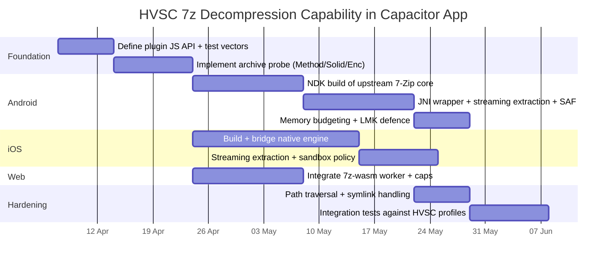

# Reliable HVSC 7‑Zip Decompression in a Capacitor App Across Android, iOS and Web

## Executive summary

Achieving “Windows 7‑Zip parity” for decompressing the High Voltage SID Collection (HVSC) inside a Capacitor-based app requires using an engine that actually implements the full 7z container specification and its codec/filter stack (LZMA/LZMA2/PPMd/BZip2/Deflate plus BCJ/BCJ2/Delta and AES + header encryption). The most direct way to reach parity is to embed upstream 7‑Zip’s C/C++ code (the same codebase that backs the `7zz` standalone console) behind a Capacitor plugin on Android (NDK + JNI) and iOS (C++ static library + Swift/Obj‑C bridging). The Web target cannot use native code, so the closest equivalent is a WebAssembly build of `7zz` (for example `7z-wasm`), but this has hard memory ceilings and significantly weaker performance predictability for large dictionaries and very large archives. citeturn9search6turn5search3turn14search19

As of HVSC release “#84”, multiple public mirrors distribute the “complete” collection as a single `.7z` file (for example `HVSC_84-all-of-them.7z`, shown at ~79.87 MB on a mirror). Historic mirrors also provided a “complete collection zipped” (ZIP) distribution. That means a robust implementation should handle at least 7z and ZIP reliably, and ideally multi-volume 7z (`.7z.001` etc) because split archives are common on mobile and in mirrors. citeturn11search0turn11search3turn14search18

Many Android GUI archive apps can extract HVSC in practice, but they are proprietary and not embeddable in your Capacitor app. Even when they list features like “multi-part archives” and “multithreading”, their internal codec/filter and dictionary limits are not usually documented at the level needed for deterministic behaviour and parity claims. By contrast, upstream 7‑Zip and the LZMA SDK document dictionary size and memory requirements, AES header encryption, solid block behaviour, and the method/filter chain, which lets you build deterministic admission checks and memory budgeting before extraction. citeturn20view0turn10view0turn5search14

The recommended approach for reliable HVSC decompression inside a Capacitor app is:

- Use a native plugin on Android and iOS embedding upstream 7‑Zip (or, if you are willing to limit scope, an LZMA2-only 7z reader such as PLzmaSDK for HVSC-like archives), and implement streaming extraction (file-by-file) to app-private storage with strict path sanitisation.
- On Web, use `7z-wasm` in a Worker, but implement strict guardrails: check the archive’s dictionary size and reject archives that require memory beyond what the browser can realistically allocate (WebAssembly linear memory is capped at 4 GiB in wasm32, and practical limits can be lower). citeturn5search3turn14search19turn14search34
- Build an “archive capability probe” that inspects `Method`, `Solid`, `Blocks`, and encryption flags (especially header encryption) before extraction, and chooses an engine or fallback path accordingly.

## What “feature parity with Windows 7‑Zip” means for 7z extraction

The 7z container is explicitly designed to support stacked compression, conversion (filters), and encryption methods; it supports AES‑256 encryption and can also encrypt the archive headers (commonly surfaced as “Encrypt file names”). citeturn14search2turn10view0

A Windows 7‑Zip parity target for decompression, at minimum, includes:

- **Container support**: 7z and ZIP (and TAR variants), and ideally support for split/multi-volume archives (e.g., `xxx.7z.001`). 7z explicitly supports multi-part archives. citeturn14search18turn20view0
- **Core codec + filter support**: 7z archives can use a method chain that includes (documented in the 7‑Zip method reference) `LZMA`, `LZMA2`, `PPMd`, `BZip2`, `Deflate`, plus filters such as `Delta`, `BCJ`, `BCJ2` and a `Copy` “no compression” method. citeturn10view0
- **Dictionary sizes**: LZMA/LZMA2 support variable dictionary sizes up to 4 GiB; memory required for decompression depends largely on dictionary size. citeturn16search30turn5search14
- **Solid archives**: 7z “solid mode” groups multiple files into solid blocks; this can improve compression but affects random-access extraction cost. 7‑Zip documents default solid block size limits by compression level and explains why limiting solid block size affects extraction behaviour. citeturn10view0
- **Encryption**: AES‑256 for 7z; key derivation uses SHA‑256 and many iterations (7‑Zip documents this in the 7z format page). Header encryption is separately controllable (`he=on` in 7‑Zip’s 7z method parameters). citeturn14search2turn10view0
- **Unicode/filename handling**: 7z supports Unicode file names; ZIP has multiple encoding conventions and 7‑Zip documents code page and UTF‑8 behaviour for ZIP. citeturn14search18turn10view0

A key engineering point for parity is **not** just “can it extract”, but whether you can deterministically decide, ahead of time, whether an archive will extract within memory and platform constraints. Upstream 7‑Zip/LZMA SDK provide the documentation to do that: the LZMA SDK documents that decompression memory is roughly `dictionary size + small overhead`, with the effective limit being available memory and address space. citeturn5search14turn10view0

Finally, if you are currently relying on “p7zip” as a compatibility baseline, note that 7‑Zip’s own links page explicitly warns that p7zip’s code “was not updated since version 16.02” and contains bugs fixed in newer 7‑Zip versions. For a parity goal, you should treat p7zip as a legacy fallback, not a primary engine. citeturn14search0

## HVSC packaging patterns and how to inspect HVSC 7z headers

### Observed packaging across mirrors and releases

Direct archive header inspection of HVSC binaries is not possible in this environment (no local binary execution against downloaded artefacts), so this report focuses on (a) packaging evidence from mirrors, and (b) exact commands you can run locally to extract header facts deterministically.

For HVSC “#84”, a mirror lists a complete `.7z` distribution:

- `HVSC_84-all-of-them.7z` and `HVSC_Update_84.7z` are visible on a mirror directory listing, with the complete archive shown around 79.87 MB. citeturn11search0

The release itself (CSDb entry) provides the release date and context (and indicates this is an ongoing “collection” release cadence). citeturn11search2

Historically, at least one older mirror page explicitly states it provides the “complete collection zipped” (ZIP), along with updates. citeturn11search3

A practical implication is that a robust client should handle:

- The “complete” `.7z` archive for modern releases.
- Updates as `.7z`.
- Legacy ZIP complete distributions (and potentially split archives in user workflows).

### Local header inspection commands for HVSC archives

Run these commands on a desktop (Windows/macOS/Linux) with a recent upstream 7‑Zip (`7z`/`7zz`), or in Termux with `7zz` (if you accept an external dependency during investigation).

**List archive technical metadata (recommended):**

```bash
7zz l -slt HVSC_84-all-of-them.7z
```

**Test archive integrity (recommended before extraction):**

```bash
7zz t HVSC_84-all-of-them.7z
```

**Extract to a target directory (preserves paths):**

```bash
mkdir -p hvsc_out
7zz x HVSC_84-all-of-them.7z -ohvsc_out
```

**If you suspect multi-volume:**

```bash
# Put all parts next to each other and point at the .001
7zz l -slt HVSC_84-all-of-them.7z.001
7zz x HVSC_84-all-of-them.7z.001 -ohvsc_out
```

Multi-part 7z archives are a standard pattern (`xxx.7z.001`, `xxx.7z.002`, ...). citeturn14search18turn20view0

### Observed HVSC #84 archive profile (local inspection, 2026-04-04)

Local inspection is now available for the target archive used by this execution pass. Running `7z l -slt ~/.cache/c64commander/hvsc/HVSC_84-all-of-them.7z` and `7z t ~/.cache/c64commander/hvsc/HVSC_84-all-of-them.7z` produced the following profile:

- SHA-256: `9ed41b3a8759af5e1489841cd62682e471824892eabf648d913b0c9725a4d6d3`
- `Method = LZMA:336m PPMD BCJ2`
- `Solid = +`
- `Blocks = 2`
- `Physical Size = 83748140`
- `Headers Size = 846074`
- `Files = 60737`
- `Folders = 2`
- `Uncompressed Size = 372025688`
- Integrity result: `Everything is Ok`

This observed profile is important because it narrows the engine decision immediately: HVSC #84 is not a plain LZMA/LZMA2-only archive. It includes `PPMD` and `BCJ2`, so any replacement strategy limited to simple LZMA/LZMA2 support needs explicit justification against those methods. It also means the current Apache Commons Compress path must be validated against a known-complex real archive rather than judged only by the earlier `LZMA:336m` assumption.

#### How to interpret `-slt` output for parity-critical fields

When you run `7zz l -slt`, focus on these fields:

- **`Method = ...`**
  This is the method chain. For HVSC you likely want to confirm it is something like `LZMA2` (possibly with `Copy` in parts) and whether you see filters like `BCJ/BCJ2/Delta`. The 7‑Zip method reference enumerates the method IDs and filters that can appear. citeturn10view0

- **Dictionary size within `Method`**
  You will often see a suffix like `LZMA2:64m` or similar. Decompression memory usage is strongly dependent on dictionary size. LZMA/LZMA2 dictionary sizes can range up to 4 GiB in the format design, and the LZMA SDK explicitly ties decompression memory to dictionary size with small overhead. citeturn16search30turn5search14

- **`Solid = +` and `Blocks = N`**
  `Solid = +` means solid mode is enabled. `Blocks` indicates how many solid blocks exist; fewer blocks usually means higher compression but more work to extract a single file. 7‑Zip documents solid mode controls and default solid block size limits by compression level. citeturn10view0

- **`Encrypted = +` and header encryption**
  For 7z archives, header encryption is separately enabled (`he=on` in 7‑Zip) and is what hides the file list until you provide the password. 7‑Zip documents both AES‑256 usage and the header-encryption toggle in its method reference. citeturn14search2turn10view0

If you need an independent parser for CI, `py7zr` can list and inspect archives via Python, but note it has documented gaps (for example, it does not support BCJ2 and Deflate64 in its baseline configuration). citeturn16search4turn16search9

## Comparative evaluation of Android tools and embeddable libraries

This section separates “end-user Android apps” (good for validation, not embeddable) from “libraries/engines” (embeddable and therefore relevant to a Capacitor app).

### End-user Android apps (validation tools, not embeddable dependencies)

- **ZArchiver**: Documented to create/extract many formats, including 7z and split archives (`7z.001`), and explicitly claims support for password-protected and multi-part archives, multithreading, and UTF‑8/UTF‑16 filename support. It also explicitly states it can create/decompress multi-part 7z archives and extract split archives. citeturn20view0
  Limitations for your use case: proprietary app, not a library; internal codec/filter/dictionary behaviour is not specified to “parity” granularity.

- **RAR (RARLAB)**: Play listing states it can unpack 7z and other formats, and includes “solid archives” and “utilizing multiple CPU cores to compress data”. It also explicitly states ZIPX support with BZIP2/LZMA/PPMd/XZ compression. citeturn19view0
  Limitations: proprietary; decompression parity for 7z method chains is not documented at the codec/filter level.

- **MiXplorer + MiX Archive add-on**: The add-on lists many pack/unpack formats including 7z and ZIPX, and unpack-only support for RAR among others. citeturn19view1
  Limitations: proprietary; codec/filter/dictionary caps are not documented.

- **7Zipper**: Its Play listing documents 7z as a supported compression format and lists decompression formats including rar and 7z, plus split ZIP archive support. citeturn15search0
  Limitations: appears stale relative to modern 7‑Zip versions; not a library.

- **B1 Archiver**: Play listing says it can open password-protected 7z archives and create password-protected ZIP/B1 archives; it also mentions non-Latin symbols for ZIP names. citeturn15search1turn19view2
  Limitations: proprietary; stale maintenance signals; not embeddable.

For HVSC-specific validation, ZArchiver is the most explicit in claiming multi-part 7z and split archive handling plus filename encoding support, which is relevant when users obtain HVSC from different mirrors. citeturn20view0

### Embeddable engines and libraries (relevant for Capacitor)

The table below is deliberately “parity-focused”: it prioritises whether you can credibly implement Windows 7‑Zip-like behaviour (method chains, solid archives, AES + header encryption, multi-volume) inside your app without external app dependencies.

Key:

- **Containers**: 7z/ZIP/RAR/TAR/MV (multi-volume/split).
- **Codecs/filters**: LZMA/LZMA2/PPMd/BZip2/Deflate/BCJ/BCJ2/Delta/Copy.
- **Enc**: AES + header encryption (file-name encryption).
- **Streaming**: Can extract file-by-file without loading entire output into RAM (still may require archive file to be seekable on disk).
- **MT**: Multi-threading support (often compression-focused; decompression is frequently single-thread).
- **Notes**: documented limitations relevant to parity.

| Candidate                         | Engine/implementation                      | Containers (7z/ZIP/RAR/TAR/MV)                                         | Codecs/filters (documented)                                                                  | Enc (AES + header enc)                                                           | Streaming focus                       | MT                                                             | Notes / parity risk                                                                                                                                   |
| --------------------------------- | ------------------------------------------ | ---------------------------------------------------------------------- | -------------------------------------------------------------------------------------------- | -------------------------------------------------------------------------------- | ------------------------------------- | -------------------------------------------------------------- | ----------------------------------------------------------------------------------------------------------------------------------------------------- | ------------------------------------------------------------- |
| Windows 7‑Zip (`7z`/`7za`/`7zz`)  | Upstream 7‑Zip                             | Broad, incl. multi-part 7z                                             | Full stack; method chain + filters documented                                                | AES‑256 + header encryption supported                                            | Yes (file-by-file to disk)            | Mostly compression; LZMA2 designed for MT compression          | Baseline parity target; LZMA/LZMA2 dict up to 4 GiB; memory depends on dict                                                                           | citeturn10view0turn14search2turn16search30               |
| p7zip (legacy port)               | Legacy port (various forks)                | Varies                                                                 | Varies                                                                                       | Varies                                                                           | Varies                                | Varies                                                         | 7‑Zip warns p7zip code not updated since 16.02 and has bugs fixed upstream                                                                            | citeturn14search0                                          |
| **Android: embed upstream 7‑Zip** | Your NDK build of upstream C++             | You choose (typically full 7zz minus RAR if you disable it)            | Full stack if you build it; documented by upstream                                           | Full AES + header encryption                                                     | Yes                                   | Mostly compression; decompression depends                      | Highest parity potential; you control ABI, memory policy and SAF integration                                                                          | citeturn9search6turn10view0turn22search19turn22search17 |
| Termux `7zip` package (`7zz`)     | Upstream 7‑Zip built in Termux, `Alone2`   | 7z + many, but Termux build disables RAR                               | Upstream method stack, but **RAR disabled**                                                  | Upstream AES + header encryption                                                 | Yes                                   | Per upstream                                                   | Termux build sets `DISABLE_RAR=1` explicitly; good validation tool but external dependency                                                            | citeturn21search3turn10view0                              |
| Termux `p7zip` package            | p7zip-project fork                         | 7z/ZIP vary                                                            | Not parity-reliable                                                                          | Varies                                                                           | Varies                                | Varies                                                         | Termux recipe builds p7zip 17.06; still not upstream mainline                                                                                         | citeturn26view0                                            |
| `7z-wasm`                         | `7zz` compiled to WASM                     | “All formats that full `7zz` supports” (per project)                   | Inherits `7zz` codec stack                                                                   | Inherits                                                                         | Often needs in-memory FS abstractions | Worker-based; CPU-heavy                                        | Based on 7‑Zip 24.09; WebAssembly memory is capped (4 GiB wasm32) and practical limits can be lower                                                   | citeturn5search3turn14search19turn14search34             |
| libarchive / `bsdtar`             | libarchive                                 | `bsdtar` can extract 7-zip and create 7-zip                            | Writer supports several compression types but **no filter types** (important for parity)     | Encrypted 7z not supported (“Reading encrypted data is not currently supported”) | Streaming-oriented for many formats   | N/A                                                            | Good “common-case” helper, but not parity: encryption and some filters/rar cases fail                                                                 | citeturn18search1turn18search0turn23search2              |
| 7‑Zip‑JBinding‑4Android           | JNI wrapper around 7‑Zip engine (Java API) | Many + split volumes (claimed)                                         | Depends on bundled native core                                                               | Depends                                                                          | Yes                                   | Supports multithread extraction of multiple archives (claimed) | The published Android artefact line indicates 7‑Zip core 16.02 in version naming, so modern 7‑Zip parity is unlikely without updating the native core | citeturn5search1turn5search13turn5search17               |
| PLzmaSDK                          | “Portable, patched LZMA SDK”               | Supports 7z incl. multi-volume (claimed)                               | LZMA/LZMA2 centric; exact full stack not fully enumerated in snippet                         | Not fully enumerated here                                                        | Designed for list/test/extract        | Thread-safe operations (claimed)                               | Strong candidate for iOS + Android if HVSC truly uses LZMA/LZMA2 without exotic filters; confirm method chain first                                   | citeturn5search2turn5search6                              |
| LZMA SDK (direct embed)           | Official LZMA SDK                          | You must implement/port container parts you need, or use included code | LZMA/LZMA2 focus; 7z supports other methods too                                              | Documents AES‑256                                                                | Yes                                   | LZMA2 supports MT compression                                  | SDK is updated (26.00) and documents dict size + decompression memory (`dict + small overhead`)                                                       | citeturn5search14turn16search30                           |
| `py7zr`                           | Python 7z library                          | 7z focus (not a general archiver)                                      | Supports several, but baseline gaps: BCJ2/Deflate64 not supported; PPMd via third-party libs | AES via third-party crypto lib                                                   | Yes                                   | Python-level concurrency possible                              | Not a good mobile embed choice unless you embed Python; useful in desktop CI for inspection                                                           | citeturn16search4turn16search9turn16search0              |
| `lzma-js` / LZMA‑JS               | JS port of LZMA algorithm                  | Not a 7z container engine                                              | LZMA only (algorithm-level)                                                                  | No 7z AES                                                                        | Yes                                   | Worker optional                                                | Useful only for `.lzma` streams, not 7z container parity                                                                                              | citeturn16search7turn16search6                            |

The core finding is that **only upstream 7‑Zip (native) and a WASM build of the same are credible parity candidates**. Everything else is either incomplete for 7z method stacks (libarchive), too old (JBinding lineage), or not a container implementation at all (lzma-js). citeturn14search0turn18search0turn16search9

## Concrete Capacitor implementation strategies without external app dependencies

This section proposes implementable options that you can ship inside your Capacitor app. Each option includes (a) scope and parity coverage, (b) build/integration considerations, (c) memory budgeting and streaming design, and (d) fallbacks.

### Option A: Native plugin embedding upstream 7‑Zip mainline C++ (recommended parity path)

**Scope and parity coverage**
This is the closest to true Windows 7‑Zip parity because you are embedding the same upstream code. Upstream 7‑Zip documents the full method chain, filters, solid mode behaviour, AES‑256 and header encryption (`he=on`), and dictionary-bound memory usage. citeturn10view0turn14search2turn16search30

**Android integration sketch**

- Build a JNI-accessible `.so` that wraps the extraction and listing APIs you need (`list`, `test`, `extract`).
- Use Gradle’s external native build flow (CMake or ndk-build). Android Studio documents that Gradle will run CMake/ndk-build and package the resulting shared libraries into your APK/AAB. citeturn22search19
- Target ABIs: at minimum `arm64-v8a` and `armeabi-v7a`, optionally `x86_64` for emulators; Android NDK documents supported ABIs and how to build with CMake’s `ANDROID_ABI`. citeturn22search17

**Build mechanics (high level)**

- Upstream 7‑Zip is not “CMake-native”, but it is buildable with Clang/make in a controlled environment. Termux’s `7zip` package script is a practical reference: it builds the `Alone2` bundle to produce `7zz`, uses `cmpl_clang.mak`, and explicitly uses `DISABLE_RAR=1` because RAR codec is treated as non-free in that packaging context. citeturn21search3turn21search6
  For your app, you must decide whether you want to include RAR extraction. If you do, you must incorporate the relevant code under the unRAR restriction (legal section below).

**File IO and SAF considerations**

- Do not extract HVSC to shared “Documents/Downloads” via SAF unless you must. Scoped storage can introduce FUSE overhead; AOSP documentation explicitly calls out avoiding FUSE overhead by using external private storage or bulk provider APIs. citeturn7search3
- Default to app-private storage (`Context.getFilesDir()` or `getExternalFilesDir()`), and optionally provide an “Export to folder…” flow with SAF for user-visible exports. Android’s Storage Access Framework guide describes the “open/create/grant directory” capability model. citeturn7search2

**Streaming vs in-memory extraction design**
Even with native code, you must design streaming on _outputs_:

- Read archive from a seekable file descriptor (download-to-disk first).
- For each entry, stream decompressed bytes to an output stream (file descriptor), never buffering entire file contents in JavaScript or Java heap.

A recommended architecture is “native worker thread performs extraction, Java/Kotlin layer only forwards progress events to JS”:

```mermaid
flowchart LR
  JS[Capacitor JS layer] -->|extract(archiveUri, destUri)| Plugin[Capacitor Native Plugin]
  Plugin -->|spawn worker thread| Native[NDK 7-Zip Engine (.so)]
  Native -->|read (seekable)| A[(Archive file on disk)]
  Native -->|stream write| D[(Destination dir: app-private)]
  Native -->|progress callbacks| Plugin
  Plugin -->|events| JS
```

**Memory budgeting and dictionary caps**

- LZMA/LZMA2 decompression memory scales with dictionary size. The LZMA SDK documents memory for decompression as roughly `dictionary size + small overhead` and supports dictionary sizes up to 4 GiB. citeturn5search14turn16search30
- Before extraction, parse archive metadata (either via 7‑Zip APIs or by running the internal list function) and compute a conservative budget: `required = dict + overhead + safetyMargin`.
- On Android, you must account for:
  - The per-app heap limit and `OutOfMemoryError` risk. Android explicitly sets a hard limit on heap size per app; if you exceed it you get OOM. citeturn17search15
  - LMK behaviour: Android’s LMK daemon kills processes under high memory pressure; Android Vitals tracks “user-perceived LMKs”. citeturn17search21turn17search7
  - `android:largeHeap`: it may increase Dalvik heap, but Android warns most apps do not need it and it does not guarantee a fixed increase; you can query `getMemoryClass()` / `getLargeMemoryClass()`. citeturn8view0
- Keep most heavy buffers in native memory, but treat total process RSS as the true budget (LMK does not care whether memory is “Java heap” or “native heap”).

**iOS integration sketch**

- Compile the same upstream C++ into a static library for iOS and expose a C API for Swift/Obj‑C bridging.
- If you decide that “LZMA/LZMA2 + AES + header encryption + multi-volume 7z” is sufficient for HVSC, PLzmaSDK and LzmaSDKObjC are iOS-oriented abstractions that explicitly mention encrypted header support and memory tuning (LzmaSDKObjC), and multi-volume + threading properties (PLzmaSDK). citeturn5search6turn5search22turn5search2
  This can reduce integration complexity versus carrying the full upstream codebase, but you must confirm HVSC method chains.

### Option B: JNI wrapper around 7‑Zip‑JBinding‑4Android (legacy core, migration required)

**What you get**
7‑Zip‑JBinding is a JNI wrapper over the 7‑Zip native library intended to offer fast extraction from Java. The Android fork (`7‑Zip‑JBinding‑4Android`) advertises password-protected extraction, volume archives support, and multi-thread extraction of multiple archives. citeturn5search1turn5search5

**Primary limitation**
The published Android artefacts are versioned around “16.02”, which strongly suggests they are based on an old 7‑Zip core (and therefore cannot be claimed as parity with modern upstream). Given upstream explicitly warns that legacy ports can lag and have bugs fixed in newer versions, using a 16.02-based core conflicts with a parity requirement. citeturn5search17turn14search0

**If you still choose it**
Treat it as a bridge:

- Replace the internal native 7‑Zip core with a modern upstream snapshot and keep the Java API surface. This is effectively “Option A plus extra JNI/API constraints”.
- Expect significant build-system work replicating how JBinding loads native libs (and audit Unicode/filename issues; the Android fork issue tracker includes filename/encoding-related issues). citeturn5search25

### Option C: LZMA SDK / PLzmaSDK limited-scope 7z support (fast path if HVSC uses simple method chains)

This option assumes HVSC uses an LZMA2-based method chain without esoteric filters (a reasonable hypothesis given the contents are `.sid` and text, not executables), but it must be confirmed via header inspection (`7zz l -slt`). citeturn10view0turn11search0

**Why it can work well**

- LZMA SDK is current (26.00) and documents dictionary sizes and decompression memory behaviour. citeturn5search14turn16search30
- PLzmaSDK explicitly claims 7z multi-volume support and thread-safe operations. citeturn5search2turn5search6
- LzmaSDKObjC explicitly mentions creating encrypted + encrypted-header 7z archives (suggesting it understands header encryption semantics) and “manage memory allocations during listing/extracting”. citeturn5search22

**Trade-off**
This is not a full parity solution unless you also implement or include:

- Full 7z method stacks including PPMd/Deflate/BCJ2 edge cases.
- Full container support beyond 7z (ZIP/TAR/RAR).

For HVSC specifically, if header inspection shows only `LZMA2` and `Solid` (no filters), this approach can be sufficient and smaller.

### Option D: WebAssembly on Web (and optionally in Android WebView) via `7z-wasm`

**What it is**
`7z-wasm` compiles `7zz` to WASM and says it supports all formats the full `7zz` CLI supports; it runs in browsers or NodeJS and uses Emscripten filesystem adapters (NODEFS/WORKERFS). citeturn5search3

**Hard limitations**

- wasm32’s addressable linear memory is capped at 4 GiB; MDN documents that 65,536 pages × 64 KiB = 4 GiB is the maximum range for wasm32 addressing. citeturn14search19turn14search34
- Practical failures can occur far below 4 GiB due to ArrayBuffer allocation and user agent limits; the `7z-wasm` issue tracker includes an example of failure on large extracts (“Array buffer allocation failed”). citeturn5search11

**Implication for HVSC**
HVSC’s compressed size (~80 MB) suggests Web extraction is feasible, but the real risk is not compressed size, it is:

- number of files (tens of thousands),
- writing them efficiently in browser storage APIs,
- and memory spikes from dictionaries and FS layer buffering.

If you support Web extraction, implement:

- upfront header inspection and dictionary cap checks,
- extraction into OPFS (Origin Private File System) or a virtual FS with chunked flushing,
- a “download extracted ZIP” fallback for browsers that cannot persist many files individually.

### Option E: libarchive hybrid for non-encrypted/common cases (not parity)

libarchive-backed tools like `bsdtar` can extract 7-zip archives and create 7-zip archives. citeturn18search1
However, libarchive has parity-breaking gaps:

- Encrypted 7z (and encrypted RAR) are explicitly not supported (“Reading encrypted data is not currently supported”). citeturn18search0
- libarchive’s 7z writer supports several compression types but does **not** support “filter types” (which matters if archives use BCJ/BCJ2/Delta). citeturn23search2

Therefore, libarchive can be a “best-effort extractor” for unencrypted, simple archives, but should not be the core claim for Windows 7‑Zip parity.

## Recommended step-by-step plan for reliable HVSC decompression in your Capacitor app

This plan is organised into a “user-level verification path” and an “engineering implementation path”. It assumes you want to ship without dependencies on external archive apps.

### User-level verification path (to remove uncertainty about HVSC headers)

- Download the target HVSC archive(s) you will support (for example `HVSC_84-all-of-them.7z`). citeturn11search0
- Run:
  - `7zz l -slt HVSC_84-all-of-them.7z`
  - `7zz t HVSC_84-all-of-them.7z`
- Record:
  - `Method`, including dictionary size,
  - `Solid` and `Blocks`,
  - whether header encryption is enabled,
  - whether it is multi-volume.
- If mirrors provide alternative formats (ZIP), repeat the same for those distributions. Historic mirrors explicitly mention “complete collection zipped”. citeturn11search3

This produces a deterministic “HVSC archive profile” you can bake into tests and admission checks.

### Engineering implementation path (recommended core)

**Phase: API contract and capability probe**

- Define a single JS API (Capacitor plugin):
  `probe(archiveUri) -> { type, entriesEstimate, methodChain, dictBytes, solid, blocks, encryptedHeader, requiresPassword, multiVolume }`
  `extract(archiveUri, destUri, options) -> progress events + final manifest`
- Implement `probe` using the embedded engine’s listing function. The method/filter vocabulary is defined by upstream (`LZMA/LZMA2/PPMd/BZip2/Deflate/Delta/BCJ/BCJ2/Copy`, `he` for header encryption). citeturn10view0turn14search2

**Phase: Android native engine integration**

- Implement Option A: bundle upstream 7‑Zip engine in an NDK `.so`.
- Integrate with Gradle using external native builds; ensure you produce libraries for the ABIs you ship (`arm64-v8a` at minimum). citeturn22search19turn22search17
- Use a dedicated extraction worker thread and stream output to app-private storage to avoid SAF overhead. AOSP documentation calls out FUSE overhead and recommends using external private storage or bulk APIs when possible. citeturn7search3

**Phase: Memory policy and LMK defence**

- Before extraction:
  - Compute required memory from dictionary size (LZMA SDK ties decompression memory to dictionary size). citeturn5search14turn16search30
  - Query memory state and refuse or downgrade if the device is low memory.
- During extraction:
  - Listen for `onTrimMemory` and abort gracefully if the system signals pressure; Android recommends responding to memory events and notes the LMK may kill your process otherwise. citeturn6view0turn17search21
- Avoid relying on `android:largeHeap` as a “fix”; Android explicitly warns it does not guarantee a fixed increase and most apps should reduce memory usage instead. citeturn8view0

**Phase: Path safety and archive extraction security**

- Enforce “no zip-slip”: canonicalise each entry path and ensure it stays within the target directory.
- Treat symlinks carefully: upstream 7‑Zip has security-motivated changes for handling symbolic links when extracting. citeturn5search14
  Practical rule: default to not extracting symlinks outside the sandbox; store them as plain files or skip.

**Phase: iOS engine integration**

- Mirror the Android approach: embed upstream 7‑Zip core or adopt PLzmaSDK if your HVSC probe indicates it is sufficient. PLzmaSDK’s registry entry explicitly calls out multi-volume support and threaded operations; LzmaSDKObjC highlights encrypted header and memory tuning. citeturn5search6turn5search22

**Phase: Web implementation**

- Implement `probe` and `extract` using `7z-wasm` in a Web Worker.
- Enforce a dictionary size cap and a file-count cap; you must respect the wasm32 4 GiB addressing limit and practical browser allocation limits. citeturn14search19turn5search11

**Timeline (illustrative)**



### Fallback strategies when feature gaps exist

- If the probe detects unsupported method/filter stacks in the Web build (or memory requirements too high), offer:
  - “Extract on device (Android/iOS only)” if the platform has native engine support.
  - “Server-side extraction” (if acceptable) producing a ZIP download per selection.
  - “Alternative mirror format” if HVSC offers ZIP (historic mirrors did). citeturn11search3

## Risks, limitations and legal/licensing considerations

**RAR support and licensing**
If you include RAR extraction, you must respect the unRAR restriction: unRAR sources may be used to handle RAR archives, but cannot be used to re-create the RAR compression algorithm. Fedora’s licensing reference quotes this restriction, and the unRAR license text contains the same clause. citeturn22search0turn22search4
Practically: extraction is feasible and common, but do not ship code that implements RAR compression derived from unRAR sources.

**libarchive gaps**
libarchive cannot be your parity baseline for encrypted 7z and has filter-related gaps; it can be used as a best-effort helper but should not be your only engine if you claim Windows 7‑Zip parity. citeturn18search0turn23search2

**Android performance and LMK instability under large file counts**
HVSC contains tens of thousands of small files; even if dictionary size is modest, extracting many small files can trigger I/O overhead and memory churn. Scoped storage and SAF can add overhead (AOSP explicitly discusses avoiding FUSE overhead). citeturn7search3turn17search21

**Web hard ceilings**
WebAssembly memory ceilings and browser allocation behaviour can make Web extraction fail even when Android/iOS succeed; you must implement admission checks and graceful fallback. citeturn14search19turn5search11

**Security surface**
Any archive extractor is a high-risk parser surface. Adopt a “latest engine” posture (upstream 7‑Zip and LZMA SDK are actively updated) and implement strict output path and symlink policies. citeturn5search14turn14search20

```text
RAW SOURCE URLS (primary and load-bearing)

https://www.7-zip.org/
https://www.7-zip.org/7z.html
https://www.7-zip.org/sdk.html
https://www.7-zip.org/links.html

https://github.com/ip7z/7zip
https://github.com/ip7z/7zip/blob/main/DOC/7zFormat.txt

https://7-zip.opensource.jp/chm/cmdline/switches/method.htm

https://github.com/use-strict/7z-wasm
https://github.com/use-strict/7z-wasm/issues/10
https://developer.mozilla.org/en-US/docs/WebAssembly/Reference/JavaScript_interface/Memory/Memory
https://v8.dev/blog/4gb-wasm-memory

https://hvsc.sannic.nl/?dir=HVSC+84
https://csdb.dk/release/?id=258120
https://hafnium.prg.dtu.dk/~theis/hvsc/

https://play.google.com/store/apps/details?id=ru.zdevs.zarchiver&hl=en_GB
https://play.google.com/store/apps/details?id=com.rarlab.rar&hl=en_GB
https://play.google.com/store/apps/details?id=org.joa.zipperplus7&hl=en_GB
https://play.google.com/store/apps/details?id=org.b1.android.archiver&hl=en_GB
https://play.google.com/store/apps/details?id=com.mixplorer.addon.archive&hl=en_GB

https://developer.android.com/topic/performance/memory
https://developer.android.com/topic/performance/vitals/lmk
https://developer.android.com/guide/topics/manifest/application-element
https://source.android.com/docs/core/perf/lmkd
https://source.android.com/docs/core/storage/scoped
https://developer.android.com/training/data-storage/shared/documents-files
https://developer.android.com/studio/projects/gradle-external-native-builds
https://developer.android.com/ndk/guides/abis

https://github.com/libarchive/libarchive/issues/2516
https://man.freebsd.org/cgi/man.cgi?format=html&query=bsdtar&sektion=1

https://github.com/omicronapps/7-Zip-JBinding-4Android
https://repo.maven.apache.org/maven2/com/sorrowblue/sevenzipjbinding/7-Zip-JBinding-4Android/
https://mvnrepository.com/artifact/com.sorrowblue.sevenzipjbinding/7-Zip-JBinding-4Android

https://github.com/OlehKulykov/PLzmaSDK
https://swiftpackageregistry.com/OlehKulykov/PLzmaSDK
https://github.com/OlehKulykov/LzmaSDKObjC

https://pypi.org/project/py7zr/
https://py7zr.readthedocs.io/en/latest/api.html
https://github.com/miurahr/py7zr

https://github.com/LZMA-JS/LZMA-JS
https://www.jsdelivr.com/package/npm/lzma-js

https://fedoraproject.org/wiki/Licensing:Unrar
https://github.com/pmachapman/unrar/blob/master/license.txt
```
